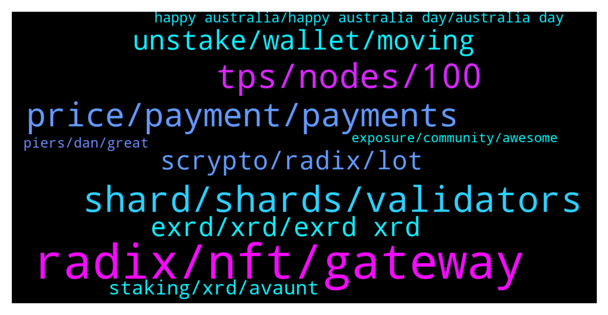

# **@radix_dlt**
 ## Analysis for **2022-01-25** - **2022-01-26**.

---

## 📊 **Basic Stats**

**n_messages_sent**: 499

---

---

## 🔝 **Top keywords and related messages**

1. **radix, nft, gateway**

    @nonce101 --- *Hi! Is there any plan to create network with EVM based on Radix? Or extend Radix to support EVM?* **--->** [TG Discussion](https://t.me/radix_dlt/346160)

    @Callum --- *I think it’s what we all need at a time like this, forget getting bogged down with the charts, in my opinion the best thing that could happen now is a 12 month bear cycle to weed out a lot of shit and then just as Radix hits its milestones the market can continue 😂* **--->** [TG Discussion](https://t.me/radix_dlt/345530)

    @Ben_XRD --- *Hey, everything you should want to know about Network Gateway is now live on our docs site :)   https://docs.radixdlt.com/main/node-and-gateway/software-introduction.html* **--->** [TG Discussion](https://t.me/radix_dlt/345797)

    @Jacob_XRD --- *The 2.4bn Founder retention has always been marked for distribution to Founder.   Funds allocated to Radix Tokens Jersey are marked for promoting the use of Radix Ledger.  You can see a full breakdown of the tokenomics here.  https://learn.radixdlt.com/article/how-was-the-xrd-token-allocated* **--->** [TG Discussion](https://t.me/radix_dlt/345525)

    @crypt_punk --- *hi, is radix 100% complete their research and 100% be sure about all of idea?* **--->** [TG Discussion](https://t.me/radix_dlt/345547)

    @bonafideplug --- *https://t.me/radishroot  Make sure to check out the newest NFT project, Radish, on Telegram.  An NFT with utility. Lots of new updates coming every week for the next 3 months!  Best way to keep up is TG or Twitter!  NFT reveal sooner than you can imagine* **--->** [TG Discussion](https://t.me/radix_dlt/346016)

2. **shard, shards, validators**

    @Shang En --- *Thanks for the answer. What does shard really mean? Why can it handle unlimited tps?* **--->** [TG Discussion](https://t.me/radix_dlt/345509)

    @Avaunt --- *There's an excellent article on Reddit by a community which helps explain the concept of sharding and Radix's approach to it. https://www.reddit.com/r/Radix?utm_medium=android_app&utm_source=share* **--->** [TG Discussion](https://t.me/radix_dlt/345540)

    @aj4269 --- *@piersr really dropped some hard hitting bombs for the world about the reality of sharding and scalibility.* **--->** [TG Discussion](https://t.me/radix_dlt/346064)

    @fpieper --- *It is quite early, but there will be very likely guarantees that the amount of validators per shard group don't drop below a certain threshold. Or they are using a constant robust value. But yeah I expect that redundancy of one shard doesn't fall below 100 nodes. Probably higher (Dan's work with BLS signatures and bloom filters are pointing towards 1000 could be possible), but of course the less nodes per shard the more throughput you achieve overall. Therefore this is always a trade-off* **--->** [TG Discussion](https://t.me/radix_dlt/345788)

    @Mleekko --- *suppose 2 regular transactions come to a Blockchain: 1) Alice transfers $2 to Bob  2) Cindy transfers $5 to Dan On a Blockchain, everything needs to come in order, so one of these transactions needs to be executed before the other. either #1 then #2 or vice versa. On Radix, the network sees that both transactions do not have any common parties, so it just tries to execute them independently. i.e. neither transactions waits until another one gets executed* **--->** [TG Discussion](https://t.me/radix_dlt/345555)

    @fpieper --- *Well, each shard is having enough redundancy even if many nodes get down. Also the shard allocation gets shuffled over time (to work against nodes leaving).  Transactions are fast, that's handled by Cerberus cross-shard atomic composability: shards are synchronized/braided on the fly if needed with finality times of 5-10 seconds.  Therefore overall, there is no problem on Radix and Cerberus consensus can handle it -> delivering unlimited scalability* **--->** [TG Discussion](https://t.me/radix_dlt/345777)

3. **tps, nodes, 100**

    @fpieper --- *The problem with Bitcoin's energy consumption is that it is currently using 100-150 terawatt hours per year.  That's roughly 12 gigawatt = 12,000,000 kilowatt continuously  ...  Nobody cares (or should care) whether your PoS network is using 1, 5 or 100 kilowatt 🤷‍♂️. It simply doesn't matter on a global scale.  (of course it is better to optimze as far as possible, but it shouldn't be your primary goal and is purely a marketing flex)  Peope need to take this into perspective. If your network is consuming 3kW and there are 30 developers, these developers consume 10 times the energy compared to their network ^^.* **--->** [TG Discussion](https://t.me/radix_dlt/346148)

    @Blind5ight --- *That approximation is in a world where not all people have access to the financial system It's also not accounting for the effect of composability on financial transactions* **--->** [TG Discussion](https://t.me/radix_dlt/345611)

    @Shang En --- *crazy, 100m is the total finance tps right now in the earth, the future is bright* **--->** [TG Discussion](https://t.me/radix_dlt/345604)

    @crypt_punk --- *https://medium.com/fantomfoundation/tech-q-a-how-will-fantom-take-care-of-on-chain-data-storage-a7d5de4690bd  @fpieper  hi bro , i saw u said about fantom and data sharding (when  reach to 300K tps) this article say something about solve this problem  can u take look about that? i think it's like central system :)* **--->** [TG Discussion](https://t.me/radix_dlt/345711)

    @fpieper --- *Yeap,  "I think Fantom's approach (relying on a non-sharded DAG) is suitable for the short/mid term and probably is able to scale to something like 50K-100K TPS (like you said). But this is already really tough for the nodes considering every node needs to store and process every transaction."  Maybe 50K-100K is way too optimistic, something that could maybe achieved. Right now they are nowhere near that mark.* **--->** [TG Discussion](https://t.me/radix_dlt/345773)

    @TheCodeisTheLaw --- *I can see min. 100 nodes per set at least still being decentralized enough as well(if we really need that much tps) so if we have more than 100 I'm even more pleased 🤗* **--->** [TG Discussion](https://t.me/radix_dlt/345791)

4. **price, payment, payments**

    @h0ll0wstick --- *I don't disagree with dat you right it s more about this impatience and delusion that going on binance dats it you made it in crypto man you are the top of the food chain people intend to think dat cex are good for crypto but really it s  a nice thing to have but it ain't t the end game here, cex are playtoys for traders, gamblers whales and bots the high value we credit in those platforms is over hyped imho* **--->** [TG Discussion](https://t.me/radix_dlt/345889)

    @d1scere --- *That goes for any supported crypto. btc, eth, etc.* **--->** [TG Discussion](https://t.me/radix_dlt/345671)

    @Tom --- *Oh ok, I thought you wanted to develop and manufacture this internally.* **--->** [TG Discussion](https://t.me/radix_dlt/346213)

    @chrisijoyah --- *In addition to the web-based platform, we will be offering a mobile app with a built-in wallet that will house our suite of components. We'll keep you posted on this 😁* **--->** [TG Discussion](https://t.me/radix_dlt/346200)

    @chrisijoyah --- *Another area we’re quite keen on exploring is POS hardware devices and payment solutions built on the Radix network. Since Adept is mostly centred around creators, the type of users we'll have ranged from your developer to aspiring fashion designer. Some of these creators may have physical stores, so in order to empower the creator in the physical world as well in the digital, it would be great to offer them POS devices too to allow the customer to purchase their products too. This is a space in which we will be exploring heavily and one in which is key to mass adoption.* **--->** [TG Discussion](https://t.me/radix_dlt/346199)

    @aus87 --- *I agree, especially in current market I am unsure of the effect it will have.  It will benefit me personally though to have more options.* **--->** [TG Discussion](https://t.me/radix_dlt/345892)

5. **unstake, wallet, moving**

    @Linda --- *I just requested an unstake in Radix Desktop Wallet. How long time will it take to get my tokens so i can withdraw them?* **--->** [TG Discussion](https://t.me/radix_dlt/346074)

    @giskard_rich --- *It’s more of an issue with staked stuff than anything else. Unless by moving stuff creates a Tex issue I guess* **--->** [TG Discussion](https://t.me/radix_dlt/345673)

    @Avaunt --- *Unstaking takes 500 epochs which is about 2 weeks at the moment.* **--->** [TG Discussion](https://t.me/radix_dlt/346076)

    @Alex --- *How will it prevent then that people simply copy the code?* **--->** [TG Discussion](https://t.me/radix_dlt/346089)

    @d1scere --- *Yes, you'll need to unstake and restake.* **--->** [TG Discussion](https://t.me/radix_dlt/345659)

    @satoshixy --- *I guess you have to unstack* **--->** [TG Discussion](https://t.me/radix_dlt/345999)

6. **exrd, xrd, exrd xrd**

    @Jacob_XRD --- *Exrd and XRD are both legit, but serve different purposes. See below.   /2tokens* **--->** [TG Discussion](https://t.me/radix_dlt/346023)

    @CryptoJockeyy --- *Price will also be same of both xrd and exrd ??* **--->** [TG Discussion](https://t.me/radix_dlt/345740)

    @Awangard79 --- *eXRD-XRD which one should I get?* **--->** [TG Discussion](https://t.me/radix_dlt/345423)

    @CryptoJockeyy --- *Exrd and xrd are same ???* **--->** [TG Discussion](https://t.me/radix_dlt/345712)

    @weeweepee --- *No gas fee? I thought exrd is erc* **--->** [TG Discussion](https://t.me/radix_dlt/345646)

    @weeweepee --- *How much it cost to bridge exrd to xrd?* **--->** [TG Discussion](https://t.me/radix_dlt/345644)

7. **scrypto, radix, lot**

    @José Ramón --- *@Adam_XRD are there any plans on how to get developers to use Scrypto, other than @piersr repeating the same things over and over again on different sub-5k-suscribers yt channels?* **--->** [TG Discussion](https://t.me/radix_dlt/345977)

    @fpieper --- *Scrypto is easy and fast to learn and greatly reduces the risk for hacks and exploits. It is Radix's unfair advantage* **--->** [TG Discussion](https://t.me/radix_dlt/346168)

    @nonce101 --- *I’m exploring ecosystem. I know about Scrypto and it’s nice for new projects. But there are a lot of old projects written in Solidity and it’s expensive to rewrite them to Scypto. That’s the reason why I asked about network with EVM* **--->** [TG Discussion](https://t.me/radix_dlt/346172)

    @Cpt_Charles --- *@Adam_XRD @clement_xrd have you seen this thing by NEAR? https://www.near.university/  I found it through this Twitter ad. They target devs by offering courses and handing out certificates. There's also a live count of 'students', which would be great to monitor the marketing results.  It might be a little early, considering the age, but I think it would be dope to have this for Scrypto, or is this quite similar to the Radix Developer Program?* **--->** [TG Discussion](https://t.me/radix_dlt/346067)

    @Jazzer9F --- *The third instalment in the blog series focusing on our new programming language, Scrypto, is now live on the blog!  https://www.radixdlt.com/post/scrypto-an-asset-oriented-smart-contract-language* **--->** [TG Discussion](https://t.me/radix_dlt/346229)

    @Blind5ight --- *A bit premature to say rewriting solidity based dapps into scrypto is expensive.  What about the cost when smart contract code fails? Scrypto promises to prevent a lot of this making it a cost reduction relative to the amount the dapp was exploited for and all collateral damage: reputation/bug fix/etc* **--->** [TG Discussion](https://t.me/radix_dlt/346233)

8. **staking, xrd, avaunt**

    @Avator --- *Thanks. I got my XRD on Uniswap and can't transfer it to my Radix wallet. Anyone else, who isn't a scammer, had the same issue* **--->** [TG Discussion](https://t.me/radix_dlt/345487)

    @Avator --- *Hey guys, how do I transfer my xrd from metamask to my Radix wallet so I can stake my xrd? Any help would be greatly appreciated* **--->** [TG Discussion](https://t.me/radix_dlt/345481)

    @GordonGekko_CVP --- *What wallet is required to hold/stake XRD? Can Bitfinex do it for me like they do with Eth2 and soon MATIC?* **--->** [TG Discussion](https://t.me/radix_dlt/345417)

    @doeboymagic --- *Still learning as you can tell. I finally set up my wallet and staked to a few nodes. Time to HODL* **--->** [TG Discussion](https://t.me/radix_dlt/345807)

    @Dexter --- *Do you think we can store XRDs on SAFEPAL? Thanks* **--->** [TG Discussion](https://t.me/radix_dlt/345730)

    @tesslerc --- *You can help secure the network using XRD and receive staking rewards for doing so.* **--->** [TG Discussion](https://t.me/radix_dlt/345416)

9. **happy australia, happy australia day, australia day**

    @synth_man --- *🔥🔥🔥 The whole team should see this* **--->** [TG Discussion](https://t.me/radix_dlt/345442)

    @Avaunt --- *Happy Australia Day to all the Aussie XRD fam. 🇦🇺* **--->** [TG Discussion](https://t.me/radix_dlt/346051)

    @Add_ith --- *Should say it to hoskinson louder* **--->** [TG Discussion](https://t.me/radix_dlt/345897)

    @Straydawg333 --- *It meant to be Vitalik 😊* **--->** [TG Discussion](https://t.me/radix_dlt/345887)

    @h0ll0wstick --- *Yes and i thank the team for dat* **--->** [TG Discussion](https://t.me/radix_dlt/345867)

    @mattiabe98 --- *Lol indeed, feels like ages ago😅* **--->** [TG Discussion](https://t.me/radix_dlt/345710)

10. **piers, dan, great**

    @Callum --- *Just sat and watched Piers on staking rewards, what an absolutely amazing show! Excellent responses, great explanations throughout and genuinely made me feel like a king for holding and staking my XRD!! Fucking love the team massively your all doing a great job 👏 can’t wait for the next couple of years to play out and for you all to be recognised for the hard work you’ve put in for so long. Hats off to Piers and a double hats off to Dan for making the whole thing possible! GREAT WORK* **--->** [TG Discussion](https://t.me/radix_dlt/345527)

    @aj4269 --- *We want @piersr on Lex Fridman podcast before Babylon. Team make it happen. 👍🏻🔥* **--->** [TG Discussion](https://t.me/radix_dlt/346230)

    @Jazzer9F --- *The latest technical AMA between RDX Works Founder Dan Hughes, and CEO Piers Ridyard is now live on YouTube!  https://youtu.be/Jn2FfMFzq0U* **--->** [TG Discussion](https://t.me/radix_dlt/345981)

    @ITProfligate --- *Twitter - if anyone wants to reply I already have with references to the last Piers’ Podcast Democracy Earth: Voting Without Identity? Governance and Democracy in the Digital Age.  https://twitter.com/guardian/status/1485741575233757184?s=20* **--->** [TG Discussion](https://t.me/radix_dlt/345474)

    @coolcukecumber --- *any reason why I can't find the "Ducktales - an introduction to Cerberus" episode on DeFi Download on Spotify? I found it on this other website instead: https://www.buzzsprout.com/874030/2901772-ducktales-an-introduction-to-cerberus* **--->** [TG Discussion](https://t.me/radix_dlt/345524)

    @Avaunt --- *https://twitter.com/fuserleer/status/1457718421668433929?t=dIvH8HHLTPSOaetxhbNSsA&s=19  Dan explains in this tweet that all the theory has been tested and proven now and we have a path to Xian* **--->** [TG Discussion](https://t.me/radix_dlt/345549)

