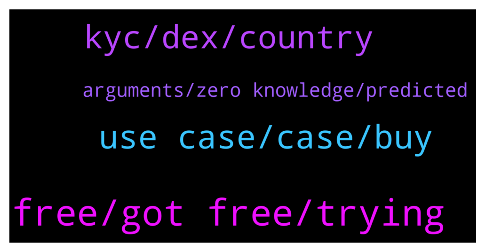

# **@shitpool**
 ## Analysis for **2022-01-25** - **2022-01-26**.

---

## 📊 **Basic Stats**

**n_messages_sent**: 192

---

---

## 🔝 **Top keywords and related messages**

1. **free, got free, trying**

    @da0man --- *arthur hayes again publishing bearish shit* **--->** [TG Discussion](https://t.me/shitpool/719938)

    @da0man --- *it’s a 0 sum game what part did people not understand lmao. He has been cashing out 100+ mil to bitfinex while posting these tweets* **--->** [TG Discussion](https://t.me/shitpool/720045)

    @Horselorde --- *Didn’t hit a lick. Literally got 5 free coins worth 15k and held while trimming rebases along the way, not hard to understand lol* **--->** [TG Discussion](https://t.me/shitpool/720057)

    @da0man --- *Sam turned the bots back on* **--->** [TG Discussion](https://t.me/shitpool/719890)

    @Horselorde --- *I also just realized he used to be pleb2king in WP* **--->** [TG Discussion](https://t.me/shitpool/719734)

    @pizza_dog --- *What’s really suspicious is that Dani the “cso” went private on Twitter just before today* **--->** [TG Discussion](https://t.me/shitpool/719965)

2. **use case, case, buy**

    @notdao --- *i am excited that DCG is very excited about RAILGUN   https://www.coindesk.com/business/2022/01/26/railgun-aims-for-private-defi-with-10m-backing-from-dcg/* **--->** [TG Discussion](https://t.me/shitpool/720095)

    @Horselorde --- *Y’all are even more concerned with $TIME than I am and I had a decent bag lmao* **--->** [TG Discussion](https://t.me/shitpool/719974)

    @<UNK> --- *Do we sell everything and get out in this pump and buy back when btc is between $6k-$15k in 2023?* **--->** [TG Discussion](https://t.me/shitpool/719911)

    @reamBay --- *At what price will you stop being so Irritating? & leave shitpool* **--->** [TG Discussion](https://t.me/shitpool/719731)

    @<UNK> --- *At what price will use case come back?* **--->** [TG Discussion](https://t.me/shitpool/719729)

    @<UNK> --- *Hey guys, so many people buying shitcoins here. Is anyone using the tokens and coins for utility / use case or it’s only to make fiat gains by pumping and dumping them?* **--->** [TG Discussion](https://t.me/shitpool/719760)

3. **kyc, dex, country**

    @da0man --- *most of these tax dodgers end up paying premiums of 20-30% in the end to make the money look legit, still won’t be and if caught you end up paying tax + fine + having lost big part of your capital* **--->** [TG Discussion](https://t.me/shitpool/719868)

    @da0man --- *KYC wallets will come to every country, especially USA* **--->** [TG Discussion](https://t.me/shitpool/719847)

    @da0man --- *if u pay some indian guy for kyc, that account belongs to him/her and if he knows what u used it for he can take ur mils* **--->** [TG Discussion](https://t.me/shitpool/719814)

    @MoneroPal --- *plebs will continue to trade, there will always be a DEX that does not require KYC that will be available via a VPN, at least for a long while* **--->** [TG Discussion](https://t.me/shitpool/719833)

    @da0man --- *future DEXes can require KYC-ed wallets* **--->** [TG Discussion](https://t.me/shitpool/719854)

    @MoneroPal --- *No country except the US can enforce compliance as US citizens are barred from banking worldwide due to FACTA. No other country has the authority or power to do anything about it. Almost all wealthy non-US citizens legally or illegally avoid taxes in their home country without reprocussion.  The KYC requirements are bogus, they just get some darks to faciliate KYC and continue as usual* **--->** [TG Discussion](https://t.me/shitpool/719810)

4. **arguments, zero knowledge, predicted**

    @MoneroPal --- *This too is retarded, another clueless…* **--->** [TG Discussion](https://t.me/shitpool/719880)

    @wojackdegreate --- *Underwater bulls should have read his last post* **--->** [TG Discussion](https://t.me/shitpool/720002)

    @wanker007 --- *Well as predicted and guessed the Russian cb news bs.* **--->** [TG Discussion](https://t.me/shitpool/719915)

    @da0man --- *you just refuted your own arguments* **--->** [TG Discussion](https://t.me/shitpool/719844)

    @my2ter --- *I see bull flags, IHS, all kind of bullish patterns across the board… no bias obviously…* **--->** [TG Discussion](https://t.me/shitpool/719772)

    @MoneroPal --- *You have a strong opinion that is backed up by zero knowledge* **--->** [TG Discussion](https://t.me/shitpool/719874)

