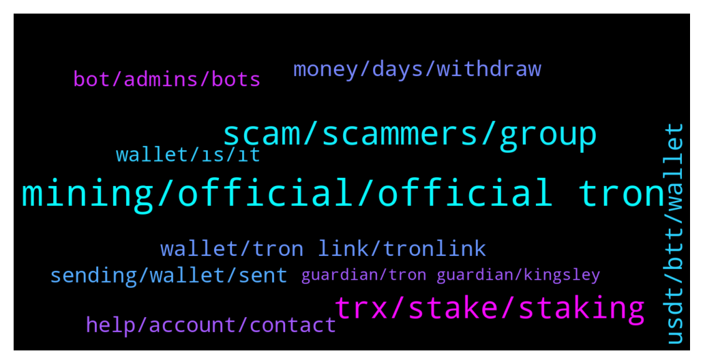

# **@tronnetworkEN**
 ## Analysis for **2022-01-25** - **2022-01-26**.

---

## 📊 **Basic Stats**

**n_messages_sent**: 347

---

---

## 🔝 **Top keywords and related messages**

1. **mining, official, official tron**

    @Chinedu --- *Please how can I start making money Tron .... And the official app or website* **--->** [TG Discussion](https://t.me/tronnetworkEN/3853393)

    @balajivarsitha --- *Anyone has news updates regarding TRON24 n Tron25🙏* **--->** [TG Discussion](https://t.me/tronnetworkEN/3855813)

    @MotivAfric --- *When will T24 able to start wirhdrawal* **--->** [TG Discussion](https://t.me/tronnetworkEN/3854101)

    @Deung --- *but why is the mining still running?* **--->** [TG Discussion](https://t.me/tronnetworkEN/3854115)

    @Carlos_TRX --- *No, TRON csn not be mined* **--->** [TG Discussion](https://t.me/tronnetworkEN/3853451)

    @balajivarsitha --- *Why then TRON 24 N TRON25 are using same application process* **--->** [TG Discussion](https://t.me/tronnetworkEN/3852436)

2. **scam, scammers, group**

    @xPommepote --- *Seems a new scam app trend…* **--->** [TG Discussion](https://t.me/tronnetworkEN/3854792)

    @Urbantime --- *Please tronforyou legit? Because they claim to be doing giveaway* **--->** [TG Discussion](https://t.me/tronnetworkEN/3855739)

    @agentpiki --- *Who knows? To scam you guys?  You not doing research and complain here?   As if we know how the scammers are?* **--->** [TG Discussion](https://t.me/tronnetworkEN/3854117)

    @agentpiki --- *Done. Thanks for your valuable suggestion.  We have lots of scammers of different nationals, not just Indians man* **--->** [TG Discussion](https://t.me/tronnetworkEN/3855902)

    @agentpiki --- *You plan to make scam smart contract is it?* **--->** [TG Discussion](https://t.me/tronnetworkEN/3853069)

    @simon866 --- *They keep trying their scams on the daily 🤦‍♂️* **--->** [TG Discussion](https://t.me/tronnetworkEN/3855694)

3. **trx, stake, staking**

    @agentpiki --- *Only if you apply as Super representative.  Trx is given rewards for blocks processed* **--->** [TG Discussion](https://t.me/tronnetworkEN/3856158)

    @Lucianoleaors --- *I just like to know if I can trust miner Trx Capital to receive TRX daily...* **--->** [TG Discussion](https://t.me/tronnetworkEN/3856095)

    @KingsDove_TRX --- *In short, the fundamentals for TRX are getting better and the recent downturn in BTC (given history of performance over the last year) I believe that the bottom is near if not already confirmed and we should see some shape up in the next week or so* **--->** [TG Discussion](https://t.me/tronnetworkEN/3852831)

    @Re1naldoch4 --- *Hi. Tronscan says out of energy. Failed.* **--->** [TG Discussion](https://t.me/tronnetworkEN/3853448)

    @PiterSpain --- *No mining on TRON. Buy and freeze&vote (like staking)* **--->** [TG Discussion](https://t.me/tronnetworkEN/3852326)

    @KingsDove_TRX --- *TRX follows BTC and I don't see many tronics selling a lot of their position* **--->** [TG Discussion](https://t.me/tronnetworkEN/3852832)

4. **usdt, btt, wallet**

    @Sum --- *I have  swapping  some  usdt for trx but  is it not working.* **--->** [TG Discussion](https://t.me/tronnetworkEN/3854285)

    @Sivakumar_1975 --- *Hello, I hold 51usdt past two days but still not showing usdt in my Wallet....what happened as soon as possible please recover my usdt....* **--->** [TG Discussion](https://t.me/tronnetworkEN/3854654)

    @Trooper369 --- *Any problem on the tron chain. My friend send me usdt in my wallet. But not yet received. Why? Any issues on the tron chain?* **--->** [TG Discussion](https://t.me/tronnetworkEN/3855633)

    @qeqa2 --- *I can’t transfer btt to binance ? Why this happen? On tronlink i have 78milion btt and showed like old btt?* **--->** [TG Discussion](https://t.me/tronnetworkEN/3853311)

    @Zer0log --- *Should i buy it with usdt on tron link or what?* **--->** [TG Discussion](https://t.me/tronnetworkEN/3854212)

    @afrifaba --- *Can I swap my TRX fir USDT in Tron link wallet and send it to Binance?* **--->** [TG Discussion](https://t.me/tronnetworkEN/3856128)

5. **money, days, withdraw**

    @MENTOR1880 --- *I borrowed the money from someone* **--->** [TG Discussion](https://t.me/tronnetworkEN/3855586)

    @Lucianoleaors --- *But, they have paid me for 20 days long.* **--->** [TG Discussion](https://t.me/tronnetworkEN/3856102)

    @MENTOR1880 --- *You that scam me, withdraw my USDT, I promise you your days are numbered, you're in this group, I promise you something, you will never go unpunished never, all the days of your life, you will regret it* **--->** [TG Discussion](https://t.me/tronnetworkEN/3855980)

    @balajivarsitha --- *Just miss he ask me about to pay 1000usdt* **--->** [TG Discussion](https://t.me/tronnetworkEN/3852608)

    @xPommepote --- *Of course do not do that.* **--->** [TG Discussion](https://t.me/tronnetworkEN/3854757)

    @balajivarsitha --- *How much days u people will be cheating cheaper bastards* **--->** [TG Discussion](https://t.me/tronnetworkEN/3852533)

6. **wallet, tron link, tronlink**

    @afrifaba --- *So why can't I find my TRX in Tron link wallet* **--->** [TG Discussion](https://t.me/tronnetworkEN/3854710)

    @😊 --- *Why can't transfer TRX from Trust wallet to Tron Link Pro  It's showing invalid receiving address* **--->** [TG Discussion](https://t.me/tronnetworkEN/3853658)

    @HimanshuHoneyBee --- *Can Anyone withdraw udst from my Tron Link pro wallet?* **--->** [TG Discussion](https://t.me/tronnetworkEN/3853414)

    @MENTOR1880 --- *Was only looking for tron coin wallet, trust wallet requested* **--->** [TG Discussion](https://t.me/tronnetworkEN/3856035)

    @paypaltobtc --- *Best version of TronLink is TronLink cold wallet* **--->** [TG Discussion](https://t.me/tronnetworkEN/3856294)

    @Rhoncrypones --- *Hi am having problem with transfering my tron to another wallet* **--->** [TG Discussion](https://t.me/tronnetworkEN/3855373)

7. **help, account, contact**

    @FeemiiKhan --- *It show that account is disabled* **--->** [TG Discussion](https://t.me/tronnetworkEN/3856094)

    @Aman --- *Hello how do I contact support* **--->** [TG Discussion](https://t.me/tronnetworkEN/3855882)

    @Nicolas --- *hello sir.. please help me.. i have never done anything wrong.. i have a dependent 6 year old son who i take care of alone.. i am also disabled with very little income..start  months I put my 270 euros that I had left to do my shopping.. I said to myself these vouchers I will be able to recover six euros every day to do my shopping it's next month that I'm going to have a  little more money to increase my income.  .. yesterday while going to see my account .. I couldn't get into it.  It tells me my account and suspended is contact support..i have messaged them a lot..but they are not responding..please help me..we don't have many already so s  'they take the little i never am i will get through this.. please help me help us.. i ask you with great sadness.. please have mercy on us and help  please recover my account..* **--->** [TG Discussion](https://t.me/tronnetworkEN/3853044)

    @MENTOR1880 --- *Are you requesting me to do what please* **--->** [TG Discussion](https://t.me/tronnetworkEN/3856021)

    @Roberto --- *Impossible to Log In today, someone have the same problem?* **--->** [TG Discussion](https://t.me/tronnetworkEN/3855504)

    @Brownhawks_Memolabs --- *hi Any admin to contact for partnership or proposal* **--->** [TG Discussion](https://t.me/tronnetworkEN/3854331)

8. **sending, wallet, sent**

    @Dennis --- *I sent again to another address it did not go through* **--->** [TG Discussion](https://t.me/tronnetworkEN/3854664)

    @PiterSpain --- *Are u sending to TPmjgZoDuPcc2L7v26toKymn3w9qpBKHhH? It's not active* **--->** [TG Discussion](https://t.me/tronnetworkEN/3854652)

    @MilNoslen --- *Are you hitting max when you try to send?* **--->** [TG Discussion](https://t.me/tronnetworkEN/3854569)

    @PiterSpain --- *I don't know what's happening...   Probably your wallet may be blacklisted by Tether.... I suggest you to contact them to discard this option.  Sometimes Tether freezes accounts if they suspect that funds are involved in frauds/scams* **--->** [TG Discussion](https://t.me/tronnetworkEN/3854686)

    @Zer0log --- *To activate my wallet means to start by only sending 1.1 to it and not less or more?* **--->** [TG Discussion](https://t.me/tronnetworkEN/3854417)

    @simon866 --- *The issue is with trust wallet, you can ask them here for what's happening with your wallet 👍  https://t.me/trustwallet* **--->** [TG Discussion](https://t.me/tronnetworkEN/3855661)

9. **bot, admins, bots**

    @balajivarsitha --- *First u people secure this forum from spammers then do give bot replies 😂* **--->** [TG Discussion](https://t.me/tronnetworkEN/3852554)

    @agentpiki --- *Admins and mods will not message you first buddy* **--->** [TG Discussion](https://t.me/tronnetworkEN/3856152)

    @Lucianoleaors --- *I just to chat with admin. Who's?* **--->** [TG Discussion](https://t.me/tronnetworkEN/3856146)

    @Fabs_trx --- *You are talking to a bot man* **--->** [TG Discussion](https://t.me/tronnetworkEN/3855570)

    @agentpiki --- *You think BOTs have the ability to talk? They are programmed for convenience, not to talk* **--->** [TG Discussion](https://t.me/tronnetworkEN/3855063)

    @MilNoslen --- *A bot can NEVER pm you. That's just simple. Scammers will DM you disguised as admins, mods, or bots.  So be smart and know the difference* **--->** [TG Discussion](https://t.me/tronnetworkEN/3852560)

10. **wallet, ıs, ıt**

    @Ali_Sonkalan --- *actually ı dıd delete from assets but when ı check tron scan ıt ıs stıll there* **--->** [TG Discussion](https://t.me/tronnetworkEN/3852687)

    @RealPanahi --- *My friends forgot the phrase section to import the wallet What should I do?* **--->** [TG Discussion](https://t.me/tronnetworkEN/3853355)

    @Dennis --- *Yes and to another wallet too* **--->** [TG Discussion](https://t.me/tronnetworkEN/3854533)

    @xPommepote --- *JustShare the hash of the transaction or your wallet address.* **--->** [TG Discussion](https://t.me/tronnetworkEN/3854522)

    @Ali_Sonkalan --- *admın how can ı remove ıt* **--->** [TG Discussion](https://t.me/tronnetworkEN/3852685)

    @Ali_Sonkalan --- *how can ı save my wallet* **--->** [TG Discussion](https://t.me/tronnetworkEN/3852681)

