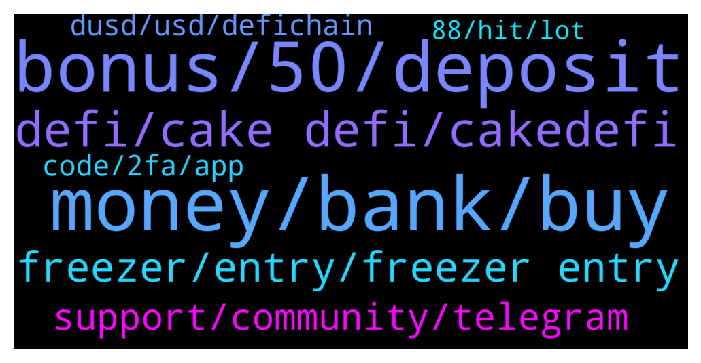

# **@CakeDeFi_EN**
 ## Analysis for **2022-01-26** - **2022-01-27**.

---

## 📊 **Basic Stats**

**n_messages_sent**: 268

---

---

## 🔝 **Top keywords and related messages**

1. **money, bank, buy**

    @<UNK> --- *Lol bank won't lose $ this is 100% apy yet still lose money I wish it breakeven soon then I'm out* **--->** [TG Discussion](https://t.me/CakeDeFi_EN/168482)

    @Tania_Braveman --- *And if you wanted to grow more coins this year, that would be…?* **--->** [TG Discussion](https://t.me/CakeDeFi_EN/168308)

    @DmgBautista --- *Atually you lose money in the bank, you just doesn't see that directly as you see in investments, because of your (or mine or any other person) traditional notion of "lost".   For any person, the usual definition of lost is when you have 100, and suddenly, you only see 99. Were did the other 1 go? You lost it. You dont see it, therefore, you lost it.   You dont see that loss in the bank because the bank doesn't work with the "value" of money for you, let's say it this way, it works with the unit of money. But the underlying value of that unit is behind it, and the bank works with that underlying value for itself, just doesn't show it to you.   If you place 100 units of money today in the bank, and you can buy a good with that 100 units, that is stable through time (let's say a big mac, since it will probably still exist in 10 years).  Today with your 100 money units, you can buy one big mac. You put that in the bank, with a 3% inflation YOY for 10 years. The bank will give an interest of 0,1% APR on your savings account.   After 10 years, your big mac will now cost almost 140 money units, but your savings account only have 101 money units in that same time.   Anyone will see that as a win, as you gained 1 money unit in 10 years. But that by itself is worthless. To have a proper analisys you will always need to have a goods basket to which compare your money units through time to see if you actually gained money or not.  And with a traditional bank savings account, you are actually losing, because no bank pays you more than the inflation.   So it is impossible for you to buy in 10 years, the same thing you buy today, with the exact same money. Ypu will always have less, for the same money. Any investment can worth less in or more in time, but investments are still the best vehicle to gain actual money and beat inflation.   See Bitcoin for example. In 2010, you would buy a gum with 1 unit. Today with 1 unit of it, you buy the truck that transports the gums. As for USD for example, in 2010, with 1 unit of it you  would buy 10 gums. Today, with the same unit, you will buy 5 gums.   Your unit of measure did not changed, but the underlying value of it, yes, and much. Same with DFI, today worths less, tomorrow will worht more. But despite those market fluctuations and as any investment, is providing you interest that is beating inflation, so you are technically not at a loss. The money you have invested will continue to provide cashflow on a dayly basis, which is more than your traditional bank can say...   P.S. - Sorry for the long post, but a good exchange of ideas is always worthy and today I'm bored AF 😂* **--->** [TG Discussion](https://t.me/CakeDeFi_EN/168498)

    @zachgax --- *The problem with crypto, is unlike the stock market, it is completely unregulated. Wild West, anything goes. That’s why there are so many meme coins and it’s all backed by thin air. One tweet by Elon Musk can send prices soaring or crashing.  That’s why projects like Defichain, and others which have a strong development roadmap, plans and supporting infrastructure, networks, services and apps are important I feel to legitimise the use of crypto.   As with anything, I advise people to read up on the coin, blockchain, project they choose to invest in. It’s like reading a prospectus of a company or stock. Make an informed decision rather than just randomly trying to hit some unicorn 100000% meme coin to cash out.* **--->** [TG Discussion](https://t.me/CakeDeFi_EN/168495)

    @Tania_Braveman --- *What strategies do I click to in 2022, I need to invest in a coin* **--->** [TG Discussion](https://t.me/CakeDeFi_EN/168345)

    @gfoc3 --- *always invest only what you can afford. 🙂* **--->** [TG Discussion](https://t.me/CakeDeFi_EN/168364)

2. **bonus, 50, deposit**

    @Shankar3275 --- *For sign up bonus which coin I have to deposit .is it  mandatory for 50 doller DFI OR.... 50 doller of  any coin can deposit..* **--->** [TG Discussion](https://t.me/CakeDeFi_EN/168966)

    @nonesoilder --- *referal bonus 8 defi is it true* **--->** [TG Discussion](https://t.me/CakeDeFi_EN/168802)

    @YSL --- *Got it …. But i don’t see the bonus ? Am I missing anything here ?* **--->** [TG Discussion](https://t.me/CakeDeFi_EN/168733)

    @B_Double_U --- *Hey, I have been receiving the defi bonus email for a while now, requesting I add $30 and get a bonus, but I have previously added money and added as liquidity. Is the email indefinite or do I need to add money to a specific locati0on in order to receive the bonus?* **--->** [TG Discussion](https://t.me/CakeDeFi_EN/168321)

    @B_Double_U --- *I guess, but I get an email a day telling me to add money to get my "pending bonus". Maybe it's just an additional bonus????* **--->** [TG Discussion](https://t.me/CakeDeFi_EN/168339)

    @Annie --- *Haloo 🙏🏻Why I can't claim.bonus $35 ...aplication cannot open ???* **--->** [TG Discussion](https://t.me/CakeDeFi_EN/168447)

3. **defi, cake defi, cakedefi**

    @busukman --- *Hey boss.. is it enought for just to know the cakedefi environment, i means like how to stake,how to LM , withdraw,depo and etc..because sometimes i feel this space is to deep.* **--->** [TG Discussion](https://t.me/CakeDeFi_EN/168455)

    @jessekylefrk --- *Can someone explain what staking means and how to bake?? I'm not familiar with cake defi.* **--->** [TG Discussion](https://t.me/CakeDeFi_EN/168586)

    @Kassius84 --- *For both questions, follow the official announcement channel of Cake DeFi and you will be notice 😃👍  Cake DeFi EN Announcements (Official) Official announcements for Cake DeFi https://t.me/CakeDeFi_EN_announcements* **--->** [TG Discussion](https://t.me/CakeDeFi_EN/168569)

    @cybearir --- *one question is there a way to convert BTC to defi and vice versa ? on cakedefi platform ?* **--->** [TG Discussion](https://t.me/CakeDeFi_EN/168738)

    @Kassius84 --- *Hey welcome. Start your DeFi Journey Here: Cake  DeFi Services Simply Explained https://support.cakedefi.com/hc/en-us/articles/900003427506-Cake-Service-simply-explained* **--->** [TG Discussion](https://t.me/CakeDeFi_EN/168214)

    @Michael_Schredl --- *There is not 'the most profitabel' one. There are different services on Cake, take a look at them: https://blog.cakedefi.com/cake-simply-explained/* **--->** [TG Discussion](https://t.me/CakeDeFi_EN/168251)

4. **freezer, entry, freezer entry**

    @zachgax --- *I also got an edm for this promo, and the wording in the email is different from the site link. Here it says says that freezer extensions are counted as well as long as 12 months or more.* **--->** [TG Discussion](https://t.me/CakeDeFi_EN/168687)

    @YSL --- *That’s good … I have 2 tranche to be defrostable next month and March .. how can I extend it to enjoy this benefit ?* **--->** [TG Discussion](https://t.me/CakeDeFi_EN/168730)

    @YSL --- *I just did that few days ago .. 🤦🏻‍♀️ will still entitle ? I freeze 5 yrs few days ago* **--->** [TG Discussion](https://t.me/CakeDeFi_EN/168707)

    @xy_z_z_yx --- *How long do we have to start freezing ?   (Not how long must it be frozen for but when does the time end in which we can freeze for the bonus)* **--->** [TG Discussion](https://t.me/CakeDeFi_EN/168717)

    @xavier_pwm --- *Sigh.. just froze mine yesterday only* **--->** [TG Discussion](https://t.me/CakeDeFi_EN/168943)

    @Michael_Schredl --- *Yes, if you extend your freezer entry you will also get the bonus* **--->** [TG Discussion](https://t.me/CakeDeFi_EN/168756)

5. **support, community, telegram**

    @Tehokosong --- *Weird I didn’t see the mod on your name for a few messages previously* **--->** [TG Discussion](https://t.me/CakeDeFi_EN/168896)

    @Tehokosong --- *Dan your not a mod anymore?!* **--->** [TG Discussion](https://t.me/CakeDeFi_EN/168894)

    @Faithkrypto --- *Several people have gotten this on their dm already do well to check and dm I know I’ll be blocked ASAP by the admins* **--->** [TG Discussion](https://t.me/CakeDeFi_EN/168865)

    @jezzkng --- *Oh, send a ticket to support to help you fix* **--->** [TG Discussion](https://t.me/CakeDeFi_EN/168658)

    @DmgBautista --- *DM other users its against the community guidelines. Please refrain from requesting such* **--->** [TG Discussion](https://t.me/CakeDeFi_EN/168882)

    @coronal --- *Hello #scammer do not dm me first🤣🤣🤣* **--->** [TG Discussion](https://t.me/CakeDeFi_EN/168656)

6. **dusd, usd, defichain**

    @DmgBautista --- *Yes DUSD has been dropping enough to offset the gain you felt in the DPDBC. DUSD has been trading already at almost 1,3$ usd aproximatelly, while currently is something around 1,1$ usd. It will drop further (my opinion only) once we get closer to the hardfork since many users are planning on exiting the pools, which will cause a drop in demand and further proximity to an actual 1$usd.* **--->** [TG Discussion](https://t.me/CakeDeFi_EN/168388)

    @DmgBautista --- *Hi! That update was an unplanned  emergency update, to stop the possibility of exploit the atomic swap beta feature, therefore the added time that many exchanges took to accomodate it. The current hardfork is a planned one, that aims to provide the tools to bring parity with USD to the Defichain DUSD* **--->** [TG Discussion](https://t.me/CakeDeFi_EN/168476)

    @mholdy.xpr --- *Can someone explain to me simply what dusd is? Is it pegged to the dollar? Any info or helpful forum would be appreciated!* **--->** [TG Discussion](https://t.me/CakeDeFi_EN/168424)

    @Gilbz --- *Curious as how DUSD stayed so high for so long - wouldn't the arbitrageurs have a field days swallowing this stuff?* **--->** [TG Discussion](https://t.me/CakeDeFi_EN/168391)

    @Manvydasm --- *Can dusd drop to 70-60-50% usd value if many users sell it?* **--->** [TG Discussion](https://t.me/CakeDeFi_EN/168407)

    @<UNK> --- *Sorhais mods 😀 may I ask after Feb 7 will dusd stay at $1 or very close to $1, or still subject to 5-30% fluctuation?* **--->** [TG Discussion](https://t.me/CakeDeFi_EN/168399)

7. **code, 2fa, app**

    @coronal --- *Yes sir i did but i put my real 2FA code but can't able to log in* **--->** [TG Discussion](https://t.me/CakeDeFi_EN/168663)

    @coronal --- *Hello sir                I used my real 2FA code but system say wrong 2FA code Why ? Any reason  ____ THANK YOU* **--->** [TG Discussion](https://t.me/CakeDeFi_EN/168651)

    @mirkata001 --- *I f using Google Authenticator: https://www.howtogeek.com/425994/how-to-move-google-authenticator-to-a-new-phone-or-multiple-phones/* **--->** [TG Discussion](https://t.me/CakeDeFi_EN/168488)

    @nonesoilder --- *Is there an age limit of 18 for membership for cakedefi* **--->** [TG Discussion](https://t.me/CakeDeFi_EN/168799)

    @Larry --- *How do I change my two-factor authentication device for my Cake account?* **--->** [TG Discussion](https://t.me/CakeDeFi_EN/168486)

    @yldz_ahmt_1905 --- *I need help About account verification* **--->** [TG Discussion](https://t.me/CakeDeFi_EN/168516)

