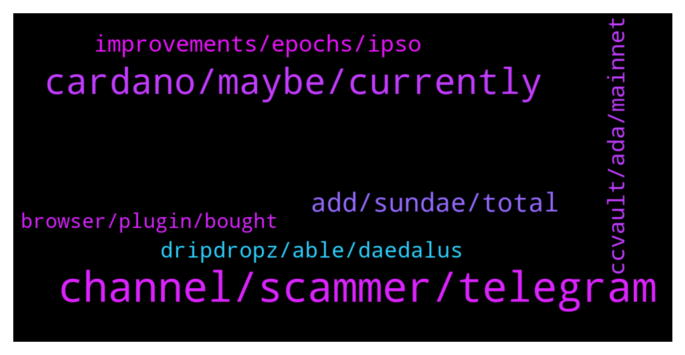

# **@Cardano**
 ## Analysis for **2022-01-26** - **2022-01-27**.

---

## 📊 **Basic Stats**

**n_messages_sent**: 129

---

---

## 🔝 **Top keywords and related messages**

1. **channel, scammer, telegram**

    @Magi --- *You need a platform scammer free  Without this   Nothing is possible* **--->** [TG Discussion](https://t.me/Cardano/775590)

    @Lgbeano --- *I'm not private messaging you, so if you are receding a message from an account that looks like me, just block and report* **--->** [TG Discussion](https://t.me/Cardano/775749)

    @KyR14c0s --- *Wrong impression and my brain could not translate well what i was reading hehehheheh* **--->** [TG Discussion](https://t.me/Cardano/775811)

    @glitch04 --- *Look at the dm they just sent not even in the group* **--->** [TG Discussion](https://t.me/Cardano/775595)

    @ZeroOne101 --- *thanks ... yeah i dont know how to reach them ... as i said earlier my messages are just disappearing after i post them in the telegram  community chat...* **--->** [TG Discussion](https://t.me/Cardano/775773)

    @Magi --- *That’s what I mean that’s very very difficult to understand for normal people   But I know I understand* **--->** [TG Discussion](https://t.me/Cardano/775605)

2. **cardano, maybe, currently**

    @ExInfernis --- *Did someone used cardano wallet paired to ledger for swapping on muesli swap or sundae swap? Or it will not work with ledger* **--->** [TG Discussion](https://t.me/Cardano/776163)

    @yournic --- *is there a wallet browser where I can see the value of my accrued tokens on the Cardano network?   i.e. like zapper.fi on eth* **--->** [TG Discussion](https://t.me/Cardano/775596)

    @arautom --- *Hey, I'm writing an article about Cardano and was doing a research about Project Catalyst, and one doubt about some official data that I found emerged. There's someone who I could talk about this in private?* **--->** [TG Discussion](https://t.me/Cardano/775466)

    @Khalid --- *So many noisy cardano haters now on social media because of sundaeswap issues. Is it really cardano's limitations that caused these problems? or did the sundaeswap team rushed the release? Will there be an official statement from IOG addressing these concerns?* **--->** [TG Discussion](https://t.me/Cardano/775892)

    @vechain4life --- *Hydra better speed this up or Cardano is toast* **--->** [TG Discussion](https://t.me/Cardano/775648)

    @Magi --- *Show how ? Which Plattform ?     I hope maybe cardano   Because  In the Future a many different people  Can’t use it because it’s not Safe at all  And for me it’s not for the humanity   To many people will withdraw they money into a nft scam  Or giveaway scam   You know that’s not safe at all   It’s the Truth look at  For me is crypto nice but for my parents or my sisters  Its too dangerous   Because of scammers   That’s why it’s never happend this year without scammer fix   And a payback for people who can proof a scam !! My opinion   I know you all a the best pros in the world and Bachelor of science 😂😂🤡* **--->** [TG Discussion](https://t.me/Cardano/775601)

3. **add, sundae, total**

    @juancmtzr3 --- *Thank! How much you recommend to stake? Min* **--->** [TG Discussion](https://t.me/Cardano/775679)

    @ZeroOne101 --- *hmmmm.... ok . one more question . i staked some ada in the nerd sundae pool like 2 weeks back ... can i just add coins to that wallet ? how will i know if there is still room to add more coins ?* **--->** [TG Discussion](https://t.me/Cardano/775769)

    @ZeroOne101 --- *i am wondering if anyone knows if it is still possible to stake for sundae ispo ?* **--->** [TG Discussion](https://t.me/Cardano/775763)

    @KimAnna --- *Where can I see my earned staking of sundaeswap?* **--->** [TG Discussion](https://t.me/Cardano/775701)

    @brzi987 --- *it will not swap at all hahahah...I was waiting over 45hours,then cancelled thr order. I've submitted it at price 0.84ada with 40% slippage,price went up to 0.98 then down to 0.76 I think...and my swap was still not complete🤦 With no feedback or support from Sundaeswap ,when I was askin for help and answers* **--->** [TG Discussion](https://t.me/Cardano/775509)

    @Lgbeano --- *That pool is over saturated but you can still add ₳. I'm not sure if they will be included in their ispo or not, you would need to ask the sundaeswap team.* **--->** [TG Discussion](https://t.me/Cardano/775772)

4. **improvements, epochs, ipso**

    @apex_pool_spo --- *no, where did you get that impression from? it is actually going to be worse for a period, when other DEXes will also lunch, but in a few months (my expectation) we will see some big improvements. there is also a hard fork schedules for February (theoretically), I am not sure if the CIP31, CIP32 and CIP33 will be included or not. If yes, we will see the improvements much sooner.* **--->** [TG Discussion](https://t.me/Cardano/775810)

    @Lgbeano --- *Yeah they only ran their ispo for 5 epochs* **--->** [TG Discussion](https://t.me/Cardano/775768)

    @KyR14c0s --- *yes but it took much more time than other days ... they were not supposed to fix this in this epoch ?* **--->** [TG Discussion](https://t.me/Cardano/775809)

    @ZeroOne101 --- *does anyone have thoughts on them only ipso'in for 5 epochs ? compared to most other projects length , and also considering the hype , that this is a pretty measly offering , no ?* **--->** [TG Discussion](https://t.me/Cardano/775777)

    @apex_pool_spo --- *there was a parameter change, but it was something minor, we won't see noticeable improvements from that (my personal guess).* **--->** [TG Discussion](https://t.me/Cardano/775812)

    @Barbedouce --- *They work without compromise to build for the better and trough the time; so we are just at the beginning of the optimisation, that's it.* **--->** [TG Discussion](https://t.me/Cardano/775898)

5. **ccvault, ada, mainnet**

    @BinK18 --- *Ccvault is the best ada wallet* **--->** [TG Discussion](https://t.me/Cardano/775859)

    @manolo_o --- *Any idea how we claim SS on CCVault?* **--->** [TG Discussion](https://t.me/Cardano/776049)

    @martap79 --- *ccvault & yoroi both not working for me* **--->** [TG Discussion](https://t.me/Cardano/775942)

    @Barbedouce --- *Hi, i'm using in the same time CCVault mainnet & testnet. I connect to minswap on testnet, then sundaeswap mainnet. When i do this, there is a mistake : minswap switch to mainnet, with the wallet i chose for sundaeswap. I think this kind of mistake can lead to some people lossing funds. Be carefull.* **--->** [TG Discussion](https://t.me/Cardano/775893)

    @vechain4life --- *Trying to send ADA from ccvault to binance.  It’s taking forever to write tx to a block* **--->** [TG Discussion](https://t.me/Cardano/775634)

    @Naheem --- *Ive had ada in yori wallet for over 15 days but not recieved any rewards is that normal? Or am i doing something wrong* **--->** [TG Discussion](https://t.me/Cardano/775496)

6. **dripdropz, able, daedalus**

    @NotEnea --- *waiting like 20 mins + for a transaction feels weird* **--->** [TG Discussion](https://t.me/Cardano/776072)

    @apex_pool_spo --- *then it is normal. the network has many transactions in the last weeks.* **--->** [TG Discussion](https://t.me/Cardano/775804)

    @KyR14c0s --- *guys anyone facing a problem with Daedalus my transactions are taking really really long* **--->** [TG Discussion](https://t.me/Cardano/775793)

    @ExInfernis --- *I was able to drip successfully with daedalus. Just waiting to receive them* **--->** [TG Discussion](https://t.me/Cardano/775566)

    @cardano1900 --- *anyone using dripdropz right now?i guess it congested the chain a bit...i am on the "awaiting payment" screen and my wallet doesn't have an output tx* **--->** [TG Discussion](https://t.me/Cardano/775565)

    @glitch04 --- *High load on the network from the transition and people trying to pickup dripdropz* **--->** [TG Discussion](https://t.me/Cardano/775638)

7. **browser, plugin, bought**

    @Bartleby --- *Never tried it ,is it browser based ?* **--->** [TG Discussion](https://t.me/Cardano/775867)

    @cryptoustt --- *testing if I can type word "muesli" here* **--->** [TG Discussion](https://t.me/Cardano/775887)

    @apex_pool_spo --- *I am using the browser plugin version.* **--->** [TG Discussion](https://t.me/Cardano/775870)

    @apex_pool_spo --- *browser (like adalite.io) and browser plugin (like yoroi)* **--->** [TG Discussion](https://t.me/Cardano/775869)

    @KyR14c0s --- *i am not used to it .....thats why i was asking .... and with the first chance we had some clever ones to say that they can help me ...... as if i am a noob and idiot ........* **--->** [TG Discussion](https://t.me/Cardano/775803)

    @pool0AAAA --- *Just install extension to your browser, very straightforward* **--->** [TG Discussion](https://t.me/Cardano/775481)

