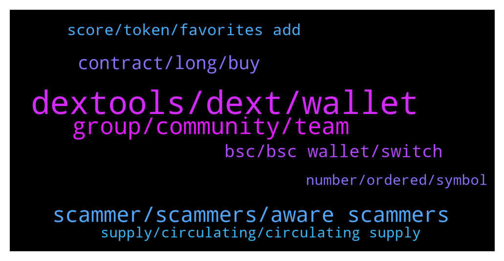

# **@DEXToolsCommunity**
 ## Analysis for **2022-01-25** - **2022-01-27**.

---

## 📊 **Basic Stats**

**n_messages_sent**: 201

---

---

## 🔝 **Top keywords and related messages**

1. **dextools, dext, wallet**

    @DividendsOfficial --- *I have nft project does dex promote nft* **--->** [TG Discussion](https://t.me/DEXToolsCommunity/328142)

    @pedrosfernandez --- *I just thought that if it still possible to do it on Dextools App so it still available* **--->** [TG Discussion](https://t.me/DEXToolsCommunity/328678)

    @napascual --- *Not from Dextools, we don't provide an Api yet. You could use the chart tools to calculate that manually though* **--->** [TG Discussion](https://t.me/DEXToolsCommunity/328509)

    @badelelele --- *dexscreener grew their chains in lightspeed* **--->** [TG Discussion](https://t.me/DEXToolsCommunity/328440)

    @JoeyDieleman --- *Probably an old DEXT contract in the list* **--->** [TG Discussion](https://t.me/DEXToolsCommunity/328597)

    @JoeyDieleman --- *Ok, if proto isn't on a supported dext it won't show. If you want your dex to be supported you xan request it. But there is alist already and dexes are choosen by its usage.* **--->** [TG Discussion](https://t.me/DEXToolsCommunity/328403)

2. **group, community, team**

    @NikoDikooo --- *No worries. Take your time. I will provide a screenshot via DM if needed for accurate numbers et cetera. Going to sleep now since I live in Sweden. We’ll be in touch 🙏* **--->** [TG Discussion](https://t.me/DEXToolsCommunity/328186)

    @hmk18990 --- *if you've any questions you can directly ask here in the group* **--->** [TG Discussion](https://t.me/DEXToolsCommunity/328313)

    @Jeoffrey_thewatcher --- *do you have any job vacancy for community moderator/manager?? i can manage both philippines community and english community.* **--->** [TG Discussion](https://t.me/DEXToolsCommunity/328551)

    @JoeyDieleman --- *Sure we are reading. Can we help?* **--->** [TG Discussion](https://t.me/DEXToolsCommunity/328977)

    @badelelele --- *can you set up a group chat?* **--->** [TG Discussion](https://t.me/DEXToolsCommunity/328448)

    @stanes --- *You can join the Chinese group here: https://t.me/DEXTChinese* **--->** [TG Discussion](https://t.me/DEXToolsCommunity/328864)

3. **scammer, scammers, aware scammers**

    @stanes --- *This is a support channel, I prefer people here being aware scammers are around.* **--->** [TG Discussion](https://t.me/DEXToolsCommunity/328582)

    @stanes --- *No sorry I don't understand why we should stop warning people of scammers.  This is not related to the app. I find your messages a bit concerning tbh, you just look like a scammer yourself 🤔* **--->** [TG Discussion](https://t.me/DEXToolsCommunity/328593)

    @Lol --- *Yes people should be aware of scammers instead posting… people will be afraid of using DEXT Stanes I hope you understand me* **--->** [TG Discussion](https://t.me/DEXToolsCommunity/328590)

    @hmk18990 --- *Hotpairs are not for sale! Also admins never dm you or request for funds! So don’t fall for scammers who told you to trend your tokens!* **--->** [TG Discussion](https://t.me/DEXToolsCommunity/328198)

    @JoeyDieleman --- *The photo you posted is from a scammer:* **--->** [TG Discussion](https://t.me/DEXToolsCommunity/328986)

    @stanes --- *Be careful, a scammer gave you a similar handle but it's a fake one.* **--->** [TG Discussion](https://t.me/DEXToolsCommunity/328489)

4. **contract, long, buy**

    @pedrosfernandez --- *Hope this contract will stay for a long time because I Hodl all coins for long time* **--->** [TG Discussion](https://t.me/DEXToolsCommunity/328684)

    @pedrosfernandez --- *is it because of the old contract ?* **--->** [TG Discussion](https://t.me/DEXToolsCommunity/328650)

    @stanes --- *Contract doesn't have liquidity since beginning of  July and there are two warning messages on the page telling people to don't buy it 🤷‍♂️* **--->** [TG Discussion](https://t.me/DEXToolsCommunity/328676)

    @BubblesTU --- *but 70 days most of that contract was liquidated* **--->** [TG Discussion](https://t.me/DEXToolsCommunity/328673)

    @BubblesTU --- *if you didn't buy to long ago you can still use the underlying liquidity to swap it back to the amount you used to buy.* **--->** [TG Discussion](https://t.me/DEXToolsCommunity/328664)

    @pedrosfernandez --- *Here the the TX infos : https://bscscan.com/tx/0x044e65b49893f68184444800ac88721cdbccc0ac8b84850fb2b0035e1f399a41* **--->** [TG Discussion](https://t.me/DEXToolsCommunity/328667)

5. **bsc, bsc wallet, switch**

    @pedrosfernandez --- *Could I user BSC too ?* **--->** [TG Discussion](https://t.me/DEXToolsCommunity/328589)

    @NoOne19944991 --- *Hi BSC hot pairs has issue Not show all of them* **--->** [TG Discussion](https://t.me/DEXToolsCommunity/329116)

    @oi_mista --- *when it does load nothing shows on BSC* **--->** [TG Discussion](https://t.me/DEXToolsCommunity/328855)

    @TheFutureHour --- *we just discovered a small issue in our bsc server, but it should be already fixed  would you check again and let us know please* **--->** [TG Discussion](https://t.me/DEXToolsCommunity/328847)

    @stanes --- *If there is still a bit of liquidity ou can try to resell them to get back a little something. On BSC fees are low so maybe it's worth it.* **--->** [TG Discussion](https://t.me/DEXToolsCommunity/328653)

    @stanes --- *You have to switch your Metamask to BSC.* **--->** [TG Discussion](https://t.me/DEXToolsCommunity/328615)

6. **score, token, favorites add**

    @JoeyDieleman --- *Score depends on the age of the token, liquidity and the amount of available social links. Also it the validation of the contract is taken into account* **--->** [TG Discussion](https://t.me/DEXToolsCommunity/328369)

    @Ibraahiiim --- *Please how do you score a token* **--->** [TG Discussion](https://t.me/DEXToolsCommunity/328368)

    @yanglianyun --- *How to add tokens to favorites? Thank you* **--->** [TG Discussion](https://t.me/DEXToolsCommunity/329046)

    @stanes --- *Do you mean the pair for your token? Search for it with the contract address.* **--->** [TG Discussion](https://t.me/DEXToolsCommunity/328255)

    @JoeyDieleman --- *The score consist on multiple categories, creation score grows when more transactions are made* **--->** [TG Discussion](https://t.me/DEXToolsCommunity/328374)

    @BubblesTU --- *but can we list the tokens that belong to it?* **--->** [TG Discussion](https://t.me/DEXToolsCommunity/328390)

7. **supply, circulating, circulating supply**

    @NikoDikooo --- *Hey Mooncat :) I have had questions from our community regarding this chart:  https://www.dextools.io/app/ether/pair-explorer/0xe7396f3210e93ba146468babf081141511ce2ef3  The current MCAP is actually around 7 million at the moment since all tokens aren’t in circulating supply. Can this be corrected/added to the Shiburai chart?* **--->** [TG Discussion](https://t.me/DEXToolsCommunity/328184)

    @MrWhale01 --- *Hey guys, how to add project's circulating supply to info? Shows only total supply* **--->** [TG Discussion](https://t.me/DEXToolsCommunity/328804)

    @hanzownage --- *Gotcha - will update on coinmarketcap* **--->** [TG Discussion](https://t.me/DEXToolsCommunity/329018)

    @stanes --- *hi, please update the circulating supply on Coingecko, we pull the info from there.* **--->** [TG Discussion](https://t.me/DEXToolsCommunity/328809)

    @bastardganpunk --- *Oh for the circulating supply you have to update it on coingecko* **--->** [TG Discussion](https://t.me/DEXToolsCommunity/328191)

    @Al_Aameen --- *I read it from coin market description* **--->** [TG Discussion](https://t.me/DEXToolsCommunity/328144)

