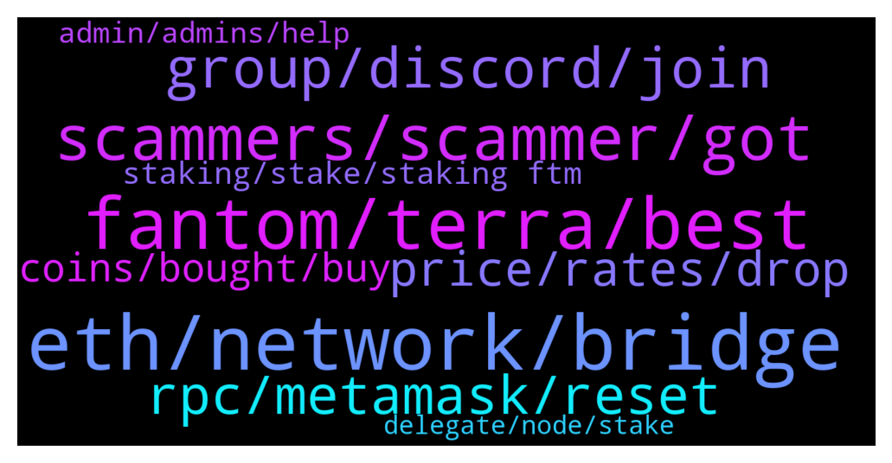

# **@Fantom_English**
 ## Analysis for **2022-01-26** - **2022-01-27**.

---

## 📊 **Basic Stats**

**n_messages_sent**: 286

---

---

## 🔝 **Top keywords and related messages**

1. **eth, network, bridge**

    @bonisu --- *Do u mean I have to sell my FTM first  ? And convert to stable coin. Then send to polygon and bridge?* **--->** [TG Discussion](https://t.me/Fantom_English/641784)

    @Ryan --- *Hey guys, sorry if it’s a silly question - I’m trying to send my ftm to meta mask. From what I can find online, I send it to my eth address, which I’ve got ready to do. Im also curious can I send it on the ftm network or does it have to be the erc20? Thanks in advance 👍* **--->** [TG Discussion](https://t.me/Fantom_English/642291)

    @Christoph --- *It doesn't work this way, for me, cost me a lot of ETH gas fee* **--->** [TG Discussion](https://t.me/Fantom_English/642370)

    @nate_hy --- *so why does EVM slow? I think ETH is slow bc blocksize limit and all validators sync, not bc EVM* **--->** [TG Discussion](https://t.me/Fantom_English/641629)

    @Christoph --- *@MathuranathM Oh really? But I have enough FTMs to pay for a lot of gas. Small amount moving it back cost a lot of ETH gas* **--->** [TG Discussion](https://t.me/Fantom_English/642376)

    @Janevietani --- *faucet are only for new user need ftm for first tx on network* **--->** [TG Discussion](https://t.me/Fantom_English/642390)

2. **fantom, terra, best**

    @Janevietani --- *it have terra to fantom with ust so it should be support fantom to terra as well* **--->** [TG Discussion](https://t.me/Fantom_English/643112)

    @METAROCKETMAN --- *What’s the best launchpad on fantom?* **--->** [TG Discussion](https://t.me/Fantom_English/641917)

    @MLH822020 --- *Hello, it doesn't go from Fantom to Terra* **--->** [TG Discussion](https://t.me/Fantom_English/643105)

    @MathuranathM --- *I would just use the fwallet on fantom website* **--->** [TG Discussion](https://t.me/Fantom_English/642351)

    @Gal --- *Hey guys  new to the platform 👋🏼 Would love an explanation about the differences between Fantom and Cardano, and why Fantom is a much better platform.* **--->** [TG Discussion](https://t.me/Fantom_English/641919)

    @Okasian --- *Keep the discussion related to fantom, please, tyvm.* **--->** [TG Discussion](https://t.me/Fantom_English/641646)

3. **scammers, scammer, got**

    @zenkert --- *I am so disappointed. No scammer contacted me the last 24h. 😭😢* **--->** [TG Discussion](https://t.me/Fantom_English/641628)

    @Chip --- *There are so many now some actually tell you to delete forum posts, so other scammers can't DM* **--->** [TG Discussion](https://t.me/Fantom_English/642318)

    @bboldbayar --- *Wow i just got 5 scammers dm me* **--->** [TG Discussion](https://t.me/Fantom_English/642314)

    @fashi0nable --- *Lol the bots on this server are badddd* **--->** [TG Discussion](https://t.me/Fantom_English/641852)

    @sticks_na_beany --- *How do people fall for this nonsense* **--->** [TG Discussion](https://t.me/Fantom_English/642603)

    @Brettcoin --- *i got nothing to that. have a great day.* **--->** [TG Discussion](https://t.me/Fantom_English/642034)

4. **group, discord, join**

    @pajamasfreak --- *Any job available please look at our site.* **--->** [TG Discussion](https://t.me/Fantom_English/642197)

    @Janevietani --- *https://t.me/spookyswap you can share it here too* **--->** [TG Discussion](https://t.me/Fantom_English/642041)

    @Kononov --- *Hi Team, I'm a Head of Business Development at Atomic Wallet, pleasure to e-meet you. We have added Fantom token to the fresh release of our platform and would like to create a common group chat for the discussion of Marketing activities. Can you assist me please?   Please let me know if you need to verify me before the conversation! (p.s. Jane, I've sent the same message in your dm)* **--->** [TG Discussion](https://t.me/Fantom_English/642307)

    @pajamasfreak --- *Don’t have one except on discord* **--->** [TG Discussion](https://t.me/Fantom_English/642058)

    @Alban --- *I would love to know more about it:)* **--->** [TG Discussion](https://t.me/Fantom_English/643032)

    @mas11002299 --- *I would like to contribute to the development* **--->** [TG Discussion](https://t.me/Fantom_English/643118)

5. **rpc, metamask, reset**

    @Janevietani --- *please have back up for RPC incase rpc.ftm.tools having issues   Network Name: Fantom Ultimates New RPC Url: https://ftmrpc.ultimatenodes.io/ ChainID: 250 Symbol: FTM Browser : https://ftmscan.com/* **--->** [TG Discussion](https://t.me/Fantom_English/641609)

    @slickrick6 --- *Try the below.    how to resolve pending txs ?  1. reset metamask go to metamask setting -> advanced -> reset reset metamask will only clear pending tx   2. add other RPC for back up Fantom RPC : a. https://rpc.ftm.tools/ b. https://rpc.ankr.com/fantom c. https://ftmrpc.ultimatenodes.io/   ChainID: 250 Symbol: FTM Browser : https://ftmscan.com  3. after reset metamask and add other rpc re-do your tx, check gas price here https://ftm.guru/fantomscan.html* **--->** [TG Discussion](https://t.me/Fantom_English/643187)

    @apo11 --- *I wanted to send fantoma network ftm* **--->** [TG Discussion](https://t.me/Fantom_English/642271)

    @g4usat --- *Hey, when I try to stake FTM from my metamask(in fantom n/w), it's throwing 'Transaction NaN Failed! [ethjs-query] while formatting outputs from RPC..." even though with high Gwei...can u pls check this and advice? (Scammers, don't waste time)* **--->** [TG Discussion](https://t.me/Fantom_English/641770)

    @g4usat --- *@Janevietani :when I try to stake FTM from my metamask(in fantom n/w), it's throwing 'Transaction NaN Failed! [ethjs-query] while formatting outputs from RPC..." even though with high Gwei...can u pls check this and advice?* **--->** [TG Discussion](https://t.me/Fantom_English/641997)

    @MathuranathM --- *Once you are on the ftm network (rpc). You should be able work with most defi stuff on fantom network* **--->** [TG Discussion](https://t.me/Fantom_English/642359)

6. **price, rates, drop**

    @oTsamohT --- *Why 2omb & 2shares big drop?* **--->** [TG Discussion](https://t.me/Fantom_English/641973)

    @topcat0112358 --- *The current beta is ~180%, so if BTC were to drop 5%, FTM would drop 9%. (Markets are pretty heavily macro driven at the moment, based the rates environment, so this doesn't account for something changing with one coin or the other.)* **--->** [TG Discussion](https://t.me/Fantom_English/641732)

    @MathuranathM --- *Cause ftm is pretty good price right now* **--->** [TG Discussion](https://t.me/Fantom_English/642345)

    @pajamasfreak --- *Varies each day, check ftm guru regularly* **--->** [TG Discussion](https://t.me/Fantom_English/642744)

    @LECH0N --- *If I staked my FTM for 365 last year and still haven't claimed it will I get new apr rates or the rate when I locked it in?* **--->** [TG Discussion](https://t.me/Fantom_English/642749)

    @to_much_crypto --- *why is FTM running so slow* **--->** [TG Discussion](https://t.me/Fantom_English/642714)

7. **coins, bought, buy**

    @bonisu --- *Any recommendations for Canadian buyers ? I buy from CDC, but it is etc 20 coins* **--->** [TG Discussion](https://t.me/Fantom_English/641752)

    @cryptoduke_i --- *other coins I bought dipped but HTD didn't* **--->** [TG Discussion](https://t.me/Fantom_English/641635)

    @pumphighweed --- *Btc hovering around 36k thank God I bought other altcoins a bit, still have some money to DCA to buy more when it go deeper. . 😅* **--->** [TG Discussion](https://t.me/Fantom_English/641632)

    @pumphighweed --- *am currently in profit I recently bought at pancake 0.4, today 0.5 because the game is released, not bad.* **--->** [TG Discussion](https://t.me/Fantom_English/641640)

    @JC_CX --- *so aren´t we getting free coins?* **--->** [TG Discussion](https://t.me/Fantom_English/641955)

    @ronald --- *Yet another scam fork. Just buy tomb unless you like chasing pump and dump like @Brettcoin* **--->** [TG Discussion](https://t.me/Fantom_English/642042)

8. **staking, stake, staking ftm**

    @bboldbayar --- *Where can i stake my ftm* **--->** [TG Discussion](https://t.me/Fantom_English/642311)

    @Redje4 --- *Hello I want to stake my ftm but how can I know that I choose a good validator?* **--->** [TG Discussion](https://t.me/Fantom_English/642900)

    @michaelmc87 --- *Is there any highly profitable staking for FTM?* **--->** [TG Discussion](https://t.me/Fantom_English/642533)

    @pajamasfreak --- *Yes, always refer back to staking calculator on site* **--->** [TG Discussion](https://t.me/Fantom_English/642756)

    @MathuranathM --- *Let me dm too lol. But really there are a lot of places to stake that give a range of api, check defiLLama for all the places* **--->** [TG Discussion](https://t.me/Fantom_English/642319)

    @Beefy --- *Best place to stake? Or add to any LPs?* **--->** [TG Discussion](https://t.me/Fantom_English/641655)

9. **admin, admins, help**

    @EVAIRaresh --- *Hey guys! Any admins available that I could speak to?😄* **--->** [TG Discussion](https://t.me/Fantom_English/642192)

    @nate_hy --- *is this real admin or what?* **--->** [TG Discussion](https://t.me/Fantom_English/641614)

    @OkamiNFTs --- *Wow very helpful admin, thank you!* **--->** [TG Discussion](https://t.me/Fantom_English/642052)

    @MetisDAO | --- *Hello everyone, please do we contact for help?* **--->** [TG Discussion](https://t.me/Fantom_English/642167)

    @ShortTheBanks --- *Admins can you please help me here?* **--->** [TG Discussion](https://t.me/Fantom_English/642013)

    @slickrick6 --- *lol you tagged every admin in the channel* **--->** [TG Discussion](https://t.me/Fantom_English/643176)

10. **delegate, node, stake**

    @slickrick6 --- *You can delegate upwards from 1 ftm* **--->** [TG Discussion](https://t.me/Fantom_English/643130)

    @Ruesandora --- *how many FTM do i need to be a delegate* **--->** [TG Discussion](https://t.me/Fantom_English/643123)

    @FB --- *Hi guys! Does anyone know why it is not possible to delegate almost all of my FTM balance? I have 92 tokens, it shows 80 and only allows the stake of 72, displaying the message "You can stake max 72.81xxx FTM"* **--->** [TG Discussion](https://t.me/Fantom_English/642582)

    @slickrick6 --- *You want to delegate to a node yes ?* **--->** [TG Discussion](https://t.me/Fantom_English/643125)

    @Nick --- *anyonw has a problem with withdrawing delegated ftm?* **--->** [TG Discussion](https://t.me/Fantom_English/643081)

    @slickrick6 --- *Send me a screen shot. It is giving you a limt to the amount you can delegate ?* **--->** [TG Discussion](https://t.me/Fantom_English/643185)

