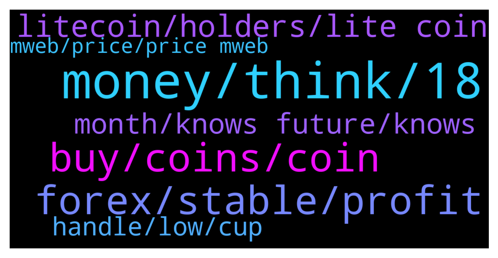

# **@Litecoin**
 ## Analysis for **2022-01-26** - **2022-01-27**.

---

## 📊 **Basic Stats**

**n_messages_sent**: 190

---

---

## 🔝 **Top keywords and related messages**

1. **money, think, 18**

    @starman42069 --- *I sometimes think people who think like this doesnt do anything on a daily basis and hate their lives* **--->** [TG Discussion](https://t.me/Litecoin/2053645)

    @DJFrohFace --- *Hold on there fellow maybe someone pops up* **--->** [TG Discussion](https://t.me/Litecoin/2053567)

    @starman42069 --- *Are you out of your minds guys. Money is a consequence. Just do what you like doing. And you ll get paid for it* **--->** [TG Discussion](https://t.me/Litecoin/2053644)

    @Notbiden --- *All you are is a number in their slaughter machine* **--->** [TG Discussion](https://t.me/Litecoin/2053640)

    @Yhtrcgtfv566 --- *Yes, the government takes care of everybody!* **--->** [TG Discussion](https://t.me/Litecoin/2053639)

    @Playconsolea --- *Why you can't send photos here?* **--->** [TG Discussion](https://t.me/Litecoin/2053438)

2. **buy, coins, coin**

    @Ben --- *Why ppl wanna buy LTC in the first place? Because most of them can’t afford the whole bitcoin. They are not rich in the beginning* **--->** [TG Discussion](https://t.me/Litecoin/2053676)

    @Z --- *LTC will hit $1000 someday in the distant future, but maybe $10 first* **--->** [TG Discussion](https://t.me/Litecoin/2053659)

    @Playconsolea --- *Guys who know how to transfer ltc without commission? Or with a commission but from 1 dollar* **--->** [TG Discussion](https://t.me/Litecoin/2053463)

    @RabbitL0v3r --- *Fees are very low on ltc chain (below 1$)* **--->** [TG Discussion](https://t.me/Litecoin/2053466)

    @J --- *Maybe you should look the other way.. if LTC reaches 70 dollar, should i sell to buy more at $400?* **--->** [TG Discussion](https://t.me/Litecoin/2053884)

    @onecryptochick --- *LTC problem is it has to many people talking shit about it.  People are coming in here for the sole reason of saying the coin sucks...strange* **--->** [TG Discussion](https://t.me/Litecoin/2053695)

3. **forex, stable, profit**

    @ryanswright --- *It helps to create fud to get more people to sell at lower prices* **--->** [TG Discussion](https://t.me/Litecoin/2053699)

    @p3rcohX --- *why would they do this if the coin price never goes up tho* **--->** [TG Discussion](https://t.me/Litecoin/2053708)

    @RabbitL0v3r --- *Amd they had to pay to import the material from choyna* **--->** [TG Discussion](https://t.me/Litecoin/2053174)

    @crypto_charlie_b --- *Charlie dont want a high value coin, he wants a stable coin….he says it himself* **--->** [TG Discussion](https://t.me/Litecoin/2053186)

    @nltox --- *stable is okay for me if it’s stable at 1k $* **--->** [TG Discussion](https://t.me/Litecoin/2053187)

    @kevinvik --- *Like "BTC stable over 25k" was some year ago.  If it's "likely" under everyone's eyes it's already late (to make high profit, small profit can come anyway).* **--->** [TG Discussion](https://t.me/Litecoin/2053197)

4. **litecoin, holders, lite coin**

    @S_J1111 --- *Litecoin is the biggest disappointment in the history of mankind. Sad piece of trash.* **--->** [TG Discussion](https://t.me/Litecoin/2053411)

    @RorschachTesst --- *Hmm more bans in litecoin than development updates* **--->** [TG Discussion](https://t.me/Litecoin/2053358)

    @syonfive --- *litecoin seems be weak in up trend , but handle n cup pattern is seen* **--->** [TG Discussion](https://t.me/Litecoin/2053773)

    @4DaTech --- *If litecoin makes a 3rd attempt at $400, will you guys hold strong?* **--->** [TG Discussion](https://t.me/Litecoin/2053804)

    @Mar --- *We can’t focus on only lite coin* **--->** [TG Discussion](https://t.me/Litecoin/2053747)

    @syonfive --- *litecoin to the moon , its buy signal buy buy buy* **--->** [TG Discussion](https://t.me/Litecoin/2053499)

5. **month, knows future, knows**

    @indigo_nakamoto --- *3 days left for it to be released...* **--->** [TG Discussion](https://t.me/Litecoin/2053821)

    @Ben --- *Just like 2015 2016, or even 2018* **--->** [TG Discussion](https://t.me/Litecoin/2053812)

    @Ben --- *Even this sounds bad, but really, nobody knows the future* **--->** [TG Discussion](https://t.me/Litecoin/2053809)

    @JohnTheApostle --- *Nothing new under the sun for us then* **--->** [TG Discussion](https://t.me/Litecoin/2053388)

    @professional --- *2021 was bullish like 2017 2022 will bearish like 2018 Everything is clear* **--->** [TG Discussion](https://t.me/Litecoin/2053276)

    @starman42069 --- *They say march bro 2 monthises* **--->** [TG Discussion](https://t.me/Litecoin/2053620)

6. **handle, low, cup**

    @starman42069 --- *the price went lower thanthe handle's low* **--->** [TG Discussion](https://t.me/Litecoin/2053868)

    @starman42069 --- *Cup and handle got invalidated bro.* **--->** [TG Discussion](https://t.me/Litecoin/2053775)

    @J --- *I want to sell the bottom so i can buy the dip* **--->** [TG Discussion](https://t.me/Litecoin/2053795)

    @syonfive --- *why? the handle's min is lower then cup's min ?* **--->** [TG Discussion](https://t.me/Litecoin/2053827)

    @RabbitL0v3r --- *Buy the tip sell the dip* **--->** [TG Discussion](https://t.me/Litecoin/2053885)

    @starman42069 --- *we dipped all the way to 96 bucks* **--->** [TG Discussion](https://t.me/Litecoin/2053870)

7. **mweb, price, price mweb**

    @Macro5674 --- *Those who care for privacy the most, are the people with most fiat bags ! So yes MWEB probably would move the price !* **--->** [TG Discussion](https://t.me/Litecoin/2053861)

    @Notbiden --- *Mweb isn't going to move the price so I could careless about mweb* **--->** [TG Discussion](https://t.me/Litecoin/2053843)

    @Ben --- *And personally i really look for using mweb function, greater for fungibility.* **--->** [TG Discussion](https://t.me/Litecoin/2053840)

    @starman42069 --- *where is mweb there are only 3 days left to the end of january* **--->** [TG Discussion](https://t.me/Litecoin/2053820)

    @starman42069 --- *MWEB is sell signal I think. It will go even lower.* **--->** [TG Discussion](https://t.me/Litecoin/2053238)

    @RorschachTesst --- *Mweb will definitely move the price* **--->** [TG Discussion](https://t.me/Litecoin/2053847)

