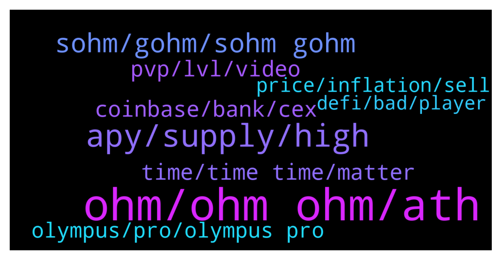

# **@OlympusTG**
 ## Analysis for **2022-01-26** - **2022-01-27**.

---

## 📊 **Basic Stats**

**n_messages_sent**: 1286

---

---

## 🔝 **Top keywords and related messages**

1. **ohm, ohm ohm, ath**

    @chitangxxx --- *I thought they were more honest than ohm a few weeks ago... Since they were buying back below backing and ohm wasn't... I trust ohm more now lol* **--->** [TG Discussion](https://t.me/OlympusTG/171181)

    @Palancapa --- *the thing is, if Ohm drops another 90% from here, it takes an 10x to get back to its original price..* **--->** [TG Discussion](https://t.me/OlympusTG/170223)

    @john4p --- *What’s the difference with time and ohm* **--->** [TG Discussion](https://t.me/OlympusTG/172122)

    @john4p --- *Ohm 95% down from Ath Time is 95.9% down from ath* **--->** [TG Discussion](https://t.me/OlympusTG/172139)

    @abdulrao --- *earlier i converted OHM tosOHM, so what i need to do know* **--->** [TG Discussion](https://t.me/OlympusTG/171088)

    @will108 --- *Wat happened to ohm price? Havent been checking for a month* **--->** [TG Discussion](https://t.me/OlympusTG/171808)

2. **apy, supply, high**

    @Host_Matt --- *no one can make long timeframe assumptions like that apy can drop below 1k in 110 days* **--->** [TG Discussion](https://t.me/OlympusTG/170521)

    @Palancapa --- *and also, the APY seems unsustainable to me* **--->** [TG Discussion](https://t.me/OlympusTG/169975)

    @DocFantom --- *Sers... Apy dropped again significantly.  Ouch* **--->** [TG Discussion](https://t.me/OlympusTG/171571)

    @nfwaple --- *because APY shouldn't be a selling point* **--->** [TG Discussion](https://t.me/OlympusTG/171850)

    @Palancapa --- *i think the high APY perhaps screwed it up? maybe too many people with too big of a bag are trying to dump it* **--->** [TG Discussion](https://t.me/OlympusTG/170261)

    @jamiemarkets --- *Is there a reason why APY is so low even with price being low?* **--->** [TG Discussion](https://t.me/OlympusTG/170383)

3. **sohm, gohm, sohm gohm**

    @dtmctid --- *Is GOHM rebasing? Didn’t think it did* **--->** [TG Discussion](https://t.me/OlympusTG/171547)

    @D7 ⭐️ --- *I don’t bought sohm  I just bought Gohm  But what I understand is the number of Sohm well increase while am holding Gohm   I hope I explain it good 😂* **--->** [TG Discussion](https://t.me/OlympusTG/169869)

    @Ap0l1o --- *gOhm and sOhm get the same rewards* **--->** [TG Discussion](https://t.me/OlympusTG/170277)

    @Palancapa --- *i thought gOHM meant governance ohm or somethin* **--->** [TG Discussion](https://t.me/OlympusTG/170303)

    @Palancapa --- *gohm and sohm is the same* **--->** [TG Discussion](https://t.me/OlympusTG/170295)

    @Flower --- *I think some people prefer sOHM because they see their balance increasing which is fair enough.* **--->** [TG Discussion](https://t.me/OlympusTG/171129)

4. **time, time time, matter**

    @nfwaple --- *and the implosion of TIME isn't going to end well, people are going to use it against us* **--->** [TG Discussion](https://t.me/OlympusTG/172106)

    @nfwaple --- *imagine you being in time, you'll get an instant ban* **--->** [TG Discussion](https://t.me/OlympusTG/171136)

    @nfwaple --- *you say this now, imagine saying this before TIME imploded, people hated me for 'fudding' TIME* **--->** [TG Discussion](https://t.me/OlympusTG/172131)

    @chitangxxx --- *I said in our lifetime. I'm old so won't be in my lifetime* **--->** [TG Discussion](https://t.me/OlympusTG/172036)

    @sbackes --- *Anyone ever figure out what happened to TIME ?* **--->** [TG Discussion](https://t.me/OlympusTG/170631)

    @chitangxxx --- *Yeah but time was exposed... If you're an ex con fraudster at least don't get exposed* **--->** [TG Discussion](https://t.me/OlympusTG/172167)

5. **coinbase, bank, cex**

    @chitangxxx --- *Yes and even after kyc cb locked my account for 5 months for no reason and no customer service* **--->** [TG Discussion](https://t.me/OlympusTG/172054)

    @chitangxxx --- *Coinbase cunts locked my account for 5 months... No bank has ever done that lol* **--->** [TG Discussion](https://t.me/OlympusTG/172038)

    @Palancapa --- *coinbase is literally like a bank lol* **--->** [TG Discussion](https://t.me/OlympusTG/172047)

    @nfwaple --- *this, coinbase is the bank, centralised exchanges are the banks, they KYC you* **--->** [TG Discussion](https://t.me/OlympusTG/172048)

    @Palancapa --- *fuck coinbase hahahahh who even uses that exchange* **--->** [TG Discussion](https://t.me/OlympusTG/172050)

    @chitangxxx --- *It takes me 5 seconds to send fiat from one country's bank account to another... With crypto it will take me 30 mins just working out the cross chain and then wait for the system to do the confirmations... Bitcoin or whatever.... No crypto will ever be accepted as the main store of value* **--->** [TG Discussion](https://t.me/OlympusTG/172023)

6. **pvp, lvl, video**

    @Palancapa --- *i really understand like half of all of this, gonna watch the whiteboard crypto video once again* **--->** [TG Discussion](https://t.me/OlympusTG/170287)

    @Palancapa --- *ugh there is so much information in the crypto space. its fucking hard to get a grip on everything* **--->** [TG Discussion](https://t.me/OlympusTG/171990)

    @Host_Matt --- *rng in crypto is regulators, hacks, people acting in bad faith like sifu, black swans* **--->** [TG Discussion](https://t.me/OlympusTG/171760)

    @chitangxxx --- *How can it be under law suit? Crypto is not regulated* **--->** [TG Discussion](https://t.me/OlympusTG/170954)

    @Palancapa --- *alright ill do that. have you seen that video from whiteboard crypto on youtube? ive yet to check it out but heard good stuff about it* **--->** [TG Discussion](https://t.me/OlympusTG/171648)

    @Ahmad --- *I know what you mean. For me I focus on like a few crypto. Hard to keep track of everything.* **--->** [TG Discussion](https://t.me/OlympusTG/171999)

7. **olympus, pro, olympus pro**

    @Adrew --- *This there anyway some project can partner with olympus* **--->** [TG Discussion](https://t.me/OlympusTG/169864)

    @Anosgoku --- *Can i get to know olympus dao here* **--->** [TG Discussion](https://t.me/OlympusTG/170047)

    @nazray --- *Yeap! You're going to have to import the token. Best choice is to go onto the Olympus webpage and find the instructions there* **--->** [TG Discussion](https://t.me/OlympusTG/170649)

    @theMagicUnicorn --- *Olympus Pro Spotlight is a series where we highlight our Olympus Pro cohort partners to give Ohmies insights into what our partners are building, how their token works, and why they chose Olympus Pro.  https://olympusdao.medium.com/olympus-pro-spotlight-keep3r-fixed-forex-e575e5864ae8* **--->** [TG Discussion](https://t.me/OlympusTG/170319)

    @theMagicUnicorn --- *Olympus Pro Spotlight is a series where we highlight our Olympus Pro cohort partners to give Ohmies insights into what our partners are building, how their token works, and why they chose Olympus Pro. https://olympusdao.medium.com/olympus-pro-spotlight-keep3r-fixed-forex-e575e5864ae8* **--->** [TG Discussion](https://t.me/OlympusTG/170336)

    @mattory --- *defi project  want to use olympus pro, who can I contact?* **--->** [TG Discussion](https://t.me/OlympusTG/171981)

8. **price, inflation, sell**

    @john4p --- *Nah g it is the selling point* **--->** [TG Discussion](https://t.me/OlympusTG/171857)

    @nfwaple --- *when price falls I think the best thing to do is look at the fundamental* **--->** [TG Discussion](https://t.me/OlympusTG/170256)

    @Palancapa --- *but i doubt this will ever happen due to inflation* **--->** [TG Discussion](https://t.me/OlympusTG/171652)

    @Palancapa --- *as inflation has been outpacing its apy the past couple of months...* **--->** [TG Discussion](https://t.me/OlympusTG/172017)

    @john4p --- *How does that attract more buyers* **--->** [TG Discussion](https://t.me/OlympusTG/171848)

    @tiagomainns --- *Next bull market it will break 1200$ support and then we will touch the 🚀* **--->** [TG Discussion](https://t.me/OlympusTG/171402)

