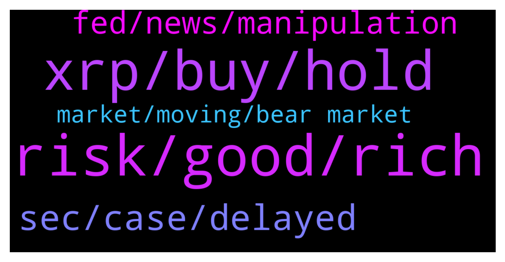

# **@Ripple**
 ## Analysis for **2022-01-26** - **2022-01-27**.

---

## 📊 **Basic Stats**

**n_messages_sent**: 196

---

---

## 🔝 **Top keywords and related messages**

1. **risk, good, rich**

    @anuj90322 --- *Us risk tolerance determined by personality or circumstances?* **--->** [TG Discussion](https://t.me/Ripple/3046196)

    @Jai_Rambo --- *Wait for "admin" to send u a link. Hahahahahahaaha why would u share your amount..* **--->** [TG Discussion](https://t.me/Ripple/3046656)

    @Jornhc4l --- *Mark my words. Read some more Q drops. A whole new world will open for you. Everything happening right now is preplanned. You're watching a movie. But don't cry when you lose your money, I've warned you 😊* **--->** [TG Discussion](https://t.me/Ripple/3046669)

    @ShaLtran --- *Do you have one already? If not first add one and then change your privacy settings so everyone can see your Profile image* **--->** [TG Discussion](https://t.me/Ripple/3046535)

    @justmuv --- *Usually I ask scammers how much money does their mother cost per hour* **--->** [TG Discussion](https://t.me/Ripple/3046713)

    @ReiTeh --- *Both? Some ppl will bet everything on something dispite being in a bad circumstances* **--->** [TG Discussion](https://t.me/Ripple/3046199)

2. **xrp, buy, hold**

    @Likeitorpumpit --- *Should I sell 1 of my ETH and buy XRP with all the monies. Reason please* **--->** [TG Discussion](https://t.me/Ripple/3046618)

    @zurik86 --- *Xrp will reach one hundred dollars* **--->** [TG Discussion](https://t.me/Ripple/3046378)

    @alfidanger --- *does xrp have multiple partners? is ripple x still running its business?* **--->** [TG Discussion](https://t.me/Ripple/3046277)

    @Abiodun --- *If you are an international XRP holders outside the US, please sign this. SEC shouldn't get away with these shenanigans.* **--->** [TG Discussion](https://t.me/Ripple/3046614)

    @Russty007 --- *Xrp is probably the only major crypto that the Fed can put their hands on because it’s a US company... so it can also become the “gold Standard” of crypto... but in a sense it makes it centralized because it can be governed by laws of the state* **--->** [TG Discussion](https://t.me/Ripple/3046020)

    @MOVEMENTGOD --- *Bitcoin represens freeedom of money, because there is no entity (company) which is in control of it. Thats the reason why some countries are trying to ban Bitcoin (they wont have any control of their Citizen)  If xrp gets full adoption - isnt it the opposite of financial freedom? Because the big boys are going to loose right know 😎😎* **--->** [TG Discussion](https://t.me/Ripple/3045958)

3. **sec, case, delayed**

    @CasperLayer1 --- *Well with the new motion its clear law suit isnt ending anywhere soon Lawyer Deaton talked about atleast end Q2 begin Q3.  Sec got what they wanted. Im totally out until some New news. Money is Just stuck doing nothing* **--->** [TG Discussion](https://t.me/Ripple/3045985)

    @ibnusob666 --- *It should be rebound on 4h timeframe* **--->** [TG Discussion](https://t.me/Ripple/3046501)

    @Rektallstar --- *There already said they plan to in March. 60 days from now* **--->** [TG Discussion](https://t.me/Ripple/3046482)

    @BennyBennyBlanco --- *Delayed it for March, than might be delayed again. I knew something fishy was up. Can’t trust the 🐀 s* **--->** [TG Discussion](https://t.me/Ripple/3046480)

    @reaper00X1Chr --- *15 mins we are gone ...* **--->** [TG Discussion](https://t.me/Ripple/3046455)

    @anuj90322 --- *Hmm... difficult to know as case Keep getting delayed* **--->** [TG Discussion](https://t.me/Ripple/3046031)

4. **fed, news, manipulation**

    @marianmp --- *FED WON'T ENCREESE ANYTHING .... IF YHEY DO THAT ALL THINGS WILL GO TO SHIIT...* **--->** [TG Discussion](https://t.me/Ripple/3046266)

    @Jakes1993 --- *Is anyone else waiting for FED meeting outcome before making a move?* **--->** [TG Discussion](https://t.me/Ripple/3046260)

    @marianmp --- *Stupid FED crushing the market ....* **--->** [TG Discussion](https://t.me/Ripple/3046553)

    @gianni146 --- *What's your prediction after the FED news?* **--->** [TG Discussion](https://t.me/Ripple/3046396)

    @Russty007 --- *I don’t care about this politics crap, I want my lambo* **--->** [TG Discussion](https://t.me/Ripple/3046025)

    @xlmshark --- *who knows, we will know after FED addresses inflation* **--->** [TG Discussion](https://t.me/Ripple/3046243)

5. **market, moving, bear market**

    @Lemon --- *chill, it's just a regular bear market* **--->** [TG Discussion](https://t.me/Ripple/3046338)

    @Petjuuuh --- *Look at monthly chat and watch al the pumps and compare with today* **--->** [TG Discussion](https://t.me/Ripple/3046488)

    @MutantSatan --- *oh no links okay, can google "marketcapof", good website for these things* **--->** [TG Discussion](https://t.me/Ripple/3046409)

    @ReiTeh --- *Some ppl are new so maybe first bear market.* **--->** [TG Discussion](https://t.me/Ripple/3046339)

    @Briggslet --- *Weekly chart is the only chart showing any sign of good technical analisys* **--->** [TG Discussion](https://t.me/Ripple/3046325)

    @Briggslet --- *Stochastic has not given a buy yet RSI is still in down trend line ADX still has buyers out of the market however sellers are also starting to dwindle. MACD is down Awsome oscilator is down .. no buy signal yet. We are hugging the bottom line of the bollinger bands. We are below the 30 moving average an just above 20p moving average. SAR parabole is also still in down trend* **--->** [TG Discussion](https://t.me/Ripple/3046322)

