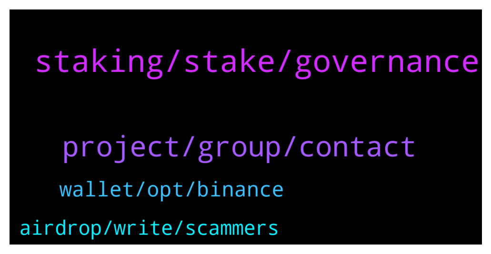

# **@algorand**
 ## Analysis for **2022-01-26** - **2022-01-27**.

---

## 📊 **Basic Stats**

**n_messages_sent**: 116

---

---

## 🔝 **Top keywords and related messages**

1. **staking, stake, governance**

    @monerowhale --- *Is this better than staking from your ledger Nano c* **--->** [TG Discussion](https://t.me/algorand/335395)

    @MMulder432 --- *I'm using it. And i stake my algo in the Algo prize game and the yieldly i'm getting, i'm staking in the staking pools* **--->** [TG Discussion](https://t.me/algorand/335610)

    @domioo911 --- *Staking algo on ledger. Its good ?* **--->** [TG Discussion](https://t.me/algorand/335340)

    @MackDenver --- *Sure, actually every week you will automatically receive YLDY from your stake, as well as have the chance to win a big ALGO prize. Check more here: https://yieldly.finance/no-loss-prize-game/* **--->** [TG Discussion](https://t.me/algorand/335589)

    @MackDenver --- *Hi, welcome to Algorand.  You don't have to stake it, just hold your $ALGO in official Algorand wallet and you will get staking rewards.* **--->** [TG Discussion](https://t.me/algorand/335566)

    @A_JarsLife_Thomas --- *I hear that from a friend of mine, weekly yuo can stake your Algo (farming YLDLY at 7% APY) and participate to a lottery at the same time...* **--->** [TG Discussion](https://t.me/algorand/335575)

2. **project, group, contact**

    @Lisirui --- *hey guys i want to ask if there is any group for tether* **--->** [TG Discussion](https://t.me/algorand/335457)

    @awoluz --- *Who can I talk to about proposal* **--->** [TG Discussion](https://t.me/algorand/335521)

    @starbloz4 --- *Hello, where can I contact the owner of this crypto project?  have an offer* **--->** [TG Discussion](https://t.me/algorand/335445)

    @Rb_71dex --- *hey mate is there any telegram group for algorand developers* **--->** [TG Discussion](https://t.me/algorand/335423)

    @NightAlgorand --- *We will let you guys know as soon as there is any updates regarding this* **--->** [TG Discussion](https://t.me/algorand/335341)

    @EserBing --- *hi admin, is there any Official Algorand launchpad site to invest new Algorand based projects?* **--->** [TG Discussion](https://t.me/algorand/335357)

3. **wallet, opt, binance**

    @NightAlgorand --- *Hi there, you can download Algorand Wallet here https://algorandwallet.com/* **--->** [TG Discussion](https://t.me/algorand/335394)

    @Azcmichael --- *Admin please help I can't opt in to my Algorand wallet on tinyman* **--->** [TG Discussion](https://t.me/algorand/335472)

    @juquinbu --- *Sorry. I can’t help you. I don’t use Trust wallet.* **--->** [TG Discussion](https://t.me/algorand/335346)

    @Azcmichael --- *I have done that yet I can't opt in* **--->** [TG Discussion](https://t.me/algorand/335475)

    @hlinhd --- *Hey folks, quick question: what happens if i send an ASA to a wallet that didn’t opt in to that ASA?* **--->** [TG Discussion](https://t.me/algorand/335406)

    @MackDenver --- *Can you try clearing your cache and try again?* **--->** [TG Discussion](https://t.me/algorand/335474)

4. **airdrop, write, scammers**

    @jumpfetus --- *everyone who DMs someone unprompted on telegram is a scammer* **--->** [TG Discussion](https://t.me/algorand/335372)

    @Tiny_Philosopher_784 --- *That's an incentive to swap. I wouldnt classify that as a true airdrop, but it's your ball* **--->** [TG Discussion](https://t.me/algorand/335390)

    @MackDenver --- *Hey @A_JarsLife_Thomas,  Never DM to anyone that you don't know. There are scammers around.* **--->** [TG Discussion](https://t.me/algorand/335583)

    @InvestorChris001 --- *Don't think there is a real one Most of them are fake.* **--->** [TG Discussion](https://t.me/algorand/335469)

    @Dave Man --- *The screenshots i am tryna post here is important. I think yall might wanna warn fellow users of scammers* **--->** [TG Discussion](https://t.me/algorand/335371)

    @hackman31 --- *Becoming impossible to ask or speak on this channel, as you write something 20 scammer write you* **--->** [TG Discussion](https://t.me/algorand/335353)

