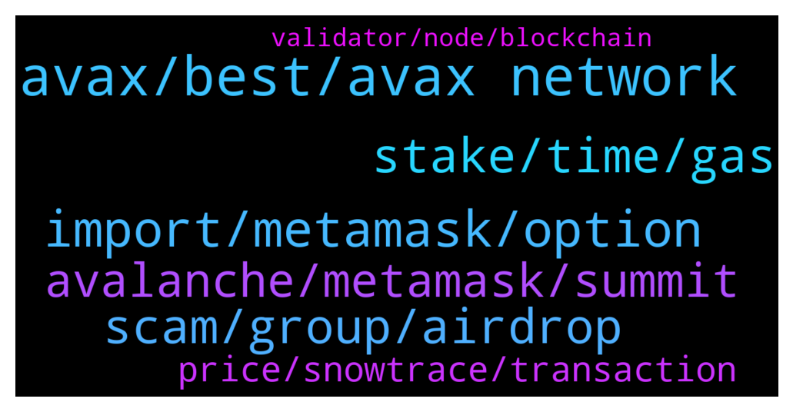

# **@avalancheavax**
 ## Analysis for **2022-01-26** - **2022-01-27**.

---

## 📊 **Basic Stats**

**n_messages_sent**: 152

---

---

## 🔝 **Top keywords and related messages**

1. **avax, best, avax network**

    @Block_Monkey --- *Transfered some AVAX from my P chain to C chain. Does not show. The transaction shows that it is in Atomic Memory. What is that and how do I get it?* **--->** [TG Discussion](https://t.me/avalancheavax/324653)

    @Madmandan --- *Avax vs eth tx last 24 hours* **--->** [TG Discussion](https://t.me/avalancheavax/324723)

    @lovingcrypto_mytelegram --- *Is AVAX running an airdrop currently* **--->** [TG Discussion](https://t.me/avalancheavax/324717)

    @maverick21061 --- *Hi Guys. What's the best mobile wallet for avax atm?* **--->** [TG Discussion](https://t.me/avalancheavax/324793)

    @nikaidocrypto --- *How to bridge UST to AVAX ?* **--->** [TG Discussion](https://t.me/avalancheavax/324699)

    @researchone --- *hi guys, is there an issue on avax transactions?* **--->** [TG Discussion](https://t.me/avalancheavax/324710)

2. **import, metamask, option**

    @researchone --- *yeah, it keeps saying waiting for confirmation despite the fact that I approve the transaction on metamask* **--->** [TG Discussion](https://t.me/avalancheavax/324712)

    @Block_Monkey --- *I checked each option for chain import, but all say nothing to import.* **--->** [TG Discussion](https://t.me/avalancheavax/324657)

    @sen666 --- *i has wait for 5days, but it not completed* **--->** [TG Discussion](https://t.me/avalancheavax/324643)

    @r0lex --- *I don't have permission to post a screenshot, but I am trying to complete an X chain to C chain transfer so I can load funds onto Metamask.  I sign into my Ledger without issues, but once I press TRANSFER, it's saying DisconnectedDeviceDuringOperation: Failed to write the report.* **--->** [TG Discussion](https://t.me/avalancheavax/324735)

    @oathtobarbatos --- *Yeah, use the import option on the Advanced tab* **--->** [TG Discussion](https://t.me/avalancheavax/324655)

    @Dilbertt --- *Please check advanced menu/import C chain option.* **--->** [TG Discussion](https://t.me/avalancheavax/324745)

3. **stake, time, gas**

    @João --- *I still dont understand very well about that stake* **--->** [TG Discussion](https://t.me/avalancheavax/324498)

    @p123452 --- *Hey Nicolas! Thanks for the reply! Is there any way to quantify how much more exactly eg. a formula to calculate that yield as a function of staking time* **--->** [TG Discussion](https://t.me/avalancheavax/324628)

    @h4f123x --- *Hi what price did investors get in at for the $230m raise back in July 2021?* **--->** [TG Discussion](https://t.me/avalancheavax/324560)

    @p123452 --- *Hey guys! Does anybody know if the staking rewards have higher apy if I stake longer in any way? e.g. do I get more rewards if I stake 1 full year compared to 3 months at a time for an entire year? or do I get the same rewards?* **--->** [TG Discussion](https://t.me/avalancheavax/324626)

    @faggins --- *Im about to unstake JLP But gas is on the high side.   Gas Limit 372,550 Max Priority Fees: 130 Max Fee: 130* **--->** [TG Discussion](https://t.me/avalancheavax/324531)

    @r0lex --- *Why is everything Pangolin related PAUSED on Beefy Finance?* **--->** [TG Discussion](https://t.me/avalancheavax/324689)

4. **scam, group, airdrop**

    @scarcitywhale --- *There’s an airdrop scam happening now that I’d like to report* **--->** [TG Discussion](https://t.me/avalancheavax/324553)

    @Smellthebull_ridetherun --- *I will give anyone who finds that prick who airdrop robbed my dumbass and ousts them to me, my car as a thiank you. No bs nothin special 2019 altima but outta principal its all yours, so i can beat this prick with my mybook and cut off his scum fingers* **--->** [TG Discussion](https://t.me/avalancheavax/324780)

    @scarcitywhale --- *yes. Horrible. Stole tokens from me because it’s 100% same branding/name everything as this group* **--->** [TG Discussion](https://t.me/avalancheavax/324556)

    @scarcitywhale --- *I got an email as well. But I’m suspicious about legitimacy. Waiting for admin confirmation before I purchase.* **--->** [TG Discussion](https://t.me/avalancheavax/324792)

    @Kels --- *Crazy scam, go fuck your mother* **--->** [TG Discussion](https://t.me/avalancheavax/324833)

    @demirel101 --- *If you dm her you will fall victim of another scam* **--->** [TG Discussion](https://t.me/avalancheavax/324818)

5. **avalanche, metamask, summit**

    @okumanntyojya --- *Avalanche has any relationship with avaxwarriors (NFT project kind a BAYC fork)? avalanche twitter retweet  avaxwarriors tweet a lot of time. and they said Avalanche support us. Any relationship?* **--->** [TG Discussion](https://t.me/avalancheavax/324598)

    @Nicolas_A --- *you mean which ones have native usdt, usdc withdrawals to Avalanche ?* **--->** [TG Discussion](https://t.me/avalancheavax/324693)

    @Brownhawks_Memolabs --- *Please any admin to contact for partnership proposal ?* **--->** [TG Discussion](https://t.me/avalancheavax/324510)

    @DaveFrog1776 --- *Any news on the Avalanche summit in Barcelona? Some people saying it might be no go with current restrictions in the city* **--->** [TG Discussion](https://t.me/avalancheavax/324855)

    @EYAL_MOR --- *On the different daaps built on avalanche* **--->** [TG Discussion](https://t.me/avalancheavax/324570)

    @oathtobarbatos --- *Avalanche administrators won't ask your seed phrase, money, or personal data. Do not enter any suspicious links* **--->** [TG Discussion](https://t.me/avalancheavax/324559)

6. **price, snowtrace, transaction**

    @Nicolas_A --- *Check vscout.io it has a calculator at the top* **--->** [TG Discussion](https://t.me/avalancheavax/324633)

    @Nicolas_A --- *you can click on the dollar value to show price either at time of transaction or current. Only shows for transactions that are old enough* **--->** [TG Discussion](https://t.me/avalancheavax/324597)

    @EYAL_MOR --- *Hi Is there an apr% scanner that scans all possible staking for avax?* **--->** [TG Discussion](https://t.me/avalancheavax/324567)

    @floorwalker --- *If you mean delegating to a validator, you can sort by lowest fees on Avascan.* **--->** [TG Discussion](https://t.me/avalancheavax/324568)

    @prezene --- *what site can I use to track price of any coin on AVAX -c chain* **--->** [TG Discussion](https://t.me/avalancheavax/324728)

    @oathtobarbatos --- *Check both etherscan and snowtrace and compare both charts, that could help* **--->** [TG Discussion](https://t.me/avalancheavax/324725)

7. **validator, node, blockchain**

    @SOG231 --- *Permit me to ask this noob question please! What’s a validator node?* **--->** [TG Discussion](https://t.me/avalancheavax/324522)

    @jjfirh --- *Hi all, when running a validator node, would the private key be stored anywhere on the disk unencrypted, or it will be just in the memory during runtime?* **--->** [TG Discussion](https://t.me/avalancheavax/324517)

    @sen666 --- *everybody, i want to build api node, must it become a validator?* **--->** [TG Discussion](https://t.me/avalancheavax/324629)

    @Nicolas_A --- *The only confidential document on it is the NodeID certificate. Which you need to backup but no hacker would really be interested in it as you can’t steal any funds from it* **--->** [TG Discussion](https://t.me/avalancheavax/324579)

    @oathtobarbatos --- *By the way, a blockchain validator is someone who is responsible for verifying transactions on a blockchain. Validators are given rewards as long as they stake the network's token (AVAX)* **--->** [TG Discussion](https://t.me/avalancheavax/324527)

    @sen666 --- *have a light node(only rev block message)?* **--->** [TG Discussion](https://t.me/avalancheavax/324639)

