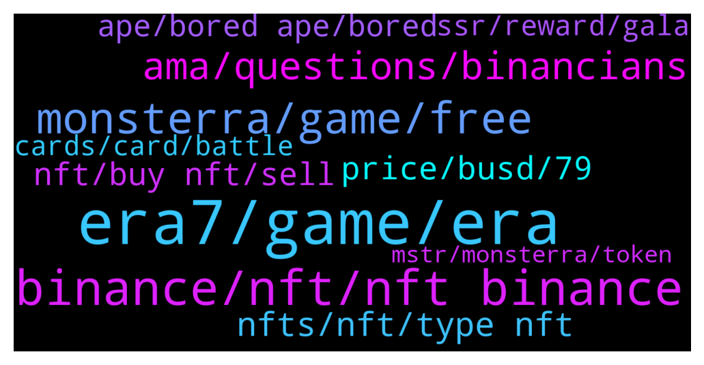

# **@binancenfts**
 ## Analysis for **2022-01-26** - **2022-01-27**.

---

## 📊 **Basic Stats**

**n_messages_sent**: 645

---

---

## 🔝 **Top keywords and related messages**

1. **era7, game, era**

    @Bikase --- *Anyone give me era7 website link* **--->** [TG Discussion](https://t.me/binancenfts/444000)

    @arianagrinder89 --- *just google it. top result is official era7 website* **--->** [TG Discussion](https://t.me/binancenfts/444016)

    @Bikase --- *Is your smart contract audited? Does Era7 aims to be a truly global project? Any plan to integrate local languages support? Finnally, is your platform open to everyone where small investor/users like me are given oppurtunity to join?  (Q). What is Com2uS, NCsoft, Nexon, and Netmarble Let's explain to me??  #ERA7  .* **--->** [TG Discussion](https://t.me/binancenfts/444232)

    @cryptotwillight --- *What are most key and unique features you add on the game Era7 that's makes it the most  unique than other GameFi projects  ?? #Era7* **--->** [TG Discussion](https://t.me/binancenfts/444234)

    @Riyadchoudhory --- *You announced on Twitter that your Chinese communities are now open; congratulations! What are the different types of Era7 card we can access in the game? What is the reward system for each of them?#ERA7* **--->** [TG Discussion](https://t.me/binancenfts/444255)

    @Jules_lrd --- *Yo @DmitriPro  We know that for many people, maintaining the hype of the game is very important to keep it alive, how do you plan to do it so that Era 7 continues to attract people in a few months with new features without being just small updates? Thank for your answer. #ERA7* **--->** [TG Discussion](https://t.me/binancenfts/444252)

2. **binance, nft, nft binance**

    @CA_SJain --- *how can i transfer NFT from featured by binance to binance market place* **--->** [TG Discussion](https://t.me/binancenfts/445730)

    @CA_SJain --- *he deposited the same NFT on binance and posted it for sell* **--->** [TG Discussion](https://t.me/binancenfts/445707)

    @CA_SJain --- *Will this help, i dont save his userid   SáHîB (Binance Angel) 🇵🇰 has warned SaNdEEPppp (1/3) Reason: here only binance nfts screenshot / discussion allowed, next time you will be ban! 🚫* **--->** [TG Discussion](https://t.me/binancenfts/445425)

    @RealJassia --- */warn only Binance Market place is allowed* **--->** [TG Discussion](https://t.me/binancenfts/445564)

    @semeerkv --- *sell your nft through on binance . Don't send to wallet. Scammers is everywhere be careful* **--->** [TG Discussion](https://t.me/binancenfts/445729)

    @sunrizer --- *Hi. Does anyone know when binance returns blocked amount on unwinning bids? It has been 3 days since the bidding ended and binancenft has not returned the amount. 🤔🤔* **--->** [TG Discussion](https://t.me/binancenfts/445014)

3. **monsterra, game, free**

    @thangmd --- *With Monsterra, players can not only earn a regular income but also have the opportunity to really dive into the game to experience the battlefield. Developing an addictive gameplay is our main priority when it comes to designing Monsterra game. Finding loopholes in the enemy's layout to ambush, dropping opposing troops to prevail, arranging reasonable defenses to defend the enemy, players will have an opportunity to enjoy a diverse set of daily quests with interesting activities which will level up the gaming experience into a higher level. Thus, we think that non-crypto players will also be interseted in our game.  For the social media platform, please keep follow us at👇:  🌟 Website l Twitter l Discord l Facebook l Telegram Channel | Facebook group | Youtube l TikTok 🌟  💥Local Community  Vietnam | China* **--->** [TG Discussion](https://t.me/binancenfts/445348)

    @Ismailbaskn0 --- *Why did you and your team decide to build Monsterra? #Monsterra* **--->** [TG Discussion](https://t.me/binancenfts/445291)

    @thangmd --- *The game set foot in a fictional world and revolves around farming, property building, and battling other lands with the magical creatures named Mongen. The design of Monsterra combines the free-to-play and free-to-earn model, which allows millions of gaming enthusiasts fun and profit with no initial investment. To make it clear, we can say that Monsterra prioritizes developing the game to elevate user experience: attractive graphics, diverse missions, addictive gameplay from food production, animal breeding to building your own land, entering fierce battle modes from leading troops to conquering new lands, beating dreadful bosses, raiding other players' lands and confronting forces head-on other real player's troops. Thus, we think Monsterra will be able to attract many more players to come in the long term.* **--->** [TG Discussion](https://t.me/binancenfts/445210)

    @thangmd --- *That's the motivation for us to build Monsterra which is the first premium game in our Monsterra Universe with various innovative solutions to the existing problems above. - Free-To-Play-To-Earn Game Mechanics: Monsterra lets gamers experience a full-fledged core game for free before actually spending on it. In other words, players can enjoy the farming and nurturing ecosystem in Monsterra for free first. Once they find the game addictive and worth investing in, they can spend their money on it afterward. - Play-For-Fun Game Model: Monsterra elevates the game-fun aspect with exciting and inspiring gameplay. We offer an interesting farming ecosystem and 4 fierce battle modes for users to enter with different rewarding structures and battle formats. - Balanced In-Game Economy: Monsterra is well designed with an innovative dual token model to slow down inflation and sustain the in-game balance. We try to keep a balanced amount between the minted and burned in-game token so that the game ecosystem can stay healthy for years to come. - Gas Fee Solution: Users pay no gas fee when getting started with Monsterra game. They will only be charged for transaction fee when converting their assets into NFT items.* **--->** [TG Discussion](https://t.me/binancenfts/445213)

    @thangmd --- *With Monsterra, our team strives to deliver a revolutionary P2E game that transforms existing Play-to-earn games into the fun zone.   Monsterra sets itself apart from other P2E games with several USPs: - Unprecedented Breeding Mechanism: Players can create new animals with different figures by breeding 2 random entities of in-game creatures. Monsterra character set, therefore, will be unique Mongens collectibles with infinite diversity. - Unique Land Shaping and Customization Mechanics: Gamers can customize their own lands to create different shapes. This elevates the individuality and uniqueness in each player’s land. - Varied Land Theme: In Monsterra, it is easy to modify land themes according to different seasons  (Merry Christmas, Halloween, etc). The brand identities of Monsteras’ partners (investors, marketing partners, etc) can also be embedded in the land plots - Innovative Token & NFT Staking: Players will gain enticing rewards and shared revenue from the staking activities in Monsterra. On top of that, the tokens and NFTs assets that are already added in the staking pools can still be utilized in the in-game activities. Players can also enjoy a lower or no gas fee if they utilize those tokens or NFTs in in-game activities.* **--->** [TG Discussion](https://t.me/binancenfts/445215)

    @thangmd --- *In my opinion, the 3 words to best describe Monsterra are Free, Fun and Earn.* **--->** [TG Discussion](https://t.me/binancenfts/445239)

4. **ama, questions, binancians**

    @Chritslonas --- *Really It's a great AMA, it was a big pleasure to me...* **--->** [TG Discussion](https://t.me/binancenfts/444332)

    @telapiaex69 --- *I changed my name user name and dp  On the AMA segment they select my question and I'm a active user from this group  I hope I have been qualified for the AMA reward* **--->** [TG Discussion](https://t.me/binancenfts/445558)

    @telapiaex69 --- *But today I was selected on #Monsterra  AMA   If I change my username name is there any effect on the reward distribution ??* **--->** [TG Discussion](https://t.me/binancenfts/445522)

    @NeyNeySGD13 --- *Thanks for this ama @DmitriPro, it was a pleasure, and very interesting* **--->** [TG Discussion](https://t.me/binancenfts/444306)

    @YilanGulsum --- *congratz all the winner and thanks for ama Dmitri* **--->** [TG Discussion](https://t.me/binancenfts/444313)

    @Jules_lrd --- *Thanks for this ama it was a pleasure for me* **--->** [TG Discussion](https://t.me/binancenfts/444322)

5. **nfts, nft, type nft**

    @arianagrinder89 --- *Still no demand for your nfts? Last time we talked you were thinking of nft fragmentation* **--->** [TG Discussion](https://t.me/binancenfts/443854)

    @AnnaLav123 --- *What can we expect from these NFTs?* **--->** [TG Discussion](https://t.me/binancenfts/444057)

    @Ewenr02 --- *Hi, I'm starting out in NFT's, do you have any advice?* **--->** [TG Discussion](https://t.me/binancenfts/444673)

    @Larissa Popow :) --- *lol well i love nfts 😊* **--->** [TG Discussion](https://t.me/binancenfts/443763)

    @Zzafer13 --- *When will we be able to transfer featured nfts?* **--->** [TG Discussion](https://t.me/binancenfts/443592)

    @Chritslonas --- *NFT project is very greatfull to us* **--->** [TG Discussion](https://t.me/binancenfts/444330)

6. **price, busd, 79**

    @unsiiii --- *175$  more expensive if you look at others* **--->** [TG Discussion](https://t.me/binancenfts/443973)

    @Yjuuu7 --- *Anybody  interested  tell  ur offer  here* **--->** [TG Discussion](https://t.me/binancenfts/444993)

    @Inosuke1 --- *Cheap on market throw your bids* **--->** [TG Discussion](https://t.me/binancenfts/443755)

    @Gheter --- *Choose yours and tell the price* **--->** [TG Discussion](https://t.me/binancenfts/445597)

    @serzh11 --- *I give 200 dollars cheaper than the market price* **--->** [TG Discussion](https://t.me/binancenfts/443916)

    @serzh11 --- *Take it, if you have time, I give it 35$ cheaper* **--->** [TG Discussion](https://t.me/binancenfts/445025)

7. **nft, buy nft, sell**

    @unsiiii --- *am selling cheap.  Crypton NFT2* **--->** [TG Discussion](https://t.me/binancenfts/443968)

    @CA_SJain --- *i learnt my lession today.. another person just msg me saying he will buy my nft, but offline.. 🤣🤣 can not fool one guy twice a day* **--->** [TG Discussion](https://t.me/binancenfts/445732)

    @IqbalNazeef --- *hey guys if you are interested in phantom galaxy nfts (halberd-001) then text me* **--->** [TG Discussion](https://t.me/binancenfts/444039)

    @Rams2025 --- *Dear someone very very rich please buy my very very expensive NFT* **--->** [TG Discussion](https://t.me/binancenfts/445677)

    @Fang47 --- *Can I need to pay any fee for selling nft* **--->** [TG Discussion](https://t.me/binancenfts/443447)

    @AndriiJa --- *I SELL THIS NFT FOR 6.99$* **--->** [TG Discussion](https://t.me/binancenfts/443536)

8. **ape, bored ape, bored**

    @nrlnft --- *“BORED APE EX” now avaılable on sale 🤜🤛* **--->** [TG Discussion](https://t.me/binancenfts/445165)

    @c_hinmay --- *Bored Ape ... bargains accepted 🙂* **--->** [TG Discussion](https://t.me/binancenfts/444962)

    @kajiefaris --- *Forsale  ZOMBIE BORED APE #2782▵ 8╳55 ▵NFT PRIDE* **--->** [TG Discussion](https://t.me/binancenfts/445670)

    @geisha999 --- *For sale BORED APE #122 ▵ 29╳55 ▵ NFT PRIDE* **--->** [TG Discussion](https://t.me/binancenfts/444032)

    @OzanberkZ79 --- *NFT, one of the most special of the Bored Ape Series, is for sale. You do not want to miss such a beautiful product at such a reasonable price, and a very beautiful watch from the Flora 1 series is for sale at a very cheap price, you should go and have a look.   BORED APE #10159▵34╳55▵NFT PRIDE  Flora 1 {Piece 25 of 50}* **--->** [TG Discussion](https://t.me/binancenfts/445171)

    @geisha999 --- *BORED APE NIGHT CLUB NFT VOLDEMORT#0316* **--->** [TG Discussion](https://t.me/binancenfts/444612)

9. **ssr, reward, gala**

    @AbsHamza --- *Think that’s probably it. I had same plus 1 SSR which I got some ENJ and 1 Alice token* **--->** [TG Discussion](https://t.me/binancenfts/443381)

    @Boobz --- *So I have 2 ssr and 4 gala Sr and didn't receive even half a cent :(* **--->** [TG Discussion](https://t.me/binancenfts/443664)

    @Thien --- *I think 2 ssr and 4sr still have qualified for ssr collection and  sr collection by the rule, right?* **--->** [TG Discussion](https://t.me/binancenfts/443868)

    @bngenterprises --- *Thnx for cryptmas metaverse mystery box reward, I get  Alice - 1 Gala - 0.4 CHR - 16.90 ENJ - 6.19 SAND - 4* **--->** [TG Discussion](https://t.me/binancenfts/443722)

    @Boobz --- *That's what I thought but I was told no only qualified for the SSR* **--->** [TG Discussion](https://t.me/binancenfts/443918)

    @Boobz --- *I just talked to support about the distribution and I was told that  Each user is only qualified for only one sub promotion.. meaning if you have 2SSR and 4SR you are only eligible for the SSR prize pool not both or all 3..* **--->** [TG Discussion](https://t.me/binancenfts/443848)

10. **cards, card, battle**

    @DmitriPro --- *Light boxes has more common cards compare to epic light boxes has more epic and legendary. Opening it you can mint battle cards, and play with them in the game.* **--->** [TG Discussion](https://t.me/binancenfts/444292)

    @DmitriPro --- *Good question. In one Master card is locked 30 Battle cards. That's a reason, because relatively to the game itself, you are purchasing whole set of cards, just mint and play* **--->** [TG Discussion](https://t.me/binancenfts/444288)

    @gau3732 --- *What is Battle Card synthesis and how to use it?Can you please elaborate more about the Mastercard & Battlecard ? #ERA7* **--->** [TG Discussion](https://t.me/binancenfts/444220)

    @DmitriPro --- *Master Cards will be valuable to holders in different ways. They can be used for accessing the PVP mode, PVE mode, Expert Alliance (daily) mode, Ranked competitions (monthly) and World Cups (fortnightly).* **--->** [TG Discussion](https://t.me/binancenfts/444162)

    @DmitriPro --- *MasterCards will also be used to summon Battle Cards everyday.  Battle Card has mining function. They will also be used to attack and defend with the passing of each round. Some cards will have characteristic enabling the effects that transcend rounds. Moreover, Battle Card are of four different qualities: common, rare, epic and legendary. The value of the Battle Cards stem from the fact that they are a mandatory requirement for playing the game.* **--->** [TG Discussion](https://t.me/binancenfts/444163)

    @DmitriPro --- *BattleCard can be upgraded by consuming GOT and ERA to increase battle power and mining power (Note: high GOT consumption demand, low ERA consumption demand). BattleCard will be mining automatically to obtain ERA from the pool (ERA mining pool, the number placed each year, is 2% of the total).* **--->** [TG Discussion](https://t.me/binancenfts/444180)

