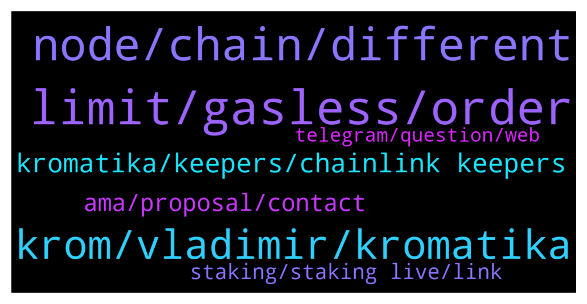

# **@chainlinkofficial**
 ## Analysis for **2022-01-26** - **2022-01-27**.

---

## 📊 **Basic Stats**

**n_messages_sent**: 144

---

---

## 🔝 **Top keywords and related messages**

1. **limit, gasless, order**

    @carevski --- *Yes, basic idea is simply. Since KROM is already utility token, why not give it more utility, that is, use it to pay for all cost. In this way fewer steps for end users. And, potentially cheaper if you buy low and use it high. So just another tool in the end user toolbox.* **--->** [TG Discussion](https://t.me/chainlinkofficial/369574)

    @carevski --- *Basically the key difference is how the trade is made. We avoid traditional swap to avoid swap fees, front running bots, slippage. Instead, we place and pull liquidity to achieve a trade. This gets us the listed benefits above.* **--->** [TG Discussion](https://t.me/chainlinkofficial/369568)

    @nick_wallace --- *Nice idea to have Gasless transactions. Thanks for answering my questions* **--->** [TG Discussion](https://t.me/chainlinkofficial/369585)

    @nick_wallace --- *Can they be utilized for relaying Gasless transactions and charging LINK for that. That would be a cool Keepers feature* **--->** [TG Discussion](https://t.me/chainlinkofficial/369601)

    @John --- *what makes this product different than other limit order solutions?* **--->** [TG Discussion](https://t.me/chainlinkofficial/369564)

    @nick_wallace --- *Gasless trading seems interesting feature? How did you achieve it? Do users only need KROM does to do Gasless trading?* **--->** [TG Discussion](https://t.me/chainlinkofficial/369571)

2. **node, chain, different**

    @gicappaemme --- *Hello guys. I am new to ChainLink and I am literally amazed by it. I have a question: if the most of its infrastructures is built on Ethereum Mainnet, would it make sense to run a node on Polygon or another EVM Compatible Chain? There would be a request in that case? Hope you can answer me! Thank you all 🙏* **--->** [TG Discussion](https://t.me/chainlinkofficial/369389)

    @marcromeron --- *Hi guys! If you're a newcomer and want to know more about Chainlink I'll host an AMA at 3 pm UTC. Check this post: https://twitter.com/stalkerscrypto/status/1484879861810622471?s=21* **--->** [TG Discussion](https://t.me/chainlinkofficial/369432)

    @Sylvarantt --- *#developers-advice is a good place to brainstorm design choices as long as they are related to Chainlink. You could find available node operators on #operators-requests and devs willing to work with you in #jobs 👍* **--->** [TG Discussion](https://t.me/chainlinkofficial/369412)

    @Sylvarantt --- *Chainlink is open-source and blockchain-agnostic, which ultimately means that with some integration efforts, Chainlink solutions can be deployed on any chain. If there is demand for hybrid smart contracts, Chainlink will eventually be there* **--->** [TG Discussion](https://t.me/chainlinkofficial/369407)

    @Lalalazzz --- *But I've read news from 2020 that Chainlink will deployed on NEAR, but nothing happened. So Im interested will they do it or not* **--->** [TG Discussion](https://t.me/chainlinkofficial/369409)

    @AriKiry --- *Hi there, I'm not sure to follow.  This post may help getting a deeper understanding on Chainlink node operators:  https://blog.chain.link/what-is-a-chainlink-node-operator/  You can also check Chainlink jobs on different networks here:  https://data.chain.link/* **--->** [TG Discussion](https://t.me/chainlinkofficial/369391)

3. **krom, vladimir, kromatika**

    @Joypokkamol --- *Hi everyone, please be ready in 10 minutes! https://twitter.com/marcromerona/status/1485663625499009029* **--->** [TG Discussion](https://t.me/chainlinkofficial/369481)

    @Joypokkamol --- *Alright! I won’t take any more of your valuable time. Thank you very much, Vladimir for today.* **--->** [TG Discussion](https://t.me/chainlinkofficial/369578)

    @Joypokkamol --- *Please tell us about Kromatika. How does it work?* **--->** [TG Discussion](https://t.me/chainlinkofficial/369511)

    @Joypokkamol --- *What is the best way for someone watching today to get started with Kromatika?* **--->** [TG Discussion](https://t.me/chainlinkofficial/369538)

    @Joypokkamol --- *Nice! Lastly, where can the audience follow Kromatika and stay updated?* **--->** [TG Discussion](https://t.me/chainlinkofficial/369555)

    @Joypokkamol --- *I am just curious about Krom-E. Could you please tell us who is Krom-E?* **--->** [TG Discussion](https://t.me/chainlinkofficial/369553)

4. **kromatika, keepers, chainlink keepers**

    @terranjourneys --- *Chainlink keepers are being used by kromatika* **--->** [TG Discussion](https://t.me/chainlinkofficial/369595)

    @MBStackOS --- *Do you guys have a timeframe for when we can use Krom dApp on Ethereum Mainnet?* **--->** [TG Discussion](https://t.me/chainlinkofficial/369565)

    @Sylvarantt --- *Forwarding it!  Carevski: An interesting fact is that Kromatika Protocol was part of Chainlink’s Fall hackathon back in September/November 2021. We had the idea already refined so we applied for the hackathon. You can find our submission here: https://devpost.com/software/kromatika, along with a small demo. Kromatika has won the “on the rise” reward at that time and here we are now rising :). Even then we knew Chainlink could be part of our solution. This is where our interest in Chainlink started and grew to be a collaboration.* **--->** [TG Discussion](https://t.me/chainlinkofficial/369531)

    @Joypokkamol --- *We will have a community Q&A with Kromatika in just a few moments, which recently announced that it integrates Chainlink Keepers to secure and automate limit order functionality in a decentralized environment. https://twitter.com/Smart_Contract/status/1483801417190101001?s=20* **--->** [TG Discussion](https://t.me/chainlinkofficial/369488)

    @Joypokkamol --- *It is fascinating to see Kromatika Integrate with Chainlink Keepers.* **--->** [TG Discussion](https://t.me/chainlinkofficial/369527)

    @Joypokkamol --- *Please tell us more about how Kromatika and Chainlink work together?* **--->** [TG Discussion](https://t.me/chainlinkofficial/369528)

5. **ama, proposal, contact**

    @Saql_ain --- *Hi mate sorry to bother you! I am marketer and having ama proposal whom any need to contact for ama session* **--->** [TG Discussion](https://t.me/chainlinkofficial/369799)

    @nuttcracker0739 --- *Who is the right person for marketing proposal ?* **--->** [TG Discussion](https://t.me/chainlinkofficial/369807)

    @uzalamim --- *Hello everyone I Have an AMA proposal, whom should I contact to directly discuss about it?* **--->** [TG Discussion](https://t.me/chainlinkofficial/369344)

    @vai_00098 --- *Hello, I have a business proposal on conducting an AMA event or promotion whom I can contact?* **--->** [TG Discussion](https://t.me/chainlinkofficial/369713)

    @Joypokkamol --- *Before we go into the details, could you please introduce yourself and tell us a bit of your background?* **--->** [TG Discussion](https://t.me/chainlinkofficial/369505)

    @<UNK> --- *Hello, I have a business proposal on conducting an AMA event or promotion whom I can contact?* **--->** [TG Discussion](https://t.me/chainlinkofficial/369736)

6. **staking, staking live, link**

    @manhhhg --- *How can I see how much LINK one node staking?* **--->** [TG Discussion](https://t.me/chainlinkofficial/369606)

    @Cong --- *How much cost A Operator farm 1 token Link?* **--->** [TG Discussion](https://t.me/chainlinkofficial/369402)

    @Linkederic --- *Staking is not yet live https://t.me/chainlinkofficial/364360* **--->** [TG Discussion](https://t.me/chainlinkofficial/369608)

    @Linkederic --- *Staking is not yet live. This article provides an overview of explicit staking from the Chainlink 2.0 Whitepaper. This presentation by Sergey discusses staking and the difference between implicit and explicit staking, while in this other presentation Sergey announced the team is planning to implement some form of staking in 2022.  As a rule the team doesn’t offer timelines for development targets. You can follow development progress via github.  Anything you find out there claiming to be "LINK staking" is actually some form of either lending or yield farming, which is out of the scope of this channel.* **--->** [TG Discussion](https://t.me/chainlinkofficial/369817)

    @Sylvarantt --- *Chainlink staking is not live yet, so I'm not sure what you need help with specifically* **--->** [TG Discussion](https://t.me/chainlinkofficial/369796)

    @Borosniper77 --- *Hey all can you stake chainlink risk free from a cold wallet?* **--->** [TG Discussion](https://t.me/chainlinkofficial/369433)

7. **telegram, question, web**

    @Linkederic --- *China has a telegram group, it’s called @chainlinkfans (unofficial) and please also feel free to check out our Chinese communities (official) here:  https://blog.chain.link/chainlink-chinese-communities/* **--->** [TG Discussion](https://t.me/chainlinkofficial/369291)

    @gicappaemme --- *Happy to read it! At this point I have another question (sorry for multiple question) what is the right section on Discord where I can find a trustable partner to make this node? I have the skills to implement the algorithm I did on a web server, but I need someone that create the node and deploy properly the job.* **--->** [TG Discussion](https://t.me/chainlinkofficial/369410)

    @Dostoevsky --- *I mean a group here on telegram?* **--->** [TG Discussion](https://t.me/chainlinkofficial/369767)

    @Joypokkamol --- *Web: https://kromatika.finance/  Twitter:  https://twitter.com/KromatikaFi   Telegram: https://t.me/kromatika_finance   Discord: https://discord.com/invite/Uv2Q2v26JG   You can follow Vladimir on https://twitter.com/VCarevski* **--->** [TG Discussion](https://t.me/chainlinkofficial/369559)

    @linkinthechain --- *Hey frens, please give this a like and retweet* **--->** [TG Discussion](https://t.me/chainlinkofficial/369122)

    @Sylvarantt --- *I'm not sure I am following you, could you please rephrase your question?* **--->** [TG Discussion](https://t.me/chainlinkofficial/369408)

