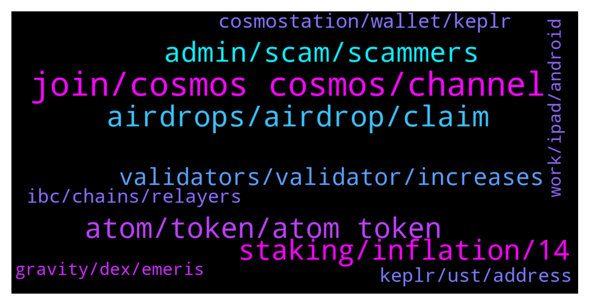

# **@cosmosproject**
 ## Analysis for **2022-01-26** - **2022-01-27**.

---

## 📊 **Basic Stats**

**n_messages_sent**: 385

---

---

## 🔝 **Top keywords and related messages**

1. **join, cosmos cosmos, channel**

    @ZoltanAtom --- *Hi there,It’s Starport! Join them to be stay updated ;  https://discord.gg/starport* **--->** [TG Discussion](https://t.me/cosmosproject/482011)

    @ZoltanAtom --- *Hi there,please join to Cosmos discord for your technical questions ;  https://discord.gg/vcExX9T* **--->** [TG Discussion](https://t.me/cosmosproject/481246)

    @FFYG_crypto4life --- *Admin I am a YouTuber and just did a a great video explaining Atom cosmos to public , wanted to check the possibility of sharing it here to create some noise on YouTube* **--->** [TG Discussion](https://t.me/cosmosproject/481505)

    @ZoltanAtom --- *There is no such Platform at Cosmos. Because at Cosmos each blockchain is sovereign specific application.   If you like to launch a project at Cosmos,you should go through Starport. And most likely new projects has no private sale, they distribute their tokens to Atom stakers.* **--->** [TG Discussion](https://t.me/cosmosproject/482017)

    @FFYG_crypto4life --- *We need some noise guys and likes to make the video go viral* **--->** [TG Discussion](https://t.me/cosmosproject/481552)

    @Thanhdcb --- *yes, agree cosmos culture  not ico , ido...pump and dump by cex* **--->** [TG Discussion](https://t.me/cosmosproject/482023)

2. **airdrops, airdrop, claim**

    @Victor --- *Hi Newb here Ive have just over 50 Cosmos staked for just shy of a year in an Exodus wallet am I eligible for airdrops* **--->** [TG Discussion](https://t.me/cosmosproject/481039)

    @FFYG_crypto4life --- *It really I didn’t claim the airdrop , it will be great to walk me through the procedure and for exodus I will migrate from it to the recommended ones u mentioned above Zoltan 😍* **--->** [TG Discussion](https://t.me/cosmosproject/481516)

    @ZoltanAtom --- *Exodus is not recommended one. You should use Keplr or Cosmostation. It seems you haven’t claim any airdrops which has been given to atom stakers.* **--->** [TG Discussion](https://t.me/cosmosproject/481515)

    @ZoltanAtom --- *Keplr or Cosmostation are recommended wallets.Claiming process of airdrop happens through Keplr. So you will need to use Keplr wallet eventually.   Do not stake your Atoms with exchanges validators Do not choose validators which offer 0 commission* **--->** [TG Discussion](https://t.me/cosmosproject/481990)

    @Humble --- *Nice is there an airdrop where can we check* **--->** [TG Discussion](https://t.me/cosmosproject/481231)

    @ZoltanAtom --- *You need Keplr wallet to claim your airdrops. Here is the guide “how to import your Cosmos account to Keplr”   https://medium.com/chainapsis/how-to-use-keplr-wallet-40afc80907f6* **--->** [TG Discussion](https://t.me/cosmosproject/482040)

3. **atom, token, atom token**

    @teletaster --- *hi! Iheard that there is change on tokenomics of ATOM, where could I find this info? at its medium post? Thanks.* **--->** [TG Discussion](https://t.me/cosmosproject/481255)

    @B1ockCha1n --- *hi. whats the main usage of ATOM token in Cosmos ecosystem ?* **--->** [TG Discussion](https://t.me/cosmosproject/481348)

    @FFYG_crypto4life --- *Not really, I am an old investor in crypto and bought w 2000$ of atom when it was 2 dollars 😍😍* **--->** [TG Discussion](https://t.me/cosmosproject/481510)

    @cometyty --- *Can anyone tell how to claim the bonus ATOM..* **--->** [TG Discussion](https://t.me/cosmosproject/481421)

    @AtomJazz --- *Everyone knows he's been fudding Atom since forever. I think he's avax guy and clearly has no idea* **--->** [TG Discussion](https://t.me/cosmosproject/481450)

    @SanNL --- *That the atom token is almost not used and that mostly reason why atom is 10B is cause of all the airdrops (so not sustainable long term).* **--->** [TG Discussion](https://t.me/cosmosproject/481446)

4. **staking, inflation, 14**

    @AtomJazz --- *Currently we have dynamic inflation in Cosmos between 7-20%. The more people stake the lower the inflation but if staking ratio falls below 60% inflation starts rising so people are incentivized to stake again (or get diluted)* **--->** [TG Discussion](https://t.me/cosmosproject/481904)

    @DAD_DEFI --- *hi all!   where can we see staking APR% on each chain?* **--->** [TG Discussion](https://t.me/cosmosproject/481301)

    @Ayo --- *I will be getting 14% every 6 seconds??* **--->** [TG Discussion](https://t.me/cosmosproject/481888)

    @bbergbahn --- *Yes last 2 weeks it was 4M with this parabolic growth we hit 100M soon* **--->** [TG Discussion](https://t.me/cosmosproject/481298)

    @Buri7xxx --- *We get 7% in the worst case, did I understand that correctly* **--->** [TG Discussion](https://t.me/cosmosproject/481905)

    @AtomJazz --- *When you open Keplr there's a stake button on the bottom. Left of that button it says earn up to 14.73% per year* **--->** [TG Discussion](https://t.me/cosmosproject/481318)

5. **admin, scam, scammers**

    @cryptonats1 --- *Can a scammer dm me I am Bored.* **--->** [TG Discussion](https://t.me/cosmosproject/481582)

    @. --- *Guys don’t trust Jazz, he’s a scammer, he just asked me for my Keplr account* **--->** [TG Discussion](https://t.me/cosmosproject/481320)

    @tejpalaux --- *So many scammers.. damm  Please stay vigilant just keep blocking the suckers 🤣😂* **--->** [TG Discussion](https://t.me/cosmosproject/481673)

    @James --- *I know. Absolutely m'fkrs. Getting DM's all the time asking for seed phrases. It kills me when they trick a dude.* **--->** [TG Discussion](https://t.me/cosmosproject/481675)

    @bbergbahn --- *Sir the one who DM you is Scammer* **--->** [TG Discussion](https://t.me/cosmosproject/481324)

    @TicoJohnny --- *Believe it's called Binance Scam Chain* **--->** [TG Discussion](https://t.me/cosmosproject/481142)

6. **validators, validator, increases**

    @J --- *Ah ok. I thought maybe it was safer to go with the most popular validators but you’re saying less popular increases airdrops?* **--->** [TG Discussion](https://t.me/cosmosproject/481045)

    @AtomJazz --- *I'd recommend any validator outside of the top 20 personally, distributing your tokens to validators lower on the list increases the decentralization of the network, decreases your risk of "slashing" (which is already low), and increases your odds of airdrops.* **--->** [TG Discussion](https://t.me/cosmosproject/481040)

    @TicoJohnny --- *I'd recommend any validator outside of the top 20 personally, distributing your tokens to validators lower on the list increases the decentralization of the network, decreases your risk of "slashing" (which is already low), and increases your odds of airdrops.* **--->** [TG Discussion](https://t.me/cosmosproject/480984)

    @ZnLeft --- *Right cool. And what about the validators? Anything you could recommend?* **--->** [TG Discussion](https://t.me/cosmosproject/480981)

    @TicoJohnny --- *It also is just a good rule of thumb to help to decentralize the network.* **--->** [TG Discussion](https://t.me/cosmosproject/481050)

    @J --- *Is Stakefish a good validator to delegate to?* **--->** [TG Discussion](https://t.me/cosmosproject/481236)

7. **cosmostation, wallet, keplr**

    @badcapitan02 --- *Witch wallet is better?? Cosmosation or kepler??* **--->** [TG Discussion](https://t.me/cosmosproject/481751)

    @AtomJazz --- *Keplr wallet or Cosmostation wallet are your best bet* **--->** [TG Discussion](https://t.me/cosmosproject/481302)

    @Nono066 --- *wich one is the best cosmostation or kplr?* **--->** [TG Discussion](https://t.me/cosmosproject/482004)

    @rico_007k --- *hi, how can one add bitsong to Kepler wallet ? manually, without connecting random websites* **--->** [TG Discussion](https://t.me/cosmosproject/481777)

    @ZoltanAtom --- *I do use both of them. If you like to use mobile one, I suggest you to choose Cosmostation. For web,Keplr is the best and easy to access Cosmos Dexs.* **--->** [TG Discussion](https://t.me/cosmosproject/482005)

    @ZoltanAtom --- *Keplr or Cosmostation are recommended wallets.Links and tutorials of wallets are at the pinned message.* **--->** [TG Discussion](https://t.me/cosmosproject/481999)

8. **ibc, chains, relayers**

    @zstupar33 --- *https://www.youtube.com/watch?v=c7P4K9UUS08 Check this out guys, nice project from IBC community, $SCRT this time* **--->** [TG Discussion](https://t.me/cosmosproject/481538)

    @AtomJazz --- *There's nothing to fud about. Growth of IBC is creating huge network effect and will allow ATOM to growth basically infinitely. People think ATOM can accrue value only on Cosmos hub itself which is not true. ATOM can and will have thousands of usecases on independent IBC connected chains that will drive demand for ATOM. Other than that Cosmos hub is building a whole set of utilities specific to Cosmos hub like Interchain security, etc.* **--->** [TG Discussion](https://t.me/cosmosproject/481454)

    @AtomJazz --- *Relayers infrastructure is the same for all IBC chains* **--->** [TG Discussion](https://t.me/cosmosproject/481008)

    @SanNL --- *Thanks. Does IBC work outside of Cosmos as well? Use IBC to connect to say Avalanche, Ethereum etc? Or mostly interoperability inside Cosmos ecosystem/hubs?* **--->** [TG Discussion](https://t.me/cosmosproject/481456)

    @bbergbahn --- *Oh yes we make it another milestone 5M IBC transfers in last 30 days...let's shout to the world* **--->** [TG Discussion](https://t.me/cosmosproject/481294)

    @Xahriwi --- *Do all relayers have to pay the receiving chains fee or is that only for those relaying for Osmosis?* **--->** [TG Discussion](https://t.me/cosmosproject/481006)

9. **keplr, ust, address**

    @Cordtus --- *You can send UST (I assume that was a typo... You can't send USDT for sure) to your keplr address I think you just can't send it from keplr to terra chain or something* **--->** [TG Discussion](https://t.me/cosmosproject/481839)

    @DAD_DEFI --- *just to confirm. i can send $UST from CEX to KEPLR terra address right?   only issue is sending $UST from Keplr to any Terra address.* **--->** [TG Discussion](https://t.me/cosmosproject/481334)

    @DAD_DEFI --- *anyways, any Keplr guys here?  just to confirm. i can send $UST from CEX to KEPLR terra address right?   only issue is sending $UST from Keplr to any Terra address.* **--->** [TG Discussion](https://t.me/cosmosproject/481313)

    @a1sunny --- *Can i send usdt to keple wallet?* **--->** [TG Discussion](https://t.me/cosmosproject/481835)

    @ZoltanAtom --- *Lol I mix usdt with ust. ! Yes you can not send usdt to Keplr.* **--->** [TG Discussion](https://t.me/cosmosproject/481840)

    @ZoltanAtom --- *I am not sure because Luna/ust is not supported at Keplr yet. It’s in beta. But I know that you can “import” your Terrastation address to Keplr so you will have your Ust under your Luna address.* **--->** [TG Discussion](https://t.me/cosmosproject/481838)

10. **work, ipad, android**

    @typerati --- *Hi frens, is keplr bowser extension downloadable in an Ipad?* **--->** [TG Discussion](https://t.me/cosmosproject/481827)

    @Cordtus --- *Yes just make very sure it's the right wallet app! Should be able to find a legit link here i imagine. @ZoltanAtom* **--->** [TG Discussion](https://t.me/cosmosproject/482039)

    @Cordtus --- *Yeah I did this on android but it didn't work. But I know some people have done it on pc and I believe it does work. Doesn't hurt to try.* **--->** [TG Discussion](https://t.me/cosmosproject/481843)

    @Cordtus --- *Can you get brave browser on iPad? It may work that way.. I tried it on android though and it didn't* **--->** [TG Discussion](https://t.me/cosmosproject/481837)

    @ZoltanAtom --- *Hi there,I am not sure if this will work. But give it a try.* **--->** [TG Discussion](https://t.me/cosmosproject/481828)

    @LED7NFT --- *I want to download Keplr wallet on android. Is it scam or real ? Because i see on playstore Keplr wallet app.* **--->** [TG Discussion](https://t.me/cosmosproject/481543)

