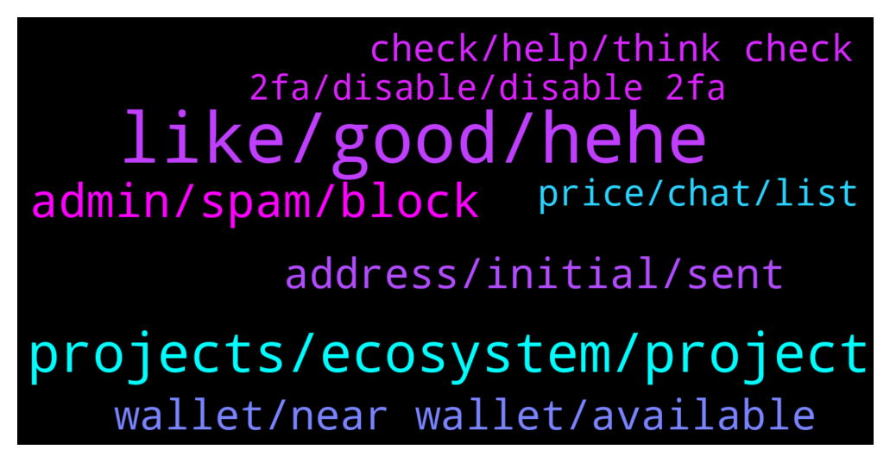

# **@cryptonear**
 ## Analysis for **2022-01-26** - **2022-01-27**.

---

## 📊 **Basic Stats**

**n_messages_sent**: 514

---

---

## 🔝 **Top keywords and related messages**

1. **like, good, hehe**

    @TheGo1denBull --- *It Ain't Big If It Ain't Jumbo 🐘* **--->** [TG Discussion](https://t.me/cryptonear/300059)

    @jas_hue --- *Then what's the essence of this community* **--->** [TG Discussion](https://t.me/cryptonear/299644)

    @oppzsmoKe --- *Dude I always do I like messing with them since they like messing with us* **--->** [TG Discussion](https://t.me/cryptonear/299599)

    @harryfrottercrypto --- *Ugliest thing ive ever seen 😂😂😂* **--->** [TG Discussion](https://t.me/cryptonear/299763)

    @larry_lang --- *hey i heard from @kenjay60 that u have some health problem=00 whatsupp with that? are u okey now =000* **--->** [TG Discussion](https://t.me/cryptonear/299015)

    @crypto_blckhntr --- *Hello to the NEAR family, why is everyone silent today?* **--->** [TG Discussion](https://t.me/cryptonear/299287)

2. **projects, ecosystem, project**

    @itsbabynata --- *hey everyone! is there any good projects on NEAR? i mean upcoming projects NFT, am i in the wrong group lol* **--->** [TG Discussion](https://t.me/cryptonear/300021)

    @GeorgePro1 --- *Maybe someone from the community will help. I like all the projects building on near. Each of them has a unique use case.* **--->** [TG Discussion](https://t.me/cryptonear/298752)

    @EmmanuelAkhabue --- *I want to build on near admin* **--->** [TG Discussion](https://t.me/cryptonear/299906)

    @rahulgoel007 --- *There are lots of projects on near  Complete list can be found here https://awesomenear.com/projects/* **--->** [TG Discussion](https://t.me/cryptonear/300023)

    @rahulgoel007 --- *You can have a look at here Contains are the projects build on near https://awesomenear.com/projects/* **--->** [TG Discussion](https://t.me/cryptonear/298748)

    @dehraw --- *Ok thanks, will check it out. Do you guys have any personal favorites (I will do my own due diligence but just curious)?* **--->** [TG Discussion](https://t.me/cryptonear/298751)

3. **admin, spam, block**

    @Brownhawks_Memolabs --- *l can't send a dm. Guess l could contact mutual contacts* **--->** [TG Discussion](https://t.me/cryptonear/299002)

    @spectre011 --- *I cant dm you first @iamkemoo please dm me* **--->** [TG Discussion](https://t.me/cryptonear/299185)

    @rahulgoel007 --- *Just remember admin will never dm you first* **--->** [TG Discussion](https://t.me/cryptonear/299008)

    @iamkemoo --- *I dont do DMs to community members. You have to add me to contacts and then you can send me. My DM settings is open to everyone.* **--->** [TG Discussion](https://t.me/cryptonear/299187)

    @iamkemoo --- *Than it has to do with you settings bro, bc others can DM me too.* **--->** [TG Discussion](https://t.me/cryptonear/299192)

    @Taurus990 --- *Please be careful, those that have any issue whatsoever, immediately i posted this a fake customer support messaged me, i blocked his lame ass…Please newbies like myself should be careful and don’t trust anyone that sends a DM first!!!* **--->** [TG Discussion](https://t.me/cryptonear/299525)

4. **address, initial, sent**

    @fabrianable --- *can my near be returned?  I sent the wrong address to the initial deposit* **--->** [TG Discussion](https://t.me/cryptonear/299326)

    @st_orif --- *I sent near at wrong adress, can I cancel transaction?* **--->** [TG Discussion](https://t.me/cryptonear/298763)

    @Jamorson --- *I deposited five near in my account 2/3 are now in storage with the fees I have available 1.3 near this was only a trial will I ever receive those back into my account just asking* **--->** [TG Discussion](https://t.me/cryptonear/298567)

    @Paddyboyy --- *I send from kucoin to my Wallet adres but i didnt receive it. Now my wallet has a name instead long adress. What can i do?* **--->** [TG Discussion](https://t.me/cryptonear/298933)

    @Paddyboyy --- *I send to 64 and not to my name id* **--->** [TG Discussion](https://t.me/cryptonear/298938)

    @fabrianable --- *my balance goes to the initial deposit address* **--->** [TG Discussion](https://t.me/cryptonear/299337)

5. **wallet, near wallet, available**

    @Seej01 --- *Would you recommend this sir? Or just stick to the near wallet?* **--->** [TG Discussion](https://t.me/cryptonear/299855)

    @anto_0789 --- *Guys I transfered my near to my near wallet, now I have to chose a validator,any suggestion please?* **--->** [TG Discussion](https://t.me/cryptonear/298599)

    @fabrianable --- *how to check near wallet address?* **--->** [TG Discussion](https://t.me/cryptonear/299200)

    @DarasLabi --- *WHat is the original website of wallet?\* **--->** [TG Discussion](https://t.me/cryptonear/299126)

    @brandonleongsw --- *Does Near support private shards currently?* **--->** [TG Discussion](https://t.me/cryptonear/299970)

    @primrosepie --- *Can anyone suggest a good wallet manager?* **--->** [TG Discussion](https://t.me/cryptonear/299072)

6. **check, help, think check**

    @larry_lang --- *in your case i think u should check this article: https://nearhelp.zendesk.com/hc/en-us/articles/1500009602081-Accidentally-sent-NEAR-to-the-funding-initial-address-Can-I-recover-it-* **--->** [TG Discussion](https://t.me/cryptonear/298943)

    @fabrianable --- *I've read it but I still don't understand  can you help me step by step* **--->** [TG Discussion](https://t.me/cryptonear/299266)

    @Donwest --- *just want to get verified in paras... hope u can help me with it guys...* **--->** [TG Discussion](https://t.me/cryptonear/298735)

    @larry_lang --- *ah i think this guide can help u then^^: https://near.org/blog/getting-started-with-the-near-wallet/* **--->** [TG Discussion](https://t.me/cryptonear/299128)

    @larry_lang --- *https://twitter.com/NEAR_daily/status/145301417399512679. u can check it here* **--->** [TG Discussion](https://t.me/cryptonear/298829)

    @jas_hue --- *Thanks for this piece of information but I'm not confident enough yet* **--->** [TG Discussion](https://t.me/cryptonear/299650)

7. **price, chat, list**

    @hieukool --- *i am sell near 12$ said said* **--->** [TG Discussion](https://t.me/cryptonear/299292)

    @dlsmnosman --- *do you guys think near will be 17 dollars again* **--->** [TG Discussion](https://t.me/cryptonear/298512)

    @NEARverse_xd --- *It is depends on many factors. If you r talking about ecosystem wise then yes easily and if you r talking about price, its depend on adoption and marketcap but the thing is near is already on no. 23 by marketcap wise. And in future it will surely come under top 10 🙌* **--->** [TG Discussion](https://t.me/cryptonear/299939)

    @NearFritz --- *Hello Ali, we don't know about that, we know about the tech. You can join a group of traders to enjoy that kind of discussions. Here is one: @merchantsofnear* **--->** [TG Discussion](https://t.me/cryptonear/298517)

    @Tony_S0prano --- *Is there a trader's chat or is price discussion allowed here?* **--->** [TG Discussion](https://t.me/cryptonear/298787)

    @Leojaxom_indoex --- *I would like to present a special Listing offer. Would you please help me get in touch with someone to talk it over in PM?* **--->** [TG Discussion](https://t.me/cryptonear/298958)

