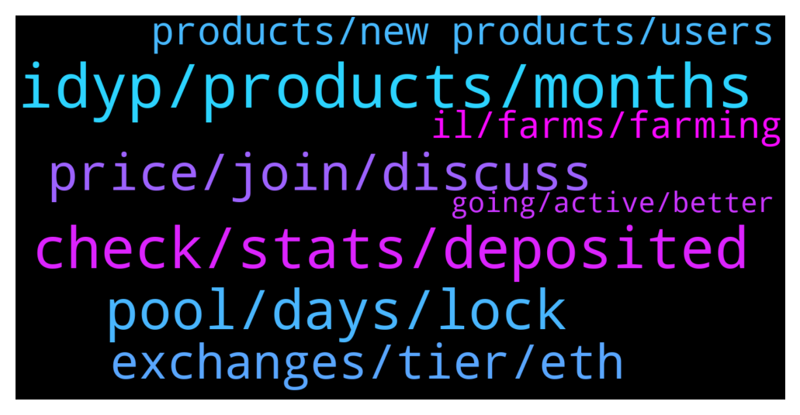

# **@dypfinance**
 ## Analysis for **2022-01-26** - **2022-01-27**.

---

## 📊 **Basic Stats**

**n_messages_sent**: 116

---

---

## 🔝 **Top keywords and related messages**

1. **idyp, products, months**

    @popper1989 --- *how many ppl are working for DYP* **--->** [TG Discussion](https://t.me/dypfinance/242920)

    @Kkkiran21 --- *Not Dyp i am talking about idyp* **--->** [TG Discussion](https://t.me/dypfinance/242907)

    @Nazhadi57 --- *I thought there is a mechanism to reduce IL in DYP* **--->** [TG Discussion](https://t.me/dypfinance/242766)

    @Aloysius De Sa --- *Which is the biggest coin that is in the same field as dyp* **--->** [TG Discussion](https://t.me/dypfinance/242775)

    @Kkkiran21 --- *Any plan for idyp in future 🥲it got rekt* **--->** [TG Discussion](https://t.me/dypfinance/242905)

    @sunnygummybear --- *so Tim. let’s keep it simple.   did idyp make it easier for new investors to understand?   what value does idyp hold? why pay it out as a reward ? as all we do is convert it…   etc etc   i’m not blaming you personally. nor attacking anything. i’m simply brainstorming on focus. and any (!!) good company needs feedback from its users   my best* **--->** [TG Discussion](https://t.me/dypfinance/242951)

2. **check, stats, deposited**

    @TaylorSwift360rekt --- *I can't find any proof on my address either, so weird* **--->** [TG Discussion](https://t.me/dypfinance/242661)

    @TaylorSwift360rekt --- *Yer that or November. Around then, sucks I don't have the exact dates, but like you said, it should be on the blockchain but it ain't. I need to keep researching and try to find a way to access the funds* **--->** [TG Discussion](https://t.me/dypfinance/242663)

    @hemanrock --- *the return calculator is approx. and if you are checking now, it shows as of today with current APY to the number of days.* **--->** [TG Discussion](https://t.me/dypfinance/242598)

    @TaylorSwift360rekt --- *Is there an old contract address they I may have pit my LP's in?* **--->** [TG Discussion](https://t.me/dypfinance/242656)

    @rvshivsup --- *Not sure if I entered staking or not* **--->** [TG Discussion](https://t.me/dypfinance/242992)

    @iamJubi --- *Yes. Best way is to please recall where you deposited your asset as I can’t really find any LP(dyp-wbnb) deposit in your address’ historical transactions.* **--->** [TG Discussion](https://t.me/dypfinance/242665)

3. **pool, days, lock**

    @iamJubi --- *APY change depends on TVL, prices of token involved on the pool, etc.   "To Be Burnt/disbursed" iDYP on the pool is yet to be distributed as reward or burnt, so it contributes to the APY. If you check, 60 days pool have no more iDYP that is potentially be disbursed while 90 days still have. This is another factor.  Also, higher lock time have higher allocated iDYP reward daily. let me check with the team  for some other factors that affects the APY. But as said, originally the longer lock days the higher the APY was.* **--->** [TG Discussion](https://t.me/dypfinance/242860)

    @Janes --- *How are yield curves determined in the different v2 farms across the various lock times? It seems odd that there is a mid point on some of the farms where the 30 day pools are actually yielding a lot more than the 60 day and 90 day pools. How dynamic are these yields day to day? Seems like there should be a better way of compensating those that chose a longer lock time.* **--->** [TG Discussion](https://t.me/dypfinance/242849)

    @Janes --- *Thanks, so the yields are Purely TVL driven or is there also an underlying mechanism that also rewards more for a longer lock time? If it’s purely TVL driven, then why would there be a reason to have pools of different lock durations?* **--->** [TG Discussion](https://t.me/dypfinance/242853)

    @Paulus --- *The APR of no lock and 3days lock down to attract people keep asset in long time with 30 and 90days right?* **--->** [TG Discussion](https://t.me/dypfinance/242670)

    @Nazhadi57 --- *I have a question, can we add more deposit to a pool with a lock in? Then will the end of the lock in date change?* **--->** [TG Discussion](https://t.me/dypfinance/242731)

    @Jorzico --- *Last 2 week eth was at 180% and then 1 person put 20k into the pool and it went to 21% how?* **--->** [TG Discussion](https://t.me/dypfinance/242622)

4. **price, join, discuss**

    @BLaZQue --- *Hello, what is happening with the price, I know BTC has some corrections but dyp its only down..* **--->** [TG Discussion](https://t.me/dypfinance/242966)

    @DhoniMSD516 --- *https://t.me/dypprice Please join here for price discussions* **--->** [TG Discussion](https://t.me/dypfinance/242967)

    @DhoniMSD516 --- *You can join here to discuss about price https://t.me/dypprice* **--->** [TG Discussion](https://t.me/dypfinance/242924)

    @DhoniMSD516 --- *Hey you can join here to discuss about price https://t.me/dypprice* **--->** [TG Discussion](https://t.me/dypfinance/242704)

    @LovelySuman86 --- *4500$ is now 650 in just 3 month* **--->** [TG Discussion](https://t.me/dypfinance/242948)

    @iamJubi --- *There is none. We only have this group https://t.me/dypfinance   and the price discussion https://t.me/dypprice* **--->** [TG Discussion](https://t.me/dypfinance/242644)

5. **exchanges, tier, eth**

    @alvindrajw --- *Any latest update from tier 1 exchnage* **--->** [TG Discussion](https://t.me/dypfinance/242903)

    @hemanrock --- *Please wait for more information on it.* **--->** [TG Discussion](https://t.me/dypfinance/242614)

    @cryptolobster --- *How to paticipate on the ETH giveaway Join discord server and than ? Find nothing* **--->** [TG Discussion](https://t.me/dypfinance/242602)

    @hemanrock --- *Here is the links for bridge  BSC-ETH https://www.youtube.com/watch?v=SK-9PqZJM-I&t=131s  ETH-AVAX https://www.youtube.com/watch?v=k--YXSSYUMY* **--->** [TG Discussion](https://t.me/dypfinance/242621)

    @Shiang --- *What are the tier 1 exchanges* **--->** [TG Discussion](https://t.me/dypfinance/242982)

    @DhoniMSD516 --- *Hey @علیرضا صادقی Please type without break so that bot will not delete your message, regarding your query, we cannot name any exchanges but more listing including tier 1 are coming soon* **--->** [TG Discussion](https://t.me/dypfinance/242974)

6. **products, new products, users**

    @timdyp --- *In my opinion, YES! First of all with the new contracts the investors only need to make two transactions, approve and deposit. They no longer need to split the funds,  add liquidity, after that go back to the pools, etc. Give it some time after the market recovers and we will see how the v2 pools goes. Of course, the feedback is always good. Also, don't forget that we will have new products for staking, farming, and borrow & lending.* **--->** [TG Discussion](https://t.me/dypfinance/242953)

    @timdyp --- *The new products will have no connection with the current ones, so the users would need to make new deposits. I am 100% sure that all the users would love the new products that are coming. Plus we will have a pretty cool referral system for all the products that will pay the users directly with USDT. And don't forget about the new website, new logo, new dapps, etc. Lot of new things are coming :)* **--->** [TG Discussion](https://t.me/dypfinance/242957)

    @Joe --- *You Said binance and coinbase First because of they Are the 2 new listings😉😂* **--->** [TG Discussion](https://t.me/dypfinance/242988)

    @Aloysius De Sa --- *Is alpaca finance the leader in this or is there an even bigger coin?* **--->** [TG Discussion](https://t.me/dypfinance/242780)

    @shinigamikami --- *Will the new products make use of users already in farming pools? Or new deposit or so will be required?* **--->** [TG Discussion](https://t.me/dypfinance/242956)

    @timdyp --- *Yes, the CAWS with the P2E game coming, lot of new things. Plus the metaverse for all the platform. The only thing is that everything takes time, the market is not good all the time, and some investors don't want to understand and realize this. Instead, they like to FUD their own bags.* **--->** [TG Discussion](https://t.me/dypfinance/242961)

7. **il, farms, farming**

    @timdyp --- *Don't get me wrong, but this is not the case. In the V1 farms the users had 100% exposure to IL for two assets, for example DYP and ETH. In the current V2 farms the users have ONLY 75% exposure to the IL for two assets, iDYP and ETH. So no change, only 25% decrease for the IL. Regarding the 25% amount that is swapped into DYP, this provides 199% current APY with no IL!  Regarding the rewards, again there is nothing changed! For the 75% deposit, you continue to earn ETH rewards, ONLY for the 25% deposit with a high APY and NO IL, you earn DYP. If you don't like the DYP rewards, you can always swap them into ETH. First of all you cannot stake iDYP tokens, you can stake only DYP tokens so unfortunately I cannot understand your affirmation.  Considering that the market dropped hard, it is impossible for the users that are using the farming pools not to have a IL right now. So before complaining about the v2 pools, you should make an analyze about the market. We had similar situation for some time with the v1 pools because of the market direction.  Regarding your last affirmation, new products for staking, farming, and borrow & lending will roll out in Q1.* **--->** [TG Discussion](https://t.me/dypfinance/242944)

    @Nazhadi57 --- *Is there impermanent loss in the Avax farms?* **--->** [TG Discussion](https://t.me/dypfinance/242764)

    @DhoniMSD516 --- *Maximize your Yield Farming Rewards on #Avalanche  24,389 #AVAX worth $1,458,706 paid to the farmers!  Join farming by automatically adding liquidity and earn 435% APY https://dyp.finance/farmv2/avax  👉https://twitter.com/dypfinance/status/1484927132346298379* **--->** [TG Discussion](https://t.me/dypfinance/242931)

    @DhoniMSD516 --- *Please read through https://link.medium.com/2nXyI0UkPlb to understand how V2 farms works* **--->** [TG Discussion](https://t.me/dypfinance/242768)

    @DhoniMSD516 --- *with new farms 25% of IL is reduced* **--->** [TG Discussion](https://t.me/dypfinance/242767)

    @DhoniMSD516 --- *Yes impermanent loss is common in yield farming* **--->** [TG Discussion](https://t.me/dypfinance/242765)

8. **going, active, better**

    @trader_broi --- *Where is @timdyp not active what happened to him* **--->** [TG Discussion](https://t.me/dypfinance/242914)

    @Gabriel --- *Hello, how it is everything going?* **--->** [TG Discussion](https://t.me/dypfinance/242895)

    @sunnygummybear --- *i think a lot is to be said for both sides. thanks for the feedback. we are of course going for the long run Tim. good, better.. best. 👍* **--->** [TG Discussion](https://t.me/dypfinance/242960)

    @DhoniMSD516 --- *He is doing better now, thanks :)* **--->** [TG Discussion](https://t.me/dypfinance/242917)

    @DhoniMSD516 --- *He is fine and active internally :)* **--->** [TG Discussion](https://t.me/dypfinance/242915)

    @Monica241 --- *Good morning and i hope we all have a beautiful day ahead* **--->** [TG Discussion](https://t.me/dypfinance/242889)

