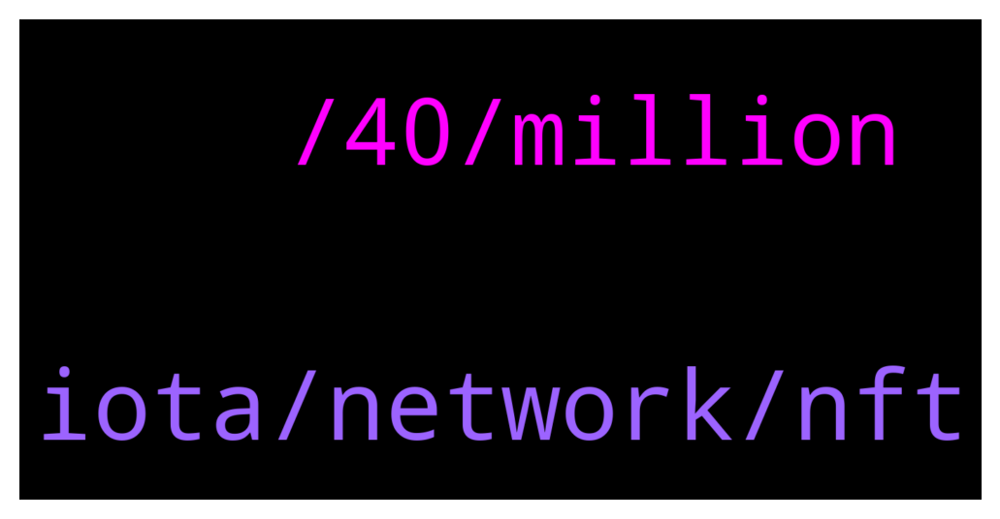

# **@iotatangle**
 ## Analysis for **2022-01-26** - **2022-01-27**.

---

## 📊 **Basic Stats**

**n_messages_sent**: 26

---

---

## 🔝 **Top keywords and related messages**

1. **iota, network, nft**

    @Lenar87 --- *to get those 2 coins, you need to dial them minimally?* **--->** [TG Discussion](https://t.me/iotatangle/307688)

    @Tahmis --- *(discord) christian.saur [Assembly] [Touchpoint Update]  Hey all!  I just wanted to share a quick overview over last week's new additions to Touchpoint as we've brought in a couple of really interesting projects!  **The Fans Together:** A DAO on the Iota protocol to provide fan ownership and fan participation of and in Professional Sports Clubs (https://thefanstogether.io/)  **Tangleswap: **TangleSwap is an AMM Decentralized Exchange (DEX) aimed at providing a wide portfolio of IOTA DeFi solutions (https://tangleswap.exchange/)  **Cryptobuddy:** Cryptobuddy is a crypto sales event aggregator and research platform. They also invest through their venture arm, lately with a focus on gaming and metaverse plays, but also eyeing the DeFi space (https://cryptobuddy.info/#/)  **Mesh+:** Mesh+ is designed to provide decentralized network coverage for the LoRa IoT ecosystem and capable to sustain telecommunications on a global scale due to usage of 2.4Ghz frequency spectrum (https://meshplus.io/)  **GAT Network & MintedVodka:** Gat Network is a web of connected NFT trading & gaming project. It is centered around Minted Vodka, the next-gen crypto-assets marketplace and NFT toolbox. Around MintedVodka, GAT Network invents, builds and connects on-chain gaming experiences (https://gat.network/minted-vodka/)  **Elysi**: ELYSI is a permissionless, decentralized metaverse experience that brings together multiple-blockchains for an endless world of customisable NFT and smart contract experiences in a virtual reality created by the users (https://elysi.io/#/)  Excited to have all of them! In addition, we had more calls with exciting projects and investors that we are working on bringing in, so expect this group to keep growing 🙂* **--->** [TG Discussion](https://t.me/iotatangle/307656)

    @Tahmis --- *It would benefit the ecosystem and rise iotas value* **--->** [TG Discussion](https://t.me/iotatangle/307727)

    @Incog --- *So many different projects coming unto IOTA 😍* **--->** [TG Discussion](https://t.me/iotatangle/307692)

    @Badis --- *I have 33409 iota very happy* **--->** [TG Discussion](https://t.me/iotatangle/307663)

    @Zhoxa --- *If iota would be 100$ then you can be Happy.* **--->** [TG Discussion](https://t.me/iotatangle/307665)

2. **, 40, million**

    @Ragnar_mb --- *50 tiota is like 1 million dollars yeah? What could they build with that.* **--->** [TG Discussion](https://t.me/iotatangle/307721)

    @Lyfee --- *What? 1 TI is one thousand GI. So at current prices its around $40.000.000* **--->** [TG Discussion](https://t.me/iotatangle/307735)

    @stephan_ka --- *50 ti is currently about 40 million ( 0.8 $ per mi)* **--->** [TG Discussion](https://t.me/iotatangle/307730)

    @Tahmis --- *Though, depends on what the unit for your 30k is 🤔* **--->** [TG Discussion](https://t.me/iotatangle/307684)

    @Zhoxa --- *I think not more then 100$ after 90 days* **--->** [TG Discussion](https://t.me/iotatangle/307679)

    @Zhoxa --- *I bought 40.000 at 0.12$ Mate* **--->** [TG Discussion](https://t.me/iotatangle/307668)

