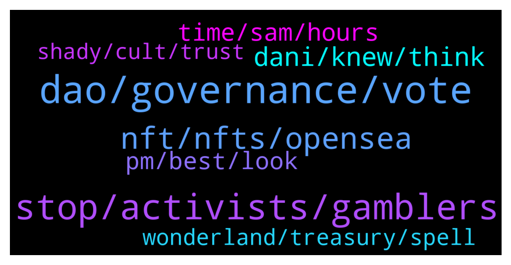

# **@lobsters_chat**
 ## Analysis for **2022-01-26** - **2022-01-27**.

---

## 📊 **Basic Stats**

**n_messages_sent**: 718

---

---

## 🔝 **Top keywords and related messages**

1. **dao, governance, vote**

    @TyraBlackbeard --- *Plato already said DAOs can't work like over 2000 years ago...so..* **--->** [TG Discussion](https://t.me/lobsters_chat/319712)

    @ivangbi --- *DAG decentralization autonomous gag… gauge. Idk, whatever the term is, the fact of the matter is that voting for the same thing weekly is not as much work as trying to vote on semi-social questions* **--->** [TG Discussion](https://t.me/lobsters_chat/319746)

    @ivangbi --- *Curve wars are the epiphany of not-committee structure. It’s fully on-chain stuff. While yearn and synthetix exercise committee structure, which is more modular in some cases, just harder to off board dead people after they become lazy. So Element proposed rotating members… tldr, start your reading with:  - synthetix dao structure - yearn dao structure - optimistic governance - etc.   Just google, whatever u find* **--->** [TG Discussion](https://t.me/lobsters_chat/319721)

    @ethnoweth --- *https://twitter.com/fiskantes/status/1485988944558923778  Anyone following DAOJones? $11m in 30 mins* **--->** [TG Discussion](https://t.me/lobsters_chat/318774)

    @astonchik --- *that is to be decided by voting yet* **--->** [TG Discussion](https://t.me/lobsters_chat/319309)

    @farm42 --- *Wen vote for SBF on elections lol* **--->** [TG Discussion](https://t.me/lobsters_chat/319159)

2. **stop, activists, gamblers**

    @ivangbi --- *You take from idiot gamblers and presumably give to people in need tho?* **--->** [TG Discussion](https://t.me/lobsters_chat/319174)

    @Edward_F --- *People "in need" are usually victims of their own "idiot" decisions too so it's hypocrisy. Half of the world has a two digit IQ.* **--->** [TG Discussion](https://t.me/lobsters_chat/319182)

    @coine_r --- *Activists and apathy don't belong in the same sentence* **--->** [TG Discussion](https://t.me/lobsters_chat/319947)

    @samkazemian --- *I think it’s more important to prove you create value+wealth than advertising how much value you give away. Because if almost all the value you give away was zero sum, your effective altruism is not as great as it might appear.* **--->** [TG Discussion](https://t.me/lobsters_chat/319173)

    @farm42 --- *IMO It is better to show that the community can selforganize itself and filter such bad guys out. This is an extremely positive thing.* **--->** [TG Discussion](https://t.me/lobsters_chat/319456)

    @somebodyontelegram --- *Aside from this video being incredibly cringe, it’s amazing how someone so smart at making money can also have such a naively stupid understanding of how to apply that same money to affect change in the real world* **--->** [TG Discussion](https://t.me/lobsters_chat/319160)

3. **nft, nfts, opensea**

    @optional1t --- *I saw a project doing a NFT game on opensea kinda interesting  You can play it lol* **--->** [TG Discussion](https://t.me/lobsters_chat/318975)

    @sonicblend --- *I stand corrected, also image_url isn't cached if it is a svg (they don't recommend). Looks like this NFT uses:    "animation_url": "https://viewer.generativedungeon.com/5",  Whereby animation_url is: A URL to a multi-media attachment for the item. The file extensions GLTF, GLB, WEBM, MP4, M4V, OGV, and OGG are supported, along with the audio-only extensions MP3, WAV, and OGA.  Animation_url also supports HTML pages, allowing you to build rich experiences and interactive NFTs using JavaScript canvas, WebGL, and more. Scripts and relative paths within the HTML page are now supported. However, access to browser extensions is not supported.* **--->** [TG Discussion](https://t.me/lobsters_chat/318978)

    @engineerking --- *Cool idea. Dynamic nfts are sick.. What other cool ideas hooking into markets or real world chainlink info and having the nft changing?* **--->** [TG Discussion](https://t.me/lobsters_chat/318712)

    @RobAnon --- *As a guy who spends his entire day in interactive NFTs, this is pretty much v0.0 of how the system can function. Pain in the ass* **--->** [TG Discussion](https://t.me/lobsters_chat/318994)

    @basmag0x --- *Bring your NFTs and deposit and you will be on the inside ser, as deep inside as you want to be* **--->** [TG Discussion](https://t.me/lobsters_chat/319045)

    @optional1t --- *Oh damn thanks for the info haha  But still a interesting approach to NFTs* **--->** [TG Discussion](https://t.me/lobsters_chat/318979)

4. **dani, knew, think**

    @andrecronje --- *100% support Dani, but this came as a surprise; https://twitter.com/zachxbt/status/1486591682728673282* **--->** [TG Discussion](https://t.me/lobsters_chat/319190)

    @kindeagle --- *Live AMA with Dani, right now: https://twitter.com/i/spaces/1MYxNnByYBbxw?s=20* **--->** [TG Discussion](https://t.me/lobsters_chat/319021)

    @gas1cent --- *I actually feel for Dani and think GiganticRebirth has no idea what he is talking about* **--->** [TG Discussion](https://t.me/lobsters_chat/319558)

    @Steff_Bullishkid --- *https://twitter.com/zappyb0i/status/1486599000014966784?s=21  you mean this?  Or you mean Dani?* **--->** [TG Discussion](https://t.me/lobsters_chat/319270)

    @alexn911 --- *and 30M to Dani - https://snowtrace.io/tx/0x98efe076c4a25cd978ee6c8f48c60c546ebec8aead669c92b2ec6f9c8b63eaf4 🙂* **--->** [TG Discussion](https://t.me/lobsters_chat/319393)

    @gas1cent --- *After how many millions netted do you think it’s ok to disregard someones feelings? Dani is not a malicios actor in this drama imho, maybe a naive person or something and that deserves sympathy, yes* **--->** [TG Discussion](https://t.me/lobsters_chat/319565)

5. **time, sam, hours**

    @samkazemian --- *I'm on all the time zones 🤣* **--->** [TG Discussion](https://t.me/lobsters_chat/318888)

    @andrecronje --- *Sam doesn't sleep, pretty sure he is AI, has anyone ever seen him?* **--->** [TG Discussion](https://t.me/lobsters_chat/318882)

    @calchulus --- *sam goes to the gym in his timezone before i get out of bed in mine lolol* **--->** [TG Discussion](https://t.me/lobsters_chat/318889)

    @coine_r --- *Sorry but surely you can't honestly believe a free mid day off work is going to do that. Come on* **--->** [TG Discussion](https://t.me/lobsters_chat/319943)

    @x1a0x1a0 --- *i would let him work in those hours* **--->** [TG Discussion](https://t.me/lobsters_chat/319985)

    @yazidu7 --- *TIME bros, i don't feel so good* **--->** [TG Discussion](https://t.me/lobsters_chat/319243)

6. **pm, best, look**

    @ahboyash --- *GM sers, would appreciate anyones comments on how I can better this spreadsheet! ☺️  https://twitter.com/ahboyash/status/1485939275065868289?s=20* **--->** [TG Discussion](https://t.me/lobsters_chat/318851)

    @TheCryptoMustard --- *I highly recommend https://rpc.ftm.tools it looks every so often for the best one so you never need to change again* **--->** [TG Discussion](https://t.me/lobsters_chat/318733)

    @RobAnon --- *My dude, you need to check out what we've built 🙂 https://opensea.io/assets/0xe952bda8c06481506e4731c4f54ced2d4ab81659/392* **--->** [TG Discussion](https://t.me/lobsters_chat/318713)

    @saintsal --- *Hey lobs, what are your favourite grant programs?  Any come to mind that attract great projects or are well-run?    (I'm helping design one at Polygon and want to make it 🚀)* **--->** [TG Discussion](https://t.me/lobsters_chat/318828)

    @kamzhiyi --- *Hi guys. Any projects that can give you a score based on your wallet P&L?* **--->** [TG Discussion](https://t.me/lobsters_chat/318901)

    @yic_alex --- *https://twitter.com/danielesesta/status/1486601522012061697 nice poll, that will sort it* **--->** [TG Discussion](https://t.me/lobsters_chat/319254)

7. **wonderland, treasury, spell**

    @Angelentropy --- *Just a guess, since Wonderland is below backing, buying the treasury via Abra is buying inventory/treasury at a discount* **--->** [TG Discussion](https://t.me/lobsters_chat/318950)

    @DAOhound --- *Yes more or less  This is an exit from wonderland that retains as much value as is reasonable* **--->** [TG Discussion](https://t.me/lobsters_chat/319033)

    @nourharidy --- *I hope that you guys will support this. A small group of trusted signers retaining unlimited control over a $700M treasury will only cause more unaccountability.  Wonderland holders should gain direct control to their treasury and elect accountable delegate representatives via GovernorAlpha on-chain gov, not another trusted treasurer/CFO  https://twitter.com/nourharidy/status/1486662942804398085* **--->** [TG Discussion](https://t.me/lobsters_chat/319576)

    @justsomedeveloper --- *Isn’t it kinda like a giant spell short where Daniele and Sifu can offload their depreciating asset into stables (which wonderland treasury contains of for the most part iirc) without needing to find someone to buy 18b spell otc?* **--->** [TG Discussion](https://t.me/lobsters_chat/319029)

    @StrategicReserve --- *are you joking? did you miss the entire saga of him looting the wonderland treasury as "salary" the last few weeks?* **--->** [TG Discussion](https://t.me/lobsters_chat/319261)

    @Ying --- *Wonderlands claim for treasury safety concern ( potential exploit), buyback is not automated.* **--->** [TG Discussion](https://t.me/lobsters_chat/318983)

