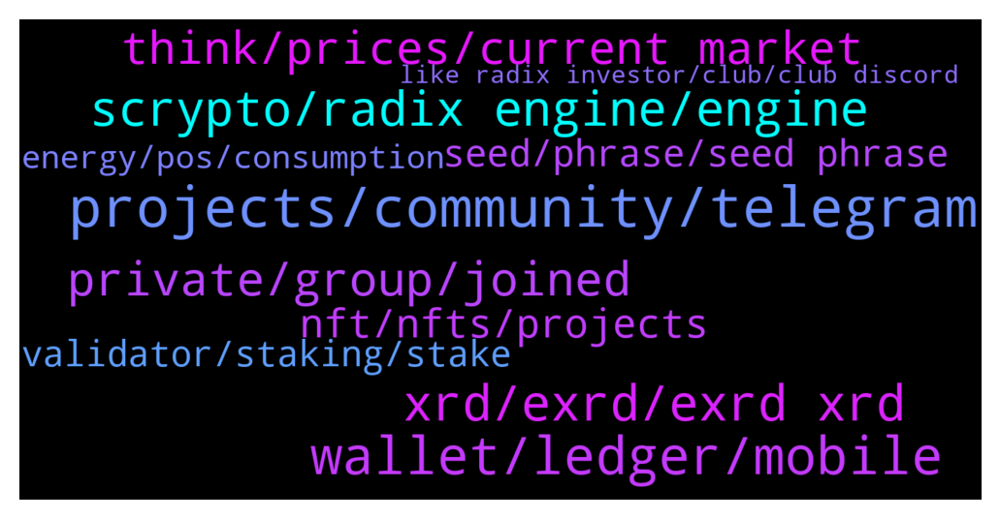

# **@radix_dlt**
 ## Analysis for **2022-01-26** - **2022-01-27**.

---

## 📊 **Basic Stats**

**n_messages_sent**: 439

---

---

## 🔝 **Top keywords and related messages**

1. **projects, community, telegram**

    @nonce101 --- *Hi! Is there any plan to create network with EVM based on Radix? Or extend Radix to support EVM?* **--->** [TG Discussion](https://t.me/radix_dlt/346160)

    @K | RadLadsXRD.com --- *RadLads is a collection of 10,000 Radical Lads on the Radix network. Each RadLad has a variety of traits and can have items that express their character.  The RadLads project is currently over 9% sold and our community is growing every day!  Join the RadLad gang:  https://radladsxrd.com https://t.me/radladsxrd https://twitter.com/RadLadsXRD* **--->** [TG Discussion](https://t.me/radix_dlt/345969)

    @Kansuler --- *🔥 Don't miss out on all the cool community projects on Radix! 🔥  Get to know what's being built, and be first to get involved.  Subscribe to Radix List announcement channel  Visit https://www.radixlist.com* **--->** [TG Discussion](https://t.me/radix_dlt/346377)

    @Blind5ight --- *Follow here for the essential Radix updates: https://t.me/RadixAnnouncements* **--->** [TG Discussion](https://t.me/radix_dlt/345948)

    @Velaman1 --- *Hello, does anybody know (besides radixlist) where to look at for more DEFI projects build on Radix? Can not find projects related to derivatives, or sintethics, loans , etc* **--->** [TG Discussion](https://t.me/radix_dlt/346303)

    @bonafideplug --- *If you’re looking for a new project.. I recommend checking us out: Radish. We are releasing some more news in the coming weeks. Stay tuned. Something rad is coming.  All support is appreciated! The development of the community will surely increase with the success of some of these projects.  https://t.me/radishroot* **--->** [TG Discussion](https://t.me/radix_dlt/346430)

2. **wallet, ledger, mobile**

    @Coinhead --- *Awesome! Everyone uses mobile wallet these days. Desktop wallet works fine but makes me feel like I entered a time warp* **--->** [TG Discussion](https://t.me/radix_dlt/346440)

    @Coinhead --- *Did team consider getting included on Trust wallet or Coinbase wallet? It’s an acceptable substitute for a mobile wallet* **--->** [TG Discussion](https://t.me/radix_dlt/346438)

    @Jacob_XRD --- *We have not released a time frame for a mobile wallet. As soon as the information is available we will share.* **--->** [TG Discussion](https://t.me/radix_dlt/346437)

    @chrisijoyah --- *In addition to the web-based platform, we will be offering a mobile app with a built-in wallet that will house our suite of components. We'll keep you posted on this 😁* **--->** [TG Discussion](https://t.me/radix_dlt/346200)

    @DelpinArc --- *In radix, could Someone send us token to our wallet and taking all of our coin in that wallet like in binance?* **--->** [TG Discussion](https://t.me/radix_dlt/346492)

    @Ee09Vee --- *At first glance it looks like an amazing “feature”!  Will there be name service on radix wallets, a ENS equivalent?* **--->** [TG Discussion](https://t.me/radix_dlt/345959)

3. **xrd, exrd, exrd xrd**

    @Lawrence --- *How do we change Exrd to XRD* **--->** [TG Discussion](https://t.me/radix_dlt/345834)

    @Jacob_XRD --- *Exrd and XRD are both legit, but serve different purposes. See below.   /2tokens* **--->** [TG Discussion](https://t.me/radix_dlt/346023)

    @Spider-man --- *So how does buying XRD on bitfinex work. First depositing for example BTC/XRP from another exchange, then with that BTC/XRP you can directly buy XRD on Bitfinex?* **--->** [TG Discussion](https://t.me/radix_dlt/345952)

    @scryptozilla --- *Hello everyone. Is there any deadline to swap the old tokens for the new ones? Exrd to xrd. Got some on an exchange but due to some personal reasons, I was not able to do the swap and can't find anything on the website. Many thanks in advance for your help.* **--->** [TG Discussion](https://t.me/radix_dlt/345917)

    @Chammi --- *What is the total supply of XRD* **--->** [TG Discussion](https://t.me/radix_dlt/346041)

    @I_Love_Puppies67 --- *Are xrd and exrd the same? Just one is attached to the ethereum network?* **--->** [TG Discussion](https://t.me/radix_dlt/346042)

4. **scrypto, radix engine, engine**

    @José Ramón --- *@Adam_XRD are there any plans on how to get developers to use Scrypto, other than @piersr repeating the same things over and over again on different sub-5k-suscribers yt channels?* **--->** [TG Discussion](https://t.me/radix_dlt/345977)

    @fpieper --- *Scrypto is easy and fast to learn and greatly reduces the risk for hacks and exploits. It is Radix's unfair advantage* **--->** [TG Discussion](https://t.me/radix_dlt/346168)

    @nonce101 --- *I’m exploring ecosystem. I know about Scrypto and it’s nice for new projects. But there are a lot of old projects written in Solidity and it’s expensive to rewrite them to Scypto. That’s the reason why I asked about network with EVM* **--->** [TG Discussion](https://t.me/radix_dlt/346172)

    @Jazzer9F --- *The third instalment in the blog series focusing on our new programming language, Scrypto, is now live on the blog!  https://www.radixdlt.com/post/scrypto-an-asset-oriented-smart-contract-language* **--->** [TG Discussion](https://t.me/radix_dlt/346229)

    @Cpt_Charles --- *@Adam_XRD @clement_xrd have you seen this thing by NEAR? https://www.near.university/  I found it through this Twitter ad. They target devs by offering courses and handing out certificates. There's also a live count of 'students', which would be great to monitor the marketing results.  It might be a little early, considering the age, but I think it would be dope to have this for Scrypto, or is this quite similar to the Radix Developer Program?* **--->** [TG Discussion](https://t.me/radix_dlt/346067)

    @happyDog44647 --- *As far as I know scrypto is not on github right?* **--->** [TG Discussion](https://t.me/radix_dlt/346170)

5. **private, group, joined**

    @Face000 --- *But i see nothing exept private group* **--->** [TG Discussion](https://t.me/radix_dlt/346485)

    @Cpt_Charles --- *Did u try get in /trader channel again? You were not on the banlist* **--->** [TG Discussion](https://t.me/radix_dlt/346467)

    @Cpt_Charles --- *@ALFRED_DULAIRE could u check if he’s on the ban list of the trader group? He cant get in* **--->** [TG Discussion](https://t.me/radix_dlt/346364)

    @Straydawg333 --- *It meant to be Vitalik 😊* **--->** [TG Discussion](https://t.me/radix_dlt/345887)

    @Cpt_Charles --- *Now you show it off wherever you can, because you own it and it’s unique 😇* **--->** [TG Discussion](https://t.me/radix_dlt/346339)

    @Face000 --- *The wipe me out every time* **--->** [TG Discussion](https://t.me/radix_dlt/346480)

6. **think, prices, current market**

    @ITProfligate --- *There is a discusion about this that starts here:- https://t.me/radix_dlt/121458* **--->** [TG Discussion](https://t.me/radix_dlt/346380)

    @chrisijoyah --- *We must look beyond this if we are ever to achieve mass adoption.* **--->** [TG Discussion](https://t.me/radix_dlt/346340)

    @Tom --- *Oh ok, I thought you wanted to develop and manufacture this internally.* **--->** [TG Discussion](https://t.me/radix_dlt/346213)

    @aus87 --- *i suppose more exposure to more people is what hes getting at* **--->** [TG Discussion](https://t.me/radix_dlt/345855)

    @biffothebear --- *With a long term view, absolutely. I invested last year and won't really take prices seriously until 2023 when it's 100% launched.* **--->** [TG Discussion](https://t.me/radix_dlt/346265)

    @aus87 --- *I agree, especially in current market I am unsure of the effect it will have.  It will benefit me personally though to have more options.* **--->** [TG Discussion](https://t.me/radix_dlt/345892)

7. **nft, nfts, projects**

    @Blind5ight --- *Not too long ago, a popular question was: "Will NFTs be possible on Radix" 😂* **--->** [TG Discussion](https://t.me/radix_dlt/346399)

    @Zloliver --- *This is what I'm starting to be worried about :D. Seems like lately it's just low-effort NFT projects launching on Radix :D.* **--->** [TG Discussion](https://t.me/radix_dlt/346304)

    @doeboymagic --- *Much appreciated. Very curious about the dapps and projects like oci and NFTs. Is there a single resource where one could go to keep tabs on everything?* **--->** [TG Discussion](https://t.me/radix_dlt/345841)

    @hanisome --- *Hey guys! RADISH has announced they will be releasing their first NFT tease tomorrow, Friday a 1PM Eastern Time.  We encourage everyone to come show support either on Twitter (@Radish_Root) or on Telegram! We will also hold a giveaway with some interesting prizes.   We appreciate the community and are eager to show you guys the work we put in, in the background.   https://t.me/radishroot* **--->** [TG Discussion](https://t.me/radix_dlt/346573)

    @chrisijoyah --- *What do you think is the next step after NFTs? So I’ve just purchased myself a pricey NFT, now what?* **--->** [TG Discussion](https://t.me/radix_dlt/346336)

    @LukeLehepuu --- *There's lots of NFT and project announcements going on, throwing ours into the arena:  Raduel - A soon to be Radix hosted arcade and metaverse! We are working on games like multiplayer snake for the arcade (demo available), and a 2D world where you are able to login and roam with your nft pets!  We have a giveaway going on for the NFT "Ember" that will be redeemed in the arcade and metaverse.  Telegram: https://t.me/Raduel Website: https://raduel.com Twitter: https://twitter.com/Raduel_ NFT "Ember": https://raduel.com/ember* **--->** [TG Discussion](https://t.me/radix_dlt/346272)

8. **seed, phrase, seed phrase**

    @Tamás --- *This is out of my knowledge, the Team can answer this. Probably a new Desktop Wallet will fix this, I guess* **--->** [TG Discussion](https://t.me/radix_dlt/346556)

    @Jacob_XRD --- *Can retry typing in the seed? Checking spelling and order of the words.* **--->** [TG Discussion](https://t.me/radix_dlt/346035)

    @giskard_rich --- *So it is basically hanging on ‘I’ve done in’ button when filling out the seed phrase* **--->** [TG Discussion](https://t.me/radix_dlt/346032)

    @luke55 --- *just wait a bit and this message will change* **--->** [TG Discussion](https://t.me/radix_dlt/346315)

    @giskard_rich --- *Is there an ETA on the new wallet? I tried to do an install of the current on a second PC, but can’t get past the seed phrase re-entry. Guessing this is due to the ongoing archive node issues…* **--->** [TG Discussion](https://t.me/radix_dlt/346019)

    @Shang En --- *After all it just worked so just wait for the update:)* **--->** [TG Discussion](https://t.me/radix_dlt/346563)

9. **validator, staking, stake**

    @Tamás --- *Sometimes it gives you back a warning, even though the staking process was succesful. I think there is nothing to worry about.* **--->** [TG Discussion](https://t.me/radix_dlt/346521)

    @SuperBabyDonut --- *Maybe check the history? If the staking process went through, it shows in history* **--->** [TG Discussion](https://t.me/radix_dlt/346522)

    @jelthebest --- *I have a question, for staking. On the Florian Pieper Stakint it says 1.80% of radix is staked there. But it says not active top 100? How is this possible?  Same goes for ocinode and  radix.plus?* **--->** [TG Discussion](https://t.me/radix_dlt/346308)

    @Shang En --- *How can I know the apy of my staking validator? I know it’s around 10%~12% but how can I check the exact number of my staking validator?* **--->** [TG Discussion](https://t.me/radix_dlt/346579)

    @Avaunt --- *There is a calculator on the Delegators tab at Radixdashboard.com. You just need to enter your stake and the fee.* **--->** [TG Discussion](https://t.me/radix_dlt/346583)

    @Shang En --- *i check the history and it shows stake so i think it's fine* **--->** [TG Discussion](https://t.me/radix_dlt/346550)

10. **energy, pos, consumption**

    @fpieper --- *The problem with Bitcoin's energy consumption is that it is currently using 100-150 terawatt hours per year.  That's roughly 12 gigawatt = 12,000,000 kilowatt continuously  ...  Nobody cares (or should care) whether your PoS network is using 1, 5 or 100 kilowatt 🤷‍♂️. It simply doesn't matter on a global scale.  (of course it is better to optimze as far as possible, but it shouldn't be your primary goal and is purely a marketing flex)  Peope need to take this into perspective. If your network is consuming 3kW and there are 30 developers, these developers consume 10 times the energy compared to their network ^^.* **--->** [TG Discussion](https://t.me/radix_dlt/346148)

    @fpieper --- *Not necessarily in the same magnitude per TX, also depends on whether one node can process 10 TPS or 1000 TPS.  But overall many magnitudes below PoW with a lot of hash power.  Tezos is proof of stake (not proof of work), but they are a quite slow unsharded network-* **--->** [TG Discussion](https://t.me/radix_dlt/346128)

    @Adam_XRD --- *Yeah, the Hedera one really seems odd (and Tezos to some extent).   I am in no way an expert, but from my limited understanding of PoS energy use I would expect most decentralized PoS networks to at least be a in a similar order of magnitude of energy use per Tx* **--->** [TG Discussion](https://t.me/radix_dlt/346121)

    @fpieper --- *The less nodes you have the less "Global kW" you have in that table ^^* **--->** [TG Discussion](https://t.me/radix_dlt/346116)

    @Blind5ight --- *Shouldn't comparisons be made down to one node and its energy consumption?* **--->** [TG Discussion](https://t.me/radix_dlt/346117)

    @fpieper --- *Something seems not right here. After ETH has migrated to PoS it may still be less efficient.  But this doesn't justify a multiple magnitude difference. Times 1000 - 10000* **--->** [TG Discussion](https://t.me/radix_dlt/346113)

