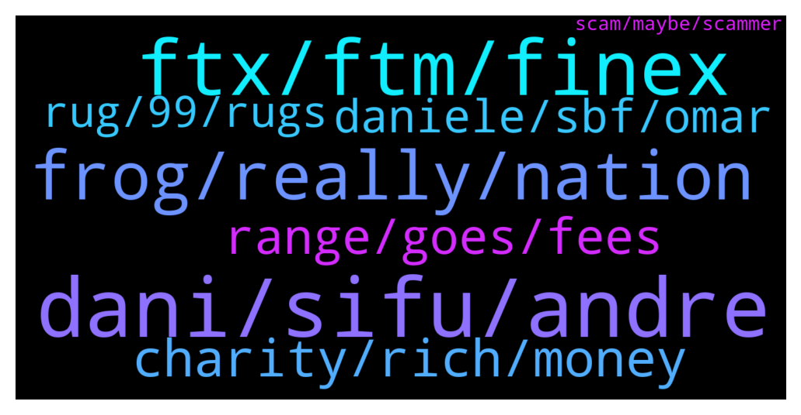

# **@shitpool**
 ## Analysis for **2022-01-26** - **2022-01-27**.

---

## 📊 **Basic Stats**

**n_messages_sent**: 351

---

---

## 🔝 **Top keywords and related messages**

1. **dani, sifu, andre**

    @MoneroPal --- *He said that Sifu should not be apart of the treasury and says he still supports Dani. Andre is likely another BitFinex lacky* **--->** [TG Discussion](https://t.me/shitpool/720555)

    @pizza_dog --- *What’s really suspicious is that Dani the “cso” went private on Twitter just before today* **--->** [TG Discussion](https://t.me/shitpool/719965)

    @pizza_dog --- *There's this thing from a while ago that's basically describing what "Sifu" proposed like a day ago with the abra merger* **--->** [TG Discussion](https://t.me/shitpool/720380)

    @sumtemm --- *you guy see dani gg today* **--->** [TG Discussion](https://t.me/shitpool/720481)

    @MoneroPal --- *I was referring to Dani and Sifu not you* **--->** [TG Discussion](https://t.me/shitpool/720058)

    @pizza_dog --- *since Andre is associated with dani* **--->** [TG Discussion](https://t.me/shitpool/720419)

2. **ftx, ftm, finex**

    @da0man --- *in terms of technical side of things, finex is way ahead* **--->** [TG Discussion](https://t.me/shitpool/720351)

    @da0man --- *the iPhone was a revolutionary product. FTX wasn't unique* **--->** [TG Discussion](https://t.me/shitpool/720359)

    @wojackdegreate --- *Ftx is pretty unique on how they handle collateral for leverage though* **--->** [TG Discussion](https://t.me/shitpool/720361)

    @da0man --- *besides, he had billions under his management before FTX. somehow as a person almost fresh out of college* **--->** [TG Discussion](https://t.me/shitpool/720331)

    @da0man --- *ftx is not an invention at all* **--->** [TG Discussion](https://t.me/shitpool/720330)

    @brendanplayford --- *yes much better - not enough derivatives, though* **--->** [TG Discussion](https://t.me/shitpool/720355)

3. **frog, really, nation**

    @MoneroPal --- *The guy is to be respected for this, he really hit a lick, I love it* **--->** [TG Discussion](https://t.me/shitpool/720052)

    @pizza_dog --- *this one is pretty goofy but https://twitter.com/AndreCronjeTech/status/1476546875557883910?s=20* **--->** [TG Discussion](https://t.me/shitpool/720382)

    @michael_ssss --- *What you know you can't explain, but you feel it. You've felt it your entire life, that there's something wrong with the world. You don't know what it is, but it's there, like a splinter in your mind, driving you mad.* **--->** [TG Discussion](https://t.me/shitpool/720696)

    @MoneroPal --- *but not really, most of the frog clowns were hyper focused on his ecosystme* **--->** [TG Discussion](https://t.me/shitpool/720646)

    @BubblesTU --- *its rule of the thumb really* **--->** [TG Discussion](https://t.me/shitpool/720593)

    @violetevergarden3 --- *not to mention but its real.* **--->** [TG Discussion](https://t.me/shitpool/720592)

4. **charity, rich, money**

    @nnxwat --- *“I wanted to get rich, not because I like money, but because i wanted to give it all to charity” 😂* **--->** [TG Discussion](https://t.me/shitpool/720296)

    @goldencatpat --- *ya i mean he dont have to give shit away* **--->** [TG Discussion](https://t.me/shitpool/720320)

    @da0man --- *and then he spawns scam shitcoins like STEP and takes everyone's money, even some poor guy from India* **--->** [TG Discussion](https://t.me/shitpool/720297)

    @da0man --- *yes, he should stop this “Effective altruism” bullshit tho* **--->** [TG Discussion](https://t.me/shitpool/720517)

    @da0man --- *not to mention that he is not some robin hood taking from the rich, in many cases some of the sam coin buyers needed the charity themselves lol* **--->** [TG Discussion](https://t.me/shitpool/720520)

    @nnxwat --- *His $5m donation to Biden campaign was charity certainly* **--->** [TG Discussion](https://t.me/shitpool/720303)

5. **range, goes, fees**

    @<UNK> --- *Do we sell everything and get out in this pump and buy back when btc is between $6k-$15k in 2023?* **--->** [TG Discussion](https://t.me/shitpool/719911)

    @wanker007 --- *Cut or uncut? 12% premium for uncut* **--->** [TG Discussion](https://t.me/shitpool/720596)

    @┻┳Pipis┳┻ --- *+20% of these fees goes to ice holders* **--->** [TG Discussion](https://t.me/shitpool/720473)

    @┻┳Pipis┳┻ --- *Tight range that goes out of range and making people loose a lot of money due to IL, that much that fees don’t cover the losses* **--->** [TG Discussion](https://t.me/shitpool/720472)

    @gonubie --- *Time spell ice sushi all done for, where will all that money go from ppl urgently selling rn* **--->** [TG Discussion](https://t.me/shitpool/720408)

    @wojackdegreate --- *Use case comes when price goes to electricity cost* **--->** [TG Discussion](https://t.me/shitpool/719912)

6. **daniele, sbf, omar**

    @da0man --- *Daniele is a crook anyone who thinks otherwise is naive* **--->** [TG Discussion](https://t.me/shitpool/720485)

    @da0man --- *I talk about all crooks that pretend they are good guys. That includes among others sbf, Daniele and larimer* **--->** [TG Discussion](https://t.me/shitpool/720492)

    @MoneroPal --- *Wow the clowns are voting to keep sesta as treasury manager* **--->** [TG Discussion](https://t.me/shitpool/720675)

    @MoneroPal --- *Andrew Cronje is a fucking clown* **--->** [TG Discussion](https://t.me/shitpool/720603)

    @da0man --- *Another cringe like Daniele but he doesn’t even run the show I bet unlike Daniele* **--->** [TG Discussion](https://t.me/shitpool/720287)

    @BeAMightyKing --- *I have always been incredibly envious of the Duke Nukem voice actor* **--->** [TG Discussion](https://t.me/shitpool/720103)

7. **rug, 99, rugs**

    @gr1mst0n1 --- *Doubt it's a rug, it's been around for a while now, ruggers don't usually.have that much patience 😂* **--->** [TG Discussion](https://t.me/shitpool/720669)

    @notdao --- *i am excited that DCG is very excited about RAILGUN   https://www.coindesk.com/business/2022/01/26/railgun-aims-for-private-defi-with-10m-backing-from-dcg/* **--->** [TG Discussion](https://t.me/shitpool/720095)

    @gr1mst0n1 --- *Look at how long it took them to rug TIME* **--->** [TG Discussion](https://t.me/shitpool/720670)

    @yesbutalsono --- *expect more rugs as the market tumbles* **--->** [TG Discussion](https://t.me/shitpool/720668)

    @MoneroPal --- *Sounds idiotic and it’s a rug, 99.99% sure* **--->** [TG Discussion](https://t.me/shitpool/720662)

    @pizza_dog --- *looks like this rug is getting out of control* **--->** [TG Discussion](https://t.me/shitpool/720416)

