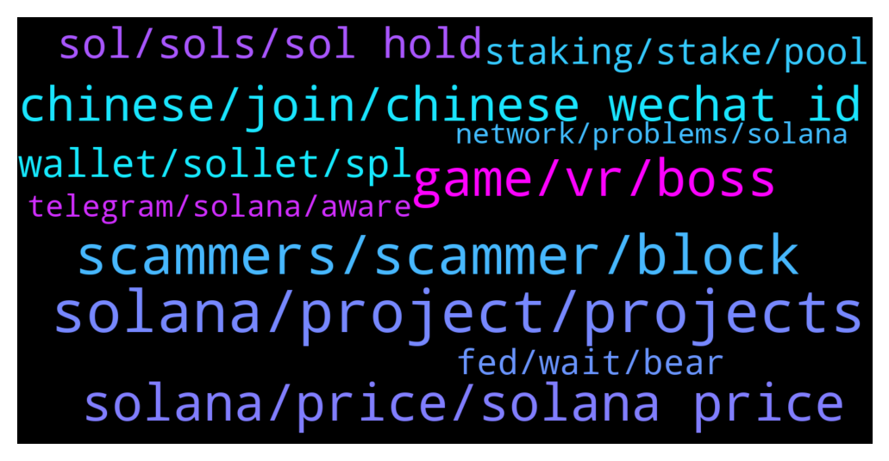

# **@solana**
 ## Analysis for **2022-01-26** - **2022-01-27**.

---

## 📊 **Basic Stats**

**n_messages_sent**: 542

---

---

## 🔝 **Top keywords and related messages**

1. **solana, project, projects**

    @Sevith --- *Anyone familiar with web3 & solana dev? plz dm me ?* **--->** [TG Discussion](https://t.me/solana/921110)

    @aiLikeSpider --- *Who's solana smart contract developer?  Could you help me, please?* **--->** [TG Discussion](https://t.me/solana/918869)

    @갠디 --- *What's the project? So I can look it up* **--->** [TG Discussion](https://t.me/solana/920629)

    @갠디 --- *Oh like what tho? Is it on Solana* **--->** [TG Discussion](https://t.me/solana/920627)

    @EMX0_0 --- *I am looking a reliable source to download some data on Solana: Things like Transaction per second, Daily transactions, number of active addresses per day, and so on.. On-chain data mainly. Any suggestion? Thank you in advance* **--->** [TG Discussion](https://t.me/solana/920228)

    @TuubaLord --- *does anyone have some good article about the ddos attacks on solana blockchain* **--->** [TG Discussion](https://t.me/solana/919582)

2. **scammers, scammer, block**

    @IYIEOW --- *So many Sol scammer admins.. lol* **--->** [TG Discussion](https://t.me/solana/918987)

    @jay --- *Damn Anatoly yakovenko just dmed me. Wen Elon musk, wen cz* **--->** [TG Discussion](https://t.me/solana/920473)

    @DeVoCrypto --- *Two scammer already pm me.... Hahaaa... I block them already* **--->** [TG Discussion](https://t.me/solana/918753)

    @Ruud --- *here also lot of scammers with fake rahul admin name* **--->** [TG Discussion](https://t.me/solana/918781)

    @Lossisloss --- *Take love admin and many scammer inbox me 😬* **--->** [TG Discussion](https://t.me/solana/918921)

    @Monterrey_Rice --- *For real! We will never DM your first* **--->** [TG Discussion](https://t.me/solana/918997)

3. **game, vr, boss**

    @Amanda --- *So many p2e platforms this year. Whats on your toplist?* **--->** [TG Discussion](https://t.me/solana/919309)

    @Amanda --- *Its an upcoming game on Solana. VR player take the place of the Boss fighting against a team of PC players. You can check their site if u want 😉* **--->** [TG Discussion](https://t.me/solana/920538)

    @CryptoAnnee --- *oh coool! I am also following some games on solana blockchain, but eyeing this vr vs pc game.* **--->** [TG Discussion](https://t.me/solana/919661)

    @Phoebe --- *It is. I look forward to fighting the boss mate. Good gameplay too they got there. What I know so far is they’ll be on Solana blockchain and they’ll have their IDO launch soon.* **--->** [TG Discussion](https://t.me/solana/919678)

    @A --- *me bro! acutally this is quite unique one they have this kind of game wherein you can be VR boss or PC fighters haha* **--->** [TG Discussion](https://t.me/solana/920135)

    @A --- *well it's a 1 Boss VR vs 5 PC fighters wherein you will fight inside arena and win rewards that are stored and tradable to marketplace haha* **--->** [TG Discussion](https://t.me/solana/920141)

4. **solana, price, solana price**

    @Meta --- *Hey guys anyone knew about this new proj in $SOL?* **--->** [TG Discussion](https://t.me/solana/920134)

    @Javier --- *But solana is falling even more, like in the long run* **--->** [TG Discussion](https://t.me/solana/918716)

    @stsc620620 --- *Seem people are losing confidence in Solana now* **--->** [TG Discussion](https://t.me/solana/921020)

    @Mihai --- *Do you think that solana will soon grow above 110?* **--->** [TG Discussion](https://t.me/solana/920437)

    @nofearnickishere --- *People talking about 20 or 30$ SOL are idiots or don’t believe in Solana for whateer reason…* **--->** [TG Discussion](https://t.me/solana/920160)

    @Z --- *Last night i bought two solanas . For 144aud dollar .. and now dip 😔* **--->** [TG Discussion](https://t.me/solana/920660)

5. **chinese, join, chinese wechat id**

    @mahib45 --- *Hello 👋  You may check out https://solanabeach.io/* **--->** [TG Discussion](https://t.me/solana/920230)

    @Monterrey_Rice --- *This might be a question for the Diacord!   https://discord.gg/solana* **--->** [TG Discussion](https://t.me/solana/919004)

    @갠디 --- *Yeah see you around when I finally join the community chat. Let's see 😉👌🏼 Thanks!* **--->** [TG Discussion](https://t.me/solana/920635)

    @c9addy --- *I just wanna learn for now* **--->** [TG Discussion](https://t.me/solana/919844)

    @mahib45 --- *🌐 INTERNATIONAL GROUPS  🇸🇦🇵🇸 Arabic: @SolanaArabic 🇦🇺 Australian : @SolanaAustralia 🇧🇩 Bangladesh: @SolanaBangladesh 🇧🇷 Brazil: @SolanaBrasil 🇨🇳 Chinese: @SolanaCHN 🇨🇳 https://weibo.com/SolanaNews 🇨🇳 Chinese WeChat ID: Solana_SOLdier 🇫🇷 France https://discord.gg/5KPMCCgau6 🇮🇳 Indian: @SolanaIndia 🇮🇩 Indonesian: @SolanaIndonesian 🇯🇵 Japanese: @SolanaJapan 🇰🇷 Korean: @SolanaKor 🇵🇰 Pakistan: @SolanaPakistan 🇵🇭 Philippines: @SolanaFilipino 🇷🇺 Russian: @SolanaRus 🇹🇭 Thailand: @Solanathaicommunity 🇹🇷 Turkish: @SolanaTurkish 🇪🇸 Spanish: @SolanaSpanish 🇻🇳 Vietnamese: @SolanaVietnam* **--->** [TG Discussion](https://t.me/solana/921108)

    @mahib45 --- *Please join 🇨🇳 Chinese: @SolanaCHN 🇨🇳 https://weibo.com/SolanaNews 🇨🇳 Chinese WeChat ID: Solana_SOLdier* **--->** [TG Discussion](https://t.me/solana/918942)

6. **sol, sols, sol hold**

    @alessx1 --- *10 sols in 10 years makes you to a millionaire* **--->** [TG Discussion](https://t.me/solana/920755)

    @Pawan --- *It's been up. Why can't you see the market fluctuations which are the outcome of SOL working!* **--->** [TG Discussion](https://t.me/solana/920358)

    @DEAD --- *Yes i'm only waiting until tomorrow for todays fed decision it will cause volatility, then if sol reaches at least 115 i'm buying, if not i ll wait a lil longer* **--->** [TG Discussion](https://t.me/solana/919741)

    @Drokzid --- *will the required amount of SOL needed to run my own node decrease by time?* **--->** [TG Discussion](https://t.me/solana/919496)

    @sunny16ny --- *Sol price is going down 😭😭* **--->** [TG Discussion](https://t.me/solana/918760)

    @Unclepennybag --- *How do you guys see the SOL doing* **--->** [TG Discussion](https://t.me/solana/918785)

7. **wallet, sollet, spl**

    @Folaross --- *List of DEXs and connect your wallet with any DEX of your choice. Click the link below - https://t.me/solana/481292   Please note that our admins won't DM you first* **--->** [TG Discussion](https://t.me/solana/919339)

    @Folaross --- *Hey, try Slope wallet, Math or Coin98 wallet.* **--->** [TG Discussion](https://t.me/solana/919310)

    @Kotim2627 --- *how to create a sollet account and link it to trust wallet to buy spl cryptocurrencies?* **--->** [TG Discussion](https://t.me/solana/919332)

    @mahib45 --- *Bridge   ❇️ Option 1 : Sollet wallet  Sollet allows you to convert ERC20 to SPL and vice versa using your MetaMask Wallet.  You can deposit ERC20 tokens and convert them to SPL tokens using the convert function of Sollet.io and Metamask (to learn how to convert ERC20 to SPL.  🔗 https://www.sollet.io  How to use: https://solpadfinance.medium.com/convert-usdt-from-erc-20-blockchain-to-solana-blockchain-4871780493af  Telegram : https://t.me/ProjectSerum  ❇️ Option 2: FTX exchange  You can use FTX to deposit tokens (ERC20, XRP, BTC etc) and withdraw from FTX to Sollet.io. FTX will automatically wrap your crypto in an SPL token to be used with the Serum DEX. Please note that to convert wrapped SPL assets back into their native chain, you can deposit into FTX and withdraw the unwrapped assets.  🔗 https://ftx.com  Telegram: https://t.me/FTX_Official  ❇️ Option 3: Wormhole  🔗 www.wormholebridge.com  🔗 https://github.com/certusone/wormhole  Telegram: https://t.me/wormholecrypto  ❇️ Option 4: Allbridge  🔗 https://app.solbridge.io/bridge  Telegram: https://t.me/allbridge_official* **--->** [TG Discussion](https://t.me/solana/920146)

    @mahib45 --- *List of wallets where SOL is supported.  You can store your Sol tokens in any wallet of your preference below. Make sure you save your Private key or phrase words in a safe place. And don't share your private key or phrase words with anyone.  🖥 Desktop Wallets ▪️ Solflare   • https://www.solflare.com/access-wallet?hardware  Solflare wallet guide using Nano S and X - https://docs.solana.com/wallet-guide/solflare  ▪️phantom wallet  https://phantom.app/download  ▪️Solong chrome extension - https://chrome.google.com/webstore/detail/solong/memijejgibaodndkimcclfapfladdchj  ▪️ Ledger Live   • Ledger Nano S and X      Guide - https://docs.solana.com/wallet-guide/ledger-live  https://support.ledger.com/hc/en-us/articles/360016265659/  ▪️Math wallet    • Chrome extension - https://mathwallet.org/en-us/      🌐 Web Wallets ▪️Solflare    • https://www.solflare.com/create-wallet  ▪️Sollet    • https://www.sollet.io/    ▪️Sollet extension wallet  •https://chrome.google.com/webstore/detail/sollet/fhmfendgdocmcbmfikdcogofphimnkno?hl=en  ▪️Math wallet    • Web Wallet - https://mathwallet.org/en-us/   📱Mobile Wallets ▪️Trust wallet    • Download Trust Wallet app for iOS or Android app and create or import your wallet with multi-coin wallet and press add + button and search for SOL then switch on - https://trustwallet.com/  ▪️Math wallet    • Download Mathwallet app for iOS or Android app - https://mathwallet.org/en-us/  ▪️Coin98 wallet    • Android       https://play.google.com/store/apps/details?id=coin98.crypto.finance.media  • iPhone    https://apps.apple.com/vn/app/coin98-crypto-super-app/id1483029574    https://coin98.net/  ▪️SwipeWallet    • Android       https://play.google.com/store/apps/details?id=com.swipe.wallet     • iPhone          https://apps.apple.com/app/swipe-wallet/id1476726454    https://swipe.io/  https://moonlet.io/  ▪️Exodus  iPhone: https://apps.apple.com/app/apple-store/id1414384820?pt=118366236&ct=download&mt=8  Android: https://play.google.com/store/apps/details?id=exodusmovement.exodus  ▪️Slope Finance slope.finance  iOS: https://apps.apple.com/us/app/slope-wallet/id1574624530  Android: https://play.google.com/store/apps/details?id=com.wd.wallet  Note: Sollet wallet is supporting Erc20 <-> SPL conversion. And Coin98 wallet is supporting Sol and SPL tokens.* **--->** [TG Discussion](https://t.me/solana/919869)

    @mahib45 --- *○ There are ten 🔟 options to stake your SOL token ! 📒 https://docs.solana.com/staking 1️⃣ Phantom App  https://phantom.app/blog/solana-staking-in-just-3-clicks Tutorial: https://twitter.com/stakefish/status/1428924822424363015   2️⃣ SOLFLARE  》Stake SOL token on solflare without ledger:   🎦 Video guide : https://www.youtube.com/watch?v=5Tf0os-JRcs  📝 Article guide: https://medium.com/@stakingfac/how-to-stake-on-solana-with-solflare-a-keystore-file-9f7cd5fba169  Staking SOL with Solflare Crypto-Wallet” by Víctor | melea:  https://link.medium.com/q872cfJqLab  》 Stake SOL token using solflare and ledger Nano S:  🎦 Video guide: https://www.youtube.com/watch?v=EAWJ12Y4v_M  📝 Article guide : https://medium.com/@stakingfac/how-to-stake-on-solana-with-solflare-a-ledger-nano-s-bdcc90d769c7  Website: https://solflare.com Telegram: @SolFlare_Wallet  ➖➖➖➖➖➖➖➖➖➖➖➖➖➖➖➖➖➖➖➖➖  3️⃣ ON LEDGER  》Stake SOL token using Command Line Interface (CLI) and Ledger Nano S  🎦 Video Guide : https://youtu.be/jg2WQcfAXHo  📝 Article Guide: (On ledger Nano X & S) https://link.medium.com/duLh90X9pab  📋https://docs.solana.com/cli/delegate-stake  📖  More tutorials are available :   https://stake2earn.com/how-to-stake-solana-with-ledger-nano-x.html   https://stake2earn.com/how-to-stake-solana-with-keystore-file.html ➖➖➖➖➖➖➖➖➖➖➖➖➖➖➖  4️⃣ Moonlet  https://bit.ly/2MV4muZ  5️⃣  FTX http://ftx.com/staking  6️⃣ Binance  https://www.binance.com/en/support/announcement/a5c507485f7843d8b3a3800fee3c1f84  7️⃣ Exodus https://www.exodus.com/blog/how-to-stake-solana-on-exodus/  8️⃣ Atomic wallet  https://atomicwallet.io/solana-staking 9️⃣ Kraken  https://www.kraken.com/u/funding/staking  🔟 OKex  https://www.okex.com/earn/announce* **--->** [TG Discussion](https://t.me/solana/920231)

8. **staking, stake, pool**

    @Aleksandar --- *Admin. How and where can i stake SOL?* **--->** [TG Discussion](https://t.me/solana/920850)

    @Comprab --- *how can i stake my sol WHITOOUT RISK? thanks* **--->** [TG Discussion](https://t.me/solana/920019)

    @Yu --- *After I ask about staking some one call me to assist me🤣🤣🤣🤣* **--->** [TG Discussion](https://t.me/solana/919386)

    @tybit_ust --- *new here, where can i stake my SOL?* **--->** [TG Discussion](https://t.me/solana/920218)

    @CyberSuYang --- *If I stake in Miranda after every block I get 6% of what I stake or I get actually only once 6% In year 🤷🏻‍♂️* **--->** [TG Discussion](https://t.me/solana/920983)

    @cryptolover1987 --- *Please read this article to know everything about Solana staking system  📎https://solana.com/staking  👇🏻Check this out for APY👇🏻  1️⃣ Solana validators list 📎 https://solanabeach.io/validators  2️⃣ Staking reward(%) 📎 https://www.stakingrewards.com/earn/solana/providers?sort=balance_DESC  3️⃣ Solana validators performance ranking 📎 https://stakeview.app/* **--->** [TG Discussion](https://t.me/solana/919380)

9. **fed, wait, bear**

    @CJsatz --- *The FOMC decision is due at 2 p.m. ET on Wednesday, followed by Powell’s press conference at 2:30 p.m. ET.* **--->** [TG Discussion](https://t.me/solana/919452)

    @ogz91 --- *Its when the decision of the Fed ? What date ?* **--->** [TG Discussion](https://t.me/solana/919448)

    @k_ibiza --- *guys any ide when all this bear market will be over* **--->** [TG Discussion](https://t.me/solana/921072)

    @Rasolk67 --- *Your opinion about the Fedel Reservation meeting* **--->** [TG Discussion](https://t.me/solana/920047)

    @KryptoKuhn --- *The fed don’t do the Zins up 0-0,025* **--->** [TG Discussion](https://t.me/solana/920002)

    @DEAD --- *Depends roughly on the feds today* **--->** [TG Discussion](https://t.me/solana/919750)

10. **telegram, solana, aware**

    @DEAD --- *Yea happens in telegram, some r bots sum r scammers , i recommend to block them of necessary* **--->** [TG Discussion](https://t.me/solana/920913)

    @mahib45 --- *Hello to all the newcomers! 👋    Welcome to Solana official community! As you just entered in #Solana, in case you have a question about what is #Solana?  Solana is a fast, secure, and censorship-resistant blockchain providing the open infrastructure required for crypto to scale to global adoption.   To read more about Solana please visit  Website: www.solana.com Document: https://docs.solana.com/introduction  ⚠️ Please be aware of fraudulent actors posing as Solana team members on Telegram. If you do receive suspicious messages, do not respond, click on links or follow any instructions. ✅ We recommend changing your telegram privacy settings to avoid being added to scam groups. ❗️There is no Solana airdrop or free giveaway!* **--->** [TG Discussion](https://t.me/solana/920949)

    @simyaci12 --- *Is there any group on telegram for new tokens of sol ?* **--->** [TG Discussion](https://t.me/solana/920162)

    @mahib45 --- *🚨🚨🚨 Scammer alert 🚨🚨🚨  ⚠️ Please be aware of fraudulent accounts posing as Solana team members on Telegram. If you receive suspicious messages, do not respond to them, click on links or follow any instructions. ⚠️ Please also be aware of "giveaways" promoted by bots, YouTube, in Medium articles or fake Telegram groups. Scammers are very creative, however the standard rule is never send funds to strangers or share your private key. ❗️There is no Solana airdrop or free giveaway! Do not send SOL anywhere with the expectation that you will receive more back.  ✅ We recommend changing your telegram privacy settings to avoid being added to scam groups.* **--->** [TG Discussion](https://t.me/solana/920245)

    @Folaross --- *⚠️ Please be aware of fraudulent actors posing as Solana team members on Telegram. If you do receive suspicious messages, do not respond, click on links or follow any instructions. ⚠️ Please also be aware of giveaways promoted on YouTube, in Medium articles or fake Telegram groups. ❗️There is no Solana airdrop or free giveaway! Do not send SOL anywhere with the expectation that you will receive more back.  ✅ We recommend changing your telegram privacy settings to avoid being added to scam groups.* **--->** [TG Discussion](https://t.me/solana/919392)

    @RealPrinceOla --- *⚠️ Please be aware of fraudulent actors posing as Solana team members on Telegram. If you do receive suspicious messages, do not respond, click on links or follow any instructions. ✅ We recommend changing your telegram privacy settings to avoid being added to scam groups. ❗️There is no Solana airdrop or free giveaway!  ⚠️Admins will never PM you first, if it does, it is most likely a scam. We the real Solana admins will never ask for money or remittances or any kind of seed phrase !!  Please Block 🚫 and report them to @notoscam* **--->** [TG Discussion](https://t.me/solana/919168)

