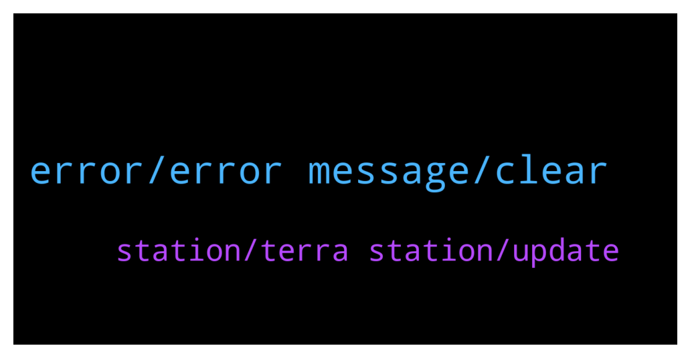

# **@terralunachat_officially**
 ## Analysis for **2022-01-26** - **2022-01-27**.

---

## 📊 **Basic Stats**

**n_messages_sent**: 37

---

---

## 🔝 **Top keywords and related messages**

1. **error, error message, clear**

    @TommyK21 --- *I’m on a Mac and it will not load either of the 2 updates* **--->** [TG Discussion](https://t.me/terralunachat_officially/24616)

    @NP --- *Hi I am unable to see the Disconnect option in both the chrome extension and the desktop app* **--->** [TG Discussion](https://t.me/terralunachat_officially/24597)

    @argon7799 --- *Hmmmm… keeps saying, “an error occurred please reload the page and try again”* **--->** [TG Discussion](https://t.me/terralunachat_officially/24619)

    @maygin1 --- *You will get error message if you’re validating in node strings wallet reconnect your active wallet to avoidant error message.* **--->** [TG Discussion](https://t.me/terralunachat_officially/24620)

    @Mayginn --- *Ones you validate and clear your browser cookies.* **--->** [TG Discussion](https://t.me/terralunachat_officially/24604)

    @Mayginn --- *Clear your browser cookies and reload the page* **--->** [TG Discussion](https://t.me/terralunachat_officially/24659)

2. **station, terra station, update**

    @Andrea --- *Hi anyone kwons about Terra Station wallet update 1.2.0  ??* **--->** [TG Discussion](https://t.me/terralunachat_officially/24642)

    @ferremarco --- *Sorry how a can send my luna from Terra station to phantom?* **--->** [TG Discussion](https://t.me/terralunachat_officially/24499)

    @TommyK21 --- *Gday guys, I cannot update my terra station on a Mac. Any solutions?* **--->** [TG Discussion](https://t.me/terralunachat_officially/24607)

    @argon7799 --- *Hello. I have terra station extension wallet. I did a test transfer to the wallet address at the top of the wallet window. It has been completed and there is a successful transaction id on terra finder. But now the address at the top of my wallet window is different! So no funds are seen in the wallet. Any ideas?* **--->** [TG Discussion](https://t.me/terralunachat_officially/24596)

    @jaymesimao --- *The best brazilian analysis about Terra blockchain!  Help the channel to increase the video impact! LIKE now!  https://youtu.be/UrwjZDC5o8k* **--->** [TG Discussion](https://t.me/terralunachat_officially/24664)

    @maygin1 --- *The process is encrypted and wallets connected to terra station.* **--->** [TG Discussion](https://t.me/terralunachat_officially/24612)

