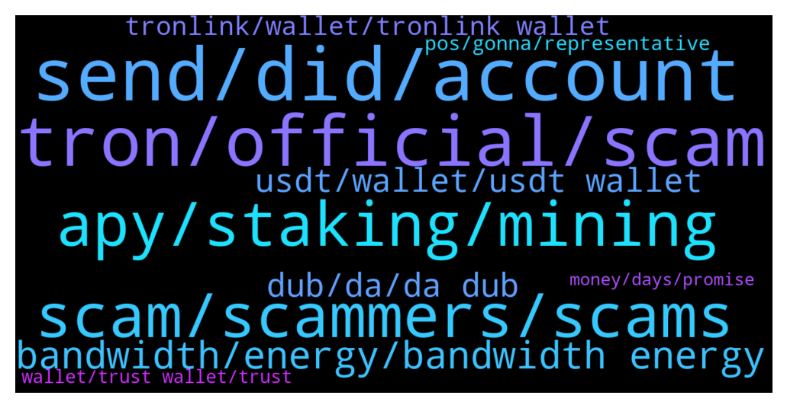

# **@tronnetworkEN**
 ## Analysis for **2022-01-26** - **2022-01-27**.

---

## 📊 **Basic Stats**

**n_messages_sent**: 313

---

---

## 🔝 **Top keywords and related messages**

1. **send, did, account**

    @Dennis --- *I have tried little too but did not go through* **--->** [TG Discussion](https://t.me/tronnetworkEN/3854571)

    @Toheebola2 --- *Good day house I received some tron into my wallet but is showing received but the balance is not appreciating I even try to send to another wallet but is not going through* **--->** [TG Discussion](https://t.me/tronnetworkEN/3856351)

    @agentpiki --- *When you press the buttons below* **--->** [TG Discussion](https://t.me/tronnetworkEN/3856228)

    @FeemiiKhan --- *It show that account is disabled* **--->** [TG Discussion](https://t.me/tronnetworkEN/3856094)

    @PiterSpain --- *Are u sending to TPmjgZoDuPcc2L7v26toKymn3w9qpBKHhH? It's not active* **--->** [TG Discussion](https://t.me/tronnetworkEN/3854652)

    @Dennis --- *I sent again to another address it did not go through* **--->** [TG Discussion](https://t.me/tronnetworkEN/3854664)

2. **tron, official, scam**

    @agentpiki --- *Tron cannot be mined, so miners are scam* **--->** [TG Discussion](https://t.me/tronnetworkEN/3856097)

    @Radesh --- *I find that the Tron guardian n Tron official sites r being used to help people with Tron wallets with issues want seed phrases to help need help to eliminate this con helplines* **--->** [TG Discussion](https://t.me/tronnetworkEN/3855056)

    @Olenagh --- *Up TRX.. tron to the moon 😁😁* **--->** [TG Discussion](https://t.me/tronnetworkEN/3856807)

    @Faithful8080 --- *Pls can anyone explain to me d way to sell tron* **--->** [TG Discussion](https://t.me/tronnetworkEN/3857198)

    @Nasserq888 --- *Where is the best place to stak tron?* **--->** [TG Discussion](https://t.me/tronnetworkEN/3856761)

    @Mikalope --- *buy Tron on a pancake swap?* **--->** [TG Discussion](https://t.me/tronnetworkEN/3857805)

3. **apy, staking, mining**

    @Zer0log --- *Thanks. So i should choose to earn energy next time when staking.* **--->** [TG Discussion](https://t.me/tronnetworkEN/3857448)

    @Cryeth --- *good evening please I would like to know if the 5% return on Tron staking is daily or per year?* **--->** [TG Discussion](https://t.me/tronnetworkEN/3856563)

    @Moneyversac --- *Yes correct, but you can leave it there, vote and get up to 9% per year* **--->** [TG Discussion](https://t.me/tronnetworkEN/3856641)

    @agentpiki --- *Do your own research.  Freezing and voting is by far the best, in my opinion* **--->** [TG Discussion](https://t.me/tronnetworkEN/3856765)

    @Zer0log --- *Freezing is different from staking or it's the same?* **--->** [TG Discussion](https://t.me/tronnetworkEN/3857892)

    @E d i --- *Fed keeps interest rates unchanged for now, stocks surge.* **--->** [TG Discussion](https://t.me/tronnetworkEN/3856399)

4. **scam, scammers, scams**

    @xPommepote --- *Seems a new scam app trend…* **--->** [TG Discussion](https://t.me/tronnetworkEN/3854792)

    @simon866 --- *They keep trying their scams on the daily 🤦‍♂️* **--->** [TG Discussion](https://t.me/tronnetworkEN/3855694)

    @agentpiki --- *Done. Thanks for your valuable suggestion.  We have lots of scammers of different nationals, not just Indians man* **--->** [TG Discussion](https://t.me/tronnetworkEN/3855902)

    @agentpiki --- *Who knows? To scam you guys?  You not doing research and complain here?   As if we know how the scammers are?* **--->** [TG Discussion](https://t.me/tronnetworkEN/3854117)

    @Samsonioc --- *Block this person ...they are spamming here with this* **--->** [TG Discussion](https://t.me/tronnetworkEN/3855891)

    @Urbantime --- *Please tronforyou legit? Because they claim to be doing giveaway* **--->** [TG Discussion](https://t.me/tronnetworkEN/3855739)

5. **bandwidth, energy, bandwidth energy**

    @Zer0log --- *Can i lend my bandwidth and earn interest?* **--->** [TG Discussion](https://t.me/tronnetworkEN/3857420)

    @Zer0log --- *Excuse me if my bandwidth capacity is full will i automatically start earning energy instead?* **--->** [TG Discussion](https://t.me/tronnetworkEN/3857885)

    @agentpiki --- *You can choose to obtain bandwidth and energy and change the wallet address* **--->** [TG Discussion](https://t.me/tronnetworkEN/3857442)

    @Carlos_TRX --- *No, u have some free bandwith daily and if u esnt energy u have to freeze TRX* **--->** [TG Discussion](https://t.me/tronnetworkEN/3857889)

    @Zer0log --- *Isn't better to choose to earn only energy since bandwidth is free?* **--->** [TG Discussion](https://t.me/tronnetworkEN/3857434)

    @Zer0log --- *No it's like 20000 for me without any energy* **--->** [TG Discussion](https://t.me/tronnetworkEN/3857428)

6. **usdt, wallet, usdt wallet**

    @Sum --- *I have  swapping  some  usdt for trx but  is it not working.* **--->** [TG Discussion](https://t.me/tronnetworkEN/3854285)

    @Trooper369 --- *Any problem on the tron chain. My friend send me usdt in my wallet. But not yet received. Why? Any issues on the tron chain?* **--->** [TG Discussion](https://t.me/tronnetworkEN/3855633)

    @Sivakumar_1975 --- *Hello, I hold 51usdt past two days but still not showing usdt in my Wallet....what happened as soon as possible please recover my usdt....* **--->** [TG Discussion](https://t.me/tronnetworkEN/3854654)

    @Mystermike --- *Hello Good afternoon Admin  Please I'm having an issue with a transaction.   I used my usdt TRC 20 network address on my trust wallet for a transaction.  The transaction says confirmed and successful on tronscan but it hasn't reflected yet on my trust wallet   Please what could be the issue* **--->** [TG Discussion](https://t.me/tronnetworkEN/3857519)

    @Mzm0078 --- *Hi my friends   I sent 927 trx to kucoin account but it has not been deposited yet, what is the problem?* **--->** [TG Discussion](https://t.me/tronnetworkEN/3857473)

    @raidateir --- *Hi! Had anyone have an issue creating a tether usdt transfer from within a smart contract? I heavily tested interaction with erc20 on testnet, however getting “tapos check error” when processing similar transaction on mainnet* **--->** [TG Discussion](https://t.me/tronnetworkEN/3856394)

7. **dub, da, da dub**

    @John --- *I should've thanks for reminding me!* **--->** [TG Discussion](https://t.me/tronnetworkEN/3855066)

    @agentpiki --- *Not newbie at all. I asked those questions when I was new also. Totally ok. We welcome those questions, although you should have read articles found within justlend.* **--->** [TG Discussion](https://t.me/tronnetworkEN/3855060)

    @agentpiki --- *Admins and mods will not message you first buddy* **--->** [TG Discussion](https://t.me/tronnetworkEN/3856152)

    @Theking202 --- *Can you send me some bruhh* **--->** [TG Discussion](https://t.me/tronnetworkEN/3855425)

    @simon866 --- *Gonna ask one more time where from then I'm gonna ban you mate* **--->** [TG Discussion](https://t.me/tronnetworkEN/3855627)

    @Lucianoleaors --- *I just to chat with admin. Who's?* **--->** [TG Discussion](https://t.me/tronnetworkEN/3856146)

8. **tronlink, wallet, tronlink wallet**

    @paypaltobtc --- *Best version of TronLink is TronLink cold wallet* **--->** [TG Discussion](https://t.me/tronnetworkEN/3856294)

    @frazgill --- *Why Tronlink wallet have mulware ?* **--->** [TG Discussion](https://t.me/tronnetworkEN/3856973)

    @WoxFi --- *is it possible to list our token on tronlink instant swap* **--->** [TG Discussion](https://t.me/tronnetworkEN/3856310)

    @Zer0log --- *What's the best version of tron link wallet can i trust browser extension?* **--->** [TG Discussion](https://t.me/tronnetworkEN/3856153)

    @afrifaba --- *So why can't I find my TRX in Tron link wallet* **--->** [TG Discussion](https://t.me/tronnetworkEN/3854710)

    @simon866 --- *We do not operate the Tronlink wallet they are a private project so you need to ask them here   https://t.me/TronLink* **--->** [TG Discussion](https://t.me/tronnetworkEN/3855680)

9. **pos, gonna, representative**

    @agentpiki --- *Only if you apply as Super representative.  Trx is given rewards for blocks processed* **--->** [TG Discussion](https://t.me/tronnetworkEN/3856158)

    @Lucianoleaors --- *I just like to know if I can trust miner Trx Capital to receive TRX daily...* **--->** [TG Discussion](https://t.me/tronnetworkEN/3856095)

    @Lucianoleaors --- *So, I saw that TRX can be mined by PoS.* **--->** [TG Discussion](https://t.me/tronnetworkEN/3856154)

    @Toheebola2 --- *Where I get what to do so I can trade my trx* **--->** [TG Discussion](https://t.me/tronnetworkEN/3856363)

    @Mario --- *You can’t just stake TRX Why not abitrade them 🧐* **--->** [TG Discussion](https://t.me/tronnetworkEN/3857387)

    @Mathias --- *Thanks you did everyone Help me with some TRX for a Business* **--->** [TG Discussion](https://t.me/tronnetworkEN/3855283)

10. **wallet, trust wallet, trust**

    @simon866 --- *Best to check with the Trust wallet team here  https://t.me/trustwallet* **--->** [TG Discussion](https://t.me/tronnetworkEN/3857534)

    @MENTOR1880 --- *Was only looking for tron coin wallet, trust wallet requested* **--->** [TG Discussion](https://t.me/tronnetworkEN/3856035)

    @PiterSpain --- *I don't know what's happening...   Probably your wallet may be blacklisted by Tether.... I suggest you to contact them to discard this option.  Sometimes Tether freezes accounts if they suspect that funds are involved in frauds/scams* **--->** [TG Discussion](https://t.me/tronnetworkEN/3854686)

    @DOAN --- *Hello friends ! Please tell me what to do with the BTT in my Trust wallet* **--->** [TG Discussion](https://t.me/tronnetworkEN/3856046)

    @simon866 --- *The issue is with trust wallet, you can ask them here for what's happening with your wallet 👍  https://t.me/trustwallet* **--->** [TG Discussion](https://t.me/tronnetworkEN/3855661)

    @simon866 --- *Shows as confirm and in the wallet* **--->** [TG Discussion](https://t.me/tronnetworkEN/3855657)

