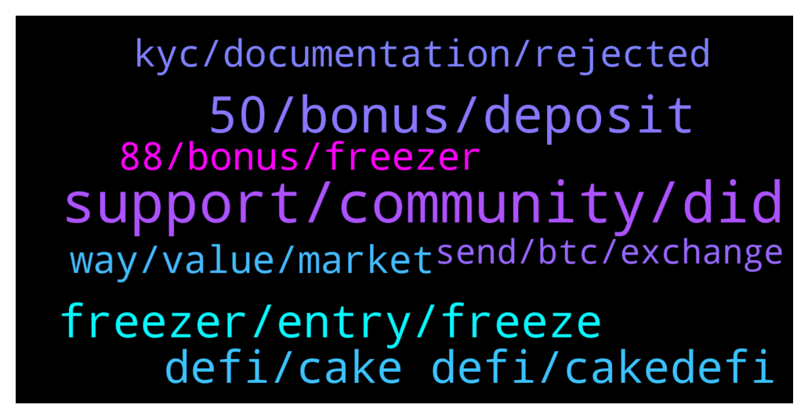

# **@CakeDeFi_EN**
 ## Analysis for **2022-01-27** - **2022-01-28**.

---

## 📊 **Basic Stats**

**n_messages_sent**: 313

---

---

## 🔝 **Top keywords and related messages**

1. **support, community, did**

    @DmgBautista --- *Hi! There is no direct number to call to solve such subjects.   Everything must be solved by our official support. You can find the link below. Please consider that there is no official support in telegram.   Anyone DM you or calling you claiming to be support or a mod, must be immediatelly blocked and reported.  Mods will never DM a user neither call. Any unsolicited DM or call must always be considered a scam attempt!  You can contact support by the below link. Please allow them at least 24h to answer, maybe a bit more on weekends  https://cake.zendesk.com/hc/en-us/requests/new* **--->** [TG Discussion](https://t.me/CakeDeFi_EN/169076)

    @coronal --- *Yes sir i did but i put my real 2FA code but can't able to log in* **--->** [TG Discussion](https://t.me/CakeDeFi_EN/168663)

    @DmgBautista --- *Please understand that when support says a wallet, they are speaking in general, they do not know what you are trying to do or your specific situation, unless you are very specific about the subject maybe. They would be surelly speaking of your DFI listed exchange wallet, from which you can cash out, its the only way to off ramp. And those, with exception of HOO, always have native DFI listed.  Please consider in future interaction and when in doubt, to double check here, we will always try our best to help 🙂 Better ask twice than being in a less confortable position, especially when you have a community that can back you up. Surelly other members may have passed by the same, and that's why we must use and empower this collective user knowledge base 🙂   Tell us how that go in uniswapp and if not able, we'll obviously in the community try to think on how to help you 👍  As always, just one important information. Your issue is a general good catch for scammers and less honest people to try and take advantage. Please remember that no mod will ever DM or call you! Also, there is no support on telegram.   If you receive any DM or call saying they are support and want to help you, or even from someone that looks like a mod, just block and report. Keep communication in this official channel.  Stay safe and hope you can solve the issue! 😊* **--->** [TG Discussion](https://t.me/CakeDeFi_EN/169237)

    @Faithkrypto --- *Several people have gotten this on their dm already do well to check and dm I know I’ll be blocked ASAP by the admins* **--->** [TG Discussion](https://t.me/CakeDeFi_EN/168865)

    @Tehokosong --- *Dan your not a mod anymore?!* **--->** [TG Discussion](https://t.me/CakeDeFi_EN/168894)

    @jezzkng --- *Oh, send a ticket to support to help you fix* **--->** [TG Discussion](https://t.me/CakeDeFi_EN/168658)

2. **50, bonus, deposit**

    @Shankar3275 --- *For sign up bonus which coin I have to deposit .is it  mandatory for 50 doller DFI OR.... 50 doller of  any coin can deposit..* **--->** [TG Discussion](https://t.me/CakeDeFi_EN/168966)

    @prasenjitbarua --- *@admin i have 2 Refferal who registered in December  If they deposit 50$ each  Shall i get 8DFI for each Refferal? or will i get 10$ worth DFI because the registered before this offer?* **--->** [TG Discussion](https://t.me/CakeDeFi_EN/169124)

    @Joaorabeloyt --- *Hello, I wrongly deposited 30 dollars only in my cake defi, after I added another 25 dollars to complete the 50, will I get the 30 dollar bonus in DFI?* **--->** [TG Discussion](https://t.me/CakeDeFi_EN/168874)

    @takeenx --- *Hi. For 50$ reward need register via ref link?* **--->** [TG Discussion](https://t.me/CakeDeFi_EN/168984)

    @smttasci --- *i sended it now and yeah its worth over 50 usd.* **--->** [TG Discussion](https://t.me/CakeDeFi_EN/169205)

    @nymonemo --- *hi i did my kyc for the quiz that give 5$ but how long i have my reward?* **--->** [TG Discussion](https://t.me/CakeDeFi_EN/169131)

3. **freezer, entry, freeze**

    @zachgax --- *I also got an edm for this promo, and the wording in the email is different from the site link. Here it says says that freezer extensions are counted as well as long as 12 months or more.* **--->** [TG Discussion](https://t.me/CakeDeFi_EN/168687)

    @YSL --- *That’s good … I have 2 tranche to be defrostable next month and March .. how can I extend it to enjoy this benefit ?* **--->** [TG Discussion](https://t.me/CakeDeFi_EN/168730)

    @xy_z_z_yx --- *Might want to change the "Convert your existing .. 10 year" since that implies we can move our current 10 year over to the 7% pool ?* **--->** [TG Discussion](https://t.me/CakeDeFi_EN/168962)

    @mm_phoenix --- *You should see an additional freezer entry that is frozen for 12months* **--->** [TG Discussion](https://t.me/CakeDeFi_EN/168734)

    @Stephan --- *It is probably just a visual mistake and one will probably have an additional freezer entry, but it’s maybe something that could be communicated to the Devs* **--->** [TG Discussion](https://t.me/CakeDeFi_EN/168748)

    @Michael_Schredl --- *Just go to the freezer page and you should see a extend button next to the freezer entry* **--->** [TG Discussion](https://t.me/CakeDeFi_EN/168731)

4. **defi, cake defi, cakedefi**

    @Kassius84 --- *For both questions, follow the official announcement channel of Cake DeFi and you will be notice 😃👍  Cake DeFi EN Announcements (Official) Official announcements for Cake DeFi https://t.me/CakeDeFi_EN_announcements* **--->** [TG Discussion](https://t.me/CakeDeFi_EN/168569)

    @YSL --- *🤔 I think cake defi might need to stated clearly to cap at $88 else later “haters” ll start to complain again* **--->** [TG Discussion](https://t.me/CakeDeFi_EN/168743)

    @CPT Cool --- *So how does cake or defichain give high apy* **--->** [TG Discussion](https://t.me/CakeDeFi_EN/169174)

    @sunilpnwr --- *I don't think Cake Defi wants influx of users as they have rejected the documents I provided by simply saying, "Provide another document other than the uploaded" I mean do you really expect users to have tonnes of Documents to merely prove their identity? C'mon! Such a disappointment.* **--->** [TG Discussion](https://t.me/CakeDeFi_EN/169240)

    @jessekylefrk --- *Can someone explain what staking means and how to bake?? I'm not familiar with cake defi.* **--->** [TG Discussion](https://t.me/CakeDeFi_EN/168586)

    @BerndMack --- *here you can find a lot information "Cake DeFi Services Simply Explained" https://support.cakedefi.com/hc/en-us/articles/900003427506-Cake-Service-einfach-erkl%C3%A4rt* **--->** [TG Discussion](https://t.me/CakeDeFi_EN/168594)

5. **way, value, market**

    @spyceekoin --- *Just checked the project out transparent products and services offering high returns for both beginners and experienced investors.* **--->** [TG Discussion](https://t.me/CakeDeFi_EN/169038)

    @vin --- *Welp, USD (and all fiat) constantly loses value as well, so over time, crypto (that doesn't have an inflationary model) has a higher likelihood of increasing in value.* **--->** [TG Discussion](https://t.me/CakeDeFi_EN/168774)

    @Kassius84 --- *Thanks to inflation, your money in the bank loses a little value every day. 🙂* **--->** [TG Discussion](https://t.me/CakeDeFi_EN/168785)

    @James --- *Just breathe, you child. I'm still up about 30k despite of price market dip because of the daily income and compound. If you're more patient you will see a return. One thing is certain you will lose money through inflation if you kept your cash in your bank* **--->** [TG Discussion](https://t.me/CakeDeFi_EN/168790)

    @DmgBautista --- *Don't worry, some people don't like ideas exchange.  I participated in yesterday's conversation between him and other users about this subject and understood clearly this user "issue".   The thing is, he confuses monetary units with underline value. He see 1$ as 1$ forever, true however that is a monetary unit. He was unfortunatelly not able to understand that the undeeline value of that unit was depreciating YOY and that in 10 years, that 1$ would buy him less than today. Basically he's missing the inflation concept in his equation.  It's a pitty such users prefer to get sensitive and react in such way. Being in a community like this and crypto in general is great to learn. I actually started to really learn about finance only a few years ago when started to dip my toes in crypto. It actually opened a world of possibilities and created the needed curiosity about finance that I was lacking.* **--->** [TG Discussion](https://t.me/CakeDeFi_EN/168798)

    @coolest_sparkles --- *Buy Bitcoin now.. engage in some quick swing trades and leveraging before the market correction..* **--->** [TG Discussion](https://t.me/CakeDeFi_EN/168828)

6. **88, bonus, freezer**

    @CT --- *what exchange rate to calculate the 88 for the freezer bonus? wont it keep changing* **--->** [TG Discussion](https://t.me/CakeDeFi_EN/169301)

    @YSL --- *I freeze my available Dfi to 12 months , it show I have additional x of Dfi as bonus and it’s not in % . Where else when I try to extend other Dfi to 12 months but I didn’t show it ..* **--->** [TG Discussion](https://t.me/CakeDeFi_EN/168760)

    @YSL --- *I just freeze 12 months for my available token and I saw 7% bonus show as no of Dfi but I don’t it when I extend it for my other frozen Dfi* **--->** [TG Discussion](https://t.me/CakeDeFi_EN/168735)

    @Michael_Schredl --- *Sorry I confused that with the 7% Bonus - the 8 DFI are in the Freezer for 180 days* **--->** [TG Discussion](https://t.me/CakeDeFi_EN/169019)

    @zachgax --- *Ok I’m back. Just transferred in some DFI to test Tiger bonus. 100 DFI in Freezer, 7% is extra 7 DFI in separate Freezer for 12 months* **--->** [TG Discussion](https://t.me/CakeDeFi_EN/168831)

    @Andre --- *Hi there, the $88 freezer bonus refers to 88 per day, corect? Quote: "The maximum amount of DFI that can be received as a 7% DFI Staking Freezer Bonus per user is $88 — an accumulative figure across all entries."* **--->** [TG Discussion](https://t.me/CakeDeFi_EN/168819)

7. **kyc, documentation, rejected**

    @Mike J --- *This KYC document needed, I have tried severally but just rejections. Am fed up* **--->** [TG Discussion](https://t.me/CakeDeFi_EN/168999)

    @zachgax --- *The kyc process is to ensure that legitimate people sign up for the service. There are only two documents to provide not tonnes.   One to prove your identity (passport, national identification, driving license)  One to prove your address (bank statement, phone bill, internet bill, electric bill)   These should be common documents any working adult has.* **--->** [TG Discussion](https://t.me/CakeDeFi_EN/169248)

    @SirVictorXY --- *More than 24hrs and my KYC status is still pending* **--->** [TG Discussion](https://t.me/CakeDeFi_EN/168843)

    @sunilpnwr --- *I have all the proper documentation but the details are filled in "Hindi". Is that the issue I am getting rejected?* **--->** [TG Discussion](https://t.me/CakeDeFi_EN/169261)

    @Kassius84 --- *I can understand your dissatisfaction.  But what exactly was given as the reason why your KYC was rejected?  You should have received an email with a reason from Cake DeFi.* **--->** [TG Discussion](https://t.me/CakeDeFi_EN/169015)

    @sunilpnwr --- *No thanks. I have given up on their kyc protocols btw. I don't need this. I just wanna speak up for all those people who still believe in this system.* **--->** [TG Discussion](https://t.me/CakeDeFi_EN/169247)

