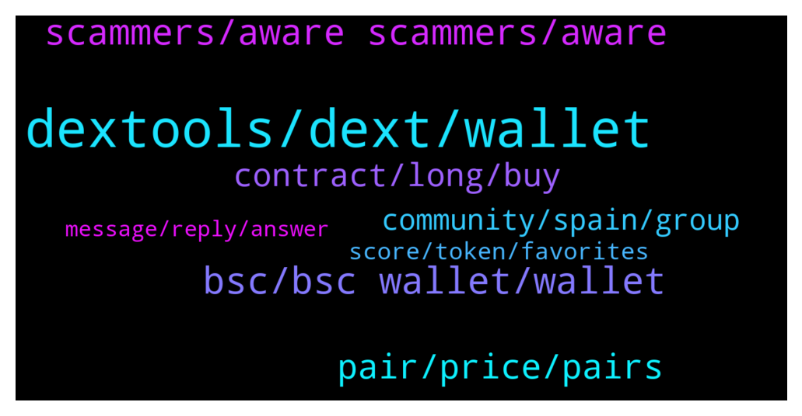

# **@DEXToolsCommunity**
 ## Analysis for **2022-01-26** - **2022-01-28**.

---

## 📊 **Basic Stats**

**n_messages_sent**: 198

---

---

## 🔝 **Top keywords and related messages**

1. **dextools, dext, wallet**

    @ilkeratalay --- *hello where can i write for dextools trend information* **--->** [TG Discussion](https://t.me/DEXToolsCommunity/328978)

    @wikkibikki --- *Is the price for Dextool advertisement* **--->** [TG Discussion](https://t.me/DEXToolsCommunity/328480)

    @badelelele --- *dexscreener grew their chains in lightspeed* **--->** [TG Discussion](https://t.me/DEXToolsCommunity/328440)

    @badrfardane --- *I just thought that if it still possible to do it on Dextools App so it still available* **--->** [TG Discussion](https://t.me/DEXToolsCommunity/328678)

    @JoeyDieleman --- *Ok, if proto isn't on a supported dext it won't show. If you want your dex to be supported you xan request it. But there is alist already and dexes are choosen by its usage.* **--->** [TG Discussion](https://t.me/DEXToolsCommunity/328403)

    @Cryptojosu563 --- *I want to learn Dextools work* **--->** [TG Discussion](https://t.me/DEXToolsCommunity/329109)

2. **bsc, bsc wallet, wallet**

    @badrfardane --- *Could I user BSC too ?* **--->** [TG Discussion](https://t.me/DEXToolsCommunity/328589)

    @Spock98 --- *Hi here, Trying to connect my BSC wallet but the "Connect" button point me on an empty page (or doing nothing) ... Is there a maintenance or requirements i didn't see ?* **--->** [TG Discussion](https://t.me/DEXToolsCommunity/329277)

    @rpoole69 --- *Good morning, BSC contract 0xF2A92BC1Cf798fF4De14502a9C6FdA58865e8D5d Thorium V2 on DEXTools shows 6,810 Holders and 2,660 TX, yet in BSCScan, 15,344 Holders and 29,526 TX* **--->** [TG Discussion](https://t.me/DEXToolsCommunity/329265)

    @oi_mista --- *when it does load nothing shows on BSC* **--->** [TG Discussion](https://t.me/DEXToolsCommunity/328855)

    @badrfardane --- *Oh I have it on BSC wallet* **--->** [TG Discussion](https://t.me/DEXToolsCommunity/328628)

    @TheFutureHour --- *we just discovered a small issue in our bsc server, but it should be already fixed  would you check again and let us know please* **--->** [TG Discussion](https://t.me/DEXToolsCommunity/328847)

3. **scammers, aware scammers, aware**

    @stanes --- *This is a support channel, I prefer people here being aware scammers are around.* **--->** [TG Discussion](https://t.me/DEXToolsCommunity/328582)

    @rpoole69 --- *Is there any specific info they should DM the user?* **--->** [TG Discussion](https://t.me/DEXToolsCommunity/328792)

    @stanes --- *No sorry I don't understand why we should stop warning people of scammers.  This is not related to the app. I find your messages a bit concerning tbh, you just look like a scammer yourself 🤔* **--->** [TG Discussion](https://t.me/DEXToolsCommunity/328593)

    @Lol --- *Yes people should be aware of scammers instead posting… people will be afraid of using DEXT Stanes I hope you understand me* **--->** [TG Discussion](https://t.me/DEXToolsCommunity/328590)

    @napascual --- *Try clearing your cache. (admins never dm first, be aware of scammers)* **--->** [TG Discussion](https://t.me/DEXToolsCommunity/329278)

    @stanes --- *And he is really busy, so give him a bit of time. Don't try to contact anyone else, he is the only one in charge of ads.* **--->** [TG Discussion](https://t.me/DEXToolsCommunity/328496)

4. **pair, price, pairs**

    @badrfardane --- *Here is the transactions : https://bscscan.com/tx/0xef29ced18791cce8501f7ccc99181a58c1d32808da6e7c4a7151dfa53c1b7ead https://bscscan.com/tx/0x0e6c4a1b0a1e8f4509b7a3ecd2e20937f8735e606bfb1c21f9b418113b52354d https://bscscan.com/tx/0x044e65b49893f68184444800ac88721cdbccc0ac8b84850fb2b0035e1f399a41* **--->** [TG Discussion](https://t.me/DEXToolsCommunity/328556)

    @badrfardane --- *I lost arround 160$ in this transaction I think... ?* **--->** [TG Discussion](https://t.me/DEXToolsCommunity/328668)

    @Jack_the_Crypto --- *Got some issue by adding dex price bot. Setted pair, but after adking price its shows no pair found 😂  Used command to set price /set_pair 1 bsc 0xfbd57367524b389425c4adfb5a6f97b0e7ad3690* **--->** [TG Discussion](https://t.me/DEXToolsCommunity/329253)

    @NoOne19944991 --- *Hi BSC hot pairs has issue Not show all of them* **--->** [TG Discussion](https://t.me/DEXToolsCommunity/329116)

    @FredericDEXT --- *You can filter by wallet, number of tx etc* **--->** [TG Discussion](https://t.me/DEXToolsCommunity/328737)

    @Leonel --- *hello I have a question, when I click on a couple below the transactions appear and next to "maker" it says "others" and there is a symbol of some people and a number enclosed in a box and next to it the symbol of a filter , what does that mean?* **--->** [TG Discussion](https://t.me/DEXToolsCommunity/328734)

5. **contract, long, buy**

    @badrfardane --- *Hope this contract will stay for a long time because I Hodl all coins for long time* **--->** [TG Discussion](https://t.me/DEXToolsCommunity/328684)

    @badrfardane --- *is it because of the old contract ?* **--->** [TG Discussion](https://t.me/DEXToolsCommunity/328650)

    @stanes --- *Contract doesn't have liquidity since beginning of  July and there are two warning messages on the page telling people to don't buy it 🤷‍♂️* **--->** [TG Discussion](https://t.me/DEXToolsCommunity/328676)

    @BubblesTU --- *but 70 days most of that contract was liquidated* **--->** [TG Discussion](https://t.me/DEXToolsCommunity/328673)

    @BubblesTU --- *if you didn't buy to long ago you can still use the underlying liquidity to swap it back to the amount you used to buy.* **--->** [TG Discussion](https://t.me/DEXToolsCommunity/328664)

    @BubblesTU --- *how long ago did you buy?* **--->** [TG Discussion](https://t.me/DEXToolsCommunity/328663)

6. **community, spain, group**

    @nate102 --- *can someone explain how these times make any sense? https://www.dextools.io/app/ether/pair-explorer/0x8eaa30e13037bf46059d52c22ee8ff6cd06d2c73* **--->** [TG Discussion](https://t.me/DEXToolsCommunity/328991)

    @Jeoffrey_thewatcher --- *do you have any job vacancy for community moderator/manager?? i can manage both philippines community and english community.* **--->** [TG Discussion](https://t.me/DEXToolsCommunity/328551)

    @badelelele --- *what timezone the team at just to get an idea?* **--->** [TG Discussion](https://t.me/DEXToolsCommunity/328435)

    @badelelele --- *can you set up a group chat?* **--->** [TG Discussion](https://t.me/DEXToolsCommunity/328448)

    @stanes --- *Sure, you can join the Chinese group here: https://t.me/DEXTChinese* **--->** [TG Discussion](https://t.me/DEXToolsCommunity/328683)

    @stanes --- *You can join the Chinese group here: https://t.me/DEXTChinese* **--->** [TG Discussion](https://t.me/DEXToolsCommunity/328864)

7. **score, token, favorites**

    @JoeyDieleman --- *Score depends on the age of the token, liquidity and the amount of available social links. Also it the validation of the contract is taken into account* **--->** [TG Discussion](https://t.me/DEXToolsCommunity/328369)

    @Ibraahiiim --- *Please how do you score a token* **--->** [TG Discussion](https://t.me/DEXToolsCommunity/328368)

    @yanglianyun --- *How to add tokens to favorites? Thank you* **--->** [TG Discussion](https://t.me/DEXToolsCommunity/329046)

    @JoeyDieleman --- *The score consist on multiple categories, creation score grows when more transactions are made* **--->** [TG Discussion](https://t.me/DEXToolsCommunity/328374)

    @Chuka --- *Wheer can i buy or sell decimated token* **--->** [TG Discussion](https://t.me/DEXToolsCommunity/329073)

    @BubblesTU --- *but can we list the tokens that belong to it?* **--->** [TG Discussion](https://t.me/DEXToolsCommunity/328390)

