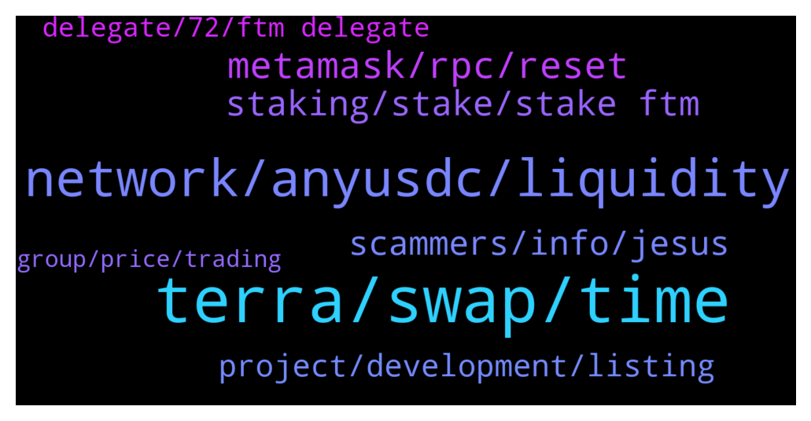

# **@Fantom_English**
 ## Analysis for **2022-01-27** - **2022-01-28**.

---

## 📊 **Basic Stats**

**n_messages_sent**: 192

---

---

## 🔝 **Top keywords and related messages**

1. **terra, swap, time**

    @Janevietani --- *it have terra to fantom with ust so it should be support fantom to terra as well* **--->** [TG Discussion](https://t.me/Fantom_English/643112)

    @Gondaliza --- *Yeh, I had this issue yesterday. Didn't realise Fantom was so buggy.* **--->** [TG Discussion](https://t.me/Fantom_English/643457)

    @A1heng --- *hi all, i need some small amount of fantom for transaction. please kindly advice where can i get it* **--->** [TG Discussion](https://t.me/Fantom_English/643653)

    @MLH822020 --- *Hello, it doesn't go from Fantom to Terra* **--->** [TG Discussion](https://t.me/Fantom_English/643105)

    @Bicrypto --- *@slickrick6 why nowadays fantom swaps & transactions taking much more time? Not smooth.. In spooky it took 5 min for a swap.. Kindly clarify..  Any congestion issue going on?* **--->** [TG Discussion](https://t.me/Fantom_English/643206)

    @pajamasfreak --- *Fantom on TG  Official: t.me/Fantom_English Announcements (official) : t.me/fantomfoundation Trading: t.me/FantomTrading French (Française): t.me/FantomFR Chinese (中文): https://t.me/FantomChinese Russian (русский): http://t.me/Fantom_Russian Vietnam : https://t.me/FantomVietnamGroup Turkey : https://t.me/Fantomir1  Fantom on DIscord: chat.fantom.network  Fantom on Twitter: twitter.com/fantomfdn* **--->** [TG Discussion](https://t.me/Fantom_English/643549)

2. **network, anyusdc, liquidity**

    @Feldspar_1 --- *Same here. I bridged FTM three days ago and haven't seen it in my wallet yet.* **--->** [TG Discussion](https://t.me/Fantom_English/643409)

    @Alban --- *Thanks a lot for the clarification Jane! Several FTM influencers on Twitter have been stating that FTM would be listed today, so I was quite unsure if I had missed something out.* **--->** [TG Discussion](https://t.me/Fantom_English/643036)

    @pajamasfreak --- *Varies each day, check ftm guru regularly* **--->** [TG Discussion](https://t.me/Fantom_English/642744)

    @A.A.N. --- *Even tried converting my DAI to FTM on Jetswap, still hasn’t gone thru* **--->** [TG Discussion](https://t.me/Fantom_English/643699)

    @to_much_crypto --- *why is FTM running so slow* **--->** [TG Discussion](https://t.me/Fantom_English/642714)

    @Juan --- *FTM network soooo sloooooooow...I really hope this will get fixed ASAP. Breaking me balls here* **--->** [TG Discussion](https://t.me/Fantom_English/642877)

3. **metamask, rpc, reset**

    @slickrick6 --- *Try the below.    how to resolve pending txs ?  1. reset metamask go to metamask setting -> advanced -> reset reset metamask will only clear pending tx   2. add other RPC for back up Fantom RPC : a. https://rpc.ftm.tools/ b. https://rpc.ankr.com/fantom c. https://ftmrpc.ultimatenodes.io/   ChainID: 250 Symbol: FTM Browser : https://ftmscan.com  3. after reset metamask and add other rpc re-do your tx, check gas price here https://ftm.guru/fantomscan.html* **--->** [TG Discussion](https://t.me/Fantom_English/643187)

    @Janevietani --- *have back up for your RPC   Fantom RPC : 1. https://rpc.ftm.tools/ 2. https://rpc.ankr.com/fantom 3. https://ftmrpc.ultimatenodes.io/   ChainID: 250 Symbol: FTM Browser : https://ftmscan.com  Another explorer is  https://explorer.fantom.network* **--->** [TG Discussion](https://t.me/Fantom_English/642718)

    @Janevietani --- *how to resolve pending txs ?  1. reset metamask go to metamask setting -> advanced -> reset reset metamask will only clear pending tx   2. add other RPC for back up Fantom RPC : a. https://rpc.ftm.tools/ b. https://rpc.ankr.com/fantom c. https://ftmrpc.ultimatenodes.io/   ChainID: 250 Symbol: FTM Browser : https://ftmscan.com  3. after reset metamask and add other rpc re-do your tx, check gas price here https://ftm.guru/fantomscan.html* **--->** [TG Discussion](https://t.me/Fantom_English/643001)

    @Janevietani --- *how to resolve pending txs ?  1. reset metamask go to metamask setting -> advanced -> reset reset metamask will only clear pending tx   2. add other RPC for back up Fantom RPC : a. https://rpc.ftm.tools/ b. https://rpc.ankr.com/fantom c. https://ftmrpc.ultimatenodes.io/   ChainID: 250 Symbol: FTM Browser : https://ftmscan.com  3. after reset metamask and add new rpc re-do your tx, check gas price here https://ftm.guru/fantomscan.html* **--->** [TG Discussion](https://t.me/Fantom_English/643700)

    @rickey_rickk --- *how to withdraw funds from ETH if there is an auto withdrawal in the wallet and I'm not the only one who has a priv*t* k*y?   Admin help* **--->** [TG Discussion](https://t.me/Fantom_English/643645)

    @TS_STARKK --- *Yea I had the same issue 3 days ago but it’s fixed now* **--->** [TG Discussion](https://t.me/Fantom_English/643461)

4. **staking, stake, stake ftm**

    @michaelmc87 --- *Is there any highly profitable staking for FTM?* **--->** [TG Discussion](https://t.me/Fantom_English/642533)

    @Janevietani --- *need to consider if a node act malicious, node self stake token which is minimum 500k FTM will be slashed as well ,* **--->** [TG Discussion](https://t.me/Fantom_English/642926)

    @Redje4 --- *Hello I want to stake my ftm but how can I know that I choose a good validator?* **--->** [TG Discussion](https://t.me/Fantom_English/642900)

    @zenkert --- *Staking doesn't seem very attractive in that perspective.* **--->** [TG Discussion](https://t.me/Fantom_English/643231)

    @panzymagic --- *has staking for ftm opened yet/* **--->** [TG Discussion](https://t.me/Fantom_English/642857)

    @pajamasfreak --- *Yes, always refer back to staking calculator on site* **--->** [TG Discussion](https://t.me/Fantom_English/642756)

5. **scammers, info, jesus**

    @sticks_na_beany --- *How do people fall for this nonsense* **--->** [TG Discussion](https://t.me/Fantom_English/642603)

    @T --- *Very strange a scammer just contacted me with username @Janevietani same like yours but with a different info* **--->** [TG Discussion](https://t.me/Fantom_English/643834)

    @Gondaliza --- *Jesus, this chatroom is filled with scammers 😅* **--->** [TG Discussion](https://t.me/Fantom_English/643454)

    @v --- *like 10 different ppl messaged me trying to scam lol* **--->** [TG Discussion](https://t.me/Fantom_English/643005)

    @Shikamat --- *Why all the scams of the world are calling me 🤣* **--->** [TG Discussion](https://t.me/Fantom_English/642674)

    @Chip --- *free money for everyone! Sounds totally real* **--->** [TG Discussion](https://t.me/Fantom_English/642646)

6. **project, development, listing**

    @Nikunj1998 --- *Do pass this feedback to the development and marketing team* **--->** [TG Discussion](https://t.me/Fantom_English/643535)

    @mas11002299 --- *I would like to contribute to the development* **--->** [TG Discussion](https://t.me/Fantom_English/643118)

    @Alban --- *I would love to know more about it:)* **--->** [TG Discussion](https://t.me/Fantom_English/643032)

    @pajamasfreak --- *@syed_TGLabs @ariel_moon can spread and educate your project below* **--->** [TG Discussion](https://t.me/Fantom_English/642810)

    @MrGray_T --- *Hello everyone. Who can I contact regarding Marketing (that is, listing the project on the exchange)?* **--->** [TG Discussion](https://t.me/Fantom_English/642944)

    @Devinpaxton_indoex --- *Greetings admins, I represent IndoEx could I speak someone who is responsible for listing/IEO of This project ?* **--->** [TG Discussion](https://t.me/Fantom_English/643722)

7. **delegate, 72, ftm delegate**

    @slickrick6 --- *You can delegate upwards from 1 ftm* **--->** [TG Discussion](https://t.me/Fantom_English/643130)

    @Ruesandora --- *how many FTM do i need to be a delegate* **--->** [TG Discussion](https://t.me/Fantom_English/643123)

    @AlexMaori --- *all validators are the same in terms of security* **--->** [TG Discussion](https://t.me/Fantom_English/642912)

    @FB --- *Hi guys! Does anyone know why it is not possible to delegate almost all of my FTM balance? I have 92 tokens, it shows 80 and only allows the stake of 72, displaying the message "You can stake max 72.81xxx FTM"* **--->** [TG Discussion](https://t.me/Fantom_English/642582)

    @slickrick6 --- *Send me a screen shot. It is giving you a limt to the amount you can delegate ?* **--->** [TG Discussion](https://t.me/Fantom_English/643185)

    @slickrick6 --- *You want to delegate to a node yes ?* **--->** [TG Discussion](https://t.me/Fantom_English/643125)

8. **group, price, trading**

    @Dimon --- *Is there a price discussion group* **--->** [TG Discussion](https://t.me/Fantom_English/643235)

    @sofiaswapspace --- *Hi! I'm Sofia - BD from SwapSpace -cryptocurrency exchange aggregator. With whom can I discuss some ideas of co-branded marketing activities? Thank you!* **--->** [TG Discussion](https://t.me/Fantom_English/643710)

    @PMan --- *Hi. Are there any useful SpiritSwap telegram groups? Trading / Price etc* **--->** [TG Discussion](https://t.me/Fantom_English/643682)

    @Janevietani --- *take price discussion to trading group* **--->** [TG Discussion](https://t.me/Fantom_English/643523)

    @Johnnyfantom --- *Please go to trading group to discuss price* **--->** [TG Discussion](https://t.me/Fantom_English/643241)

    @Shikamat --- *Hi, is there a French group ?* **--->** [TG Discussion](https://t.me/Fantom_English/643548)

