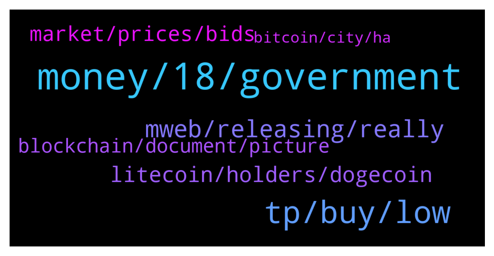

# **@Litecoin**
 ## Analysis for **2022-01-27** - **2022-01-28**.

---

## 📊 **Basic Stats**

**n_messages_sent**: 216

---

---

## 🔝 **Top keywords and related messages**

1. **money, 18, government**

    @starman42069 --- *I sometimes think people who think like this doesnt do anything on a daily basis and hate their lives* **--->** [TG Discussion](https://t.me/Litecoin/2053645)

    @starman42069 --- *Are you out of your minds guys. Money is a consequence. Just do what you like doing. And you ll get paid for it* **--->** [TG Discussion](https://t.me/Litecoin/2053644)

    @cloudlite15 --- *You can find me at the mcdonalds restroom stall...* **--->** [TG Discussion](https://t.me/Litecoin/2054036)

    @RabbitL0v3r --- *J'avoue, seulement ici c'est english only* **--->** [TG Discussion](https://t.me/Litecoin/2054119)

    @Notbiden --- *All you are is a number in their slaughter machine* **--->** [TG Discussion](https://t.me/Litecoin/2053640)

    @Macro5674 --- *More the people accepts metaverse and virtual businesses more the government gets stand to lockdowns ! First Idiocracy and now Matrix is now becoming a documentary 😂 where actually rather than to extract energy from us , they creating a metaverse world to decrease the energy to control us to a limited spaces with no ownership on real world !* **--->** [TG Discussion](https://t.me/Litecoin/2054108)

2. **tp, buy, low**

    @onecryptochick --- *LTC problem is it has to many people talking shit about it.  People are coming in here for the sole reason of saying the coin sucks...strange* **--->** [TG Discussion](https://t.me/Litecoin/2053695)

    @J --- *Maybe you should look the other way.. if LTC reaches 70 dollar, should i sell to buy more at $400?* **--->** [TG Discussion](https://t.me/Litecoin/2053884)

    @J --- *I want to sell the bottom so i can buy the dip* **--->** [TG Discussion](https://t.me/Litecoin/2053795)

    @Kglugenbeel --- *LTC was my very first Crypto; think it’s time for a #ComeBackStory ❤️* **--->** [TG Discussion](https://t.me/Litecoin/2054214)

    @RabbitL0v3r --- *Im not financial advisor, but u would sell the bottom of the multiyear BTCLTC downtren* **--->** [TG Discussion](https://t.me/Litecoin/2053798)

    @🔺ᬼ⃝ℝ🔺 --- *Hold what ? LTC ?? 😂😂😂 If they return my money I never buy that dry coin again* **--->** [TG Discussion](https://t.me/Litecoin/2053569)

3. **mweb, releasing, really**

    @indigo_nakamoto --- *3 days left for it to be released...* **--->** [TG Discussion](https://t.me/Litecoin/2053821)

    @RorschachTesst --- *Mweb will definitely move the price* **--->** [TG Discussion](https://t.me/Litecoin/2053847)

    @Ben --- *If mweb is really valuable then it’s good to postpone it, which gives retail investors more time to accumulate* **--->** [TG Discussion](https://t.me/Litecoin/2053864)

    @Notbiden --- *Mweb isn't going to move the price so I could careless about mweb* **--->** [TG Discussion](https://t.me/Litecoin/2053843)

    @Ben --- *And personally i really look for using mweb function, greater for fungibility.* **--->** [TG Discussion](https://t.me/Litecoin/2053840)

    @RorschachTesst --- *I bet 1k litecoin that mweb won't be released in January* **--->** [TG Discussion](https://t.me/Litecoin/2053824)

4. **litecoin, holders, dogecoin**

    @ForDaTek --- *If litecoin makes a 3rd attempt at $400, will you guys hold strong?* **--->** [TG Discussion](https://t.me/Litecoin/2053804)

    @onecryptochick --- *I'm in the green on Litecoin...profits* **--->** [TG Discussion](https://t.me/Litecoin/2053997)

    @syonfive --- *litecoin seems be weak in up trend , but handle n cup pattern is seen* **--->** [TG Discussion](https://t.me/Litecoin/2053773)

    @Mar --- *We can’t focus on only lite coin* **--->** [TG Discussion](https://t.me/Litecoin/2053747)

    @Playconsolea --- *For an hour, Litecoin fell from $ 115 - $ 107, this is a good result* **--->** [TG Discussion](https://t.me/Litecoin/2053536)

    @indigo_nakamoto --- *Or just bad actors who don't want others to invest into Litecoin.* **--->** [TG Discussion](https://t.me/Litecoin/2053698)

5. **market, prices, bids**

    @ryanswright --- *It helps to create fud to get more people to sell at lower prices* **--->** [TG Discussion](https://t.me/Litecoin/2053699)

    @ForDaTek --- *I don’t understand why people stop buying at low prices but fomo in at high prices?* **--->** [TG Discussion](https://t.me/Litecoin/2054044)

    @WaLsh_P --- *yea they think market trends or cycles is forever* **--->** [TG Discussion](https://t.me/Litecoin/2054053)

    @@bamboo --- *others believe if they talk shit somehow it will pump the price 🤦‍♂️* **--->** [TG Discussion](https://t.me/Litecoin/2053951)

    @Notbiden --- *Hire some better marketing people and actually meet and set achievable deadlines for project advancements and it would very successful right now its strictly driven by supply and demand but as I recall from every interview this is how charlie wants it so the rest get to suffer max pain each cycle* **--->** [TG Discussion](https://t.me/Litecoin/2053833)

    @Ben --- *The reality allows them to do it, which is good, but it also causes the selling pressure* **--->** [TG Discussion](https://t.me/Litecoin/2053681)

6. **blockchain, document, picture**

    @SBH --- *How about putting documents on the blockchain* **--->** [TG Discussion](https://t.me/Litecoin/2054065)

    @SBH --- *not the picture, but the keys, to proof ownership to it* **--->** [TG Discussion](https://t.me/Litecoin/2054093)

    @RabbitL0v3r --- *You can make an nft of anything, even of documents* **--->** [TG Discussion](https://t.me/Litecoin/2054097)

    @SBH --- *I tried in opensea, but could not choose this file type* **--->** [TG Discussion](https://t.me/Litecoin/2054099)

    @RabbitL0v3r --- *Getting what? The fact that puttin a document on the blockchain is a bad idea?* **--->** [TG Discussion](https://t.me/Litecoin/2054090)

    @SBH --- *Why is a document different from a picture of ape?* **--->** [TG Discussion](https://t.me/Litecoin/2054091)

7. **bitcoin, city, ha**

    @Notbiden --- *Bitcorn fed says leaving rates at 0* **--->** [TG Discussion](https://t.me/Litecoin/2053618)

    @onecryptochick --- *why does it suck? bc its not bitcoin...i don't get it lol* **--->** [TG Discussion](https://t.me/Litecoin/2053696)

    @professional --- *Ha ha , Will not happen. US Made bitcoin* **--->** [TG Discussion](https://t.me/Litecoin/2053657)

    @starman42069 --- *Meanwhile BTC gets everyone REKT and does not care. In fact it even gets entire countries rekt these days.* **--->** [TG Discussion](https://t.me/Litecoin/2053641)

    @starman42069 --- *They will call Bitcoin City in El Salvador REKT City and their volcano bonds are going to 0* **--->** [TG Discussion](https://t.me/Litecoin/2053609)

    @dscreativ --- *looking back that pi cycle top indicator on bitcoin nailed it again, i remember at the time everyone dismissed it :)* **--->** [TG Discussion](https://t.me/Litecoin/2054157)

