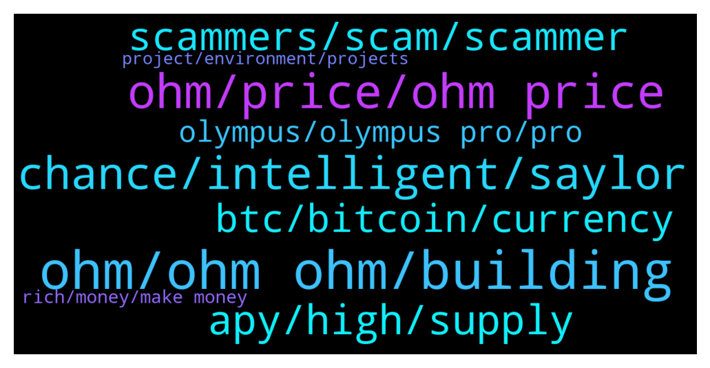

# **@OlympusTG**
 ## Analysis for **2022-01-27** - **2022-01-28**.

---

## 📊 **Basic Stats**

**n_messages_sent**: 1319

---

---

## 🔝 **Top keywords and related messages**

1. **ohm, ohm ohm, building**

    @john4p --- *What’s the difference with time and ohm* **--->** [TG Discussion](https://t.me/OlympusTG/172122)

    @allenkor --- *I thought ohm held time as well* **--->** [TG Discussion](https://t.me/OlympusTG/172949)

    @DM me NOT --- *If this question could be a little more specific, what is your personal opinion for the reason why OHM suffered this relatively huge amount, for instance, considering any other possible similar projects?  If you don't like my question, you don't need to answer this.* **--->** [TG Discussion](https://t.me/OlympusTG/172543)

    @chitangxxx --- *I thought they were more honest than ohm a few weeks ago... Since they were buying back below backing and ohm wasn't... I trust ohm more now lol* **--->** [TG Discussion](https://t.me/OlympusTG/171181)

    @Palancapa --- *time has an unsustainable APY, Ohm's APY is much better and more sustainable* **--->** [TG Discussion](https://t.me/OlympusTG/172137)

    @NsMiscar --- *Just because i bought OHM does not mean i am not holding some SHIB...lol* **--->** [TG Discussion](https://t.me/OlympusTG/172369)

2. **ohm, price, ohm price**

    @KidJuel --- *I remember when I jokingly said OHM will be $50 like when it was $500+* **--->** [TG Discussion](https://t.me/OlympusTG/172730)

    @TNrafi2109 --- *Thanks. Any improvememt in near future that can boost the price? Because.many of us bought ohm at price above usd200, i.think the current apy is not enough to cover our loss* **--->** [TG Discussion](https://t.me/OlympusTG/172967)

    @will108 --- *Wat happened to ohm price? Havent been checking for a month* **--->** [TG Discussion](https://t.me/OlympusTG/171808)

    @DocDeFi --- *Still waiting for an entry. This telegram convinced me to wait for sub 50 usd Ohm* **--->** [TG Discussion](https://t.me/OlympusTG/172852)

    @nfwaple --- *imagine seeing OHM at $10 five years later* **--->** [TG Discussion](https://t.me/OlympusTG/172828)

    @will108 --- *So psycologically, seeing OHM at $10 or even $1, has profound surreal oob experience. You reach nirvana having the inestment been rekt, all $55k worth of it gone* **--->** [TG Discussion](https://t.me/OlympusTG/172827)

3. **chance, intelligent, saylor**

    @john4p --- *Same way I still support arsenal knowing the team is hopeless* **--->** [TG Discussion](https://t.me/OlympusTG/173188)

    @nfwaple --- *I feel sorry for the time holders, but I am grateful that in the end, the good players win* **--->** [TG Discussion](https://t.me/OlympusTG/171163)

    @Host_Matt --- *thats why im saying if you play it well* **--->** [TG Discussion](https://t.me/OlympusTG/171724)

    @Host_Matt --- *because they're missing out on the best parts of life* **--->** [TG Discussion](https://t.me/OlympusTG/171323)

    @nfwaple --- *I listened to the podcast with Saylor today* **--->** [TG Discussion](https://t.me/OlympusTG/173122)

    @Palancapa --- *Oh i think i answered my Own question* **--->** [TG Discussion](https://t.me/OlympusTG/173213)

4. **apy, high, supply**

    @cdp279 --- *Apy is not going up. Stop with apy please ser. Do you understand what happens when apy goes up?* **--->** [TG Discussion](https://t.me/OlympusTG/172968)

    @nfwaple --- *because APY shouldn't be a selling point* **--->** [TG Discussion](https://t.me/OlympusTG/171850)

    @Al_S1919 --- *Hello, why is the APY so fkn low?* **--->** [TG Discussion](https://t.me/OlympusTG/171015)

    @Host_Matt --- *Reducing apy reduces emissions is good for price* **--->** [TG Discussion](https://t.me/OlympusTG/171247)

    @nfwaple --- *don't agree with removing apy though, supply needs to increase still* **--->** [TG Discussion](https://t.me/OlympusTG/171586)

    @nfwaple --- *APY used to be high and price was high* **--->** [TG Discussion](https://t.me/OlympusTG/171590)

5. **scammers, scam, scammer**

    @chitangxxx --- *Yeah it is. Go there and tell people to chat here! They banned me for calling the leaders a bunch of scamming cunts that should immediately die of cancer together with their kids and families... Dont see anything wrong with that to be fair. Lol* **--->** [TG Discussion](https://t.me/OlympusTG/172262)

    @chitangxxx --- *That's why people think he's a scammer too* **--->** [TG Discussion](https://t.me/OlympusTG/172187)

    @invida108 --- *Can you imagine scammers are on stand by reading threads just attempting scamming us?   Scammers:  CAN I ASK YOU TO DIE ASAP* **--->** [TG Discussion](https://t.me/OlympusTG/170910)

    @Ap0l1o --- *there is 99% chance that he is a scammer* **--->** [TG Discussion](https://t.me/OlympusTG/170799)

    @Host_Matt --- *only makes sense to scam in a market that is unregulated and highly anonymous* **--->** [TG Discussion](https://t.me/OlympusTG/172165)

    @LONGDONGWONG --- *scammers are true psychopaths  They do not feel shame or regret in their actions  Kindda hard for them to relate to the pains of people losing  Their brains are wired differently* **--->** [TG Discussion](https://t.me/OlympusTG/172289)

6. **btc, bitcoin, currency**

    @nfwaple --- *there were some arguments on the form of BTC, like wBTC or renBTC etc. can't really remember* **--->** [TG Discussion](https://t.me/OlympusTG/171982)

    @Ahmad --- *I think for Bitcoin to become currency is hard. I read about El Salvador during this crash and it is not good.* **--->** [TG Discussion](https://t.me/OlympusTG/171989)

    @chitangxxx --- *It will never be a legal tender currency in our lifetime* **--->** [TG Discussion](https://t.me/OlympusTG/171998)

    @Palancapa --- *it doesn't even have to be a legel tender currency. we just need to socially accept that bitcoin will be the best store of value for the general population.* **--->** [TG Discussion](https://t.me/OlympusTG/172003)

    @nfwaple --- *as more people lose access to their wallets, in a longer timeframe, bitcoin may be a good store of value* **--->** [TG Discussion](https://t.me/OlympusTG/172008)

    @S --- *It’s useless.  No utility. Just a name that people go off of that keep the markets going.   I sure hope people pump it again.  Cuz btc needs to survive. And people want to make money in crypto so they will invest in btc.   Should switch from btc to something with actual a owner and utility* **--->** [TG Discussion](https://t.me/OlympusTG/172621)

7. **olympus, olympus pro, pro**

    @DM me NOT --- *I am investing in other projects, too.  They are down less than 30% ~ 50% mostly in the recent crash.  However, OHM has fallen the largest amount. I expected this before I bought gOHM,  so I bought gOHM  only with 100 USD for a scouting purpose.  I am not spreading FUD neither I am saying Olympus DAO is bad.  I just wish I could learn  how Olympus can create real "profit" based on the gathered money from the community?* **--->** [TG Discussion](https://t.me/OlympusTG/172536)

    @mattory --- *defi project  want to use olympus pro, who can I contact?* **--->** [TG Discussion](https://t.me/OlympusTG/171981)

    @TNrafi2109 --- *I just want to make sure that olympus do not have relationship.with time?* **--->** [TG Discussion](https://t.me/OlympusTG/172955)

    @theMagicUnicorn --- *Olympus Pro Spotlight is a series where we highlight our Olympus Pro cohort partners to give Ohmies insights into what our partners are building, how their token works, and why they chose Olympus Pro. https://olympusdao.medium.com/olympus-pro-spotlight-keep3r-fixed-forex-e575e5864ae8* **--->** [TG Discussion](https://t.me/OlympusTG/172709)

    @nfwaple --- *LP revenue as well if Olympus becomes the LP for more protocols* **--->** [TG Discussion](https://t.me/OlympusTG/171045)

    @mattory --- *I want to know about olympus pro and how to cooperate* **--->** [TG Discussion](https://t.me/OlympusTG/171725)

8. **rich, money, make money**

    @Host_Matt --- *its like how our society is a ponzi because we rely on people to have babies or we would be fucked if they stopped having kid* **--->** [TG Discussion](https://t.me/OlympusTG/172160)

    @Palancapa --- *im 23 y/o and want to be financially free by the time im 30* **--->** [TG Discussion](https://t.me/OlympusTG/173148)

    @nfwaple --- *people just wouldn't believe it, because they wanted them to make money for them* **--->** [TG Discussion](https://t.me/OlympusTG/172172)

    @nfwaple --- *bro there are people that made money, it's just not you* **--->** [TG Discussion](https://t.me/OlympusTG/171387)

    @Palancapa --- *yeah i know! but now it takes 10-15 years to get rich* **--->** [TG Discussion](https://t.me/OlympusTG/171667)

    @Palancapa --- *if i joined in 2014 i wouldve already been rich* **--->** [TG Discussion](https://t.me/OlympusTG/171668)

