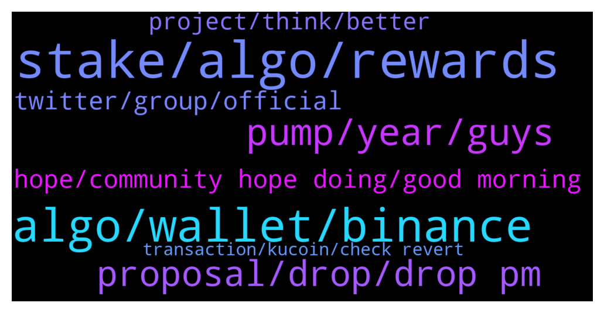

# **@algorand**
 ## Analysis for **2022-01-27** - **2022-01-28**.

---

## 📊 **Basic Stats**

**n_messages_sent**: 122

---

---

## 🔝 **Top keywords and related messages**

1. **stake, algo, rewards**

    @MMulder432 --- *I'm using it. And i stake my algo in the Algo prize game and the yieldly i'm getting, i'm staking in the staking pools* **--->** [TG Discussion](https://t.me/algorand/335610)

    @MackDenver --- *Sure, actually every week you will automatically receive YLDY from your stake, as well as have the chance to win a big ALGO prize. Check more here: https://yieldly.finance/no-loss-prize-game/* **--->** [TG Discussion](https://t.me/algorand/335589)

    @Crytolegendlord --- *Sure man before coming into the algorand ecosystem we were on bsc chain we had the same experience and learnt from it that's how we escape from losses sometimes because of our experience on bsc.* **--->** [TG Discussion](https://t.me/algorand/335675)

    @NightAlgorand --- *You can hold your algo coins in your wallet. It stakes automatically. You can see current APY here https://algoexplorer.io/rewards-calculator* **--->** [TG Discussion](https://t.me/algorand/335752)

    @A_JarsLife_Thomas --- *I hear that from a friend of mine, weekly yuo can stake your Algo (farming YLDLY at 7% APY) and participate to a lottery at the same time...* **--->** [TG Discussion](https://t.me/algorand/335575)

    @MackDenver --- *Hi, welcome to Algorand.  You don't have to stake it, just hold your $ALGO in official Algorand wallet and you will get staking rewards.* **--->** [TG Discussion](https://t.me/algorand/335566)

2. **algo, wallet, binance**

    @NightAlgorand --- *You can download Algorand Wallet here https://algorandwallet.com/* **--->** [TG Discussion](https://t.me/algorand/335745)

    @Lcee --- *Sorry for the plenty enquiries, just wanted to know if I stand to gain anything by having the Algo coin in my Algo wallet than having it on Binance* **--->** [TG Discussion](https://t.me/algorand/335749)

    @Lcee --- *Thank you. So which one is Algo wallet?* **--->** [TG Discussion](https://t.me/algorand/335742)

    @Lcee --- *I want to buy Algo, where do I buy from?  From Binance Exchange?* **--->** [TG Discussion](https://t.me/algorand/335733)

    @NightAlgorand --- *You can use Binance or Kucoin 🙂* **--->** [TG Discussion](https://t.me/algorand/335734)

    @Am --- *I can't swap anything with algo in atomic wallet, is it because the algo balance is 0?* **--->** [TG Discussion](https://t.me/algorand/335827)

3. **pump, year, guys**

    @domioo911 --- *in 2018, altcoins lost 90% each and never rebounded again. do you have to that this year will be the same?* **--->** [TG Discussion](https://t.me/algorand/335739)

    @domioo911 --- *in 2017, after all cryptocurrencies broke, they dropped to a level from which they could not bounce back so far. what do you think it could be the same now?* **--->** [TG Discussion](https://t.me/algorand/335688)

    @frankmula --- *Check out choice coin guys huge potentials* **--->** [TG Discussion](https://t.me/algorand/335780)

    @NightAlgorand --- *Hi there, please do the speculation talk here @algorand_price* **--->** [TG Discussion](https://t.me/algorand/335741)

    @J --- *Agreed it will eventually pump, after another 70% fall* **--->** [TG Discussion](https://t.me/algorand/335669)

    @domioo911 --- *Guys we are on bear market. After this we will pump. We should be patience and waiting about 2 years* **--->** [TG Discussion](https://t.me/algorand/335668)

4. **proposal, drop, drop pm**

    @NightAlgorand --- *Hi there, you can check it here https://algoexplorer.io/rewards-calculator* **--->** [TG Discussion](https://t.me/algorand/335727)

    @awoluz --- *Who can I talk to about proposal* **--->** [TG Discussion](https://t.me/algorand/335521)

    @RhysBaanx --- *Who can I speak to in regards to a partnership?* **--->** [TG Discussion](https://t.me/algorand/335617)

    @MackDenver --- *You can contact us from our website* **--->** [TG Discussion](https://t.me/algorand/335618)

    @frankmula --- *You should check it out..@choicechoicedao on Twitter* **--->** [TG Discussion](https://t.me/algorand/335548)

    @NightAlgorand --- *You can drop me a PM.* **--->** [TG Discussion](https://t.me/algorand/335522)

5. **hope, community hope doing, good morning**

    @MackDenver --- *Happy Friday, Algorand community! Hope everyone is doing great.* **--->** [TG Discussion](https://t.me/algorand/335753)

    @NightAlgorand --- *Thank you for your heads up 🙂* **--->** [TG Discussion](https://t.me/algorand/335719)

    @Crytolegendlord --- *Thank you algorand,thank you tinyman we love you* **--->** [TG Discussion](https://t.me/algorand/335672)

    @Monica241 --- *Good morning and i hope we all have a beautiful day ahead* **--->** [TG Discussion](https://t.me/algorand/335597)

    @MackDenver --- *Good morning Algorand community!  Hope everyone is doing well.* **--->** [TG Discussion](https://t.me/algorand/335564)

    @NightAlgorand --- *Hi there, you can keep yourself updated here @algorand_announcements 🙂* **--->** [TG Discussion](https://t.me/algorand/335714)

6. **twitter, group, official**

    @Nidal --- *so, it is necessary to delete this group on twitter otherwise they will continue with other people* **--->** [TG Discussion](https://t.me/algorand/335799)

    @Pablo_cast --- *before you must be mostly a legally established business. Now they are verifing some easy to sigh scams* **--->** [TG Discussion](https://t.me/algorand/335681)

    @MackDenver --- *Please never share your phrase with anyone. The official team will never ask for your fund or wallet phrase. It is a scam.* **--->** [TG Discussion](https://t.me/algorand/335797)

    @Nidal --- *Hi, I received a message from (Algorand Team@Community_Algo) in my twitter mailbox and I would like to know if it is an official group  from Algorand because it asks me for my private key to access a giveaway. there are a lot of Algorand groups on twitter. I need to know if this is an official group.can you warn the algo community so they don't get scammed  I thank you in advance for the attention you give to this message.* **--->** [TG Discussion](https://t.me/algorand/335796)

    @MackDenver --- *We are aware of the scammers on Twitter, we are taking action against them to shut them down.* **--->** [TG Discussion](https://t.me/algorand/335800)

    @NightAlgorand --- *Our support will never PM you first, please beware of scammer! Never share your private key.* **--->** [TG Discussion](https://t.me/algorand/335707)

7. **project, think, better**

    @Crytolegendlord --- *Sure we saw that today so painful but I already knew it was a bad project from the start,imagine all what he has achieved after getting verified yet rug😢😢* **--->** [TG Discussion](https://t.me/algorand/335682)

    @Pablo_cast --- *I really think before was too hard and now is too easy* **--->** [TG Discussion](https://t.me/algorand/335679)

    @Dave --- *I really hope foundation can do better. Individual projects must require KYC. Without KYC should only run by  community. I can save my self from experience but how about new people. I don’t think lost people can’t afford to lose lost of  Algos. Maybe I’m lucky to have Job and little extra money.  I’m very sure people loosing life saving money because want to make better* **--->** [TG Discussion](https://t.me/algorand/335678)

    @stomski --- *Like is it legit, since yielding brings some risk* **--->** [TG Discussion](https://t.me/algorand/335603)

    @KAPIBAYSIDE --- *What do you think about it? What potential  do you see?* **--->** [TG Discussion](https://t.me/algorand/335786)

    @NightAlgorand --- *Hey, if you are facing difficulties, please do check with yieldly themselves.* **--->** [TG Discussion](https://t.me/algorand/335698)

8. **transaction, kucoin, check revert**

    @V4sHisM --- *It’s been processing on kucoin for hours* **--->** [TG Discussion](https://t.me/algorand/335789)

    @V4sHisM --- *My usdt seems to be stuck* **--->** [TG Discussion](https://t.me/algorand/335784)

    @MackDenver --- *Kucoin hasn't sent your transaction yet then* **--->** [TG Discussion](https://t.me/algorand/335790)

    @V4sHisM --- *It doesnt have a txhash yet* **--->** [TG Discussion](https://t.me/algorand/335788)

    @MackDenver --- *There is no mainnet faucet at the moment* **--->** [TG Discussion](https://t.me/algorand/335624)

    @MackDenver --- *It is not congested. What is your transaction hash?* **--->** [TG Discussion](https://t.me/algorand/335787)

