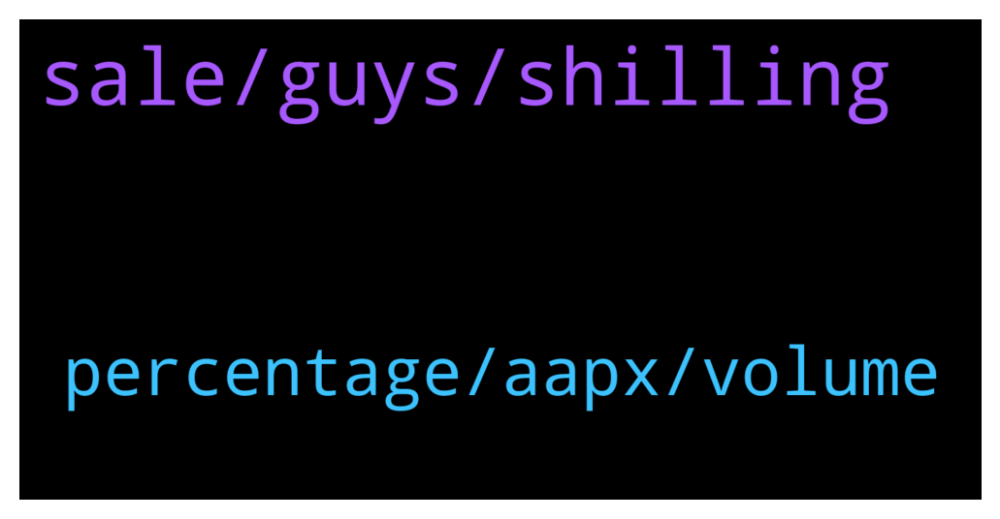

# **@ampnetapxchat**
 ## Analysis for **2022-01-23** - **2022-01-28**.

---

## 📊 **Basic Stats**

**n_messages_sent**: 53

---

---

## 🔝 **Top keywords and related messages**

1. **sale, guys, shilling**

    @North --- *Are we as the community allowed to talk about it here even or will posts be deleted? I had no idea it was even running yet, I thought you guys were still working on tokenomics and going to release more info* **--->** [TG Discussion](https://t.me/ampnetapxchat/36740)

    @North --- *@jakovtradingmentor what do you think about timing of any shilling to Chiliz community? They obviously have aligned interests and so would probably be interested here too, but we should take care to not get ahead of ourselves* **--->** [TG Discussion](https://t.me/ampnetapxchat/36775)

    @jakovtradingmentor --- *but the community, you guys, you can do so if you're motivated to* **--->** [TG Discussion](https://t.me/ampnetapxchat/36780)

    @Tinus_Tussengas_1984 --- *is there somewhere we can see the progress on the prudenzzafc fan token seed sale?* **--->** [TG Discussion](https://t.me/ampnetapxchat/36828)

    @North --- *I didn't mean you guys 😂 that's what we are here for. And frankly we will probably do it anyway unless you say the timing is unwise* **--->** [TG Discussion](https://t.me/ampnetapxchat/36781)

    @jakovtradingmentor --- *could you elaborate by what you mean with shilling to chilliz community?* **--->** [TG Discussion](https://t.me/ampnetapxchat/36776)

2. **percentage, aapx, volume**

    @mislavjavor --- *Hey all, the bar counts until hard cap is reached, the percentage until the hard cap i* **--->** [TG Discussion](https://t.me/ampnetapxchat/36808)

    @MelonHusk --- *Don't tell me Ampnet is raising more money?* **--->** [TG Discussion](https://t.me/ampnetapxchat/36814)

    @Tinus_Tussengas_1984 --- *thanks m8. that loading bar is looking strange btw... i assume its to see the progress in time to the deadline instead of the percentage of funding 😋* **--->** [TG Discussion](https://t.me/ampnetapxchat/36806)

    @jakovtradingmentor --- *well i'm told we as ampnet cant really go around and shill the projects on our platform, something about the legality around it doesnt allow us to do so* **--->** [TG Discussion](https://t.me/ampnetapxchat/36779)

    @jakovtradingmentor --- *ofc if raise is successful, which seems like it is, a percentage of that raise is going to ampnet for aapx buybacks* **--->** [TG Discussion](https://t.me/ampnetapxchat/36817)

    @North --- *Fomo will increase as it gets towards  $500K. No way this doesn't get funded. Great news and hopefully we get some more details for AmpNet once we know it's going ahead* **--->** [TG Discussion](https://t.me/ampnetapxchat/36773)

