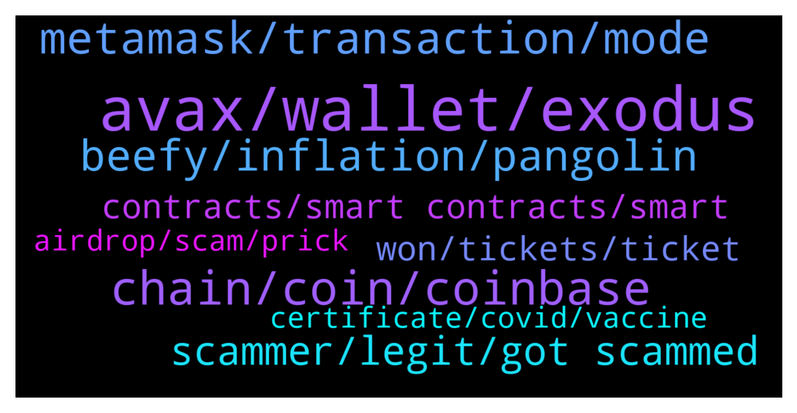

# **@avalancheavax**
 ## Analysis for **2022-01-27** - **2022-01-28**.

---

## 📊 **Basic Stats**

**n_messages_sent**: 162

---

---

## 🔝 **Top keywords and related messages**

1. **avax, wallet, exodus**

    @lord --- *I just looked, it does not look like that avax is on there yet, so if I want to convert it to something else to get it on to exodus like eth, btc, dai, what is the best way to do this* **--->** [TG Discussion](https://t.me/avalancheavax/325061)

    @lovingcrypto_mytelegram --- *Is AVAX running an airdrop currently* **--->** [TG Discussion](https://t.me/avalancheavax/324717)

    @nikaidocrypto --- *How to bridge UST to AVAX ?* **--->** [TG Discussion](https://t.me/avalancheavax/324699)

    @maverick21061 --- *Hi Guys. What's the best mobile wallet for avax atm?* **--->** [TG Discussion](https://t.me/avalancheavax/324793)

    @LONGDONGWONG --- *How do I go about bridging UST from Terra to AVAX* **--->** [TG Discussion](https://t.me/avalancheavax/324871)

    @Madmandan --- *Avax vs eth tx last 24 hours* **--->** [TG Discussion](https://t.me/avalancheavax/324723)

2. **chain, coin, coinbase**

    @Nicolas_A --- *Trust wallet, Coinbase wallet, Coin98 are some of the choices* **--->** [TG Discussion](https://t.me/avalancheavax/324795)

    @mehmet07btc --- *Guys in which cexes are native usdt and usdc traded* **--->** [TG Discussion](https://t.me/avalancheavax/324687)

    @Nicolas_A --- *you mean which ones have native usdt, usdc withdrawals to Avalanche ?* **--->** [TG Discussion](https://t.me/avalancheavax/324693)

    @oathtobarbatos --- *coinmarket? coingecko? I think you can see details about any coin on the snowtrace.io if you have the contract address of that token* **--->** [TG Discussion](https://t.me/avalancheavax/324730)

    @prezene --- *what site can I use to track price of any coin on AVAX -c chain* **--->** [TG Discussion](https://t.me/avalancheavax/324728)

    @oathtobarbatos --- *Check both etherscan and snowtrace and compare both charts, that could help* **--->** [TG Discussion](https://t.me/avalancheavax/324725)

3. **metamask, transaction, mode**

    @researchone --- *yeah, it keeps saying waiting for confirmation despite the fact that I approve the transaction on metamask* **--->** [TG Discussion](https://t.me/avalancheavax/324712)

    @researchone --- *hmm stil the same issue, any other recommendations?* **--->** [TG Discussion](https://t.me/avalancheavax/324715)

    @jacobseven --- *...fastest? I have a pending transaction for 8 hours now. Even ETH proper never did that* **--->** [TG Discussion](https://t.me/avalancheavax/324953)

    @LONGDONGWONG --- *network grinding to a halt again* **--->** [TG Discussion](https://t.me/avalancheavax/324903)

    @maverick21061 --- *Thanks bro. And why would it be say better than MetaMask* **--->** [TG Discussion](https://t.me/avalancheavax/324796)

    @r0lex --- *I got it to say this too, at the advanced stage.  Failed to write the report.* **--->** [TG Discussion](https://t.me/avalancheavax/324749)

4. **beefy, inflation, pangolin**

    @TalcHands --- *So the 32% inflation number I have seen on a couple websites is incorrect?* **--->** [TG Discussion](https://t.me/avalancheavax/324994)

    @r0lex --- *Why is everything Pangolin related PAUSED on Beefy Finance?* **--->** [TG Discussion](https://t.me/avalancheavax/324689)

    @r0lex --- *I'm at Beefy but I heard Midas is offering 17% with daily payouts* **--->** [TG Discussion](https://t.me/avalancheavax/324766)

    @Desmond --- *Fed not raising the prices it was a bluff all this while* **--->** [TG Discussion](https://t.me/avalancheavax/324740)

    @Briggsservic --- *I wonder why we complain when the market tanks, obviously if you in long term you know what you want tbh it’s awkward if I’m looking for short term gains I’d preferably farm my crypto n stack w my earning into my position* **--->** [TG Discussion](https://t.me/avalancheavax/324706)

    @Nicolas_A --- *It could be that the amount of unlocks from vesting this year amount to 20% of current supply. Anyway it’s just a bit weird to look at inflation for a protocol that’s like 15 months old and compare it to protocols who are years older* **--->** [TG Discussion](https://t.me/avalancheavax/324996)

5. **scammer, legit, got scammed**

    @lord --- *just had the following text, is this another scammer ...* **--->** [TG Discussion](https://t.me/avalancheavax/325053)

    @lord --- *isn't it comforting to know this place is just scammer central, no legit help on here* **--->** [TG Discussion](https://t.me/avalancheavax/325066)

    @Nicolas_A --- *Anyone who contacts you out of the blue is a scammer* **--->** [TG Discussion](https://t.me/avalancheavax/325054)

    @jacobseven --- *note, user "Rose" is a scammer* **--->** [TG Discussion](https://t.me/avalancheavax/324957)

    @Patrick --- *I can imagine how you feel dude...but it was clear it was a scam...if it's too good to be true...* **--->** [TG Discussion](https://t.me/avalancheavax/324806)

    @sn0wslide --- *(Wow - first comment from me in months and get hit with a scammer instantly… 🤦‍♂️)* **--->** [TG Discussion](https://t.me/avalancheavax/324788)

6. **contracts, smart contracts, smart**

    @lord --- *no does not support avalanche at this time, this is why i need to convert it to another token first, just wondering if anyone has a suggestion* **--->** [TG Discussion](https://t.me/avalancheavax/325045)

    @WPSmartContracts --- *Hi, we have a project called wp smart contracts that allow any user to deploy smart contracts in Avalanche C-Chain as well as many other chains, can any admin tell me if it is ok to post links about that here? Of course all related with Avalanche only, thanks* **--->** [TG Discussion](https://t.me/avalancheavax/325016)

    @Natethegreat762 --- *Can any avalanche experts comment on this paper?https://medium.com/@itsnear/what-avalanche-paper-is-not-c047cf512c16?s=09* **--->** [TG Discussion](https://t.me/avalancheavax/324939)

    @scarcitywhale --- *I’m not sure why someone having a “thick African accent” is relevant or necessarily means they don’t work for Avalanche. Your thought process is deeply problematic. Nonetheless, you’d be better off taking it and your questions to the Discord group for customer support.* **--->** [TG Discussion](https://t.me/avalancheavax/325093)

    @ihatetomatoesman --- *hello, is it possible to build an app on Avalanche Network if I have no programming experience 🤔 thank you so much for answering my questions* **--->** [TG Discussion](https://t.me/avalancheavax/325033)

    @WPSmartContracts --- *Ok thanks, seems like I cannot post urls, but anyway, if anyone is interested can google wp smart contracts and will reach us, there is a full sectiom dedicated to Avalanche C-Chain with a set of smart contracts ready to use, basically ERC-20 tokens, ERC-20 Staking contracts, and ERC-721 NFT Marketplaces, hope you enjoy it and we are open to feedback and suggestions* **--->** [TG Discussion](https://t.me/avalancheavax/325022)

7. **won, tickets, ticket**

    @rebel_puppy_wenchie --- *How do you tell which avalanche account on here is there real one? I now have 2 and they both say official! One has a pinned message the other doesn’t.* **--->** [TG Discussion](https://t.me/avalancheavax/324990)

    @sn0wslide --- *Avalanche summit website. Why’s it not working?! Anyone else get an email re tickets?* **--->** [TG Discussion](https://t.me/avalancheavax/324787)

    @bestcoderna --- *Join us for our Avalanche Weekly Wrapup call https://twitter.com/i/spaces/1eaKbNenBnaKX* **--->** [TG Discussion](https://t.me/avalancheavax/324915)

    @yasinokan --- *I think avalanche should give validators free tickets for their contributions to network* **--->** [TG Discussion](https://t.me/avalancheavax/324901)

    @MaestroKongrio --- *the summit site is offline… sound like an attack to start offering ticket here...* **--->** [TG Discussion](https://t.me/avalancheavax/324803)

    @oathtobarbatos --- *Be careful with anyone's DM and, remember, Avalanche administrators won't ask you for money and, they won't DM you first.* **--->** [TG Discussion](https://t.me/avalancheavax/324965)

8. **certificate, covid, vaccine**

    @Talux --- *I for one am glad that anti vaxxers aren't allowed* **--->** [TG Discussion](https://t.me/avalancheavax/324970)

    @seitanic --- *It's in Barcelona, Catalonia, which has abolished all vaccine mandates. So at this point it's not about where the event/venue is, but more about what the host desires. So in this case Avalanche is unnecessarily enforcing a vaccine mandate on attendees, sad times...* **--->** [TG Discussion](https://t.me/avalancheavax/324926)

    @neirenoir --- *Mostly because someone with a recent Certificate of Recovery is probably more protected against COVID than someone with a year old Certificate of Vaccination with two doses. Doesn't make sense not to accept all certificates.* **--->** [TG Discussion](https://t.me/avalancheavax/325037)

    @Shinycakes --- *Koennen wir mal gern mal in der defi Gruppe ausdiskutieren* **--->** [TG Discussion](https://t.me/avalancheavax/324971)

    @Shinycakes --- *Vaccinated superspreader covid shit show hopefully ends soon for more equality -.-* **--->** [TG Discussion](https://t.me/avalancheavax/324904)

    @DaveFrog1776 --- *Any news on the Avalanche summit in Barcelona? Some people saying it might be no go with current restrictions in the city* **--->** [TG Discussion](https://t.me/avalancheavax/324855)

9. **airdrop, scam, prick**

    @Smellthebull_ridetherun --- *I will give anyone who finds that prick who airdrop robbed my dumbass and ousts them to me, my car as a thiank you. No bs nothin special 2019 altima but outta principal its all yours, so i can beat this prick with my mybook and cut off his scum fingers* **--->** [TG Discussion](https://t.me/avalancheavax/324780)

    @Neha_Vermaiii --- *Alfheim Finance is releasing airdrop of 10,000 AFM to each wallet address* **--->** [TG Discussion](https://t.me/avalancheavax/325030)

    @neirenoir --- *No, WAGMI airdrop is not a scam* **--->** [TG Discussion](https://t.me/avalancheavax/324936)

    @oversovl --- *I think big airdrop scam happening right now, don't fall for it. The group is copy of this one.* **--->** [TG Discussion](https://t.me/avalancheavax/324769)

    @oathtobarbatos --- *Nope. If there's a group talking about airdrops then ignore and report it as soon as possible, it's a scam* **--->** [TG Discussion](https://t.me/avalancheavax/324718)

    @aelepe --- *Has anyone got idea what Wagmi airdrop is it?* **--->** [TG Discussion](https://t.me/avalancheavax/324927)

