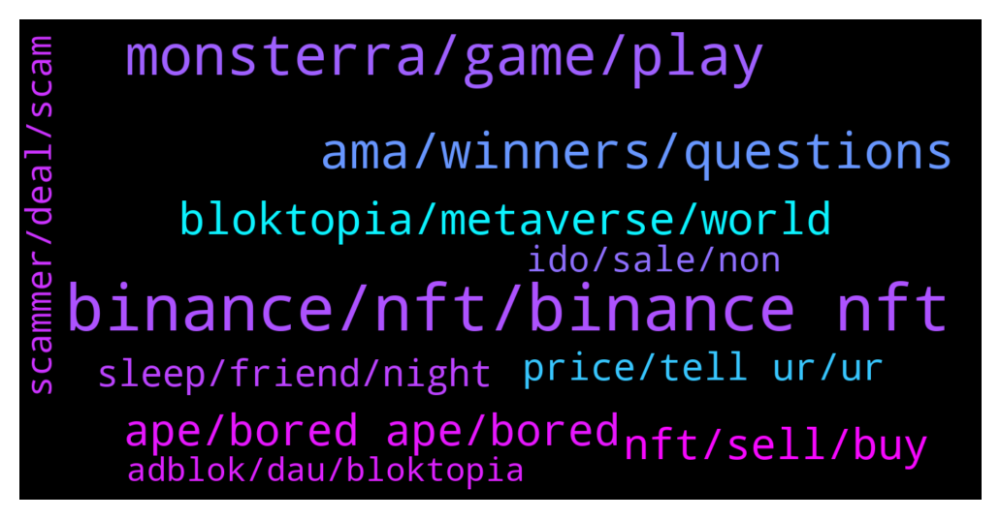

# **@binancenfts**
 ## Analysis for **2022-01-27** - **2022-01-28**.

---

## 📊 **Basic Stats**

**n_messages_sent**: 638

---

---

## 🔝 **Top keywords and related messages**

1. **binance, nft, binance nft**

    @NFTCollector1 --- *how can i transfer NFT from featured by binance to binance market place* **--->** [TG Discussion](https://t.me/binancenfts/445730)

    @NFTCollector1 --- *Dear follow member, one of the member in this group with name saNdEEPppp is a fraud.. he bought my nft offline but didn’t transfer money.  Please don’t engage with him* **--->** [TG Discussion](https://t.me/binancenfts/445407)

    @NFTCollector1 --- *he deposited the same NFT on binance and posted it for sell* **--->** [TG Discussion](https://t.me/binancenfts/445707)

    @sunrizer --- *Hi. Does anyone know when binance returns blocked amount on unwinning bids? It has been 3 days since the bidding ended and binancenft has not returned the amount. 🤔🤔* **--->** [TG Discussion](https://t.me/binancenfts/445014)

    @RealJassia --- *Mostly smart people get scammed. We deal many people, anyways it's a long debate. I request please never deal private only use Binance Marketplace. Binance Marketplace is best place for buying and selling NFT or Mystery Box .  Because here you are sure of 💯 of payment without any doubt as your NFT get sold.* **--->** [TG Discussion](https://t.me/binancenfts/445755)

    @semeerkv --- *sell your nft through on binance . Don't send to wallet. Scammers is everywhere be careful* **--->** [TG Discussion](https://t.me/binancenfts/445729)

2. **monsterra, game, play**

    @thangmd --- *These are some of the most important milestones for our Monsterra game project. Yet, I think the community would love to have a comprehensive view on our well-defined roadmoad. Here are the other development stages for your information: https://whitepaper.monsterra.io/roadmap/2021-2022-roadmap* **--->** [TG Discussion](https://t.me/binancenfts/445233)

    @NeyNeySGD13 --- *What's up @thangmd, With this #AMA, I understand better the purpose of #Monsterra, it is rather interesting, I have one questions:  What are the optimizations made so that the game is not extremely advantageous for people who have put lot of money and people who just put little in the game and that Play2Earn remains a Play2Earn and not a Pay2Win ?   Thanks #Monsterra* **--->** [TG Discussion](https://t.me/binancenfts/445263)

    @Atbrightone --- *I was reading your white paper and you describe monsterra as a free to play and earn Blockchain game However there are thousands of other Blockchain games that refer to themselves as being free to play and earn but in reality a player has to purchase very expensive in-game items or pay huge entry fees to be able to earn otherwise you'd play for weeks if not months without earning anything, Can you guarantee that Monsterra will indeed be different from other games and one can play with little or no investment and actually earn ? @thangmd #Monsterra* **--->** [TG Discussion](https://t.me/binancenfts/445275)

    @thangmd --- *The game set foot in a fictional world and revolves around farming, property building, and battling other lands with the magical creatures named Mongen. The design of Monsterra combines the free-to-play and free-to-earn model, which allows millions of gaming enthusiasts fun and profit with no initial investment. To make it clear, we can say that Monsterra prioritizes developing the game to elevate user experience: attractive graphics, diverse missions, addictive gameplay from food production, animal breeding to building your own land, entering fierce battle modes from leading troops to conquering new lands, beating dreadful bosses, raiding other players' lands and confronting forces head-on other real player's troops. Thus, we think Monsterra will be able to attract many more players to come in the long term.* **--->** [TG Discussion](https://t.me/binancenfts/445210)

    @thangmd --- *The gaming sector is expanding at a rapid pace. With that hasty growth, encountering tough obstacles and backlog problems is inevitable. After conducting research on popular games, Monsterra team found out that there are several problems faced by both gamers and games publishers including:  - High Entry Fee - Poorly Designed Gameplay - Imbalanced Tokenomic Model - High gas fee rate* **--->** [TG Discussion](https://t.me/binancenfts/445212)

    @thangmd --- *That's the motivation for us to build Monsterra which is the first premium game in our Monsterra Universe with various innovative solutions to the existing problems above. - Free-To-Play-To-Earn Game Mechanics: Monsterra lets gamers experience a full-fledged core game for free before actually spending on it. In other words, players can enjoy the farming and nurturing ecosystem in Monsterra for free first. Once they find the game addictive and worth investing in, they can spend their money on it afterward. - Play-For-Fun Game Model: Monsterra elevates the game-fun aspect with exciting and inspiring gameplay. We offer an interesting farming ecosystem and 4 fierce battle modes for users to enter with different rewarding structures and battle formats. - Balanced In-Game Economy: Monsterra is well designed with an innovative dual token model to slow down inflation and sustain the in-game balance. We try to keep a balanced amount between the minted and burned in-game token so that the game ecosystem can stay healthy for years to come. - Gas Fee Solution: Users pay no gas fee when getting started with Monsterra game. They will only be charged for transaction fee when converting their assets into NFT items.* **--->** [TG Discussion](https://t.me/binancenfts/445213)

3. **ama, winners, questions**

    @semeerkv --- *Thanks @Kenikky @PaddyCarroll great AMA 👏* **--->** [TG Discussion](https://t.me/binancenfts/447224)

    @YilanGulsum --- *im so glad youre one of the winners.* **--->** [TG Discussion](https://t.me/binancenfts/447239)

    @telapiaex69 --- *I changed my name user name and dp  On the AMA segment they select my question and I'm a active user from this group  I hope I have been qualified for the AMA reward* **--->** [TG Discussion](https://t.me/binancenfts/445558)

    @telapiaex69 --- *But today I was selected on #Monsterra  AMA   If I change my username name is there any effect on the reward distribution ??* **--->** [TG Discussion](https://t.me/binancenfts/445522)

    @cryptotwillight --- *Is it an special event for our community* **--->** [TG Discussion](https://t.me/binancenfts/446849)

    @thangmd --- *can’t wait to see questions from you !* **--->** [TG Discussion](https://t.me/binancenfts/445249)

4. **bloktopia, metaverse, world**

    @alansheva97 --- *People always comparing Bloktopia with other top metaverse projects, such like The Sandbox, Decentraland, etc. What's your feeling and opinion about that ? #Bloktopia* **--->** [TG Discussion](https://t.me/binancenfts/447132)

    @AbirIts --- *Yes right, lol. Today there is an AMA of Bloktopia which is also metaverse project* **--->** [TG Discussion](https://t.me/binancenfts/446844)

    @Helinajobyd --- *Guyz, please check out. Bloktopia is very profitable.* **--->** [TG Discussion](https://t.me/binancenfts/446865)

    @emsengul --- *What will be the role of the metaverse for humans in the future, and where will Bloktopia be in that?* **--->** [TG Discussion](https://t.me/binancenfts/447181)

    @LokeshKamal --- *Bloktopia mid 2022 easy cross 1$* **--->** [TG Discussion](https://t.me/binancenfts/446363)

    @PaddyCarroll --- *Bloktopia is a cyberpunk, dystopian inspired virtual reality skyscraper, with world class user experience. Visitors can engage in basic or advanced learning from some of the world leading minds in the Crypto industry - earn revenue, play games with friends, build networks and much more. Think of Bloktopia as a shopping mall, where instead of just retail, each store has a different project, exchange, influencer or crypto brand offering an immersive customer experience. And just because I love crypto, it doesn’t mean that I don’t also like trainers, sport and gaming. Bloktopia will cater for huge global brands in high interest categories. Layered on top of that are places that people can hang out with their friends. And world class event spaces that allow for major sporting talent and musicians to join the metaverse too.* **--->** [TG Discussion](https://t.me/binancenfts/447087)

5. **ape, bored ape, bored**

    @c_hinmay --- *Bored Ape ... bargains accepted 🙂* **--->** [TG Discussion](https://t.me/binancenfts/444962)

    @nrlnft --- *“BORED APE EX” now avaılable on sale 🤜🤛* **--->** [TG Discussion](https://t.me/binancenfts/445165)

    @decentralized_person --- *Place your Bid! 14.89$ Search: girl from meta universe 428* **--->** [TG Discussion](https://t.me/binancenfts/445419)

    @Ramuk_Arvind --- *Lowest price for bidding on bnb* **--->** [TG Discussion](https://t.me/binancenfts/446538)

    @JustinLKW --- *Top collection Badass Ape, rank 11* **--->** [TG Discussion](https://t.me/binancenfts/446349)

    @OzanberkZ79 --- *NFT, one of the most special of the Bored Ape Series, is for sale. You do not want to miss such a beautiful product at such a reasonable price, and a very beautiful watch from the Flora 1 series is for sale at a very cheap price, you should go and have a look.   BORED APE #10159▵34╳55▵NFT PRIDE  Flora 1 {Piece 25 of 50}* **--->** [TG Discussion](https://t.me/binancenfts/445171)

6. **nft, sell, buy**

    @MarcoForex --- *Not for now, i just buy and sell nft* **--->** [TG Discussion](https://t.me/binancenfts/446472)

    @Naznaz98 --- *Here u can tell others about ur NFT.  When u want release bunch of 10k.. b4 that u need to get promote in social media. So that u will get some decent price for ur nfts* **--->** [TG Discussion](https://t.me/binancenfts/446450)

    @MarcoForex --- *Request of NFT before pay, Buy Offline, Selling Project with Crypto pay* **--->** [TG Discussion](https://t.me/binancenfts/446459)

    @BLyricss --- *So please on which platforms can I create and sell NFTs. 🙏* **--->** [TG Discussion](https://t.me/binancenfts/444755)

    @Viru141184 --- *I don't know how to sell NFT* **--->** [TG Discussion](https://t.me/binancenfts/446212)

    @AndriiJa --- *I Nft sell my NFT FOR 5$(* **--->** [TG Discussion](https://t.me/binancenfts/446196)

7. **price, tell ur, ur**

    @Yjuuu7 --- *Anybody  interested  tell  ur offer  here* **--->** [TG Discussion](https://t.me/binancenfts/444993)

    @msatasci --- *Please give him an offer 🥺* **--->** [TG Discussion](https://t.me/binancenfts/446680)

    @Yjuuu7 --- *Tell ur price guys and buy it* **--->** [TG Discussion](https://t.me/binancenfts/446055)

    @Yjuuu7 --- *Anyone interseted in buying these two tell ur offers* **--->** [TG Discussion](https://t.me/binancenfts/446022)

    @Yjuuu7 --- *Anybody interested in buying these two Tell ur price if seriously interested* **--->** [TG Discussion](https://t.me/binancenfts/444927)

    @Noldor_live --- *Best price ever, cheaper then market price* **--->** [TG Discussion](https://t.me/binancenfts/446000)

8. **sleep, friend, night**

    @captainbnb --- *🤣🤣 don't touch your phone when you are going to sleep* **--->** [TG Discussion](https://t.me/binancenfts/446296)

    @coopa69 --- *Why you laughing man, is it joke?* **--->** [TG Discussion](https://t.me/binancenfts/444898)

    @thisisomgart --- *:)) are you angry to me ?* **--->** [TG Discussion](https://t.me/binancenfts/445859)

    @ting6898 --- *Good day is over, hope tomorrow will be better, good night😴* **--->** [TG Discussion](https://t.me/binancenfts/444576)

    @AnneWen --- *Don't look at the past as lonely, because it will never turn back. Find ways to improve the present because that's when you boldly move forward into the future.* **--->** [TG Discussion](https://t.me/binancenfts/445531)

    @RealJassia --- *Okay guys catch you back after waking up 😂 lol  Good Night 👍* **--->** [TG Discussion](https://t.me/binancenfts/446294)

9. **scammer, deal, scam**

    @NFTCollector1 --- *its already under scammer list sameer KV told me* **--->** [TG Discussion](https://t.me/binancenfts/445725)

    @RealJassia --- *Good to learn lesson without getting scam* **--->** [TG Discussion](https://t.me/binancenfts/445741)

    @c_hinmay --- *Anyone asking you to make any deal outside the marketplace is a scammer* **--->** [TG Discussion](https://t.me/binancenfts/445735)

    @NFTCollector1 --- *the guy we scammed me.. change his user id to @balwantsinghh* **--->** [TG Discussion](https://t.me/binancenfts/446481)

    @RealJassia --- *Sorry Man please be careful next time. You can tagg him here we can report his account. You have done deal in private. And we never recommend private deal* **--->** [TG Discussion](https://t.me/binancenfts/445723)

    @NFTCollector1 --- *how i am offtopic.. i am reporting a scammer here* **--->** [TG Discussion](https://t.me/binancenfts/446967)

10. **ido, sale, non**

    @Kenikky --- *Is this project open to non-crypto people?* **--->** [TG Discussion](https://t.me/binancenfts/445227)

    @telapiaex69 --- *Why do you think non-crypto people will interested on your game ?? Do you have any YouTube or any other social media platform to see your game details ?* **--->** [TG Discussion](https://t.me/binancenfts/445296)

    @PaddyCarroll --- *The crypto industry is fragmented and new comers to the space don’t really know where to start and who to trust. Our aim is to help fix that by offering a platform which is built for crypto and NFT enthusiasts.* **--->** [TG Discussion](https://t.me/binancenfts/447086)

    @thangmd --- *Yes this project is open to non-crypto people with free-to-play mechanics and no initial investment and we can reach out not only people from crypto space but also traditional gamers* **--->** [TG Discussion](https://t.me/binancenfts/445230)

    @Thikase759 --- *You told that users precede crypto information and intended content in one place. Could users need to add their own wallet here?#Bloktopia* **--->** [TG Discussion](https://t.me/binancenfts/447159)

    @Kenikky --- *How, or through which partnerships do you plan on utilising to share your product onto the normal consumers - especially non-crypto users?* **--->** [TG Discussion](https://t.me/binancenfts/445228)

