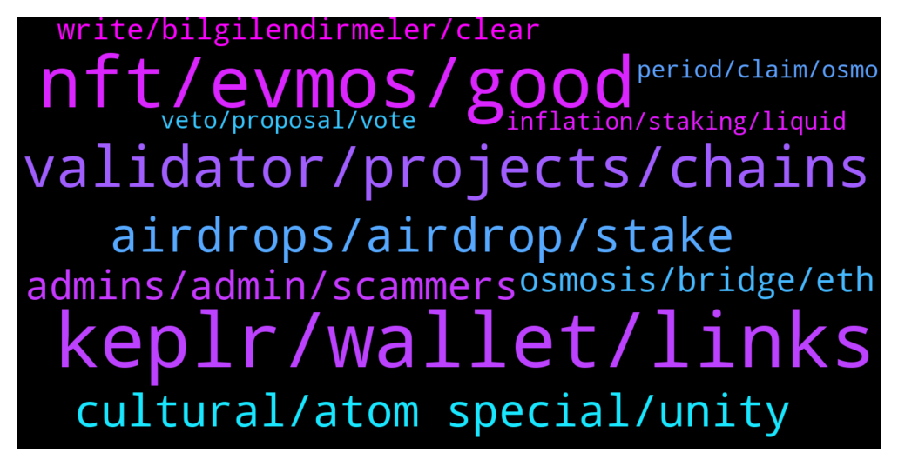

# **@cosmosproject**
 ## Analysis for **2022-01-27** - **2022-01-28**.

---

## 📊 **Basic Stats**

**n_messages_sent**: 374

---

---

## 🔝 **Top keywords and related messages**

1. **keplr, wallet, links**

    @bmx777 --- *Keprl and ledger live with the same account show a different balance* **--->** [TG Discussion](https://t.me/cosmosproject/482559)

    @rico_007k --- *hi, how can one add bitsong to Kepler wallet ? manually, without connecting random websites* **--->** [TG Discussion](https://t.me/cosmosproject/481777)

    @ZoltanAtom --- *Hi there,It’s Starport! Join them to be stay updated ;  https://discord.gg/starport* **--->** [TG Discussion](https://t.me/cosmosproject/482011)

    @AtomJazz --- *We actually have a specialized channel for Twitter posts like this. You're welcome to join https://t.me/ATOMCosmonauts* **--->** [TG Discussion](https://t.me/cosmosproject/482434)

    @$SENSEI PEGASUS Morel --- *Hi Please confirm this: I have to put the seed phrase of my exodus wallet on kelpr wallet to receive my aidrop?* **--->** [TG Discussion](https://t.me/cosmosproject/482037)

    @<UNK> --- *Witch wallet is better?? Cosmosation or kepler??* **--->** [TG Discussion](https://t.me/cosmosproject/481751)

2. **nft, evmos, good**

    @Satoshi_2009 --- *But Users are concerned about investment* **--->** [TG Discussion](https://t.me/cosmosproject/482316)

    @tokenativo --- *see in the view of the investor... that is what really counts...* **--->** [TG Discussion](https://t.me/cosmosproject/482274)

    @AtomJazz --- *Dev said on the last video with Cryptocito that this is actually coming very soon. Will be a cool feature* **--->** [TG Discussion](https://t.me/cosmosproject/482082)

    @ShashidharS1 --- *No like its better to do marketing before someone else comes along with almost same specs and marketing* **--->** [TG Discussion](https://t.me/cosmosproject/482511)

    @ZoltanAtom --- *Also yes,Starport will support new projects. Look at this one too;  https://twitter.com/starporthq/status/1486764190144479233?s=21* **--->** [TG Discussion](https://t.me/cosmosproject/482258)

    @ZoltanAtom --- *There will be Omniflix, Evmos launch on February! Join their communities;  https://t.me/OmniFLixChat  https://t.me/EvmosOrg* **--->** [TG Discussion](https://t.me/cosmosproject/481988)

3. **validator, projects, chains**

    @ZoltanAtom --- *💥INTERCHAIN SECURITY COMING TO COSMOS HUB! 💥   🟪Interchain Security will allow Cosmos chains to lease security to each other. What this means, in practice, is that validators on one chain (the security provider) will be able to validate on another (the security consumer).  Earning Rewards On Many Chains  🟪Interchain Security will allow ATOM holders to earn staking rewards on a large number of Cosmos chains, just by staking their ATOMs. Consumer chains will benefit both from robust security from the Cosmos Hub validator set, and by getting their tokens in the hands of the Cosmos community of early adopters.  📄 For More Details Read This Blog Post* **--->** [TG Discussion](https://t.me/cosmosproject/482259)

    @ZoltanAtom --- *There is no such Platform at Cosmos. Because at Cosmos each blockchain is sovereign specific application.   If you like to launch a project at Cosmos,you should go through Starport. And most likely new projects has no private sale, they distribute their tokens to Atom stakers.* **--->** [TG Discussion](https://t.me/cosmosproject/482017)

    @staycat1on --- *Kinda of holy city of cosmos* **--->** [TG Discussion](https://t.me/cosmosproject/482646)

    @Satoshi_2009 --- *I checked Bro I really appreciate for Cosmos world and their achievements but maintaining them in terms of price and long term duration makes sense to prove that High APY is just not part of slow rug pull. But 80% drop and each passing day high inflation is hurting user and their investment in last what they will do you know well. Make a solid sustainable plan rather than just attracting, Cosmos is still good and more stable in terms of APY than other it knows high APY is never being a good solution as in last its painful for all* **--->** [TG Discussion](https://t.me/cosmosproject/482322)

    @AtomJazz --- *In Cosmos every dAPP is fully sovereign application specific L1 chain. DVPN runs on Cosmos stack but Cosmos hub doesn't have any control over it* **--->** [TG Discussion](https://t.me/cosmosproject/482326)

    @ZoltanAtom --- *It doesn’t mean that “VCs will fund the new projects at Cosmos”   As I understand you would like that big Vc companies should come and fund new projects at Cosmos? What kind of business model do you think is better to fund new projects ?   As I share it with you, Starport is the official Launchpad at Cosmos. You do not need big capital to launch a blockchain which sovereign, scalable,interoperable!   Look at the past examples;   Stargaze? Stargaze is the One of the CosmosHub validator. Atom stakers funded the validator and validator did turn their dreams to reality! Juno another example. Omniflix is already another validator at Cosmos ecosystem chains. More coming…  The key problem at Cosmos is “Not funding” , really issue is that developers have their habits “how to deploy their protocols to Eth or smart contracts platforms”  They have their own culture to do this long time.   Starport coming to show itself to developers soon “hey,I am here and give full support to your ideas,your dreams”   I know that you concerns related with funding projects is right but it’s not like anyone don’t think this and not bothering themself.   Have a little more patience please, pieces are coming together. Until now “infrastructure were prepared  and still” but anymore with Starport things will be changing.   To be honest with you, I wouldn’t like to see big VCs companies at Cosmos and how they like to dump their tokens to retails!  Changes are painful! But Cosmos vision will change many “habits” at Crypto.* **--->** [TG Discussion](https://t.me/cosmosproject/482296)

4. **airdrops, airdrop, stake**

    @GerryOkwy --- *This is showing me Airdrop and not where to stake atom* **--->** [TG Discussion](https://t.me/cosmosproject/482466)

    @crypt0evil --- *Where i can check all my airdrops? :)* **--->** [TG Discussion](https://t.me/cosmosproject/482185)

    @ZoltanAtom --- *Keplr or Cosmostation are recommended wallets.Claiming process of airdrop happens through Keplr. So you will need to use Keplr wallet eventually.   Do not stake your Atoms with exchanges validators Do not choose validators which offer 0 commission* **--->** [TG Discussion](https://t.me/cosmosproject/481990)

    @ZoltanAtom --- *You need Keplr wallet to claim your airdrops. Here is the guide “how to import your Cosmos account to Keplr”   https://medium.com/chainapsis/how-to-use-keplr-wallet-40afc80907f6* **--->** [TG Discussion](https://t.me/cosmosproject/482040)

    @TalcHands --- *Is there a mobile wallet where I can stake and be eligible for airdrops?* **--->** [TG Discussion](https://t.me/cosmosproject/482617)

    @<UNK> --- *Can i participate in airdrops with cosmosation??* **--->** [TG Discussion](https://t.me/cosmosproject/481755)

5. **cultural, atom special, unity**

    @staycat1on --- *Historical and cultural difference only, but L1 is created equal in structure. So atom is exactly L1, but with historical/cultural/spiritual uniqueness.* **--->** [TG Discussion](https://t.me/cosmosproject/482644)

    @staycat1on --- *There should be some cultural spiritual historical uniqueness to make Atom special* **--->** [TG Discussion](https://t.me/cosmosproject/482637)

    @AtomJazz --- *Not just ATOM but the whole Cosmos ecosystem* **--->** [TG Discussion](https://t.me/cosmosproject/482526)

    @AtomJazz --- *ATOMs community should do the same and the same goes for Sifchain* **--->** [TG Discussion](https://t.me/cosmosproject/482490)

    @Johnson --- *Not trying to fud, is there a particular reason why atom is down at the moment ? Did I miss any announcements ?* **--->** [TG Discussion](https://t.me/cosmosproject/482660)

    @ShashidharS1 --- *Yeah but interoperability is the speciality of atom right?* **--->** [TG Discussion](https://t.me/cosmosproject/482525)

6. **admins, admin, scammers**

    @James --- *I know. Absolutely m'fkrs. Getting DM's all the time asking for seed phrases. It kills me when they trick a dude.* **--->** [TG Discussion](https://t.me/cosmosproject/481675)

    @Contents_unknown --- *Where can I report a admin scammer* **--->** [TG Discussion](https://t.me/cosmosproject/482385)

    @tejpalaux --- *So many scammers.. damm  Please stay vigilant just keep blocking the suckers 🤣😂* **--->** [TG Discussion](https://t.me/cosmosproject/481673)

    @cryptonats1 --- *Ahh love it when scammers dm. They love the pics I send.* **--->** [TG Discussion](https://t.me/cosmosproject/481653)

    @AtomJazz --- *Those are impersonators. No real admin will ever DM you first* **--->** [TG Discussion](https://t.me/cosmosproject/482386)

    @AtomJazz --- *If anyone DMed you to do verification block him immediately* **--->** [TG Discussion](https://t.me/cosmosproject/482367)

7. **osmosis, bridge, eth**

    @ZoltanAtom --- *Oh so you are saying that osmosis, Juno are not successful ? Their business plan was a bad idea ?* **--->** [TG Discussion](https://t.me/cosmosproject/482268)

    @crypto4life4eva --- *Can I transfer my UST on osmosis to ETH or TERRA on gravity? I can’t seem to work it out* **--->** [TG Discussion](https://t.me/cosmosproject/482120)

    @memegoldfrog --- *hi how can i transfer my atom from cosmos to osmosis net* **--->** [TG Discussion](https://t.me/cosmosproject/482118)

    @abratusz --- *"I think Osmosis governance should choose one bridge solution to use as its primary service provider to bring over assets from Ethereum" – @sunnya97* **--->** [TG Discussion](https://t.me/cosmosproject/482486)

    @Cordtus --- *Nobody is being a bridge maxi my friend. Settle down.* **--->** [TG Discussion](https://t.me/cosmosproject/482484)

    @Roundersyy --- *with gravity bridge now can we send luna or atom to eth？* **--->** [TG Discussion](https://t.me/cosmosproject/481607)

8. **write, bilgilendirmeler, clear**

    @TolayHaytham --- *Even  it asked me need to write , but maybe write  anything  cause  it's  unnecessary* **--->** [TG Discussion](https://t.me/cosmosproject/482205)

    @staycat1on --- *Your opinion means similar to what I mean* **--->** [TG Discussion](https://t.me/cosmosproject/482641)

    @JasonOfArgonaut --- *One of the dicks figured out I forgot to turn off calls.  At least he reminded me to do that.* **--->** [TG Discussion](https://t.me/cosmosproject/481680)

    @Celikkartal --- *CosmoTurk⚛ (@TurkCosmonaut) adlı kişiye göz at: https://twitter.com/TurkCosmonaut?t=zfa52Lhic-Y2ofHE_Cq4lA&s=09* **--->** [TG Discussion](https://t.me/cosmosproject/482086)

    @AtomJazz --- *But it's open to different interpretations I guess* **--->** [TG Discussion](https://t.me/cosmosproject/482627)

    @ShashidharS1 --- *Yes yes thats what i meant to say* **--->** [TG Discussion](https://t.me/cosmosproject/482530)

9. **veto, proposal, vote**

    @staycat1on --- *What is the meaning and criteria to vote “no with veto”?* **--->** [TG Discussion](https://t.me/cosmosproject/481796)

    @ZoltanAtom --- *Hi there,I don’t understand this one too. “yes” or “no” should be more than enough to understand people opinions about proposals. I guess “no with veto” is strongly “No”* **--->** [TG Discussion](https://t.me/cosmosproject/481799)

    @Xahriwi --- *No with veto is for malicious proposals and votes to not return the deposit required to submit a proposal* **--->** [TG Discussion](https://t.me/cosmosproject/481823)

    @ZoltanAtom --- *Correct.  If mostly there is “no with veto” at the proposal,means your Atoms which you deposit for proposal burn!* **--->** [TG Discussion](https://t.me/cosmosproject/481825)

    @staycat1on --- *This is going to be important. If I don’t have the power to vote “veto”, my “no”would become invalid vote.* **--->** [TG Discussion](https://t.me/cosmosproject/481810)

    @alkan58 --- *Is there any way to see if I have voted on past gov proposals?* **--->** [TG Discussion](https://t.me/cosmosproject/481713)

10. **inflation, staking, liquid**

    @AtomJazz --- *Currently we have dynamic inflation in Cosmos between 7-20%. The more people stake the lower the inflation but if staking ratio falls below 60% inflation starts rising so people are incentivized to stake again (or get diluted)* **--->** [TG Discussion](https://t.me/cosmosproject/481904)

    @Ayo --- *I will be getting 14% every 6 seconds??* **--->** [TG Discussion](https://t.me/cosmosproject/481888)

    @Buri7xxx --- *We get 7% in the worst case, did I understand that correctly* **--->** [TG Discussion](https://t.me/cosmosproject/481905)

    @Buri7xxx --- *do we get the 14% forever or can it be less later, for example 8% ?* **--->** [TG Discussion](https://t.me/cosmosproject/481902)

    @AtomJazz --- *7% inflation yes but since not everyone is staking APY is a bit higher. This will probably change with liquid staking feature. We're probably going to see fixed inflation gravitating towards 0 eventually* **--->** [TG Discussion](https://t.me/cosmosproject/481909)

    @MrCoinnaisseur --- *That would be like 6 million % per year otherwise lol* **--->** [TG Discussion](https://t.me/cosmosproject/481893)

