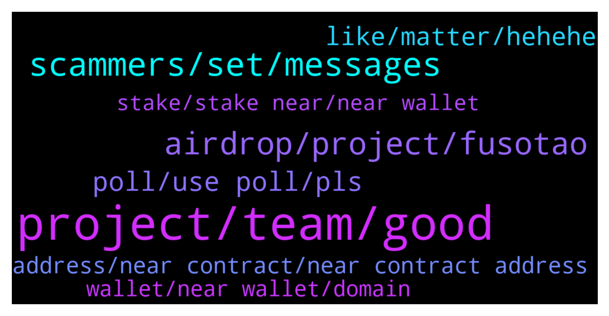

# **@cryptonear**
 ## Analysis for **2022-01-27** - **2022-01-28**.

---

## 📊 **Basic Stats**

**n_messages_sent**: 510

---

---

## 🔝 **Top keywords and related messages**

1. **project, team, good**

    @bailey_12 --- *Hey gangz, I am hosting a Puzzle Contest on our NEAR Reddit. Make sure to check it out.   https://twitter.com/BaileyVu12/status/1486599859905859585* **--->** [TG Discussion](https://t.me/cryptonear/299786)

    @upance --- *This is excellent project for the future with strong team, a transparent, planned and project roadmap. it will be successfulI. Always be waiting for the progress of this project.* **--->** [TG Discussion](https://t.me/cryptonear/301438)

    @GeorgePro1 --- *Oh that misfit is nice and unique 😅* **--->** [TG Discussion](https://t.me/cryptonear/299760)

    @momotazchy --- *A good project and strong team in a predictable and transparent road map, planned and projected. I think in the near future we will see an unprecedented growth of this project.* **--->** [TG Discussion](https://t.me/cryptonear/300862)

    @RiyanRiyadlunNajih --- *so innovative happy to take participate in such huge project.  You guys are very hard working and I am pretty sure you will reach to the Moon very soon..    #NEARProtocol* **--->** [TG Discussion](https://t.me/cryptonear/301180)

    @rahulgoel007 --- *We need to learn a lot from that larry😂* **--->** [TG Discussion](https://t.me/cryptonear/299864)

2. **scammers, set, messages**

    @oppzsmoKe --- *Dude I always do I like messing with them since they like messing with us* **--->** [TG Discussion](https://t.me/cryptonear/299599)

    @harryfrottercrypto --- *Imagine if they put the effort they did in scamming in getting a job* **--->** [TG Discussion](https://t.me/cryptonear/299623)

    @smartinvestor20212021 --- *Scammers all get reported lol plz dm me more scammers I enjoy doing this for free* **--->** [TG Discussion](https://t.me/cryptonear/299740)

    @TheGo1denBull --- *Everybody globally has a nice group of scammers. But hey if you want to have convos with scammers have fun with them lol* **--->** [TG Discussion](https://t.me/cryptonear/299606)

    @CryptoNerdyy --- *Tell your teach to take a look whit my issue ticket(3167) i can spam this every single day* **--->** [TG Discussion](https://t.me/cryptonear/299419)

    @TheGo1denBull --- *To them that's a profession unfortunately* **--->** [TG Discussion](https://t.me/cryptonear/299625)

3. **airdrop, project, fusotao**

    @bailey_12 --- *Hey gangz, 1 Airdrop from Bitstore is not enough ?? Bow Bow, another Airdrop is on the line to hunt down  https://twitter.com/BaileyVu12/status/1486980604097089538* **--->** [TG Discussion](https://t.me/cryptonear/303901)

    @larry_lang --- *Hello all, welcome to NEAR Protocol Official channel. Thanks for joining us on the NEAR X Bit.Store special airdrop 😍😍 https://twitter.com/NEAR_Blockchain/status/1486904937925812225    With that being said, we would love u to: - Check the pinned welcome message for useful links + community rules 🎉  - For further support feel free to DM our admins  @kv9990 @larry_lang @Kripto_Raptor @iamkemoo @FritzWagner @iforbusiness2 @GeorgePro1 @bailey_12   ( ADMINS NEVER DM FIRST,BEWARE OF SCAMMERS)* **--->** [TG Discussion](https://t.me/cryptonear/300567)

    @larry_lang --- *we dont have any airdrop event now, sir, becareful, it could be scam* **--->** [TG Discussion](https://t.me/cryptonear/300463)

    @kv9990 --- *Hey new people, don't forget to checkout this AIRDROP!!!!* **--->** [TG Discussion](https://t.me/cryptonear/304119)

    @mayanktanwar2 --- *Hey i submit form i m eligible to Airdrop?* **--->** [TG Discussion](https://t.me/cryptonear/300458)

    @Shubh007123 --- *Can You Announce this here so everyone can can join our cahnnel , also there will Airdrop for near early adopters* **--->** [TG Discussion](https://t.me/cryptonear/299985)

4. **poll, use poll, pls**

    @Stelcy_Chelsey --- *Hey what's up? Hope you are doing good* **--->** [TG Discussion](https://t.me/cryptonear/299486)

    @Aflatoon123 --- *After hct seeing u here.  Welcome* **--->** [TG Discussion](https://t.me/cryptonear/300011)

    @NearFritz --- *Yep I am going better, just headache, but I am going to be fine soon. Thanks for caring* **--->** [TG Discussion](https://t.me/cryptonear/299489)

    @spectre011 --- *Lets go Whats the question bro Hit me* **--->** [TG Discussion](https://t.me/cryptonear/299659)

    @Mas98777 --- *Hi all Glas to meet you all* **--->** [TG Discussion](https://t.me/cryptonear/304024)

    @spectre011 --- *My good mod  Good morning bro* **--->** [TG Discussion](https://t.me/cryptonear/299669)

5. **like, matter, hehehe**

    @jas_hue --- *Then what's the essence of this community* **--->** [TG Discussion](https://t.me/cryptonear/299644)

    @mayanktanwar2 --- *I think that post is the reason people are joining* **--->** [TG Discussion](https://t.me/cryptonear/300625)

    @rahulgoel007 --- *Not like the last time 20k joined in 2 days* **--->** [TG Discussion](https://t.me/cryptonear/311090)

    @NearFritz --- *Yep, maybe it is even helpful, people learn that it is not good to be naive. Who knows...if later that can save a life ? hahaha half kidding* **--->** [TG Discussion](https://t.me/cryptonear/299627)

    @javachip_x --- *Wait, why suddenly a lot of people join in and say "Hi" and "Good project"* **--->** [TG Discussion](https://t.me/cryptonear/309754)

    @NearFritz --- *Hehehe well we are all here because we love freedom, and we know Web3 will help people in that matter, for example DAOs... I am a true believer on DAOs it would change our society from the bones.* **--->** [TG Discussion](https://t.me/cryptonear/299654)

6. **address, near contract, near contract address**

    @crypto_j0nes --- *hi guys..want to withdraw NEAR from binance and i have an option "NEAR PROTOCOL" as network..is this aurora network or it means something else ?!* **--->** [TG Discussion](https://t.me/cryptonear/299912)

    @rahulgoel007 --- *Here is near contract address  $NEAR contract address on AURORA  "0xC42C30aC6Cc15faC9bD938618BcaA1a1FaE8501d"  $NEAR contract address on ETH "0x85F17Cf997934a597031b2E18a9aB6ebD4B9f6a4"  $NEAR contract address on BSC "0x1fa4a73a3f0133f0025378af00236f3abdee5d63"* **--->** [TG Discussion](https://t.me/cryptonear/310361)

    @crypto_j0nes --- *i see..then need to deposit them on metamask  binance network and then bridge them to aurora* **--->** [TG Discussion](https://t.me/cryptonear/299920)

    @kv9990 --- *Go to https://rainbowbridge.app/ Select Aurora Network and connect wallet. It'll add for u 😉* **--->** [TG Discussion](https://t.me/cryptonear/301684)

    @hanlei19 --- *how to add aurora network to metamask?* **--->** [TG Discussion](https://t.me/cryptonear/301675)

    @ShubhamK_45 --- *Can you tell which BSC address to submit?* **--->** [TG Discussion](https://t.me/cryptonear/307361)

7. **wallet, near wallet, domain**

    @Taurus990 --- *Hello everyone, please how do i send NFT’s from my NEAR wallet to ETH wallet ?* **--->** [TG Discussion](https://t.me/cryptonear/299522)

    @freakadele --- *Hello there, is there a way to send  near across wallets in an anonymous way?* **--->** [TG Discussion](https://t.me/cryptonear/312640)

    @Seej01 --- *Would you recommend this sir? Or just stick to the near wallet?* **--->** [TG Discussion](https://t.me/cryptonear/299855)

    @sachinmurali03 --- *Hey guys. Does Near wallet works fine for you all?* **--->** [TG Discussion](https://t.me/cryptonear/300427)

    @Seej01 --- *Does near wallet not ask for a password?* **--->** [TG Discussion](https://t.me/cryptonear/300064)

    @Seej01 --- *Is this another kind of wallet or a third party extension?* **--->** [TG Discussion](https://t.me/cryptonear/299853)

