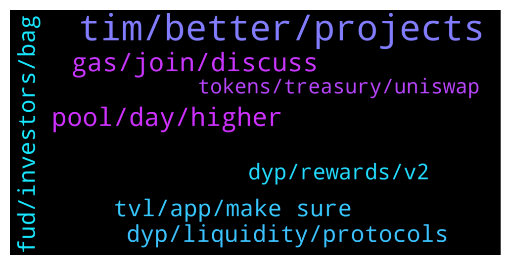

# **@dypfinance**
 ## Analysis for **2022-01-27** - **2022-01-28**.

---

## 📊 **Basic Stats**

**n_messages_sent**: 132

---

---

## 🔝 **Top keywords and related messages**

1. **tim, better, projects**

    @MJMuppet_JayJay --- *Love the openess around this Tim. It must really be noted that what you just mentioned in this group would have been tucked away as best as possible by A LOT of other projects* **--->** [TG Discussion](https://t.me/dypfinance/243103)

    @shinigamikami --- *And of course our cats that I’m dying to get my hands on* **--->** [TG Discussion](https://t.me/dypfinance/242958)

    @MJMuppet_JayJay --- *🙏 thanks tim! Have a good ons guys!* **--->** [TG Discussion](https://t.me/dypfinance/243136)

    @MJMuppet_JayJay --- *Cheers for the update Tim! Looking forward hearing more from the team about this.* **--->** [TG Discussion](https://t.me/dypfinance/243131)

    @trader_broi --- *Where is @timdyp not active what happened to him* **--->** [TG Discussion](https://t.me/dypfinance/242914)

    @crypto_wolf_hou --- *Hello, there. I am a fullstack developer and have tons of experience in blockchain projects. I have already been involved in DeFi/NFT/DEX projects on many networks like Ethereum and Solana. Is there anyone who can introduce me to the project?* **--->** [TG Discussion](https://t.me/dypfinance/242789)

2. **pool, day, higher**

    @iamJubi --- *APY change depends on TVL, prices of token involved on the pool, etc.   "To Be Burnt/disbursed" iDYP on the pool is yet to be distributed as reward or burnt, so it contributes to the APY. If you check, 60 days pool have no more iDYP that is potentially be disbursed while 90 days still have. This is another factor.  Also, higher lock time have higher allocated iDYP reward daily. let me check with the team  for some other factors that affects the APY. But as said, originally the longer lock days the higher the APY was.* **--->** [TG Discussion](https://t.me/dypfinance/242860)

    @Janes --- *How are yield curves determined in the different v2 farms across the various lock times? It seems odd that there is a mid point on some of the farms where the 30 day pools are actually yielding a lot more than the 60 day and 90 day pools. How dynamic are these yields day to day? Seems like there should be a better way of compensating those that chose a longer lock time.* **--->** [TG Discussion](https://t.me/dypfinance/242849)

    @Janes --- *Thanks, so the yields are Purely TVL driven or is there also an underlying mechanism that also rewards more for a longer lock time? If it’s purely TVL driven, then why would there be a reason to have pools of different lock durations?* **--->** [TG Discussion](https://t.me/dypfinance/242853)

    @timdyp --- *Its a user from the old v1 pools. What explanation do you need? You can check the transaction on etherscan.* **--->** [TG Discussion](https://t.me/dypfinance/243096)

    @shinigamikami --- *Will the new products make use of users already in farming pools? Or new deposit or so will be required?* **--->** [TG Discussion](https://t.me/dypfinance/242956)

    @Janes --- *Ok thanks! I didn’t realize that you could see the amount of idyp that was still being disbursed to each pool, but I found that info. So most of these yields should drop down a bit once the idyp allocation is finished. Got it!* **--->** [TG Discussion](https://t.me/dypfinance/242901)

3. **gas, join, discuss**

    @madlytanvir --- *one more thing when i click claim its about 500+ usdt gas fee and asking for two transection...  so please someone help me who know this very well* **--->** [TG Discussion](https://t.me/dypfinance/243033)

    @LovelySuman86 --- *4500$ is now 650 in just 3 month* **--->** [TG Discussion](https://t.me/dypfinance/242948)

    @DhoniMSD516 --- *https://t.me/dypprice Please join here for price discussions* **--->** [TG Discussion](https://t.me/dypfinance/242967)

    @DhoniMSD516 --- *You can join here to discuss about price https://t.me/dypprice* **--->** [TG Discussion](https://t.me/dypfinance/242924)

    @DhoniMSD516 --- *It depends on gas trends, the metamask shows around 300$ but actual cost will be less* **--->** [TG Discussion](https://t.me/dypfinance/243243)

    @DhoniMSD516 --- *Price discussion is not allowed here so you can join above group and discuss about price* **--->** [TG Discussion](https://t.me/dypfinance/242926)

4. **fud, investors, bag**

    @Disguy125 --- *All I know is that team goal is to give back to the investors and I can attest to that.* **--->** [TG Discussion](https://t.me/dypfinance/243186)

    @rvshivsup --- *People buying the dip, very smart* **--->** [TG Discussion](https://t.me/dypfinance/243016)

    @Pawan --- *Market is just driven by sentiments. No math, no curves.* **--->** [TG Discussion](https://t.me/dypfinance/242846)

    @Pawan --- *Crypto market now is acting like a hedge fund. No matter what project is all about, just money flown in and out drives the price. Getting to a ludicrous point.* **--->** [TG Discussion](https://t.me/dypfinance/242845)

    @Pawan --- *Crypto market makes no sense  Neutral news is now bad news. Investors are crappy pants* **--->** [TG Discussion](https://t.me/dypfinance/242844)

    @MJMuppet_JayJay --- *You guys basically did the crypto equivalent of a corporate stock buyback* **--->** [TG Discussion](https://t.me/dypfinance/243124)

5. **tvl, app, make sure**

    @rvshivsup --- *It’s always done via browser or there is an app too* **--->** [TG Discussion](https://t.me/dypfinance/242997)

    @DhoniMSD516 --- *Hey it should be instant, make sure your transactions are completed, clear cache and check again.* **--->** [TG Discussion](https://t.me/dypfinance/242994)

    @MJMuppet_JayJay --- *I havent checked eth scan etc so just catching up on mobile* **--->** [TG Discussion](https://t.me/dypfinance/243117)

    @DhoniMSD516 --- *For now only through browsers, if you are using metamask or trustwallet or coin98 you can use in those apps too* **--->** [TG Discussion](https://t.me/dypfinance/242998)

    @rvshivsup --- *Does it take time, how do I check this please* **--->** [TG Discussion](https://t.me/dypfinance/242993)

    @hemanrock --- *You can also check in MY STATS.* **--->** [TG Discussion](https://t.me/dypfinance/242833)

6. **dyp, liquidity, protocols**

    @popper1989 --- *how many ppl are working for DYP* **--->** [TG Discussion](https://t.me/dypfinance/242920)

    @Kkkiran21 --- *Not Dyp i am talking about idyp* **--->** [TG Discussion](https://t.me/dypfinance/242907)

    @cyryp --- *Hi have DYP self specific its own blacchain.?* **--->** [TG Discussion](https://t.me/dypfinance/243270)

    @timdyp --- *Around 210k DYP I believe. It seems that in the last few days some users with big amounts in liquidity on different protocols including DYP, are removing their liquidity and selling all the assets. Probably based on the market crash. If you check their wallets, all of them are doing the same thing for all the protocols like DYP, Sushi, Aave, etc. It doesn't matter, they remove the liquidity and sell the assets.* **--->** [TG Discussion](https://t.me/dypfinance/243101)

    @umarbisyir --- *500000 dyp already sold it seems?* **--->** [TG Discussion](https://t.me/dypfinance/243099)

    @DhoniMSD516 --- *Hey welcome :)  Head here to know about DYP and products https://t.me/dypfinance/229271* **--->** [TG Discussion](https://t.me/dypfinance/242981)

7. **dyp, rewards, v2**

    @sunnygummybear --- *i think you guys made a mistake with V2 farms.   and i say this in the most respectful way.   i have always like your service and product.   in the old farms. you often had 1 sided exposure. for example. Weth / Usdt. or you could select 2 coins that could have variation in price.  but more importantly.. as the rewards came in. behind the scenes dyp was converted to an actual valauble token (for example Weth) and we as investors didn’t notice / worry about dyp.   why should we. dyp itself is just a (not so interesting) token to the market. hear me out.. no disrespect ment.   too many yield companies believe their coin will be different. will have a value. but at dyp you (in the old days) always seemed more realistic (your own coin drives a process but market value not so)  in v2 farms we as investors got exposure to dyp and idyp - (which is already mega confusing for new investors).   those rewards .. idyp have no value so 99% is here to make money and sell idyp rewards asap. why? .. what other value would idyp have to hold (and pls note i have 25k idyp staked or should i say had).   stop giving idyp rewards. and re-invest them into the system. and make the whole apy% stronger and stronger. pay in valauble weth / bnb / avax. use idyp/dyp internally.   point is … old farms were clean. with focus on the value for the  crypto investor.   v2 farms have added 2 sided impermant loss (example: weth/dyp). opened us investors up to selling idyp to get rewards (exactly what you guys didn’t want in version 1) and made it harder to understand for all involved.   am i leaving dyp.finance. no!   and that’s after ‘loosing’ 100k$ in farming. i know crypto markets. but i feel some feedback to the team on v2 could be said.   my best (and all above said with 110% respect to all working hard at dyp).   keep it more simple. why nft launch (sure it’s a fun marketing thing). but your core was always an amazing apy / yield opportunity for investors… done in a smart way.   my best!* **--->** [TG Discussion](https://t.me/dypfinance/242938)

    @DhoniMSD516 --- *DYP already have utilities in V2 Farming and Staking, Bridge is already available more utilities will be coming too* **--->** [TG Discussion](https://t.me/dypfinance/242906)

    @timdyp --- *Don't get me wrong, but this is not the case. In the V1 farms the users had 100% exposure to IL for two assets, for example DYP and ETH. In the current V2 farms the users have ONLY 75% exposure to the IL for two assets, iDYP and ETH. So no change, only 25% decrease for the IL. Regarding the 25% amount that is swapped into DYP, this provides 199% current APY with no IL!  Regarding the rewards, again there is nothing changed! For the 75% deposit, you continue to earn ETH rewards, ONLY for the 25% deposit with a high APY and NO IL, you earn DYP. If you don't like the DYP rewards, you can always swap them into ETH. First of all you cannot stake iDYP tokens, you can stake only DYP tokens so unfortunately I cannot understand your affirmation.  Considering that the market dropped hard, it is impossible for the users that are using the farming pools not to have a IL right now. So before complaining about the v2 pools, you should make an analyze about the market. We had similar situation for some time with the v1 pools because of the market direction.  Regarding your last affirmation, new products for staking, farming, and borrow & lending will roll out in Q1.* **--->** [TG Discussion](https://t.me/dypfinance/242944)

    @Tettluft --- *How much eth should I leave in the wallet to get to pay fees when staking dyp?* **--->** [TG Discussion](https://t.me/dypfinance/243242)

    @DhoniMSD516 --- *Maximize your Yield Farming Rewards on #Avalanche  24,389 #AVAX worth $1,458,706 paid to the farmers!  Join farming by automatically adding liquidity and earn 435% APY https://dyp.finance/farmv2/avax  👉https://twitter.com/dypfinance/status/1484927132346298379* **--->** [TG Discussion](https://t.me/dypfinance/242931)

    @hemanrock --- *if you are in V2 FARMS, please claim rewards first and hover to withdraw button to check your remaining days of your locktime. if it is feel to free withdraw, then you can proceed to withdraw your asset and DYP* **--->** [TG Discussion](https://t.me/dypfinance/243039)

8. **tokens, treasury, uniswap**

    @cryptoninja1990 --- *Hey DeFi Yield Family, this is listing manager from BitMart. We are interested in listing IDYP token. Could you tell me who I can talk to? I am not a Scammer, you could verify me via BitMart Official website* **--->** [TG Discussion](https://t.me/dypfinance/243143)

    @timdyp --- *The tokens were bought using ETH from our treasury.* **--->** [TG Discussion](https://t.me/dypfinance/243123)

    @timdyp --- *The tokens were bought from Uniswap and KuCoin directly. We will provide more information in the next days.* **--->** [TG Discussion](https://t.me/dypfinance/243118)

    @timdyp --- *Thank you Jay! Also, I am happy to inform the community that the team market bought in the last couple of hours around 1,000,000 DYP tokens from Uniswap and KuCoin. The tokens will be added to our treasury.* **--->** [TG Discussion](https://t.me/dypfinance/243111)

    @MJMuppet_JayJay --- *The spent tokens, were they treasury funds too?* **--->** [TG Discussion](https://t.me/dypfinance/243122)

    @timdyp --- *Sure, more info will be provided. I can confirm that 1,084,513.08 DYP was purchased from Uniswap and KuCoin open market.* **--->** [TG Discussion](https://t.me/dypfinance/243132)

