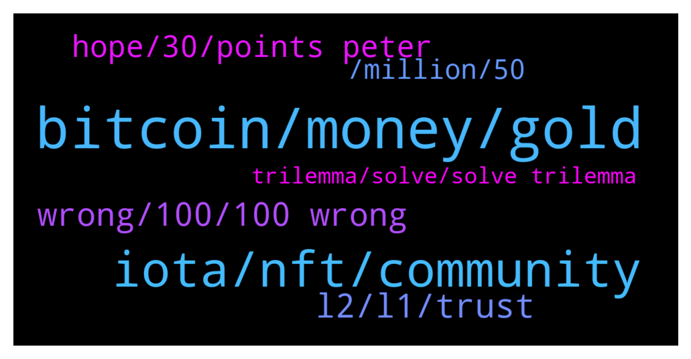

# **@iotatangle**
 ## Analysis for **2022-01-27** - **2022-01-28**.

---

## 📊 **Basic Stats**

**n_messages_sent**: 176

---

---

## 🔝 **Top keywords and related messages**

1. **bitcoin, money, gold**

    @fudleur --- *if bitcoin can be replaced as a store of value, then no cryptocurrency can compete with gold, as gold has that function since 5k and more years, while bitcoin is here since 13* **--->** [TG Discussion](https://t.me/iotatangle/307835)

    @StefanoDellaValle --- *Bitcoin does only one simple application: move bitcoin. That's all.* **--->** [TG Discussion](https://t.me/iotatangle/307932)

    @fudleur --- *gold did not evolve in millions of years. did development stop because of that?* **--->** [TG Discussion](https://t.me/iotatangle/307844)

    @fudleur --- *but money needs to be “hard” and imho there is no harder money than bitcoin, so Dom should not come forth saying things like iota will replace bitcoin. who can take such a statement seriously? i for myself cannot, but up to you.* **--->** [TG Discussion](https://t.me/iotatangle/307839)

    @StefanoDellaValle --- *The gold is a myth... In thousand of year humans has used everything but gold for daily expense and bought land, properties and art as store of value. 90% of the gold is in the national safe... not in personal save* **--->** [TG Discussion](https://t.me/iotatangle/307854)

    @fudleur --- *currently, to store value, you need to invest, as our fiat curriencies degenerate fast* **--->** [TG Discussion](https://t.me/iotatangle/307882)

2. **iota, nft, community**

    @PiernasLocas --- *White list open to everyone, to buy a rustyrobot nft* **--->** [TG Discussion](https://t.me/iotatangle/307740)

    @StefanoDellaValle --- *Anyway .. I've never read form someone in IOTA community that IOTA will replace bitcon ... so what?* **--->** [TG Discussion](https://t.me/iotatangle/307872)

    @StefanoDellaValle --- *Even IOTA is a community, but here the romantic history is a little bit different: real adoption in the industry to build more transparent and secure applications* **--->** [TG Discussion](https://t.me/iotatangle/307921)

    @goldenpro98 --- *how can i know if my iota are on the chrysalis network? if i just bought them on an Exchange are they already on chrysalis?* **--->** [TG Discussion](https://t.me/iotatangle/307788)

    @fudleur --- *i like iota for what it is, but i hate the vision that dom has for this project.* **--->** [TG Discussion](https://t.me/iotatangle/307841)

    @fudleur --- *to put it into perspective: IOTA is extremely fast… but generates a ton of data. how many fullnodes exist that contain the whole history since IOTAs inception? very very few and those need to store large amounts of data. meanwhile, i store the whole bitcoin blockchain, running since 2009, on my raspberry PI. i can verify each an every transaction back to the very first one and therefore, updates to the protocol remain possible more easily than updates to the iota protocol.* **--->** [TG Discussion](https://t.me/iotatangle/307911)

3. **l2, l1, trust**

    @StefanoDellaValle --- *I understand very well: you trust intermediary nodes.... so you moved away from the P2P paradigma ... and therfore you need to trust third paty.* **--->** [TG Discussion](https://t.me/iotatangle/307959)

    @StefanoDellaValle --- *so you are hoping to scale a secure L1 with an unsecure L2 ... best wishes* **--->** [TG Discussion](https://t.me/iotatangle/307953)

    @StefanoDellaValle --- *no, the the reason is that is not really so secure to grant what the ledger based L1 is able to grant.* **--->** [TG Discussion](https://t.me/iotatangle/307952)

    @antonionardella --- *There is coordinator-less network running since last year..* **--->** [TG Discussion](https://t.me/iotatangle/307818)

    @tomastd --- *What does it mean? is the whitelist already closed?* **--->** [TG Discussion](https://t.me/iotatangle/307757)

    @HolgerKoether --- *Removing the Coo requires several modules to work together. You can read about it here: https://v2.iota.org/how-it-works/introduction* **--->** [TG Discussion](https://t.me/iotatangle/307830)

4. **wrong, 100, 100 wrong**

    @fudleur --- *or what is this point based on?* **--->** [TG Discussion](https://t.me/iotatangle/307925)

    @fudleur --- *really this statement is 100% wrong, every single word in it* **--->** [TG Discussion](https://t.me/iotatangle/307958)

    @fudleur --- *sorry but this is 100% wrong* **--->** [TG Discussion](https://t.me/iotatangle/307954)

    @fudleur --- *yea this is true, but this is not my point* **--->** [TG Discussion](https://t.me/iotatangle/307933)

    @fudleur --- *sorry but this is not true* **--->** [TG Discussion](https://t.me/iotatangle/307877)

    @fudleur --- *i think this is a point to argue against for u guys, if ur interested* **--->** [TG Discussion](https://t.me/iotatangle/307848)

5. **hope, 30, points peter**

    @StefanoDellaValle --- *ok. please tell us at least a second.* **--->** [TG Discussion](https://t.me/iotatangle/307936)

    @fudleur --- *thanks for responding antonio. so this really looks like a hard promise* **--->** [TG Discussion](https://t.me/iotatangle/307815)

    @antonionardella --- *This is not amateur hour amymore where stuff is published to make the news..* **--->** [TG Discussion](https://t.me/iotatangle/307823)

    @HolgerKoether --- *I need to hop on a call but would love to pick this up in 30-40mins* **--->** [TG Discussion](https://t.me/iotatangle/307862)

    @fudleur --- *hope they don’t postpone it too much* **--->** [TG Discussion](https://t.me/iotatangle/307817)

    @Jogadoh --- *I'll only be able to do it when I get home, I hope I have time.* **--->** [TG Discussion](https://t.me/iotatangle/307753)

6. **, million, 50**

    @Lyfee --- *What? 1 TI is one thousand GI. So at current prices its around $40.000.000* **--->** [TG Discussion](https://t.me/iotatangle/307735)

    @Ragnar_mb --- *50 tiota is like 1 million dollars yeah? What could they build with that.* **--->** [TG Discussion](https://t.me/iotatangle/307721)

    @StefanoDellaValle --- *you can store in a BTC tx only 80 byte. What kind of application can you build with 80 byte (and pay USD fot that)?* **--->** [TG Discussion](https://t.me/iotatangle/307938)

    @Ragnar_mb --- *Yep didn't times the 50, that's even better build,* **--->** [TG Discussion](https://t.me/iotatangle/307799)

    @stephan_ka --- *50 ti is currently about 40 million ( 0.8 $ per mi)* **--->** [TG Discussion](https://t.me/iotatangle/307730)

    @Ragnar_mb --- *Grand scheme 1 million is nothing to burn but could help some really good projects* **--->** [TG Discussion](https://t.me/iotatangle/307729)

7. **trilemma, solve, solve trilemma**

    @fudleur --- *my take is: it is impossible to solve the trilemma in only one layer* **--->** [TG Discussion](https://t.me/iotatangle/307951)

    @fudleur --- *this btw it the “decentralized” part of the trilemma :)* **--->** [TG Discussion](https://t.me/iotatangle/307946)

    @ash1taka1997 --- *Ok, so some believe it is unsolvable while some others think it is solvable. The latter are still trying hard…* **--->** [TG Discussion](https://t.me/iotatangle/307910)

    @fudleur --- *it did not solve it on the main layer and people in the bitcoin community say that the trilemma is not solvable within the main layer. i also don’t see how, but i’m also not a mathematician.* **--->** [TG Discussion](https://t.me/iotatangle/307909)

    @fudleur --- *yes. my point is, that it’s impossible to solve the trilemma* **--->** [TG Discussion](https://t.me/iotatangle/307906)

    @fudleur --- *bitcoin maxis say the trilemma is unsolvable, which i agree with. Scalability, Security, Decentralization* **--->** [TG Discussion](https://t.me/iotatangle/307808)

