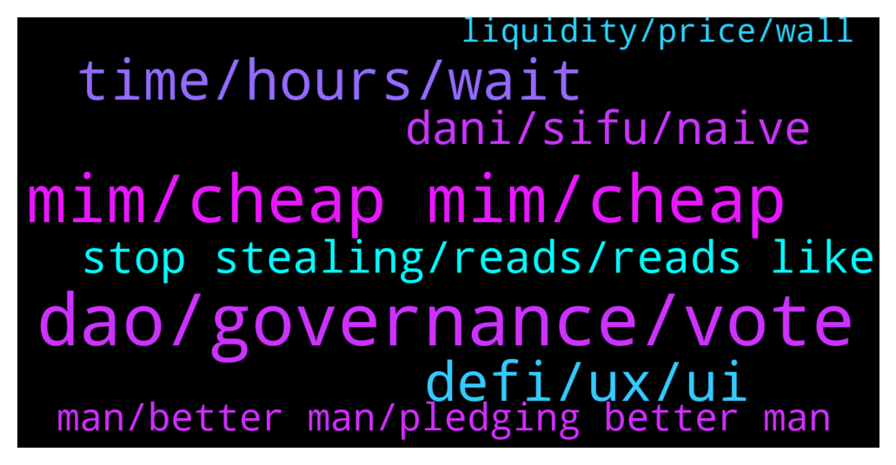

# **@lobsters_chat**
 ## Analysis for **2022-01-27** - **2022-01-28**.

---

## 📊 **Basic Stats**

**n_messages_sent**: 816

---

---

## 🔝 **Top keywords and related messages**

1. **dao, governance, vote**

    @TyraBlackbeard --- *Plato already said DAOs can't work like over 2000 years ago...so..* **--->** [TG Discussion](https://t.me/lobsters_chat/319712)

    @ivangbi --- *DAG decentralization autonomous gag… gauge. Idk, whatever the term is, the fact of the matter is that voting for the same thing weekly is not as much work as trying to vote on semi-social questions* **--->** [TG Discussion](https://t.me/lobsters_chat/319746)

    @ivangbi --- *Curve wars are the epiphany of not-committee structure. It’s fully on-chain stuff. While yearn and synthetix exercise committee structure, which is more modular in some cases, just harder to off board dead people after they become lazy. So Element proposed rotating members… tldr, start your reading with:  - synthetix dao structure - yearn dao structure - optimistic governance - etc.   Just google, whatever u find* **--->** [TG Discussion](https://t.me/lobsters_chat/319721)

    @DeadMeatHK --- *Anyone here have experience with how a DAO interacts with traditional commercial entities? In particular, if a DAO controlled protocol wants to open an account with a CEX, how is the KYC managed? Do DAOs often (at all?) have a legal entity that can interact with other companies?* **--->** [TG Discussion](https://t.me/lobsters_chat/320266)

    @Paulisson --- *I d speculate on the fact that if we wourd free time for people to engage in democratic duties we would be likely to see an increase in participation.  Ie: give people a free mid day off work for civic duties (collective governance, social projects etc..) many are likely to find the incentive of a half day off enough to engage.  With the possibility that we have to add trustless voting and financial incentive it brings the concepts even farther where people could even birng their passion into the scheme (garden management is what makes you horny, you could just join the appropriate working group)  This is i believe the way of DAO provide incentive for participation and meaningful enough for participants to know they are actually contributing to something and spending their time in a productive maneer.  Add on top of it sovereign/local currency that is exchanged against citizen time capacity and plenty of doors opens* **--->** [TG Discussion](https://t.me/lobsters_chat/319935)

    @Steff_Bullishkid --- *you will only get people to vote if you bribe them/pay them for it* **--->** [TG Discussion](https://t.me/lobsters_chat/319782)

2. **mim, cheap mim, cheap**

    @hasufly --- *Leveraged MIM farmers can be blown up. Further, it would be interesting how much MIM is backed by TIME and SPELL* **--->** [TG Discussion](https://t.me/lobsters_chat/320071)

    @PmRiviere --- *No chance. $MIM is overcollateralized to the tune of 200% and degenbox users would need to buy large volumes of $MIM to unwind positions. If it were to loose peg that would make a bunch of people really rich though* **--->** [TG Discussion](https://t.me/lobsters_chat/320012)

    @syed_jafri --- *Not in degenbox, the borrowed MIM is looped to borrow even MIM to buy UST* **--->** [TG Discussion](https://t.me/lobsters_chat/320097)

    @PmRiviere --- *Liquidators need to buy $MIM to liquidate* **--->** [TG Discussion](https://t.me/lobsters_chat/320077)

    @satoshi_onamoto --- *Is there much chance of mim losing peg given recent developments? Would that ruin a lot of stuff?* **--->** [TG Discussion](https://t.me/lobsters_chat/320007)

    @PmRiviere --- *as I say there's too much incentive to buy "cheap" $MIM for a depeg to happen* **--->** [TG Discussion](https://t.me/lobsters_chat/320019)

3. **time, hours, wait**

    @coine_r --- *Sorry but surely you can't honestly believe a free mid day off work is going to do that. Come on* **--->** [TG Discussion](https://t.me/lobsters_chat/319943)

    @SpikeSpiege1 --- *I was just asking someone if time holders ever got that drop* **--->** [TG Discussion](https://t.me/lobsters_chat/320103)

    @mostamh --- *Yeah I'm still trying to understand, what they're all panicking about lol, this is nothing in comparison to all the different rekt events we saw recently* **--->** [TG Discussion](https://t.me/lobsters_chat/320280)

    @K1NGKOIN --- *This old Zachxbt thread on $Time stealth launch just hit different now  https://twitter.com/zachxbt/status/1452737593364426752?t=uOsU0KgBSQU9nXlRWqLZWQ&s=19* **--->** [TG Discussion](https://t.me/lobsters_chat/319499)

    @Arv1ee --- *Guys, do we know Solidly's exact snapshot time?* **--->** [TG Discussion](https://t.me/lobsters_chat/320035)

    @zariat_5D --- *when this all hits primetime news (which it will) normie sentiment is going to be completely rekt* **--->** [TG Discussion](https://t.me/lobsters_chat/319326)

4. **defi, ux, ui**

    @eager_to_learn --- *Take a break from defi drama to read about the SEC's latest attempt to stifle innovation:  https://lexnode.substack.com/p/urgent-considerations-of-impact-on* **--->** [TG Discussion](https://t.me/lobsters_chat/319626)

    @adrianleb --- *“Check out our new UI and innovative UX” bruh either give me free money or remove stress from my life I don’t care how pretty your buttons are* **--->** [TG Discussion](https://t.me/lobsters_chat/320399)

    @ivangbi --- *Tbh these discussions been so frequent about the quality of UX in DeFi, that maybe the core protocols don’t need to focus on it. They need to be d2b kinda (dao to business?) and allow the likes of nexo and CEXes to throw their $ in there.* **--->** [TG Discussion](https://t.me/lobsters_chat/320348)

    @ivangbi --- *https://twitter.com/The3D_/status/1486827635082776579?s=20&t=FqT8R9-5LcT4T-_8-OmUhw  I like every builder, but let’s be honest this UI sucks, yearn UI sucks, compound UI sucks, and yes gearbox UI sucks too so I am not biased there. And it’s fine. The UIs need to suck so we keep more money for crypto-native while centralized platforms build secure retail-focused products and then ape into those exact pools* **--->** [TG Discussion](https://t.me/lobsters_chat/320340)

    @adrianleb --- *Like governments building tax reporting websites with improved UX, it won’t make more ppl excited about filing their taxes* **--->** [TG Discussion](https://t.me/lobsters_chat/320363)

    @carlblow --- *This seems like kinda scary for defi? Idk* **--->** [TG Discussion](https://t.me/lobsters_chat/319445)

5. **dani, sifu, naive**

    @andrecronje --- *100% support Dani, but this came as a surprise; https://twitter.com/zachxbt/status/1486591682728673282* **--->** [TG Discussion](https://t.me/lobsters_chat/319190)

    @alexn911 --- *and 30M to Dani - https://snowtrace.io/tx/0x98efe076c4a25cd978ee6c8f48c60c546ebec8aead669c92b2ec6f9c8b63eaf4 🙂* **--->** [TG Discussion](https://t.me/lobsters_chat/319393)

    @gas1cent --- *I actually feel for Dani and think GiganticRebirth has no idea what he is talking about* **--->** [TG Discussion](https://t.me/lobsters_chat/319558)

    @Steff_Bullishkid --- *https://twitter.com/zappyb0i/status/1486599000014966784?s=21  you mean this?  Or you mean Dani?* **--->** [TG Discussion](https://t.me/lobsters_chat/319270)

    @syed_jafri --- *too late, dani’s tweet says he knew* **--->** [TG Discussion](https://t.me/lobsters_chat/319242)

    @Steff_Bullishkid --- *well maybe dani also needs a second chance then* **--->** [TG Discussion](https://t.me/lobsters_chat/319844)

6. **stop stealing, reads, reads like**

    @amplice --- *to me it reads like "all devs must be guys unless u explicitly know they aren't" which is maybe not the best thing* **--->** [TG Discussion](https://t.me/lobsters_chat/319863)

    @ivangbi --- *I am sorry for being a party pooper but maybe could have deviated by 1 letter to save* **--->** [TG Discussion](https://t.me/lobsters_chat/319516)

    @onestallion --- *https://twitter.com/1stallion_/status/1486618877664673795?s=21 my opinion is slightly different* **--->** [TG Discussion](https://t.me/lobsters_chat/319581)

    @ivangbi --- *Saylor is a tard, all there is to it* **--->** [TG Discussion](https://t.me/lobsters_chat/319097)

    @alejoamiras --- *yeah … diff to take Saylor seriously.* **--->** [TG Discussion](https://t.me/lobsters_chat/319121)

    @mrrobbo --- *That’s the only way to interpret it at this point* **--->** [TG Discussion](https://t.me/lobsters_chat/319282)

7. **man, better man, pledging better man**

    @ivangbi --- *He speaks so well tho, what a smoothing voice* **--->** [TG Discussion](https://t.me/lobsters_chat/320381)

    @Sal_ash --- *Maybe he's just friends with the guy* **--->** [TG Discussion](https://t.me/lobsters_chat/319293)

    @crjobo --- *Ok, now he is circling and tunneling. Not really smart* **--->** [TG Discussion](https://t.me/lobsters_chat/320078)

    @Figu3 --- *It's weird because he understand the dynamics really well but refuses to see its virtues* **--->** [TG Discussion](https://t.me/lobsters_chat/320327)

    @alejoamiras --- *I love the way he recognizes his past, and owns up to he was, pledging to be a better man and work to prove it. But hey, maybe I'm wrong.* **--->** [TG Discussion](https://t.me/lobsters_chat/319919)

    @ivangbi --- *@PmRiviere ^ jr wasn’t talking nonsense, he meant this* **--->** [TG Discussion](https://t.me/lobsters_chat/319658)

