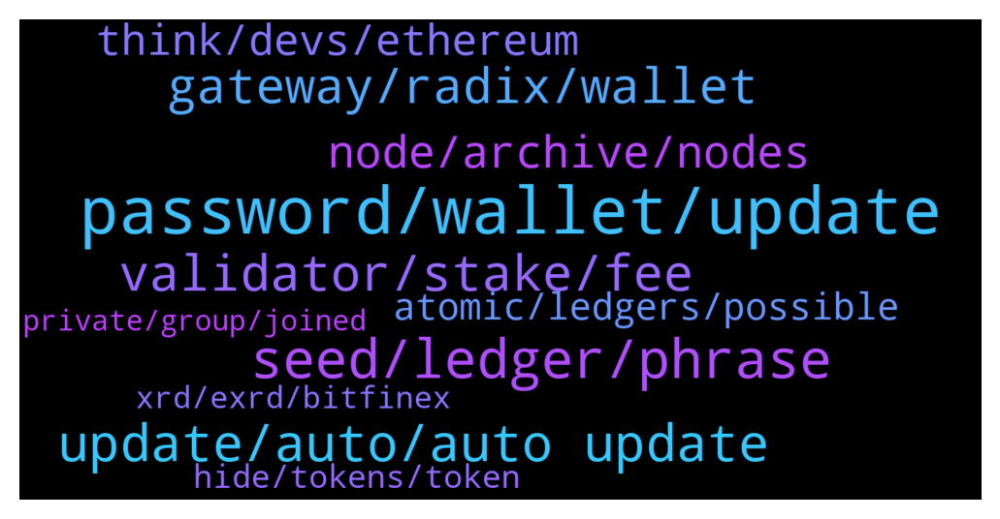

# **@radix_dlt**
 ## Analysis for **2022-01-27** - **2022-01-28**.

---

## 📊 **Basic Stats**

**n_messages_sent**: 569

---

---

## 🔝 **Top keywords and related messages**

1. **password, wallet, update**

    @Tamás --- *This is out of my knowledge, the Team can answer this. Probably a new Desktop Wallet will fix this, I guess* **--->** [TG Discussion](https://t.me/radix_dlt/346556)

    @StesyD --- *guys just updated to the new version and seems password is not working anymore , I tried to restore and still stuck to this ...not letting me delete the wallet  any advice?* **--->** [TG Discussion](https://t.me/radix_dlt/346791)

    @radixmatt --- *It would be helpful if you who are having trouble with passwords could let me know what version you were updating from.* **--->** [TG Discussion](https://t.me/radix_dlt/346691)

    @Kafkafrate --- *you can also change the colors of the wallets now, if you long press the wallet for edit. Never asked actually how obvious this edit of wallets is* **--->** [TG Discussion](https://t.me/radix_dlt/346657)

    @Mleekko --- *alternative solution - open your "wallet.json" and remove "selectedNodeHash"* **--->** [TG Discussion](https://t.me/radix_dlt/346797)

    @NewYearTree --- *Updated wallet to 1.3.0 and it says now that my password is incorrect. But on older versions it's ok.* **--->** [TG Discussion](https://t.me/radix_dlt/346820)

2. **seed, ledger, phrase**

    @Bent --- *This isn't great advice imo. If your realistic alternative is to keep using the software wallet then moving that over to hardware by importing seed phrase is still an improvement in security. It's not nearly as good as creating a new seed phrase from scratch on the ledger would be but still far superior to continuing with the software wallet.* **--->** [TG Discussion](https://t.me/radix_dlt/347101)

    @fpieper --- *Though this is something you never should do and I can't recommend that.  You should never use a software generated seed for your hardware wallet ...* **--->** [TG Discussion](https://t.me/radix_dlt/347021)

    @Magal36 --- *anyway, as Florian said, you should never import the seed phrase into a ledger hw unless that seed phrase came from a previous broken ledger hw. If you import your seed from the desktop wallet, you loose the security of the hardware, because that seed was already in a device connected to the internet, whereas the seed that came with the ledger never has been connected, has zero chance of being exposed.* **--->** [TG Discussion](https://t.me/radix_dlt/347062)

    @Bent --- *This isn't the only reason to use a ledger. By moving the seed over you get two immediate benefits: One, if your seed wasn't already compromised then now it no logner can be; and 2) all transactions from now on are protected by the ledger which they wouldn't be if you continue to use the software wallet.* **--->** [TG Discussion](https://t.me/radix_dlt/347105)

    @Magal36 --- *Disagree. Once you use the seed that was generated by the software wallet and have been on a device that might have been exposed, it's basically the same security. The best security is to unstake and transfer from a brand new address generated from the ledger device seed.* **--->** [TG Discussion](https://t.me/radix_dlt/347106)

    @Vorgesetzter --- *Just googled it. Ledger also supports 12-words: "Note: Ledger hardware wallets only generate 24-word recovery phrases. You can also enter a 12, 18 or 24 word recovery phrase you received from a different wallet provider." From: https://www.ledger.com/academy/crypto/what-is-a-recovery-phrase* **--->** [TG Discussion](https://t.me/radix_dlt/347041)

3. **update, auto, auto update**

    @luke55 --- *yes definitely the right one, maybe if you downloaded the newest version and you were already on v1.2.6 will break things. So the way to go should be to use the automatic update function only?* **--->** [TG Discussion](https://t.me/radix_dlt/346686)

    @MrPipsSociety --- *When I try click auto update I get this error. Any ideas ?* **--->** [TG Discussion](https://t.me/radix_dlt/346665)

    @radixmatt --- *If you want to manually download v1.2.6: https://github.com/radixdlt/olympia-wallet/releases/tag/v1.2.6* **--->** [TG Discussion](https://t.me/radix_dlt/346837)

    @h0ll0wstick --- *Yep awesome I've updated dark mode 👌* **--->** [TG Discussion](https://t.me/radix_dlt/346655)

    @Kafkafrate --- *where do you guys see this automatic update option in 1.2.6? because i can't see any button or message about the new version* **--->** [TG Discussion](https://t.me/radix_dlt/346878)

    @Tulzscha --- *I am having the same problem after updating* **--->** [TG Discussion](https://t.me/radix_dlt/346676)

4. **validator, stake, fee**

    @Tamás --- *Sometimes it gives you back a warning, even though the staking process was succesful. I think there is nothing to worry about.* **--->** [TG Discussion](https://t.me/radix_dlt/346521)

    @Radstakes --- *There is no risk to your tokens from staking, they never actually leave your wallet.  In future, slashing will be implemented which will put funds at risk if a validator acts maliciously.* **--->** [TG Discussion](https://t.me/radix_dlt/346856)

    @Gekko_0x --- *is staking on anon person's validator node puting my radix at risk?* **--->** [TG Discussion](https://t.me/radix_dlt/346852)

    @Shang En --- *How can I know the apy of my staking validator? I know it’s around 10%~12% but how can I check the exact number of my staking validator?* **--->** [TG Discussion](https://t.me/radix_dlt/346579)

    @giskard_rich --- *Some people stake Cerby for years and there are high penalties for unstaking early. That’s one use case for the above. Then there’s the OCI bonus stake rewards.. 😜* **--->** [TG Discussion](https://t.me/radix_dlt/347119)

    @MassieFur --- *No issue, but if one validator has over 50% stake for example, it is too centralized (instead of decentralized)* **--->** [TG Discussion](https://t.me/radix_dlt/346972)

5. **gateway, radix, wallet**

    @Kafkafrate --- *Hi @everyone . I'm glad to announce that the new version of the Radix Stream app is out in the app stores 😁📲   This version is a bigger update with a new Dark theme, Transactions for wallets and added customisations. On top of that you can see the fiat valuation of your DogeCube tokens :)   Head over to the official webpage and download your version: https://radix.stream/  Don't forget to leave your feedback at: https://feedback.radix.stream/ or on the Discord channel!  PS: if you see glitches on the webpage delete your browser history to see the updates.* **--->** [TG Discussion](https://t.me/radix_dlt/346640)

    @Adam_XRD --- *Radix Desktop Wallet v1.3 has been released!  Get the latest at https://wallet.radixdlt.com/ - or accept the automatic update if you're on the latest v1.2.6.  This is an important update that we strongly recommend everyone take. Details below.  This release is mostly about migrating to the new API and Gateway service under the hood. That's important because once everyone has moved to this version, we will be able to obsolete our old Archive nodes that were severely limiting our ability to scale to peak demand, causing periodic problems with not being able to connect. Use of the Gateway service also resolves some spotty issues a few people were having with balances being shown incorrectly or inconsistently.  Features: * Seed phrases can now be 12, 18, or 24 words. For the more security-conscious, you may wish to create a new wallet using a longer seed phrase. (It is not possible to upgrade an existing address to one using a different seed phrase.)  * You can now hide tokens you aren't interested in. These tokens will no longer appear on your balances screen and shall upset you no further. If you change your mind, you can unhide a token in the wallet's settings.  * A warning is now presented whenever sending or staking of XRD would drop your balance below 10 XRD. This is to help prevent the "oops" situation of not having sufficient XRD to pay for further transactions.  Fixes: * Error messages are much improved overall. This is a direct consequence of the new API and hopefully should provide a more clear idea why a transaction wasn't possible.  * When connecting to a custom Gateway node, the wallet now offers a clear warning that you must trust the Gateway to not present you with bogus transactions. This is a very important bit of information that we communicated socially when we first added custom archive node capability to the wallet, but we overlooked adding a clear warning in the wallet itself. Thanks to community member @devmannic  for pointing out the lack of this warning message.  * More information about staking and unstaking status is shown in your list of validators. In particular, we now show "pending stake" for stake that is awaiting the end of the epoch to take effect - and thus cannot yet be requested to be unstaked.  * A validator that is not currently in the top-100 now presents a visible warning, indicating that it is not currently producing emissions XRD for you.  * Password fields now show if you're typing a password with caps lock set.  * Improved handling when a hardware wallet is disconnected during usage.  * Wallet now remembers the last account that you had selected when you last quit.* **--->** [TG Discussion](https://t.me/radix_dlt/346753)

    @HodlerKing --- *Error on radix wallet after DL:* **--->** [TG Discussion](https://t.me/radix_dlt/346894)

    @MarkVuong94 --- *Assistant, I have a question, when will I release Radix wallet that can transact on Android and IOS? Thanks* **--->** [TG Discussion](https://t.me/radix_dlt/346433)

    @Frankcmc --- *Any radix mobile wallet available so far?* **--->** [TG Discussion](https://t.me/radix_dlt/346427)

    @radixmatt --- *Radix Desktop Wallet v1.3 has been released! Get the latest at https://wallet.radixdlt.com/ - or accept the automatic update if you're on the latest v1.2.6.  This is an important update that we strongly recommend everyone take. Details below.  This release is mostly about migrating to the new API and Gateway service under the hood. That's important because once everyone has moved to this version, we will be able to obsolete our old Archive nodes that were severely limiting our ability to scale to peak demand, causing periodic problems with not being able to connect. Use of the Gateway service also resolves some spotty issues a few people were having with balances being shown incorrectly or inconsistently.* **--->** [TG Discussion](https://t.me/radix_dlt/346661)

6. **node, archive, nodes**

    @fpieper --- *You don't need to reenter the seed. Matt already stated the problem above.  You just need to use an old version to set the archive nodes to mainnet (not using community nodes) and then upgrade to 1.3  Or wait until 1.3.1 is fully released ;)* **--->** [TG Discussion](https://t.me/radix_dlt/346901)

    @Kansuler --- *Perhaps you're going against an archive node that hasn't been updated yet?* **--->** [TG Discussion](https://t.me/radix_dlt/347199)

    @Al_Bunderino --- *It's not mainnet vs stokenet - it's about the nodes. Switch from community node to official before you update.* **--->** [TG Discussion](https://t.me/radix_dlt/346840)

    @Al_Bunderino --- *But it shows how needed this update was - so many used community nodes...* **--->** [TG Discussion](https://t.me/radix_dlt/346869)

    @Jonn --- *Strange, I'm already on the mainnet* **--->** [TG Discussion](https://t.me/radix_dlt/346839)

    @Al_Bunderino --- *Roll back or wait. It's a bug, when using community nodes* **--->** [TG Discussion](https://t.me/radix_dlt/346792)

7. **think, devs, ethereum**

    @tesslerc --- *Regardless, it's much easier to poach from the millions of devs in tradfi than the 5.5 competent devs building in Ethereum* **--->** [TG Discussion](https://t.me/radix_dlt/347189)

    @MattToTheMoon --- *#ama attracting dev talent is one of the key pillars of your strategy. does your strategy for attracting development talent change based on the market? Not saying we are in a bear market, but if things were to go that way in the future, it’s a lot harder to attract talent when the crypto market cap is going down* **--->** [TG Discussion](https://t.me/radix_dlt/346434)

    @Kafkafrate --- *the risk of developing anything on ethereum is not worth in my opinion. There are so many potential loopholes in the code that it's just a matter of time until someone finds an exploit.* **--->** [TG Discussion](https://t.me/radix_dlt/347184)

    @ITProfligate --- *There is a discusion about this that starts here:- https://t.me/radix_dlt/121458* **--->** [TG Discussion](https://t.me/radix_dlt/346380)

    @chrisijoyah --- *For me the end goal with crypto is about empowering the average joe and providing the benefits that would improve their everyday life. There’s a ridiculous amount of people in the world that don’t even have a bank account, let’s change that.* **--->** [TG Discussion](https://t.me/radix_dlt/346346)

    @tesslerc --- *I think many Ethereum devs don't think this way, sadly.  You're taking about risk because users may lose funds. Not sure all those building on Ethereum share the same moral values.* **--->** [TG Discussion](https://t.me/radix_dlt/347186)

8. **atomic, ledgers, possible**

    @NuMorlock --- *As long as writing hash time lock contract is possible, then escrow and release of funds can allow for atomic swaps (among other things).   Just to confirm:  Protocol design prevents HTLC from being written?  Or it just hasn’t been done yet?* **--->** [TG Discussion](https://t.me/radix_dlt/346593)

    @Avaunt --- *Do you mean for example between Radix and Solana?  There are bridges between chains but it's impossible to have an atomic swap/tx between them.  The solution is to use dapps and services that can all coexist on a single network and txs can be composed atomically. Ie Radix* **--->** [TG Discussion](https://t.me/radix_dlt/346585)

    @Blind5ight --- *It's not possible to get performant atomicity across ledgers  These guys do it for example for a specific use case But latency++: https://twitter.com/ConnextNetwork/status/1388039183361576961?s=20* **--->** [TG Discussion](https://t.me/radix_dlt/346609)

    @TheCodeisTheLaw --- *Atomic swaps are different from committing txs across shards 🤔* **--->** [TG Discussion](https://t.me/radix_dlt/346582)

    @Blind5ight --- *That's why you have the 2-phase commit Only commits if all pieces succeed, problem is latency because the ledgers aren't synced up like the Radix shards can be* **--->** [TG Discussion](https://t.me/radix_dlt/346611)

    @Avaunt --- *But you couldn't guarantee success or be able to roll back the TX if one side of the TX failed is my understanding? Ie, you submit the TX on Network 1 and it bridges to Network 2. If it fails on Network 2 then you couldn't roll back to the original state on Network 1* **--->** [TG Discussion](https://t.me/radix_dlt/346610)

9. **hide, tokens, token**

    @BlAzAk --- *Who will keep all our RC Tokens visibles ? 😂* **--->** [TG Discussion](https://t.me/radix_dlt/346843)

    @Kafkafrate --- *With the hide/show tokens implementation would be easier to just select the ones you want because there will be always fewer clicks than removing all spam one by one. A filter option would be good, show favorites and that's it. but maybe now it was faster to implement this one.* **--->** [TG Discussion](https://t.me/radix_dlt/346885)

    @Avaunt --- *Love the token hide feature as well* **--->** [TG Discussion](https://t.me/radix_dlt/346778)

    @bartftel --- *If you would distribute a token indicating the total number of badges I would keep that visible 😇* **--->** [TG Discussion](https://t.me/radix_dlt/346849)

    @Katy --- *May I suggest a similar button to the HIDE- and that is HIDE NFT, HIDE CURRENCY, HIDE other - I have so many different token types that my wallet is still really full - but I cant transfer some of the NFTs out - love to have different HIDE sections - so I can organise and see them at a glance. That would make it even more awesome!!!! 💥💥* **--->** [TG Discussion](https://t.me/radix_dlt/346875)

    @Katy --- *I love it coz I see them all in one place! ❤️ You should be honoured! All those tokens in their own wallet!! 😂👏👏* **--->** [TG Discussion](https://t.me/radix_dlt/346848)

10. **xrd, exrd, bitfinex**

    @Didier24 --- *Hi guys, maybe a stupid question but i hope for serious answers. Whats the different between xrd and exrd. I'm asking because i wanted to buy xrd on bitfinex (the only exchange, which has xrd) but the kyc was very complicated. And i have already an account on mexc but on mexc is only exrd.* **--->** [TG Discussion](https://t.me/radix_dlt/347151)

    @Alba --- *XRD remind XRP. This is undeniable* **--->** [TG Discussion](https://t.me/radix_dlt/346386)

    @Mark --- *Quick question. I can only convert exrd to xrd on bitfinex right?* **--->** [TG Discussion](https://t.me/radix_dlt/346523)

    @Alba --- *@Adam_XRD Why not renaming XRD to RADX for example?  Our ticker name currently does not remind to effectively enough to RADIX  in my opinion.* **--->** [TG Discussion](https://t.me/radix_dlt/346378)

    @fpieper --- *Personally I wasn't a big fan of the XRD ticker in the beginning, but over time it has grown on me and I will not give it away again 😂* **--->** [TG Discussion](https://t.me/radix_dlt/346394)

    @Bent --- *I have been buying XRD without KYC on bitfinex by transferring in Algo to my account there; and then transferred the XRD onto my Radix wallet.* **--->** [TG Discussion](https://t.me/radix_dlt/347158)

