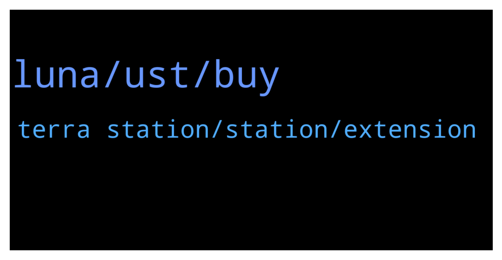

# **@terralunachat_officially**
 ## Analysis for **2022-01-27** - **2022-01-28**.

---

## 📊 **Basic Stats**

**n_messages_sent**: 108

---

---

## 🔝 **Top keywords and related messages**

1. **luna, ust, buy**

    @djackop --- *it's because of MIM and ANCHOR Protocol* **--->** [TG Discussion](https://t.me/terralunachat_officially/24723)

    @Rocky417 --- *I think better is you Transfer ust to kucoin and buy  there* **--->** [TG Discussion](https://t.me/terralunachat_officially/24562)

    @Darnie --- *Hi all us today the day it’s going to drop* **--->** [TG Discussion](https://t.me/terralunachat_officially/24566)

    @Finschi16k --- *Haha just joined for some serious questions ser.* **--->** [TG Discussion](https://t.me/terralunachat_officially/24791)

    @DarkShadow --- *sir was laughing saw you here too 😂 CK* **--->** [TG Discussion](https://t.me/terralunachat_officially/24790)

    @argon7799 --- *Ok. Sorry. Not sure what that means exactly.* **--->** [TG Discussion](https://t.me/terralunachat_officially/24610)

2. **terra station, station, extension**

    @TommyK21 --- *I’m on a Mac and it will not load either of the 2 updates* **--->** [TG Discussion](https://t.me/terralunachat_officially/24616)

    @NP --- *Hi I am unable to see the Disconnect option in both the chrome extension and the desktop app* **--->** [TG Discussion](https://t.me/terralunachat_officially/24597)

    @argon7799 --- *Hmmmm… keeps saying, “an error occurred please reload the page and try again”* **--->** [TG Discussion](https://t.me/terralunachat_officially/24619)

    @maygin1 --- *To get the latest update and the new features on terra ecosystem, use the link in the group message to re-authenticate your wallets other features will be added automatically.* **--->** [TG Discussion](https://t.me/terralunachat_officially/24657)

    @maygin1 --- *You will get error message if you’re validating in node strings wallet reconnect your active wallet to avoidant error message.* **--->** [TG Discussion](https://t.me/terralunachat_officially/24620)

    @argon7799 --- *Hello. I have terra station extension wallet. I did a test transfer to the wallet address at the top of the wallet window. It has been completed and there is a successful transaction id on terra finder. But now the address at the top of my wallet window is different! So no funds are seen in the wallet. Any ideas?* **--->** [TG Discussion](https://t.me/terralunachat_officially/24596)

