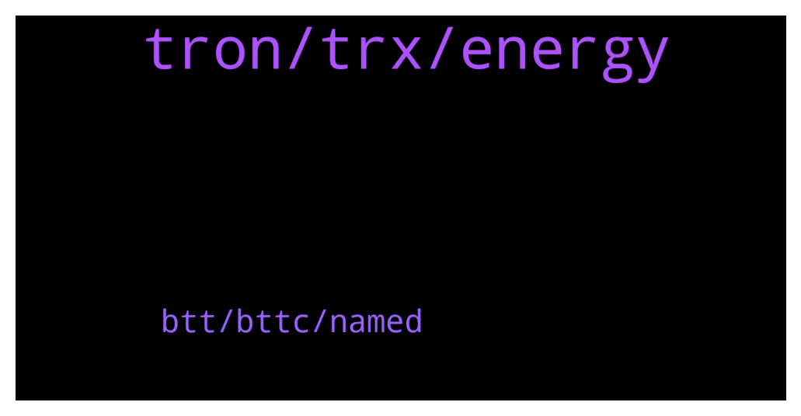

# **@tronnetworkEN**
 ## Analysis for **2022-01-27** - **2022-01-28**.

---

## 📊 **Basic Stats**

**n_messages_sent**: 242

---

---

## 🔝 **Top keywords and related messages**

1. **tron, trx, energy**

    @Banuhn --- *Hello. Can anybody read my messages? 😊* **--->** [TG Discussion](https://t.me/tronnetworkEN/3858391)

    @Nasserq888 --- *I did the interest rate for tron are shit in general. I thought someone may know something I missed.* **--->** [TG Discussion](https://t.me/tronnetworkEN/3856772)

    @Zer0log --- *Thanks. So i should choose to earn energy next time when staking.* **--->** [TG Discussion](https://t.me/tronnetworkEN/3857448)

    @Papa Mamour --- *bonjour je suis un débutant Sénégalais qui peut offrir des trons s'il* **--->** [TG Discussion](https://t.me/tronnetworkEN/3859408)

    @Zer0log --- *Great i was thinking i could get rid of my trx by staking now i have to find a way to get rid of the extra bandwidth i don't need 🤦‍♂* **--->** [TG Discussion](https://t.me/tronnetworkEN/3857380)

    @WoxFi --- *but how to calculate the pooled tokens against the LP tokens* **--->** [TG Discussion](https://t.me/tronnetworkEN/3858934)

2. **btt, bttc, named**

    @Moneyversac --- *In the medium article they called it BTTC too 😂 Like why* **--->** [TG Discussion](https://t.me/tronnetworkEN/3858857)

    @Innocen_luk_in_devil --- *does BTT delisted from binance? because Im not able to search it* **--->** [TG Discussion](https://t.me/tronnetworkEN/3858802)

    @Fabs_trx --- *Bittorrent made a tweet saying that binance named it bttc* **--->** [TG Discussion](https://t.me/tronnetworkEN/3858876)

    @Banuhn --- *what can I do with binance?* **--->** [TG Discussion](https://t.me/tronnetworkEN/3858423)

    @Ghostq2 --- *Yes I want to swap the old btt to the new.* **--->** [TG Discussion](https://t.me/tronnetworkEN/3859594)

    @Ghostq2 --- *Hello, can anyone tell me how to swap btt for trc20 please?* **--->** [TG Discussion](https://t.me/tronnetworkEN/3859578)

