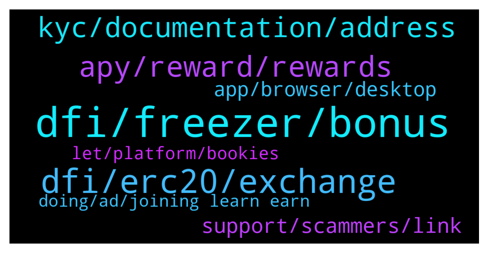

# **@CakeDeFi_EN**
 ## Analysis for **2022-01-28** - **2022-01-29**.

---

## 📊 **Basic Stats**

**n_messages_sent**: 228

---

---

## 🔝 **Top keywords and related messages**

1. **dfi, freezer, bonus**

    @CPT Cool --- *I joined 6 months ago, dfi worth less now. Sad coin* **--->** [TG Discussion](https://t.me/CakeDeFi_EN/169142)

    @nymonemo --- *hi i did my kyc for the quiz that give 5$ but how long i have my reward?* **--->** [TG Discussion](https://t.me/CakeDeFi_EN/169131)

    @zachgax --- *Let’s have a feature discussion.   Personally, It triggers my inner OCD the longer I use the product, the more fractional entries I have in the freezer. Especially with promos and bonuses like now. Would be great if there were some updates to enhance the Freezer functionality.   1. Batch extension and entry consolidation.   I understand that a new entry has to be made when we freeze because duration is calculated at time of entry. But, if I were to extend an entry, it recalculates duration at time of extension right? So, if I can batch extend multiple Freezer entries and consolidate them into one, it would make my freezer so much neater.  2. Auto batch freezing as a sub-function for auto-staking.   Right now, I manually freeze my auto-staked rewards when it reaches a certain size. I think this would be a great to have something like a submenu to auto-staking where I can set Auto-freeze of staked DFI when it reaches a set amount. Say every 50 DFI.   What do you guys think?* **--->** [TG Discussion](https://t.me/CakeDeFi_EN/169432)

    @mm_phoenix --- *there is an additional impermanent loss if there is a shift in the pool https://support.cakedefi.com/hc/en-us/articles/900003762406-What-is-Liquidity-Mining- https://support.cakedefi.com/hc/en-us/articles/900003761626-What-are-the-risks-at-Liquidity-Mining-* **--->** [TG Discussion](https://t.me/CakeDeFi_EN/169302)

    @fabioandreatta --- *BOOST your rewards to the moon! 🚀  When you enter any DFI staking and LM Freezer to SUPERCHARGE your cash flow by 7% of the total entry value. You’re free to choose from 1 year and beyond.   T's & C's apply https://blog.cakedefi.com/supercharge-your-dfi-rewards-with-our-lunar-promotion* **--->** [TG Discussion](https://t.me/CakeDeFi_EN/169384)

    @CT --- *what exchange rate to calculate the 88 for the freezer bonus? wont it keep changing* **--->** [TG Discussion](https://t.me/CakeDeFi_EN/169301)

2. **dfi, erc20, exchange**

    @TJone$ --- *I am asking how I can get my ERC20 defi chain back to my Cakedefi account without incurring the very high fees of $130! This is a very relevant question in this group which is why I am asking for help. Please be helpful rather than dismissive. Even though I know you are a bot.   Please help. Thanks* **--->** [TG Discussion](https://t.me/CakeDeFi_EN/169218)

    @TJone$ --- *Still trapped. Uniswap took the gas fee but didn’t complete the swap. Not your problem I know but still can’t do anything with the ERC20 DefiChain  Kucoin don’t seem to support it either 🤷🏼‍♂️* **--->** [TG Discussion](https://t.me/CakeDeFi_EN/169354)

    @TJone$ --- *Hello. I’m new. Please be kind 😎  How do I transfer my ERC20 defi in TW to Cake ? It say for a first deposit it is $130* **--->** [TG Discussion](https://t.me/CakeDeFi_EN/169196)

    @Michael_Schredl --- *You need to pay the 130$, because you need a ETH address if you want to deposit ERC20 DFI - or you can trade your ETH on an Exchange that has DFI listed and send your DFI to Cake* **--->** [TG Discussion](https://t.me/CakeDeFi_EN/169220)

    @tokyo --- *Hello, I transferred my first money to cakedefi today and the money went into freezer on its own although I didn't do anything, I wanted to invest the money in liquidetmining 😔* **--->** [TG Discussion](https://t.me/CakeDeFi_EN/169548)

    @XOrrz --- *What about buying in? Like from btc to dfi from kucoin. Or straight from cake itself.* **--->** [TG Discussion](https://t.me/CakeDeFi_EN/169167)

3. **apy, reward, rewards**

    @CPT Cool --- *Where does blocks earn money from* **--->** [TG Discussion](https://t.me/CakeDeFi_EN/169178)

    @Max --- *Thanks for your answer must appreciate I will look into it more.. and is it possible to make 40$ a day through cake ?* **--->** [TG Discussion](https://t.me/CakeDeFi_EN/169584)

    @xavier_pwm --- *Hi everyone, would like to ask how do the rewards are determined backend. It seems that the estimated APY and actual reward payout is different by about 30%. In my case, I did a 10 year freezing, hoping to get the indicated 90+% apy return, only to be receiving about 30% less. Any advice?* **--->** [TG Discussion](https://t.me/CakeDeFi_EN/169438)

    @YyeapY --- *does the apy% shown at LM/Staking is excluded reward fee?* **--->** [TG Discussion](https://t.me/CakeDeFi_EN/169422)

    @spyceekoin --- *Just checked the project out transparent products and services offering high returns for both beginners and experienced investors.* **--->** [TG Discussion](https://t.me/CakeDeFi_EN/169038)

    @zachgax --- *I believe the APY % are best case scenarios. Especially with freezer, you have to take into account re-staking and re-freezing your interest to generate the full compounding effect. Also APY constantly changes as block rewards get lower over time as well.  There was a thread on this on Reddit once that discussed all the factors that could affect it. You could probably still find it if you searched Cake freezer apy %   But tl;dr the apy% you see is ‘fluid’* **--->** [TG Discussion](https://t.me/CakeDeFi_EN/169443)

4. **kyc, documentation, address**

    @Mike J --- *This KYC document needed, I have tried severally but just rejections. Am fed up* **--->** [TG Discussion](https://t.me/CakeDeFi_EN/168999)

    @zachgax --- *Then there must be something wrong with the documents you provided. Maybe your name doesn’t match, maybe your address doesn’t match. That’s the whole point of KYC, it’s a security to make sure the person who signs up is really that person.   There are also some countries that are not allowed to use Cake. Are you in one of these countries?   https://support.cakedefi.com/hc/en-us/articles/360040335072-Which-countries-are-currently-not-able-to-use-the-Cake-DeFi-Services-  Unfortunately, this is the law where Cake is located.* **--->** [TG Discussion](https://t.me/CakeDeFi_EN/169252)

    @Arzuhsnv --- *Hi. There is no sms to the phone number to make KYC. Can you help me?* **--->** [TG Discussion](https://t.me/CakeDeFi_EN/169520)

    @zachgax --- *The kyc process is to ensure that legitimate people sign up for the service. There are only two documents to provide not tonnes.   One to prove your identity (passport, national identification, driving license)  One to prove your address (bank statement, phone bill, internet bill, electric bill)   These should be common documents any working adult has.* **--->** [TG Discussion](https://t.me/CakeDeFi_EN/169248)

    @DmgBautista --- *Your country is accepted by the current singaporean rules. I would double check on the number you gave, maybe the international code is incorrect?  If really is all good, I would submit a support ticket explaining the situation. You can contact them in the below link   https://cake.zendesk.com/hc/en-us/requests/new* **--->** [TG Discussion](https://t.me/CakeDeFi_EN/169536)

    @imohitss --- *Kyc is tough on cake defi* **--->** [TG Discussion](https://t.me/CakeDeFi_EN/169000)

5. **support, scammers, link**

    @Sunny02 --- *ok thank you. BTW I am constantly getting PMd by you and "Michael" via DM since we startet chatting here 🙂 Probably scammers?* **--->** [TG Discussion](https://t.me/CakeDeFi_EN/169526)

    @DmgBautista --- *Hi! There is no direct number to call to solve such subjects.   Everything must be solved by our official support. You can find the link below. Please consider that there is no official support in telegram.   Anyone DM you or calling you claiming to be support or a mod, must be immediatelly blocked and reported.  Mods will never DM a user neither call. Any unsolicited DM or call must always be considered a scam attempt!  You can contact support by the below link. Please allow them at least 24h to answer, maybe a bit more on weekends  https://cake.zendesk.com/hc/en-us/requests/new* **--->** [TG Discussion](https://t.me/CakeDeFi_EN/169076)

    @DmgBautista --- *Please understand that when support says a wallet, they are speaking in general, they do not know what you are trying to do or your specific situation, unless you are very specific about the subject maybe. They would be surelly speaking of your DFI listed exchange wallet, from which you can cash out, its the only way to off ramp. And those, with exception of HOO, always have native DFI listed.  Please consider in future interaction and when in doubt, to double check here, we will always try our best to help 🙂 Better ask twice than being in a less confortable position, especially when you have a community that can back you up. Surelly other members may have passed by the same, and that's why we must use and empower this collective user knowledge base 🙂   Tell us how that go in uniswapp and if not able, we'll obviously in the community try to think on how to help you 👍  As always, just one important information. Your issue is a general good catch for scammers and less honest people to try and take advantage. Please remember that no mod will ever DM or call you! Also, there is no support on telegram.   If you receive any DM or call saying they are support and want to help you, or even from someone that looks like a mod, just block and report. Keep communication in this official channel.  Stay safe and hope you can solve the issue! 😊* **--->** [TG Discussion](https://t.me/CakeDeFi_EN/169237)

    @TJone$ --- *Because your support team said for me to cash out some of my defichain I had to send it to a wallet so i did 🤷🏼‍♂️* **--->** [TG Discussion](https://t.me/CakeDeFi_EN/169233)

    @zachgax --- *I vote bot. Same repeating message patterns.* **--->** [TG Discussion](https://t.me/CakeDeFi_EN/169619)

    @DmgBautista --- *Garanteed 100% scammers. And not surprisingly, Michael as well as Bernd are the 2 mods in this channel that has probably their "birth copyright" infringed more times by scammers 😅   Just block and report them without hesitation. Please be safe! 🙂* **--->** [TG Discussion](https://t.me/CakeDeFi_EN/169531)

6. **app, browser, desktop**

    @Sunny02 --- *my problems are on safari (Desktop), Chrome (Desktop) and iOS App. I need the CSV for tax purposes - I regularly export everything to cointracking* **--->** [TG Discussion](https://t.me/CakeDeFi_EN/169523)

    @Sunny02 --- *I get this with Chrome, the Cake App (a red dot instead of the error message) and Safari* **--->** [TG Discussion](https://t.me/CakeDeFi_EN/169519)

    @YSL --- *No problem to access into apps or laptop.* **--->** [TG Discussion](https://t.me/CakeDeFi_EN/169105)

    @Andre --- *Since yesterday I can't lock into my Cake account (browser, not App). But I'm certain Email and password are correct! Anybody else having that problem?* **--->** [TG Discussion](https://t.me/CakeDeFi_EN/169096)

    @DmgBautista --- *Yes I understand. That can guve you a lot of additional work that you should not need to do.  I would try and open in an Android phone if you have the possibility, just to clear all possibilities. And then semd the resulting file to the email.  Other than that, just the old computer restart to see if it operates magic.  Yes you can submit a ticket, but I dont know if it will help on that particular point, since it may be a particulat point of your machine or phone update. But obviously that you will not stay without an answer.  You can write them here  https://cake.zendesk.com/hc/en-us/requests/new* **--->** [TG Discussion](https://t.me/CakeDeFi_EN/169525)

    @DmgBautista --- *Yes, some users had that issue already. Are you using firefox? Some of the users seem to be using firefox when facing that error.  I've just tried with chrome and all went fine* **--->** [TG Discussion](https://t.me/CakeDeFi_EN/169518)

7. **let, platform, bookies**

    @jezzkng --- *haha, i like ur #2 idea* **--->** [TG Discussion](https://t.me/CakeDeFi_EN/169457)

    @castro2021x --- *This brings me thoughts of WagerGang* **--->** [TG Discussion](https://t.me/CakeDeFi_EN/169043)

    @marky777z --- *That's revolutionizing  wagering with a decentralized transparency* **--->** [TG Discussion](https://t.me/CakeDeFi_EN/169035)

    @spyceekoin --- *Let's not make use of traditional bookmakers way where fixing odds and taking substantial cut goes opposite* **--->** [TG Discussion](https://t.me/CakeDeFi_EN/169034)

    @spyceekoin --- *Let's try to get rid of old bookies* **--->** [TG Discussion](https://t.me/CakeDeFi_EN/169031)

    @castro2021x --- *true tho That's a smart contract dedicated to match* **--->** [TG Discussion](https://t.me/CakeDeFi_EN/169029)

