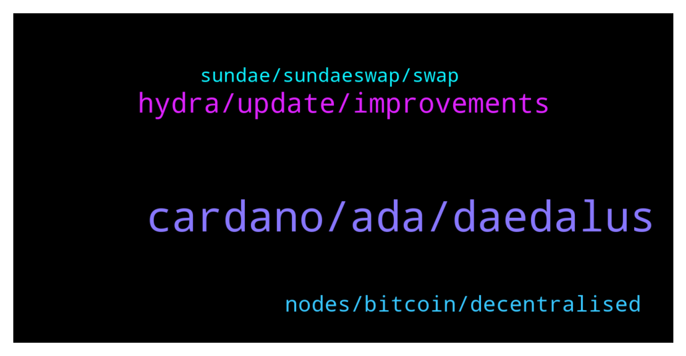

# **@Cardano**
 ## Analysis for **2022-01-28** - **2022-01-29**.

---

## 📊 **Basic Stats**

**n_messages_sent**: 98

---

---

## 🔝 **Top keywords and related messages**

1. **cardano, ada, daedalus**

    @Lgbeano --- *You have made 5 comments in this channel, none productive or of any value, every comment is complaining.   The roadmap has been set out since the start of cardano, not changed. We are in the basho era now which is scalability.   Did you watch yesterday product update from the iog team?   Also, don't use daedalus, that is a full node wallet, as a standard end user there is no reason to use it really, light wallets have better user experience and designed for such.   If you were around in cardano when staking was implemented you will remember that the experience with that was very frustrating and clunky. But now no one talks about that, it is forgotten. It won't be long before parameters are changed on layer 1 and all this will be forgotten.  Welcome to innovation and never achieved before development.   It's early days, if the experience is too bad then maybe come back in a few months, there is no rush to use the system, why do something that is causing you such frustration?   There is so much development and innovation going on at the moment beyond the standard dexes or crypto audience targeted products. Why not get yourself stuck into something more productive and positive than simply moaning with no value.* **--->** [TG Discussion](https://t.me/Cardano/776415)

    @Angel --- *I have a question. What are the benefits of holding a huge amount of ada?. If over time the transactions fees will be lower than 0.17ADA. It's very unlikely that we need 5k ada or more. Realistically we will never transact that much. Due to the extreme volatility of ada It's not a practical medium of exchange. We will likely use Djed or other stable coins so it'd be better to just buy djed instead. There is more utility in using tokens developed in the cardano blockchain than to have ada itself* **--->** [TG Discussion](https://t.me/Cardano/776604)

    @Khan --- *How can ppls like me be part of it ?  For all I know I have some ada coins that's all haha 😅* **--->** [TG Discussion](https://t.me/Cardano/776624)

    @Lgbeano --- *This is a great community built map which shows just some of what's happening on Cardano   https://www.cardanocube.io/cardano-ecosystem-interactive-map* **--->** [TG Discussion](https://t.me/Cardano/776637)

    @Mrck --- *18 mins to do a p2p tx...* **--->** [TG Discussion](https://t.me/Cardano/776414)

    @ssainball --- *Emergo doesn't seem to do anything for the Cardano community. This is a serious problem. Emergo has a lot of money as ada. Still, they seem to be sluggish Yoroi operations. A lot of people are suffering.* **--->** [TG Discussion](https://t.me/Cardano/776314)

2. **hydra, update, improvements**

    @glitch04 --- *only available update that I am aware of https://sundaeswap.finance/posts/wen-sundae* **--->** [TG Discussion](https://t.me/Cardano/776382)

    @glitch04 --- *Nope, for updates stay tuned to their projects channels for the latest information* **--->** [TG Discussion](https://t.me/Cardano/776681)

    @Zyroxa --- *definitly but as far as i know this wont be changed* **--->** [TG Discussion](https://t.me/Cardano/776410)

    @Lars --- *But is it being developed further? Is that faster?* **--->** [TG Discussion](https://t.me/Cardano/776452)

    @Chillig. --- *should that change will there be an announcement?* **--->** [TG Discussion](https://t.me/Cardano/776409)

    @Chillig. --- *means if you have subscribed to the announcement channel you are on the safe side?* **--->** [TG Discussion](https://t.me/Cardano/776412)

3. **nodes, bitcoin, decentralised**

    @Lgbeano --- *Nodes verify the blockchain, they don't work towards decentralisation.   Bitcoin is only as decentralised as the amount of miners there are now, which isn't that many.   You could shut down all the client nodes and the chain would run fine. If you shut down the miners the chain would stop.* **--->** [TG Discussion](https://t.me/Cardano/776430)

    @santiloopz --- *If client nodes are not important why are they factored in in nakamoto coefficient for decentralization? https://news.earn.com/quantifying-decentralization-e39db233c28e?gi=2be913cf8990* **--->** [TG Discussion](https://t.me/Cardano/776434)

    @Lgbeano --- *When you use a light wallet that is connected to a full node, you just don't use it.   I'm sure they want people to believe that bitcoin is super decentralised because end users are running client full nodes 🙈. But their use is limited and like you say yourself, all it does is verify the chain, it is nothing more than an observer.   Decentralisation comes from whether a single or few entities could have an impact on the chain if they were removed.   If something is centralised then one entity can turn off or control the network.   If something is decentralised the question is how decentralised is it. That can be answered by how many entities need to be removed before the chain stops functioning.   If all end users stop loading up their full nodes the chain would continue.   If all miners stopped mining the chain would stop and the nodes would no longer sync.   How many bitcoin mining firms are there around the world? That's how decentralised bitcoin is.* **--->** [TG Discussion](https://t.me/Cardano/776438)

    @santiloopz --- *I would say it is advisable to hace as many full nodes as possible to favour decentralization, so I dont see why advice otherwise.* **--->** [TG Discussion](https://t.me/Cardano/776426)

    @santiloopz --- *Why then in bitcoin they say running client nodes (not miners) is good for decentralization?* **--->** [TG Discussion](https://t.me/Cardano/776428)

    @santiloopz --- *Again, you are speaking from a narrow point of view which is keeping systems operational. Decentralization is broader than that, just take a few minutes to read the article.* **--->** [TG Discussion](https://t.me/Cardano/776439)

4. **sundae, sundaeswap, swap**

    @ChrisSTR8 --- *In my understanding you have to claim them manually. Best you ask here:  https://discord.gg/sundae* **--->** [TG Discussion](https://t.me/Cardano/776244)

    @MikeAlano --- *hello, just checking if anybody started receiving Sundae tokens from the stakepools?  thanks* **--->** [TG Discussion](https://t.me/Cardano/776672)

    @Lars --- *Does anyone know how long it takes to swap at sundaeswap? My order currently says "awaiting scoop"* **--->** [TG Discussion](https://t.me/Cardano/776442)

    @notPoetEnough --- *Can anyone point me to where Sundae stipulates how rewards are distributed? Checked their tokenomics page on their website and it's not clear.* **--->** [TG Discussion](https://t.me/Cardano/776379)

    @haniye6677 --- *hi I delegated Ada in the Sundae Swap pool. How do I get the Sundaeswap token reward? Do I have to claim in the same yoroi wallet?* **--->** [TG Discussion](https://t.me/Cardano/776246)

    @Lgbeano --- *Yeah I haven't even attempted sundaeswap. I used musliswap when it first came out, that was a good experience. But it was not as well known.   I will leave using dexes for some time.* **--->** [TG Discussion](https://t.me/Cardano/776451)

