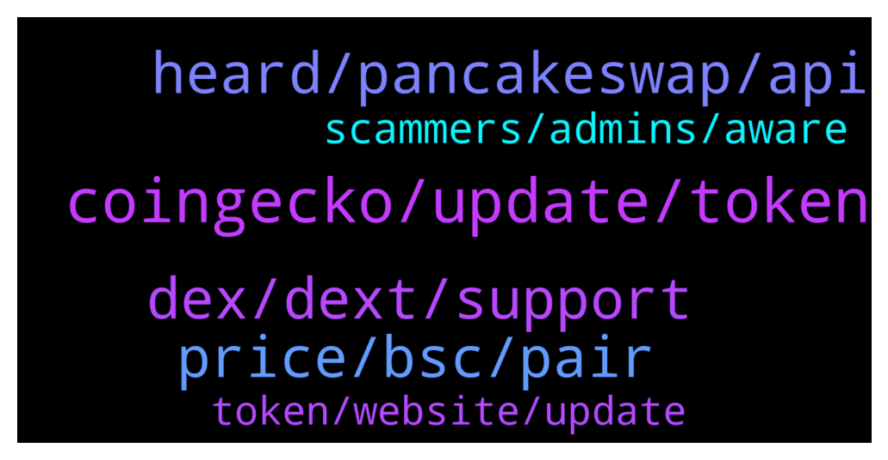

# **@DEXToolsCommunity**
 ## Analysis for **2022-01-27** - **2022-01-29**.

---

## 📊 **Basic Stats**

**n_messages_sent**: 122

---

---

## 🔝 **Top keywords and related messages**

1. **coingecko, update, token**

    @bastardganpunk --- *About social Information for your token, please update etherscan.io or bscscan.com or coingecko.com  We pull info from there.    For the logo please update coinGecko or TrustWallet.* **--->** [TG Discussion](https://t.me/DEXToolsCommunity/329403)

    @stanes --- *About social Information for your token, please update etherscan.io or bscscan.com or coingecko.com  We pull info from there.    For the logo please update coinGecko or TrustWallet.* **--->** [TG Discussion](https://t.me/DEXToolsCommunity/329378)

    @TarikAljanabi --- *Hello, please is it possible to update my token info like logo on the platform?* **--->** [TG Discussion](https://t.me/DEXToolsCommunity/329377)

    @MasterCryptoHolic --- *In "my position" doesn't it auto track where I bought in and where I am currently for a token ?* **--->** [TG Discussion](https://t.me/DEXToolsCommunity/329556)

    @MasterCryptoHolic --- *Else for previously bought token that's not possible automatically ?* **--->** [TG Discussion](https://t.me/DEXToolsCommunity/329560)

    @stanes --- *Sure, just click the Swap button and connect your wallet.* **--->** [TG Discussion](https://t.me/DEXToolsCommunity/329349)

2. **heard, pancakeswap, api**

    @MasterCryptoHolic --- *Ok would love to see this feature in near future.* **--->** [TG Discussion](https://t.me/DEXToolsCommunity/329563)

    @leech_dev --- *Btw, what I can get if I get pro plan there?* **--->** [TG Discussion](https://t.me/DEXToolsCommunity/329210)

    @Qulironeharo807 --- *Heard about polytrade launching its mainnet on 31th Jan. Is it a worthy one?* **--->** [TG Discussion](https://t.me/DEXToolsCommunity/329241)

    @JoeyDieleman --- *Sure we are reading. Can we help?* **--->** [TG Discussion](https://t.me/DEXToolsCommunity/328977)

    @stanes --- *Check this page for the differences between plans: https://www.dextools.io/#chooseyourplan* **--->** [TG Discussion](https://t.me/DEXToolsCommunity/329222)

    @huifkar --- *I do know that the team is expanding. Hired another senior front-end dev not too long ago and a prominent Italian CIO focusing on expansion in Italy -- I believe.* **--->** [TG Discussion](https://t.me/DEXToolsCommunity/329040)

3. **dex, dext, support**

    @Cryptojosu563 --- *I want to learn Dextools work* **--->** [TG Discussion](https://t.me/DEXToolsCommunity/329109)

    @stanes --- *If the DEX is on a chain we already support, the team can DM @pablojan with all the relevant info.* **--->** [TG Discussion](https://t.me/DEXToolsCommunity/328789)

    @rpoole69 --- *What would a DEX need to do in order to be added to DEXTools?* **--->** [TG Discussion](https://t.me/DEXToolsCommunity/328782)

    @leech_dev --- *Can you tell me where I can find the APIs of DexTools and How I can use that?* **--->** [TG Discussion](https://t.me/DEXToolsCommunity/329204)

    @leech_dev --- *Oh, I see... So it means there's no way to get "Dext score" like Dextools, right?* **--->** [TG Discussion](https://t.me/DEXToolsCommunity/329207)

    @bitmart255 --- *How we connect DEXTOOLS to wallet in mobile?* **--->** [TG Discussion](https://t.me/DEXToolsCommunity/329061)

4. **price, bsc, pair**

    @NoOne19944991 --- *Hi BSC hot pairs has issue Not show all of them* **--->** [TG Discussion](https://t.me/DEXToolsCommunity/329116)

    @Jack_the_Crypto --- *Got some issue by adding dex price bot. Setted pair, but after adking price its shows no pair found 😂  Used command to set price /set_pair 1 bsc 0xfbd57367524b389425c4adfb5a6f97b0e7ad3690* **--->** [TG Discussion](https://t.me/DEXToolsCommunity/329253)

    @napascual --- *Do you have an app wallet installed? If you already have one, you may have to clear the browser cache* **--->** [TG Discussion](https://t.me/DEXToolsCommunity/329075)

    @rpoole69 --- *Good morning, BSC contract 0xF2A92BC1Cf798fF4De14502a9C6FdA58865e8D5d Thorium V2 on DEXTools shows 6,810 Holders and 2,660 TX, yet in BSCScan, 15,344 Holders and 29,526 TX* **--->** [TG Discussion](https://t.me/DEXToolsCommunity/329265)

    @Spock98 --- *Hi here, Trying to connect my BSC wallet but the "Connect" button point me on an empty page (or doing nothing) ... Is there a maintenance or requirements i didn't see ?* **--->** [TG Discussion](https://t.me/DEXToolsCommunity/329277)

    @FredericDEXT --- *You need to click on the + next to your buy* **--->** [TG Discussion](https://t.me/DEXToolsCommunity/329557)

5. **scammers, admins, aware**

    @bastardganpunk --- *For ads and marketing please send a DM to @guillermorodriguez78  Admins NEVER DM FIRST* **--->** [TG Discussion](https://t.me/DEXToolsCommunity/329400)

    @rpoole69 --- *Is there any specific info they should DM the user?* **--->** [TG Discussion](https://t.me/DEXToolsCommunity/328792)

    @whisardly --- *(sad scammers dont bother dming me)* **--->** [TG Discussion](https://t.me/DEXToolsCommunity/329523)

    @ValentineFlokiCEO --- *that same guy dmed me he is a scammer* **--->** [TG Discussion](https://t.me/DEXToolsCommunity/329418)

    @napascual --- *Try clearing your cache. (admins never dm first, be aware of scammers)* **--->** [TG Discussion](https://t.me/DEXToolsCommunity/329278)

    @stanes --- *Hi, Please DM @guillermorodriguez78 he is the person-in-charge.  Be aware of scammers, HE WILL NEVER DM YOU FIRST.* **--->** [TG Discussion](https://t.me/DEXToolsCommunity/329254)

6. **token, website, update**

    @whisardly --- *Hey can someone tell me what this contract is? I used dextools to purchase tokens and it interacted here.  https://bscscan.com/address/0xdef1c0ded9bec7f1a1670819833240f027b25eff* **--->** [TG Discussion](https://t.me/DEXToolsCommunity/329520)

    @Astromooner --- *Hi how does a token update their details that are not showing on dextool eg website address* **--->** [TG Discussion](https://t.me/DEXToolsCommunity/329402)

    @Jonatanm94 --- *Does anyone know how advertising can be contracted in dextools to promote a token?* **--->** [TG Discussion](https://t.me/DEXToolsCommunity/329399)

    @_ --- *To add a token on dextools, is it free or need we paye something ?* **--->** [TG Discussion](https://t.me/DEXToolsCommunity/329231)

    @CryptoCruzin --- *Hi! How can I update the twitter and website links for out token on dextools?* **--->** [TG Discussion](https://t.me/DEXToolsCommunity/329181)

    @hmk18990 --- *this is dextools support you can use https://t.me/DEXTtraderslounge for token or other talks* **--->** [TG Discussion](https://t.me/DEXToolsCommunity/329036)

