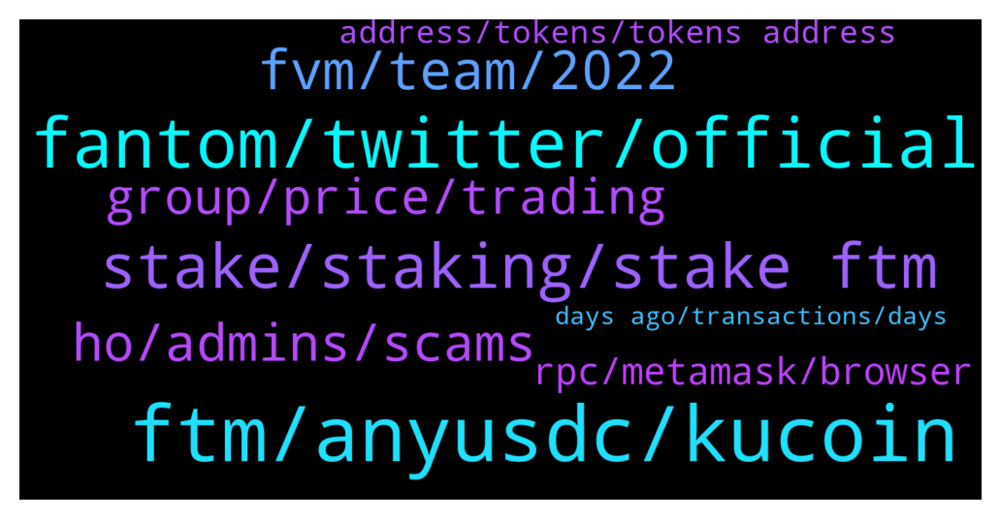

# **@Fantom_English**
 ## Analysis for **2022-01-28** - **2022-01-29**.

---

## 📊 **Basic Stats**

**n_messages_sent**: 178

---

---

## 🔝 **Top keywords and related messages**

1. **ftm, anyusdc, kucoin**

    @Feldspar_1 --- *Same here. I bridged FTM three days ago and haven't seen it in my wallet yet.* **--->** [TG Discussion](https://t.me/Fantom_English/643409)

    @xeyespablox --- *I transferred FTM from Metamask to Kucoin a week ago and never received it!* **--->** [TG Discussion](https://t.me/Fantom_English/643906)

    @pajamasfreak --- *you might get anyFTM/anyUSDC. when there is no liquidity, bridge you will give you anyFTM/anyUSDC , you can wait until there is liquidity so you can swap anyFTM/anyUSDC to FTM/anyUSDC or if you dont wanna wait liquidity, you can bridge it back to origin chain  check it on https://app.multichain.org/#/pool go to Pool -> FTM -> Remove -> anyFTM/anyUSDC to FTM/USDC ( which one network that have liquidity )* **--->** [TG Discussion](https://t.me/Fantom_English/644109)

    @xeyespablox --- *oh cause FTM network appeared available thats why I did it* **--->** [TG Discussion](https://t.me/Fantom_English/643929)

    @BinK18 --- *As per my knowledge, KuCoin had no FTM network liquidity last week , only ERC-20 withdrawals were available . KuCoin can help retrieve if funds were sent in wrong network* **--->** [TG Discussion](https://t.me/Fantom_English/643920)

    @librosagrado --- *I sent my FTM from my MetaMask wallet to my kucoin wallet a long time ago through the correct network and I still haven't received anything* **--->** [TG Discussion](https://t.me/Fantom_English/644333)

2. **fantom, twitter, official**

    @A1heng --- *hi all, i need some small amount of fantom for transaction. please kindly advice where can i get it* **--->** [TG Discussion](https://t.me/Fantom_English/643653)

    @Bicrypto --- *@slickrick6 why nowadays fantom swaps & transactions taking much more time? Not smooth.. In spooky it took 5 min for a swap.. Kindly clarify..  Any congestion issue going on?* **--->** [TG Discussion](https://t.me/Fantom_English/643206)

    @Gondaliza --- *Yeh, I had this issue yesterday. Didn't realise Fantom was so buggy.* **--->** [TG Discussion](https://t.me/Fantom_English/643457)

    @zenith22 --- *Hi I swapped fantom through spooky swap Moved to Anyfantom. What's wrong with this?* **--->** [TG Discussion](https://t.me/Fantom_English/644107)

    @Ambiora --- *Where we can find Fantom road map?* **--->** [TG Discussion](https://t.me/Fantom_English/644122)

    @Lustock --- *Hi, I would like to make a question maybe the admin could help me I bought Fantom in Binance today, the idea was to storage in nano ledger under the ETH’s address but Instead of that I put under Fantom network and Binance allowed me to complete the transaction successfully; but I never received the Fantom in my ETH address after ( I add in advance the token). What can I do?  Thanks a lot* **--->** [TG Discussion](https://t.me/Fantom_English/644086)

3. **stake, staking, stake ftm**

    @Karlastar --- *Were Can I stake my FTM? The best Option?* **--->** [TG Discussion](https://t.me/Fantom_English/644348)

    @Michael_Gatsby --- *Guys, where to do you stake your fantoms these days?* **--->** [TG Discussion](https://t.me/Fantom_English/644216)

    @stephensiew --- *Is it true that Tarot cannot work with native fWallet?* **--->** [TG Discussion](https://t.me/Fantom_English/644166)

    @pajamasfreak --- *Stake to different node, can’t stake on same one* **--->** [TG Discussion](https://t.me/Fantom_English/643583)

    @DOLLARAIN --- *Pls guide me on how to stake ftm* **--->** [TG Discussion](https://t.me/Fantom_English/643630)

    @huang --- *hello. how can I staking my FTM coin* **--->** [TG Discussion](https://t.me/Fantom_English/643688)

4. **fvm, team, 2022**

    @Janevietani --- *we dont have eta for FVM, FVM will be release when its ready* **--->** [TG Discussion](https://t.me/Fantom_English/644126)

    @Ambiora --- *I didn't get you. Actually wanted to check by when team is planning to bring FVM and it could be a part of their road map and hence asked this question* **--->** [TG Discussion](https://t.me/Fantom_English/644124)

    @pajamasfreak --- *There is no roadmap for sometime now* **--->** [TG Discussion](https://t.me/Fantom_English/644123)

    @Ambiora --- *That's true but do we have any plan by when team is targetting to bring FVM?* **--->** [TG Discussion](https://t.me/Fantom_English/644135)

    @Janevietani --- *I dont know but probably  end of 2022 or 2023 earlier* **--->** [TG Discussion](https://t.me/Fantom_English/644136)

    @zenkert --- *Some think we are on our way into a year of crypto Winter.  Might be so, but there will still be hot coins.* **--->** [TG Discussion](https://t.me/Fantom_English/643867)

5. **ho, admins, scams**

    @tCollector --- *no idea why I sent the address here instead of DMing you @Janevietani 😅 attention issues 🤓* **--->** [TG Discussion](https://t.me/Fantom_English/643832)

    @FB --- *Be careful with the scams from here approaching you by DM. Here is full of them! Do not give your metamask wallet information to anyone!!! ☠️* **--->** [TG Discussion](https://t.me/Fantom_English/643913)

    @T --- *Ah wait. The username was in the info* **--->** [TG Discussion](https://t.me/Fantom_English/643835)

    @T --- *Very strange a scammer just contacted me with username @Janevietani same like yours but with a different info* **--->** [TG Discussion](https://t.me/Fantom_English/643834)

    @Gondaliza --- *Jesus, this chatroom is filled with scammers 😅* **--->** [TG Discussion](https://t.me/Fantom_English/643454)

    @Wilko01 --- *Tried to contact you - but you don`t answer yet* **--->** [TG Discussion](https://t.me/Fantom_English/643195)

6. **group, price, trading**

    @sofiaswapspace --- *Hi! I'm Sofia - BD from SwapSpace -cryptocurrency exchange aggregator. With whom can I discuss some ideas of co-branded marketing activities? Thank you!* **--->** [TG Discussion](https://t.me/Fantom_English/643710)

    @Dimon --- *Is there a price discussion group* **--->** [TG Discussion](https://t.me/Fantom_English/643235)

    @Janevietani --- *take price discussion to trading group* **--->** [TG Discussion](https://t.me/Fantom_English/643523)

    @Johnnyfantom --- *Please go to trading group to discuss price* **--->** [TG Discussion](https://t.me/Fantom_English/643241)

    @zenkert --- *Personally I seldom participate in such groups. IMHO 90% posted are just crap with no relevance at all.* **--->** [TG Discussion](https://t.me/Fantom_English/643236)

    @Nikunj1998 --- *Do pass this feedback to the development and marketing team* **--->** [TG Discussion](https://t.me/Fantom_English/643535)

7. **rpc, metamask, browser**

    @Janevietani --- *Fantom RPC : 1. https://rpc.ftm.tools/ 2. https://rpc.ankr.com/fantom 3. https://ftmrpc.ultimatenodes.io/   ChainID: 250 Symbol: FTM Browser : https://ftmscan.com  Another explorer is  https://explorer.fantom.network* **--->** [TG Discussion](https://t.me/Fantom_English/644389)

    @Janevietani --- *also please make sure have back up RPC  Fantom RPC : 1. https://rpc.ftm.tools/ 2. https://rpc.ankr.com/fantom 3. https://ftmrpc.ultimatenodes.io/   ChainID: 250 Symbol: FTM Browser : https://ftmscan.com  Another explorer is  https://explorer.fantom.network  check gas price here https://ftm.guru/fantomscan.html* **--->** [TG Discussion](https://t.me/Fantom_English/643842)

    @Janevietani --- *how to resolve pending txs ?  1. reset metamask go to metamask setting -> advanced -> reset reset metamask will only clear pending tx   2. add other RPC for back up Fantom RPC : a. https://rpc.ftm.tools/ b. https://rpc.ankr.com/fantom c. https://ftmrpc.ultimatenodes.io/   ChainID: 250 Symbol: FTM Browser : https://ftmscan.com  3. after reset metamask and add new rpc re-do your tx, check gas price here https://ftm.guru/fantomscan.html* **--->** [TG Discussion](https://t.me/Fantom_English/644185)

    @Gondaliza --- *Sent Fantom from my exchange to metamask but it went to Eth network 🤣* **--->** [TG Discussion](https://t.me/Fantom_English/643371)

    @Janevietani --- *connect ledger to metamask set fantom network on metamask with this rpc  Fantom RPC : 1. https://rpc.ftm.tools/ 2. https://rpc.ankr.com/fantom 3. https://ftmrpc.ultimatenodes.io/   ChainID: 250 Symbol: FTM Browser : https://ftmscan.com  Another explorer is  https://explorer.fantom.network  then you will be able see your coin* **--->** [TG Discussion](https://t.me/Fantom_English/644088)

    @Michael_Gatsby --- *Ok, thanks a lot... much appreciated* **--->** [TG Discussion](https://t.me/Fantom_English/644261)

8. **address, tokens, tokens address**

    @jonas_man --- *That’s the minting function. It sends from a null address. For some reason evm says it is the 0x0* **--->** [TG Discussion](https://t.me/Fantom_English/644019)

    @fashi0nable --- *i want to know in what situations a person would receive/mint from the address* **--->** [TG Discussion](https://t.me/Fantom_English/643972)

    @fashi0nable --- *What is the 0x000 address on FTM? What could it mean when an address receives tokens from the address?* **--->** [TG Discussion](https://t.me/Fantom_English/643963)

    @fashi0nable --- *i've seen transactions on ftmscan of addresses receiving tokens from that address* **--->** [TG Discussion](https://t.me/Fantom_English/644017)

    @jonas_man --- *Farms and projects burn tokens to that address* **--->** [TG Discussion](https://t.me/Fantom_English/644018)

    @James --- *But damn  This address has billions of dollars in it* **--->** [TG Discussion](https://t.me/Fantom_English/643970)

9. **days ago, transactions, days**

    @aidfx --- *I've been waiting 30 minutes so far for transactions today, is there congestion?* **--->** [TG Discussion](https://t.me/Fantom_English/644177)

    @TS_STARKK --- *Yea I had the same issue 3 days ago but it’s fixed now* **--->** [TG Discussion](https://t.me/Fantom_English/643461)

    @TS_STARKK --- *Had the same issues also some days ago* **--->** [TG Discussion](https://t.me/Fantom_English/643431)

    @Johnnyfantom --- *I have just completed transactions, they only took a few seconds* **--->** [TG Discussion](https://t.me/Fantom_English/643216)

    @James --- *Can you send the transaction harsh on here. ?* **--->** [TG Discussion](https://t.me/Fantom_English/643962)

