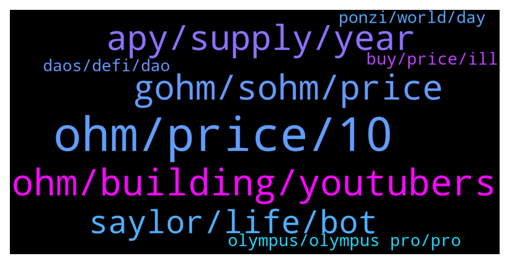

# **@OlympusTG**
 ## Analysis for **2022-01-28** - **2022-01-29**.

---

## 📊 **Basic Stats**

**n_messages_sent**: 812

---

---

## 🔝 **Top keywords and related messages**

1. **ohm, price, 10**

    @TNrafi2109 --- *Thanks. Any improvememt in near future that can boost the price? Because.many of us bought ohm at price above usd200, i.think the current apy is not enough to cover our loss* **--->** [TG Discussion](https://t.me/OlympusTG/172967)

    @KidJuel --- *I remember when I jokingly said OHM will be $50 like when it was $500+* **--->** [TG Discussion](https://t.me/OlympusTG/172730)

    @will108 --- *So psycologically, seeing OHM at $10 or even $1, has profound surreal oob experience. You reach nirvana having the inestment been rekt, all $55k worth of it gone* **--->** [TG Discussion](https://t.me/OlympusTG/172827)

    @nfwaple --- *imagine seeing OHM at $10 five years later* **--->** [TG Discussion](https://t.me/OlympusTG/172828)

    @will108 --- *I am putting it aside, if OHM is still $10 5 years later, then all my investment will be back and more lol* **--->** [TG Discussion](https://t.me/OlympusTG/172831)

    @DocDeFi --- *Still waiting for an entry. This telegram convinced me to wait for sub 50 usd Ohm* **--->** [TG Discussion](https://t.me/OlympusTG/172852)

2. **ohm, building, youtubers**

    @allenkor --- *I thought ohm held time as well* **--->** [TG Discussion](https://t.me/OlympusTG/172949)

    @PLUTO 007 --- *What on earth has happened to OHM ?? I haven’t checked in around 3 weeks. This is disgusting.  Thank god for Strong Nodes without them I’d be finished.  If you guys are looking for a real success of a project look no further then STRONG* **--->** [TG Discussion](https://t.me/OlympusTG/173839)

    @DM me NOT --- *If this question could be a little more specific, what is your personal opinion for the reason why OHM suffered this relatively huge amount, for instance, considering any other possible similar projects?  If you don't like my question, you don't need to answer this.* **--->** [TG Discussion](https://t.me/OlympusTG/172543)

    @SecuriTech24 --- *Ohm hereby declares they have not found weapons of mass destruction in Iran* **--->** [TG Discussion](https://t.me/OlympusTG/173790)

    @nfwaple --- *my opinion is that OHM went through a significant pump stage that OHM didn't ask for* **--->** [TG Discussion](https://t.me/OlympusTG/172545)

    @Host_Matt --- *or is ohm the only thing you checked* **--->** [TG Discussion](https://t.me/OlympusTG/173857)

3. **apy, supply, year**

    @safuking --- *i mean apy decreased so much by now* **--->** [TG Discussion](https://t.me/OlympusTG/173454)

    @ccryii --- *Not dead . Look at apy and the decisions already taken. The team is doing what they meant* **--->** [TG Discussion](https://t.me/OlympusTG/173453)

    @EasternCircumcision --- *nope, apy depends on total supply* **--->** [TG Discussion](https://t.me/OlympusTG/172843)

    @cdp279 --- *Apy is not going up. Stop with apy please ser. Do you understand what happens when apy goes up?* **--->** [TG Discussion](https://t.me/OlympusTG/172968)

    @RecoDedon --- *How can you say this? Maybe the apy will be 5% after the next 6-12 months?! Then you can wait multiple years until you are going plus...* **--->** [TG Discussion](https://t.me/OlympusTG/172842)

    @RecoDedon --- *The apy is inflationary. It's simple logic if you have 10x more tokens at the end of the year, then your market cap needs to be 10x as well to keep the price balanced and on the same level. Due to the fact that it is IMPOSSIBLE to make a 10x or even 30x in only one year or LONG TERM, the price HAS TO GO DOWN. it's simple economy. Or why do you guys think we went down from 1500 to 62$?!🤣 🤣  APY and price of ohm is in correlation. The higher the apy, the lower the price goes down. Only if we reach a healthy APY of 5%-20%, which is an achievable goal in terms of long term increase in market cap, then we can increase the price after some time. This can take years from now.* **--->** [TG Discussion](https://t.me/OlympusTG/173291)

4. **gohm, sohm, price**

    @Mehdi_szd --- *The price of my gohm is less than the price of gohm in my Metamask wenn I try to sell!* **--->** [TG Discussion](https://t.me/OlympusTG/173754)

    @Erik --- *Do I just ignore the sOHM , because your value is supposed to be your gOHM multiplied by the index factor at that moment* **--->** [TG Discussion](https://t.me/OlympusTG/172594)

    @nfwaple --- *there is a 'current index' on the website dashboard, gOHM is a wrapped staked version of OHM, 1 gOHM = (current index) OHM. If the index is 70, it means 1 gOHM contains 70 sOHM. That index increases every rebase* **--->** [TG Discussion](https://t.me/OlympusTG/173203)

    @nfwaple --- *check gOHM price if that makes you feel better* **--->** [TG Discussion](https://t.me/OlympusTG/173865)

    @nfwaple --- *gOHM is the price that matters because it is index adjusted* **--->** [TG Discussion](https://t.me/OlympusTG/173206)

    @nfwaple --- *gOHM price = sOHM price x current index* **--->** [TG Discussion](https://t.me/OlympusTG/173737)

5. **saylor, life, bot**

    @JM --- *But have we found Toby’s five kids?* **--->** [TG Discussion](https://t.me/OlympusTG/173791)

    @nfwaple --- *I listened to the podcast with Saylor today* **--->** [TG Discussion](https://t.me/OlympusTG/173122)

    @nfwaple --- *Toby is not a bot 👀👀* **--->** [TG Discussion](https://t.me/OlympusTG/172702)

    @nfwaple --- *Yea Saylor has a different mindset than most of us though* **--->** [TG Discussion](https://t.me/OlympusTG/173141)

    @SecuriTech24 --- *I can't create a poll but would be interesting* **--->** [TG Discussion](https://t.me/OlympusTG/173691)

    @nfwaple --- *a lot of people are pretty clueless here* **--->** [TG Discussion](https://t.me/OlympusTG/173632)

6. **olympus, olympus pro, pro**

    @elmaestro123 --- *My $5000 investment in Olympus is now $250. Would I laugh for cry* **--->** [TG Discussion](https://t.me/OlympusTG/173601)

    @DM me NOT --- *I am investing in other projects, too.  They are down less than 30% ~ 50% mostly in the recent crash.  However, OHM has fallen the largest amount. I expected this before I bought gOHM,  so I bought gOHM  only with 100 USD for a scouting purpose.  I am not spreading FUD neither I am saying Olympus DAO is bad.  I just wish I could learn  how Olympus can create real "profit" based on the gathered money from the community?* **--->** [TG Discussion](https://t.me/OlympusTG/172536)

    @TNrafi2109 --- *I just want to make sure that olympus do not have relationship.with time?* **--->** [TG Discussion](https://t.me/OlympusTG/172955)

    @theMagicUnicorn --- *Olympus Pro Spotlight is a series where we highlight our Olympus Pro cohort partners to give Ohmies insights into what our partners are building, how their token works, and why they chose Olympus Pro. https://olympusdao.medium.com/olympus-pro-spotlight-keep3r-fixed-forex-e575e5864ae8* **--->** [TG Discussion](https://t.me/OlympusTG/172709)

    @theMagicUnicorn --- *we are pleased to present Olympus12, a 12-month action plan for how Olympus will achieve its goal of becoming Web3’s premiere decentralized reserve currency. The DAO has been actively involved in activities designed to strengthen OHM’s reserve currency status, with a special focus on dampening volatility and using the Treasury to significantly benefit and grow the Olympus ecosystem  https://olympusdao.medium.com/olympus12-building-a-strong-ecosystem-around-a-web3-native-reserve-currency-416f58175e74* **--->** [TG Discussion](https://t.me/OlympusTG/173025)

    @nfwaple --- *Let's say if you want to get token A, current price $2.10, you may be able to get them on Olympus Pro at $2 if you bond using whatever they ask for* **--->** [TG Discussion](https://t.me/OlympusTG/172982)

7. **buy, price, ill**

    @UJ_CHO --- *I bought when price was 1070$* **--->** [TG Discussion](https://t.me/OlympusTG/172425)

    @Mehdi_szd --- *I checked on uniswap,  it shows the correct price* **--->** [TG Discussion](https://t.me/OlympusTG/173764)

    @SecuriTech24 --- *Price only matter if you buy or sell right? discuss* **--->** [TG Discussion](https://t.me/OlympusTG/173936)

    @safuking --- *but yeah as long as price goes up and not stays 50-60bucks i would be happy* **--->** [TG Discussion](https://t.me/OlympusTG/173462)

    @Ap0l1o --- *If the answer is yes and no, I buy* **--->** [TG Discussion](https://t.me/OlympusTG/173517)

    @Palancapa --- *the price is still around 60 dollars* **--->** [TG Discussion](https://t.me/OlympusTG/173051)

8. **ponzi, world, day**

    @Flower --- *this is crypto man, you should check every day!* **--->** [TG Discussion](https://t.me/OlympusTG/172408)

    @nfwaple --- *The community is quite interesting, definitely havent seen something like that in crypto* **--->** [TG Discussion](https://t.me/OlympusTG/173098)

    @Flower --- *this is crypto, you should check your investments every day otherwise tough $hit.* **--->** [TG Discussion](https://t.me/OlympusTG/173913)

    @cdp279 --- *It’s crypto man, what do you want me to say? I’m not attacking you just saying people didn’t want to sell when times were good now everyone is upset. This happens every, single , time.   It’s my third time I didn’t sell at the top. Who knows maybe I’ll never learn.   Sometimes we have to laugh. No point in being upset and blaming creators/ community/ admins.* **--->** [TG Discussion](https://t.me/OlympusTG/173318)

    @PLUTO 007 --- *If I’m honest the whole crypto thing is a ponzi but I’m not complaining as some are paying me well* **--->** [TG Discussion](https://t.me/OlympusTG/173883)

    @PLUTO 007 --- *They are all ponzis but some are successful and some just die* **--->** [TG Discussion](https://t.me/OlympusTG/173877)

