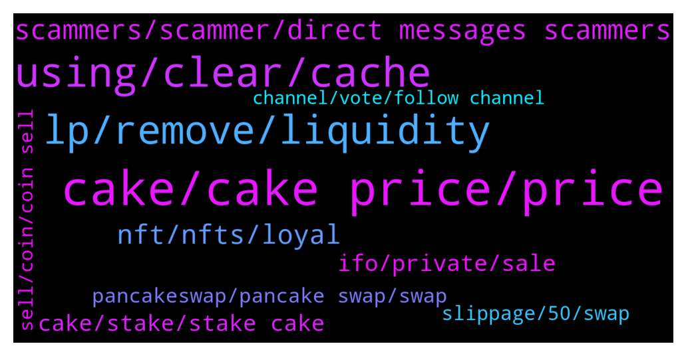

# **@PancakeSwap**
 ## Analysis for **2022-01-28** - **2022-01-29**.

---

## 📊 **Basic Stats**

**n_messages_sent**: 1050

---

---

## 🔝 **Top keywords and related messages**

1. **cake, cake price, price**

    @ha --- *+15% rise from the bottom of Bitcoin, +7% rise in Cake coin... What the heck is the reason?... Alienation from the market😞😞* **--->** [TG Discussion](https://t.me/PancakeSwap/2310727)

    @xandercakes --- *CAKE vs UNI (30 days)  If you bought $100 (2021-12-30) of CAKE Today (2022-01-29) you have $59.77 of CAKE  If you bought $100 (2021-12-30) of UNI Today (2022-01-29) you have $62.12 of UNI  Provided by 🤖 @BSC_Price_BOT* **--->** [TG Discussion](https://t.me/PancakeSwap/2309956)

    @jason5401 --- *….uni back to 11$ cake still in 7.1$* **--->** [TG Discussion](https://t.me/PancakeSwap/2309943)

    @jason5401 --- *how seeing the bog picture im buy in 25$ 20$ 15$ and cake keep dump now 6.88 ！i Fear now can’t back to 22$ and keep dumping to 5$ I lose 20k 🥲* **--->** [TG Discussion](https://t.me/PancakeSwap/2309004)

    @Motti --- *Has the quite hack effected $cake price? From what I read , cake coins worth millions were part of the hack https://www.theblockcrypto.com/post/132157/qubit-finance-bridge-ethereum-bsc-exploited-lost-80-million* **--->** [TG Discussion](https://t.me/PancakeSwap/2309057)

    @scoutharding --- *Squad holders love $cake.  We want cake to get back to ATH* **--->** [TG Discussion](https://t.me/PancakeSwap/2307755)

2. **using, clear, cache**

    @SecuestPcs --- *What error are you getting? Could you please share screenshot?* **--->** [TG Discussion](https://t.me/PancakeSwap/2307133)

    @Ceddi200 --- *1 Go to the Setting Tab in SafePal App and click “Clear Browser Cache”.* **--->** [TG Discussion](https://t.me/PancakeSwap/2310922)

    @kebon_sayur --- *Its not work. After click Button confirm , not respond* **--->** [TG Discussion](https://t.me/PancakeSwap/2310936)

    @Been --- *I set a 2fa authenticator security on my bitcoins wallet then my phone got crashed , and I got a new phone , but I was unable to login my bitcoins wallet because I didn’t have the 2fa authenticator security code anymore* **--->** [TG Discussion](https://t.me/PancakeSwap/2308946)

    @Marshmallow_Man77 --- *nah its not cache, already cleared it, restarted and all that basic jazz* **--->** [TG Discussion](https://t.me/PancakeSwap/2309992)

    @Luukku1 --- *Are you using s dapp browser?* **--->** [TG Discussion](https://t.me/PancakeSwap/2309096)

3. **lp, remove, liquidity**

    @bromridha --- *Hey i have a question: Suppose i added lp 1 bnb and ppl keep buying and LP increase from taxes to 5 bnb so if I remove the total LP will I get 1 bnb or 5 bnb? (Educational purpose)* **--->** [TG Discussion](https://t.me/PancakeSwap/2310736)

    @Marshmallow_Man77 --- *mind you ive never had problems removing LP before but now even when i use the WBNB pair the remove button does nothing after Enable / sign (yes metamask)* **--->** [TG Discussion](https://t.me/PancakeSwap/2309997)

    @philliano --- *I enabled my Chess and USDC liquidity but it doesn’t seem to remove once I click remove it get frozen and it never gets past that page.* **--->** [TG Discussion](https://t.me/PancakeSwap/2308483)

    @Ceddi200 --- *Is this your wallet address 0xA572054Afa16956da109Da3BB7f57767f41bc7f7   If yes, I can’t find any lp showing in your balance* **--->** [TG Discussion](https://t.me/PancakeSwap/2308544)

    @DeFiFaRmErDeFi --- *5 If ur the only Person providing Liquidity* **--->** [TG Discussion](https://t.me/PancakeSwap/2310737)

    @rupeshpreneur --- *can I add liquidity in that case* **--->** [TG Discussion](https://t.me/PancakeSwap/2309967)

4. **scammers, scammer, direct messages scammers**

    @ReflectionKing --- *I will have to leave this group. I just joined and now 20+ scammers pretending to be PCS. Constant DM's* **--->** [TG Discussion](https://t.me/PancakeSwap/2308352)

    @Nuno --- *But ONLY because i joined this site which makes me believe that this site is a scam* **--->** [TG Discussion](https://t.me/PancakeSwap/2310698)

    @Mattyice95 --- *There are so many scammers trying to contact me. I’ve had like 15 messages in the last 10 minutes* **--->** [TG Discussion](https://t.me/PancakeSwap/2308114)

    @CakeCompounder --- *ANYONE who sends you a message will be a SCAMMER* **--->** [TG Discussion](https://t.me/PancakeSwap/2311030)

    @MiguelCastle --- *I just received like 6 DMs all bunch of scammers* **--->** [TG Discussion](https://t.me/PancakeSwap/2307835)

    @Johnmart8611 --- *You are looking for who to DM you scammer* **--->** [TG Discussion](https://t.me/PancakeSwap/2309621)

5. **nft, nfts, loyal**

    @DrBiotin --- *Why limited to nft holders????? Has this been announced before??? Sudden strategy change?? Not good for anyone but only the nft holders* **--->** [TG Discussion](https://t.me/PancakeSwap/2307714)

    @laurel60 --- *Do you really make enough from nft* **--->** [TG Discussion](https://t.me/PancakeSwap/2307722)

    @DrBiotin --- *Thats what i mean, it was luck to have one for 200$ but now these NFTs makes you loyal and old member???????* **--->** [TG Discussion](https://t.me/PancakeSwap/2307698)

    @DrBiotin --- *Admin pls clarify how nfts makes squat holders loyal and old?* **--->** [TG Discussion](https://t.me/PancakeSwap/2307746)

    @DrBiotin --- *This community is not made of only theese lucky nft holders i hope. Will see...* **--->** [TG Discussion](https://t.me/PancakeSwap/2307720)

    @DrBiotin --- *I bet all these talkers holding squat nfts but thousands dont...* **--->** [TG Discussion](https://t.me/PancakeSwap/2307752)

6. **ifo, private, sale**

    @Ceddi200 --- *Other ways to participate are coming soon! Enabling Pancake Squad holders to participate in the new Private Sale is our first step to kickstart the new IFO 3.1 format.   Unlimited sales doesn’t require bunnies* **--->** [TG Discussion](https://t.me/PancakeSwap/2308778)

    @Tigerhawk89 --- *Pancakesquads are fixed 10k nfts, squad owners will get a fixed share in ifo preventing bots from stepping in and affecting prices* **--->** [TG Discussion](https://t.me/PancakeSwap/2308211)

    @NicoCrypt --- *Only PancakeSquad is announced for IFO 3.1 private sale allocation as of now.* **--->** [TG Discussion](https://t.me/PancakeSwap/2308403)

    @Carco_Guardian --- *buy pancakesquad and take a seat with popcorn... it is on fire for private pool of IFO.. ❤👈* **--->** [TG Discussion](https://t.me/PancakeSwap/2309454)

    @DrBiotin --- *Hi. I would like to ask for the new IFO system. I am an old community member in PCS and i track the IFOs carefully. But according to the new IFO 3.1, seems like i can not join the prime(private) sales anymore, just because i dont have PancakeSwuat NFT?* **--->** [TG Discussion](https://t.me/PancakeSwap/2307662)

    @yogen7 --- *Can we use pancake bunnies for private sale?* **--->** [TG Discussion](https://t.me/PancakeSwap/2308838)

7. **cake, stake, stake cake**

    @amirrezarbn --- *Hi i staked cake 1 month ago in auto cake but when i check it today it said staked but 00$  where is my cake ?* **--->** [TG Discussion](https://t.me/PancakeSwap/2310768)

    @FabulousXBT --- *So how to get “other token” without cake staking?* **--->** [TG Discussion](https://t.me/PancakeSwap/2307057)

    @Universa --- *Only active cake stake and reward other tokens Close cake staking reward cake tokens It produce inflation* **--->** [TG Discussion](https://t.me/PancakeSwap/2307053)

    @arjun_crypto --- *In IFO staking 10 cake I stake ,can I participate in IFO 3.1 & syrup pool/farms* **--->** [TG Discussion](https://t.me/PancakeSwap/2309938)

    @Universa --- *I am saying only stake cake and reward some other tokens Rather then stake cake and earn cake* **--->** [TG Discussion](https://t.me/PancakeSwap/2307063)

    @Eman --- *is it really worth it? if i already have staked CAKE.* **--->** [TG Discussion](https://t.me/PancakeSwap/2307354)

8. **pancakeswap, pancake swap, swap**

    @DaviSant02 --- *Good afternoon, does any ADM know if the Pancakeswap website is experiencing any problems? Well, I'm trying to access and it doesn't even give a result, the site page doesn't load!* **--->** [TG Discussion](https://t.me/PancakeSwap/2309315)

    @Anks_84 --- *Hello, I have had an issue with Pancake swap transaction. Please can I post the query here for help?* **--->** [TG Discussion](https://t.me/PancakeSwap/2308497)

    @QV_zz --- *only bep20 coins can be swapped on pancakeswap* **--->** [TG Discussion](https://t.me/PancakeSwap/2310981)

    @Cepheu5 --- *guys i need some pancakeswap website is not opening* **--->** [TG Discussion](https://t.me/PancakeSwap/2308676)

    @jjsosas --- *Please someone help me with this blank page issue when loading pancakeswap, I have cleared cache and it did not do anything* **--->** [TG Discussion](https://t.me/PancakeSwap/2310845)

    @divirix --- *What’s going on with pancake swap ? I keep trying to buy coins and I keep getting an output message!! Fix the wack network* **--->** [TG Discussion](https://t.me/PancakeSwap/2309681)

9. **slippage, 50, swap**

    @R666667 --- *With every slip I tried, it would not work* **--->** [TG Discussion](https://t.me/PancakeSwap/2307906)

    @CakeCompounder --- *50% is the maximum slippage but it will put the transaction through at the lowest it can.   By setting 50% you are permitting the swap to go through at the lower at slippage available — up to 50%* **--->** [TG Discussion](https://t.me/PancakeSwap/2309565)

    @Ceddi200 --- *if your slippage tolerance is too low like 0.1%, the transaction will fail if the price movement of the coin is above 0.2%* **--->** [TG Discussion](https://t.me/PancakeSwap/2308407)

    @RasaGagge --- *Hi, have a question: if you activate the expert mode on swap and put 50% slippage. Will it try to buy for a lower slippage if it possible before 50%?? @Luukku1   Ps: scammer don’t pm me plz* **--->** [TG Discussion](https://t.me/PancakeSwap/2309434)

    @mr_mermann --- *Hello, I have a question about expert mode. Is it just to be able to set a higher slippage and not to confirm the swap again extra?* **--->** [TG Discussion](https://t.me/PancakeSwap/2308753)

    @albert13lim --- *there is no option for slippage* **--->** [TG Discussion](https://t.me/PancakeSwap/2308723)

10. **sell, coin, coin sell**

    @zeamaayz --- *Many coins you buy and you can’t sell. That’s mostly some kinda bad investment* **--->** [TG Discussion](https://t.me/PancakeSwap/2309016)

    @Rush_lover --- *depence on the coin u want to sell. Some shitcoins take 100% fee.* **--->** [TG Discussion](https://t.me/PancakeSwap/2310890)

    @mcerix --- *so i bought a coin and now i cant sell it, i have expertmode, splippig at 49% but it dosent work* **--->** [TG Discussion](https://t.me/PancakeSwap/2309002)

    @n98765432m --- *I want to sell NFT COIN but can't* **--->** [TG Discussion](https://t.me/PancakeSwap/2310830)

    @Skp9119 --- *thanks for the advice bro I understand and I will do it..The coins are in an account that has $ 300,000 there I do not know anything else..* **--->** [TG Discussion](https://t.me/PancakeSwap/2310896)

    @HAITIENLK --- *🚨🚨🚨🚨🚨🚨🚨🚨🚨🚨 7)If none of the above work, you've probably bought a coin you cant sell. 🚨🚨🚨🚨🚨🚨🚨🚨🚨🚨* **--->** [TG Discussion](https://t.me/PancakeSwap/2308582)

