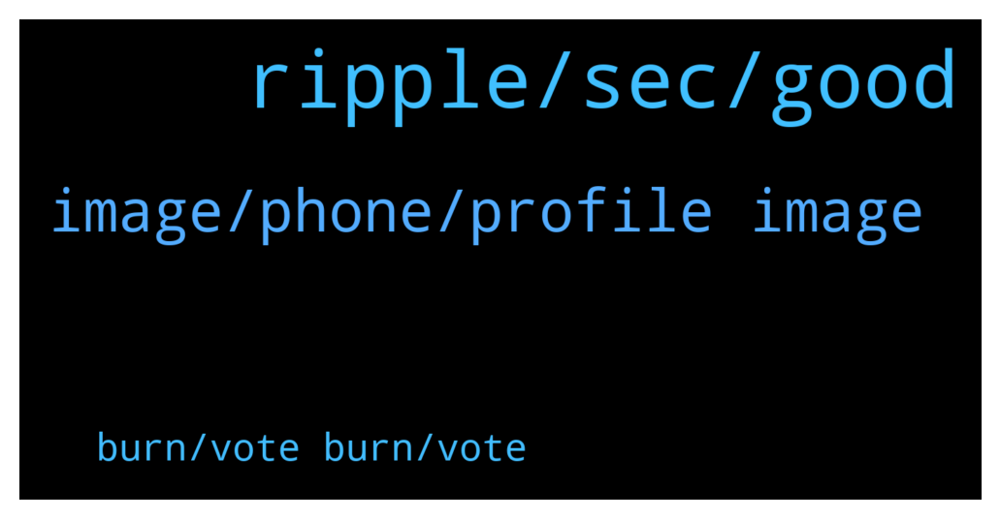

# **@Ripple**
 ## Analysis for **2022-01-28** - **2022-01-29**.

---

## 📊 **Basic Stats**

**n_messages_sent**: 87

---

---

## 🔝 **Top keywords and related messages**

1. **ripple, sec, good**

    @Cointh88 --- *SEC delay tactics: A pressure play on Ripple or is “there something really bad”? – Hogan analysis  “Among the 66 documents, there could be something really bad that can destroy the SEC’s case”, Hogan suspects. This could justify the legal gymnastics.  https://financefeeds.com/sec-delay-tactics-pressure-play-ripple-something-really-bad-hogan-analysis/* **--->** [TG Discussion](https://t.me/Ripple/3047328)

    @TMack2 --- *I bought ta 1.1$ gonna ahold until it's 2$* **--->** [TG Discussion](https://t.me/Ripple/3046887)

    @slsc81 --- *Btc dying then only xrp flying* **--->** [TG Discussion](https://t.me/Ripple/3047339)

    @zurik86 --- *If the coin rises in price in a hundred or thousands of years, then we will wait* **--->** [TG Discussion](https://t.me/Ripple/3047076)

    @Jakes1993 --- *Is $10 far fetched in this life time? Honest responses only😅* **--->** [TG Discussion](https://t.me/Ripple/3047109)

    @gerrymchugh --- *Google Ripple forced to burn XRP* **--->** [TG Discussion](https://t.me/Ripple/3046904)

2. **image, phone, profile image**

    @max219912 --- *Hmmm took about 45 min but it’s in my D’CENT now thankfully* **--->** [TG Discussion](https://t.me/Ripple/3047307)

    @dscreativ --- *bro turn your phone the other way.* **--->** [TG Discussion](https://t.me/Ripple/3047048)

    @specialpatrolgroup --- *I’m thinking you two just planted a fake conversation.* **--->** [TG Discussion](https://t.me/Ripple/3046996)

    @JustNNM --- *Please go to setting then edit and scroll down to @Username and add one there* **--->** [TG Discussion](https://t.me/Ripple/3047365)

    @gerrymchugh --- *I wish I could send you links!* **--->** [TG Discussion](https://t.me/Ripple/3046903)

    @specialpatrolgroup --- *Not until you get a username and profile image* **--->** [TG Discussion](https://t.me/Ripple/3047270)

3. **burn, vote burn, vote**

    @gerrymchugh --- *OK, don't know how many that is, but the escrow account can be burned - though it will never happen* **--->** [TG Discussion](https://t.me/Ripple/3046913)

    @CornPop69 --- *They don’t have to burn anything because it was bought with their own money. I can’t vote to burn your tokens.* **--->** [TG Discussion](https://t.me/Ripple/3046895)

    @gerrymchugh --- *But technically the large amount of XRP they own would have to be burned if community voted on it?* **--->** [TG Discussion](https://t.me/Ripple/3046892)

    @CornPop69 --- *We can’t vote to burn their tokens lol* **--->** [TG Discussion](https://t.me/Ripple/3046902)

    @CornPop69 --- *We can’t vote to burn anyones tokens because we’re not a DAO* **--->** [TG Discussion](https://t.me/Ripple/3046897)

    @CornPop69 --- *That’s my whole point, they control the majority* **--->** [TG Discussion](https://t.me/Ripple/3046914)

