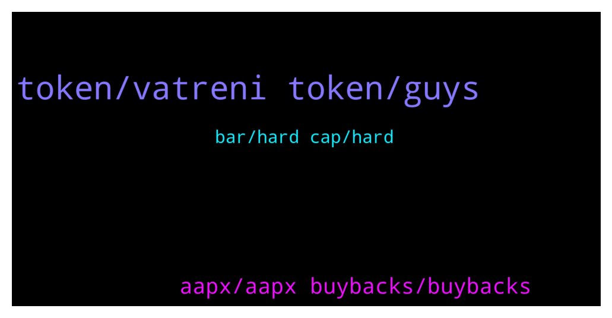

# **@ampnetapxchat**
 ## Analysis for **2022-01-24** - **2022-01-29**.

---

## 📊 **Basic Stats**

**n_messages_sent**: 57

---

---

## 🔝 **Top keywords and related messages**

1. **token, vatreni token, guys**

    @<UNK> --- *They just had Croatian national football team partnership and Vatreni token launch. Next comes PontoonDao (Q1) on Near protocol (which is damn hot atm). Then later this year licensing whole product to "reputable and large" brand (ongoing talks).  All this and 3.72m total marketcap. Upside is tremendous* **--->** [TG Discussion](https://t.me/ampnetapxchat/36757)

    @North --- *Are we as the community allowed to talk about it here even or will posts be deleted? I had no idea it was even running yet, I thought you guys were still working on tokenomics and going to release more info* **--->** [TG Discussion](https://t.me/ampnetapxchat/36740)

    @North --- *@jakovtradingmentor what do you think about timing of any shilling to Chiliz community? They obviously have aligned interests and so would probably be interested here too, but we should take care to not get ahead of ourselves* **--->** [TG Discussion](https://t.me/ampnetapxchat/36775)

    @jakovtradingmentor --- *but the community, you guys, you can do so if you're motivated to* **--->** [TG Discussion](https://t.me/ampnetapxchat/36780)

    @North --- *I didn't mean you guys 😂 that's what we are here for. And frankly we will probably do it anyway unless you say the timing is unwise* **--->** [TG Discussion](https://t.me/ampnetapxchat/36781)

    @Braam --- *I see the Vatreni token is 80% funded. However it's only until the 2 feb.  Jakov please explain what happens if the 2nd comes and goes when the funding has reached $500000. And then conversely what happens if it does fulfill the total amount? Thanks* **--->** [TG Discussion](https://t.me/ampnetapxchat/36856)

2. **aapx, aapx buybacks, buybacks**

    @MelonHusk --- *Don't tell me Ampnet is raising more money?* **--->** [TG Discussion](https://t.me/ampnetapxchat/36814)

    @jakovtradingmentor --- *if the 2nd comes and goes and the sale is fully funded, a percentage of the sale goes to ampnet as commission which is then used for aapx buybacks* **--->** [TG Discussion](https://t.me/ampnetapxchat/36857)

    @jakovtradingmentor --- *ofc if raise is successful, which seems like it is, a percentage of that raise is going to ampnet for aapx buybacks* **--->** [TG Discussion](https://t.me/ampnetapxchat/36817)

    @North --- *Fomo will increase as it gets towards  $500K. No way this doesn't get funded. Great news and hopefully we get some more details for AmpNet once we know it's going ahead* **--->** [TG Discussion](https://t.me/ampnetapxchat/36773)

    @PFCBLic --- *Maybe we can have some basic function to understand impact on aapx in correlation with complete campaign  For example:  "If total volume of Vatreni campaign is fullfilled we expect N revenues that will be directed to buyback in volume of N or will be put for staking in volume of N and so on"?  I would say this is ok start regarding presales* **--->** [TG Discussion](https://t.me/ampnetapxchat/36744)

    @matejmz --- *Yeah I expected more info. Also maybe give a recap what role AAPX has in this. What are the buybacks etc. There is hardly any community around AMPnet anymore, so we can't carry this and I guess most of the OGs don't want to shill anymore... Anyway it looks good that 40% was already sold.* **--->** [TG Discussion](https://t.me/ampnetapxchat/36743)

3. **bar, hard cap, hard**

    @mislavjavor --- *Hey all, the bar counts until hard cap is reached, the percentage until the hard cap i* **--->** [TG Discussion](https://t.me/ampnetapxchat/36808)

    @Tinus_Tussengas_1984 --- *thanks m8. that loading bar is looking strange btw... i assume its to see the progress in time to the deadline instead of the percentage of funding 😋* **--->** [TG Discussion](https://t.me/ampnetapxchat/36806)

    @jakovtradingmentor --- *i'm not a 100% sure as I haven't been told so maybe one of the devs can answer this* **--->** [TG Discussion](https://t.me/ampnetapxchat/36859)

    @mislavjavor --- *so the percentage can be 130%, 150%, etc...* **--->** [TG Discussion](https://t.me/ampnetapxchat/36810)

    @matejmz --- *Yeah, it is bugged apparently. (Time would be at 50%, so this is not the case)  @mislavjavor* **--->** [TG Discussion](https://t.me/ampnetapxchat/36807)

    @North --- *Look at most charts from 2017 ICOs and you will see 99% losses followed by recoveries* **--->** [TG Discussion](https://t.me/ampnetapxchat/36826)

