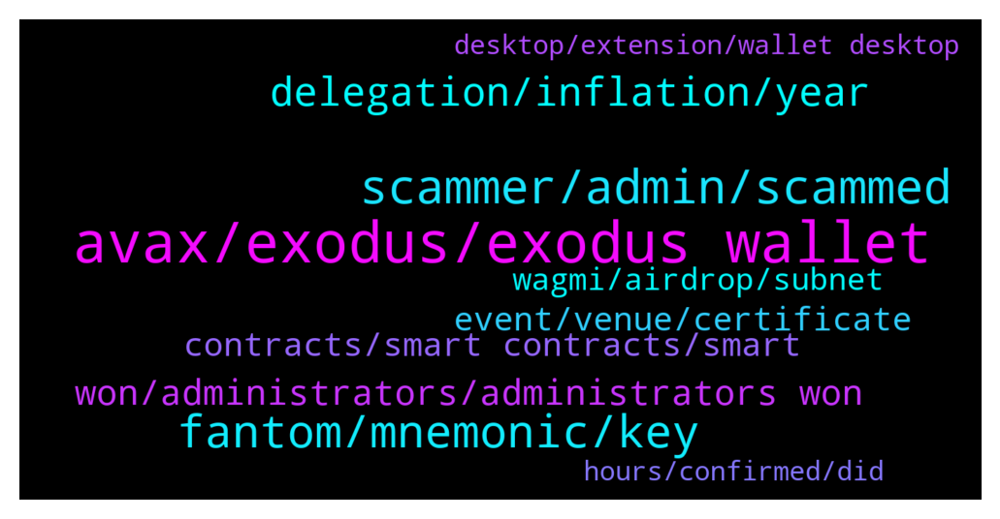

# **@avalancheavax**
 ## Analysis for **2022-01-28** - **2022-01-29**.

---

## 📊 **Basic Stats**

**n_messages_sent**: 185

---

---

## 🔝 **Top keywords and related messages**

1. **avax, exodus, exodus wallet**

    @lord --- *I just looked, it does not look like that avax is on there yet, so if I want to convert it to something else to get it on to exodus like eth, btc, dai, what is the best way to do this* **--->** [TG Discussion](https://t.me/avalancheavax/325061)

    @Ashokmakhija --- *Hello everyone i am new to avax chain and i really liked the chain i am a trader and like to trade tokens is there a way for me to do the same ? I want features like stop loss , limit orders and more is there a way for me access this advanced trading features ?* **--->** [TG Discussion](https://t.me/avalancheavax/325271)

    @CypherBlock --- *You can delegate avax using the wallet.avax.network website . You don't need a "place" like Binance or anything if you have your own wallet.* **--->** [TG Discussion](https://t.me/avalancheavax/325137)

    @Global_Defi --- *how long does it take ?  eth to avax   and the other way around...  5 ~10 mins ?* **--->** [TG Discussion](https://t.me/avalancheavax/324923)

    @deverloop --- *So I can’t transfer and sell it?* **--->** [TG Discussion](https://t.me/avalancheavax/325108)

    @LONGDONGWONG --- *How do I go about bridging UST from Terra to AVAX* **--->** [TG Discussion](https://t.me/avalancheavax/324871)

2. **scammer, admin, scammed**

    @Amatio12 --- *send it as the instruction say but my 26-avalanche token never came back and never bonus received I have big experience even admin never answer my Q.? I am asking my self-weather I scammed or not* **--->** [TG Discussion](https://t.me/avalancheavax/325049)

    @Amatio12 --- *from all direction the say we can solve the issue but all are scammers* **--->** [TG Discussion](https://t.me/avalancheavax/325101)

    @lord --- *isn't it comforting to know this place is just scammer central, no legit help on here* **--->** [TG Discussion](https://t.me/avalancheavax/325066)

    @lord --- *just had the following text, is this another scammer ...* **--->** [TG Discussion](https://t.me/avalancheavax/325053)

    @jonathan --- *Getting message...... sorry, this group doesn't seen to exist.* **--->** [TG Discussion](https://t.me/avalancheavax/324986)

    @Jad --- *but you just said you got scammed* **--->** [TG Discussion](https://t.me/avalancheavax/324879)

3. **fantom, mnemonic, key**

    @Alp --- *I am really afraiding to ask question. Lots of scammers are calling me. I am not beginner. Just wondering that i can access to avax wallet with my Fantom mnemomic key. It is normal?* **--->** [TG Discussion](https://t.me/avalancheavax/325131)

    @Nicolas_A --- *You generated it when you used Fantom. The probability of someone generating the same key as you is close to 0* **--->** [TG Discussion](https://t.me/avalancheavax/325158)

    @Alp --- *If Fantom and Avax generate the same mnemomic keys what will happen? I can enter avax wallet with Fantom key. I can send Avax to this wallet. It is strange for me. Maybe somebody has the same wallet. I didnt generate it. Just restore it with Fantom key.* **--->** [TG Discussion](https://t.me/avalancheavax/325157)

    @CypherBlock --- *So if you want like for security sake, to have separate mnemonics, then tell avax wallet site to generate new one for you and be sure to save it. If you want to use Fantom mnemonic you can with the assumption that Avalanche and Fantom are both based on same standard (same master words list).* **--->** [TG Discussion](https://t.me/avalancheavax/325162)

    @CypherBlock --- *Alp if you imported Fanotm mnemonic into avax.wallet.network you effectively created a new Avax wallet at that time. Nobody has your same Mnemonic unless they stole it from you or vice versa.* **--->** [TG Discussion](https://t.me/avalancheavax/325159)

    @Alp --- *I have Fantom mnemomic key. I have tried this key at the wallet.avax.network. and i can access.* **--->** [TG Discussion](https://t.me/avalancheavax/325142)

4. **delegation, inflation, year**

    @CypherBlock --- *25 avax might be smallest amount to delegate. To validate 2000* **--->** [TG Discussion](https://t.me/avalancheavax/325140)

    @vkudakov --- *How much % for Avax delegation?* **--->** [TG Discussion](https://t.me/avalancheavax/325146)

    @TalcHands --- *So the 32% inflation number I have seen on a couple websites is incorrect?* **--->** [TG Discussion](https://t.me/avalancheavax/324994)

    @CypherBlock --- *Rewards for delegation depend on Amount, length of delegation and fee charged by the validator (typically 2%). So you can likely get ~7+% by delegating for a year. Maybe a bit over 6% for 1 month.* **--->** [TG Discussion](https://t.me/avalancheavax/325155)

    @Nicolas_A --- *It’s rewards which is around 10% and then you can include unlocks from vesting (foundation, team etc). Don’t know exact amount and it changes after every quarterly unlock* **--->** [TG Discussion](https://t.me/avalancheavax/324993)

    @Nicolas_A --- *It could be that the amount of unlocks from vesting this year amount to 20% of current supply. Anyway it’s just a bit weird to look at inflation for a protocol that’s like 15 months old and compare it to protocols who are years older* **--->** [TG Discussion](https://t.me/avalancheavax/324996)

5. **won, administrators, administrators won**

    @rebel_puppy_wenchie --- *How do you tell which avalanche account on here is there real one? I now have 2 and they both say official! One has a pinned message the other doesn’t.* **--->** [TG Discussion](https://t.me/avalancheavax/324990)

    @bestcoderna --- *Join us for our Avalanche Weekly Wrapup call https://twitter.com/i/spaces/1eaKbNenBnaKX* **--->** [TG Discussion](https://t.me/avalancheavax/324915)

    @oathtobarbatos --- *Be careful with anyone's DM. Avalanche administrators won't DM you first!* **--->** [TG Discussion](https://t.me/avalancheavax/325258)

    @oathtobarbatos --- *Remember guys, Avalanche administrators won't DM you first and, they won't ask you for money!* **--->** [TG Discussion](https://t.me/avalancheavax/325189)

    @Amatio12 --- *no true admin feel sorry for Avalanche* **--->** [TG Discussion](https://t.me/avalancheavax/325098)

    @oathtobarbatos --- *Be careful with anyone's DM and, remember, Avalanche administrators won't ask you for money and, they won't DM you first.* **--->** [TG Discussion](https://t.me/avalancheavax/324965)

6. **event, venue, certificate**

    @Talux --- *I for one am glad that anti vaxxers aren't allowed* **--->** [TG Discussion](https://t.me/avalancheavax/324970)

    @seitanic --- *It's in Barcelona, Catalonia, which has abolished all vaccine mandates. So at this point it's not about where the event/venue is, but more about what the host desires. So in this case Avalanche is unnecessarily enforcing a vaccine mandate on attendees, sad times...* **--->** [TG Discussion](https://t.me/avalancheavax/324926)

    @FUZZIEWUZZIE --- *Could the next event or venue be someplace that doesn't require me to inject my body with something that had less than a year of development? Would be appreciated.* **--->** [TG Discussion](https://t.me/avalancheavax/324900)

    @FUZZIEWUZZIE --- *"We'd love to see you at the Avalanche Summit! Just take a series of injections first, and show us your private medical history! It's okay :) it's no big deal! We are fully decentralized."* **--->** [TG Discussion](https://t.me/avalancheavax/324943)

    @neirenoir --- *Mostly because someone with a recent Certificate of Recovery is probably more protected against COVID than someone with a year old Certificate of Vaccination with two doses. Doesn't make sense not to accept all certificates.* **--->** [TG Discussion](https://t.me/avalancheavax/325037)

    @EnduroV1 --- *heute ist der Begriff anti vaxxers vage gebraucht. Scheint als ob Du immer noch MSM folgst....* **--->** [TG Discussion](https://t.me/avalancheavax/324974)

7. **contracts, smart contracts, smart**

    @WPSmartContracts --- *Hi, we have a project called wp smart contracts that allow any user to deploy smart contracts in Avalanche C-Chain as well as many other chains, can any admin tell me if it is ok to post links about that here? Of course all related with Avalanche only, thanks* **--->** [TG Discussion](https://t.me/avalancheavax/325016)

    @lord --- *no does not support avalanche at this time, this is why i need to convert it to another token first, just wondering if anyone has a suggestion* **--->** [TG Discussion](https://t.me/avalancheavax/325045)

    @oldangusred --- *Hi! I'd like to know if there's some insurance dapp on Avalanche, like Ethereum has Nexus Mutual and Etherisc. I'm writing and article about this and this information is hard to get on Google, etc. Thank you!* **--->** [TG Discussion](https://t.me/avalancheavax/325306)

    @ihatetomatoesman --- *hello, is it possible to build an app on Avalanche Network if I have no programming experience 🤔 thank you so much for answering my questions* **--->** [TG Discussion](https://t.me/avalancheavax/325033)

    @WPSmartContracts --- *Ok thanks, seems like I cannot post urls, but anyway, if anyone is interested can google wp smart contracts and will reach us, there is a full sectiom dedicated to Avalanche C-Chain with a set of smart contracts ready to use, basically ERC-20 tokens, ERC-20 Staking contracts, and ERC-721 NFT Marketplaces, hope you enjoy it and we are open to feedback and suggestions* **--->** [TG Discussion](https://t.me/avalancheavax/325022)

    @oathtobarbatos --- *Has nothing to do with the Avalanche team, as far as I know, it's just a project created on the Avalanche blockchain* **--->** [TG Discussion](https://t.me/avalancheavax/324930)

8. **wagmi, airdrop, subnet**

    @fpole --- *What is the use of 10 wgm tokens which was airdroped* **--->** [TG Discussion](https://t.me/avalancheavax/325274)

    @Rugpull_Prevention --- *It's the native token to the WAGMI sub-network. Anyone can build on it just like with avalanche. I think it's more of a showcase of technology, a great way to do it and get attention as well.* **--->** [TG Discussion](https://t.me/avalancheavax/325275)

    @Nicolas_A --- *Pangolin has deployed their contracts there and Synapse is working to support the WAGMI subnet with their bridge* **--->** [TG Discussion](https://t.me/avalancheavax/325286)

    @Nicolas_A --- *Use the wagmi subnet and pay fees there* **--->** [TG Discussion](https://t.me/avalancheavax/325276)

    @neirenoir --- *No, WAGMI airdrop is not a scam* **--->** [TG Discussion](https://t.me/avalancheavax/324936)

    @Neha_Vermaiii --- *Alfheim Finance is releasing airdrop of 10,000 AFM to each wallet address* **--->** [TG Discussion](https://t.me/avalancheavax/325030)

9. **desktop, extension, wallet desktop**

    @vampyren --- *Yes i use that now but he mention a new wallet....* **--->** [TG Discussion](https://t.me/avalancheavax/325294)

    @Nicolas_A --- *Wallets being developed ? It's desktop, mobile and browser extension* **--->** [TG Discussion](https://t.me/avalancheavax/325292)

    @BNMYOUNGBOY56 --- *Hello pls I'm having issues with my wallet* **--->** [TG Discussion](https://t.me/avalancheavax/325172)

    @vampyren --- *I watch the latest video from Emin and he mention a wallet, is that a desktop wallet or what? anyone knows?* **--->** [TG Discussion](https://t.me/avalancheavax/325290)

    @Nicolas_A --- *Yes you can use the web wallet but there is no desktop wallet, mobile wallet or browser extension publicly available as they are still being worked on* **--->** [TG Discussion](https://t.me/avalancheavax/325295)

10. **hours, confirmed, did**

    @CypherBlock --- *I heard there was maintanence earlier.* **--->** [TG Discussion](https://t.me/avalancheavax/325165)

    @jacobseven --- *...fastest? I have a pending transaction for 8 hours now. Even ETH proper never did that* **--->** [TG Discussion](https://t.me/avalancheavax/324953)

    @jacobseven --- *so now it is confirmed, but not finalized...I hate slow mode...really. I think I will just leave* **--->** [TG Discussion](https://t.me/avalancheavax/324956)

    @jacobseven --- *the transaction had been confirmed 4 hours later* **--->** [TG Discussion](https://t.me/avalancheavax/324955)

    @oathtobarbatos --- *Maybe it's a Metamask issue. Try resetting your settings, I did a few transactions recently and it worked fine* **--->** [TG Discussion](https://t.me/avalancheavax/324954)

